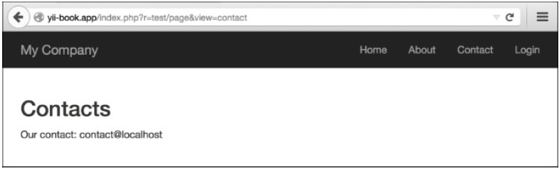
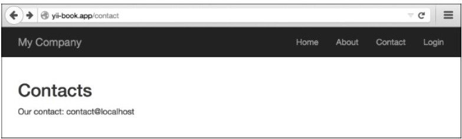

## 展示静态页面

如果你有一些静态页面，并且不会经常修改他们，那么不值得查询数据库，并为他们做页面管理。

### 准备

按照官方指南[http://www.yiiframework.com/doc-2.0/guide-start-installation.html](http://www.yiiframework.com/doc-2.0/guide-start-installation.html)的描述，使用Composer包管理器创建一个新的应用。

### 如何做...

1. 创建一个测试控制器文件`@app/controllers/TestController.php`：

```php
<?php
namespace app\controllers;
use yii\web\Controller;
class TestController extends Controller
{
    public function actions()
    {
        return [
            'page' => [
                'class' => 'yii\web\ViewAction',
            ]
        ];
    }
}
```

2. 现在，将你的页面放进`views/test/pages`，命名为`index.php`和`contact.php`。`index.php`文件的内容如下：

```html
<h1>Index</h1>
content of index file
Contact.php content is:
<h2>Contacts</h2>
<p>Our contact: contact@localhost</p>
```

3. 现在你可以通过访问URL检查你的页面
4. `http://yii-book.app/index.php?r=test/page&view=contact`：



5. 或者，如果你配置干净的URL格式的话，你可以访问`http://yii-book.app/test/page/view/about`。

### 工作原理...

我们连接了外部动作，名叫`\yii\web\ViewAction`，它只是尝试去找到一个视图，和`$_GET`参数提供的名称一致。如果找到了，展示它。如果找不到，将会给一个`404 not found`的页面。如果没有设置`viewParam`，将会使用默认值`defaultView`。

### 更多...

#### 关于ViewAction

`\yii\web\ViewAction`有一些有用的参数。列表如下：

| 参数名称 | 描述 |
|--|--|
| defaultView | 如果用户没有在GET参数中提供`yii\web\ViewAction::$viewParam`，默认视图的名称。默认值是'index'。格式应该是`path/to/view`。同`GET`参数中的类似 |
| layout | 应用到请求视图的布局名称。它会在视图被渲染前分配给`yii\base\Controller::$layout`。默认值是null，意味着使用控制器的布局。如果为false，不使用布局。 |
| viewParam | 包含请求视图名称`GET`参数的名称 |
| viewPrefix | 这是一个字符串，会作为一个前缀附加到用户指定的视图名称上，构成一个完整的视图名称。例如，如果一个用户请求是`tutorial/chap1`，相应的视图名称是`pages/tutorial/chap1`，假设前缀是`pages`。真实的视图文件又`yii\base\View::findViewFile()`决定。 |

#### 配置URL规则

`ViewAction`动作为你提供了一种方式，可以用于修改你的控制器，但是这个URL看着像`http://yii-book.app/index.php?r=test/page&page=about`。为了使URL更短更可读，添加一个URL规则到`urlManager`组件：

```php
'<view:about>' => 'test/page'
```

如果`urlManager`组件配置正确，你将会得到如下页面：



为了配置`urlManager`组件，参考*配置URL规则*小节。

### 参考

欲了解更多信息，参考如下地址：

- [http://www.yiiframework.com/doc-2.0/yii-web-viewaction.html](http://www.yiiframework.com/doc-2.0/yii-web-viewaction.html)
- [http://www.yiiframework.com/doc-2.0/guide-structure-views.html#rendering-static-pages](http://www.yiiframework.com/doc-2.0/guide-structure-views.html#rendering-static-pages)
- *配置URL规则*小节