# 第二章 路由，控制器和视图

在本章中，我们将会讨论如下话题：

- 配置URL规则
- 生成URL
- 在URL规则中使用正则表达式
- 使用一个基础控制器
- 使用独立动作
- 创建一个自定义过滤器
- 展示静态页面
- 使用flash消息
- 在视图中使用控制器上下文
- 部分复用视图
- 使用blocks
- 使用装饰器
- 定义多个布局
- 翻页和数据排序

## 介绍

本章将会帮助你学习一些方便的东西：Yii URL路由，控制器和视图。你将能够使你的控制器和视图更加灵活。

## 配置URL规则

在本小节中，我们将会学习如何配置URL规则。在开始以前，我们创建一个应用。

### 准备

1. 按照官方指南[http://www.yiiframework.com/doc-2.0/guide-start-installation.html](http://www.yiiframework.com/doc-2.0/guide-start-installation.html)的描述，使用Composer包管理器创建一个新的应用。
2. 使用如下代码创建`@app/controllers/TestController.php`控制器：

```
<?php
namespace app\controllers;
use yii\helpers\Html;
use yii\web\Controller;
class TestController extends Controller
{
    public function actionIndex()
    {
        return $this->renderContent(Html::tag('h2',
            'Index action'
        ));
    }
    public function actionPage($alias)
    {
        return $this->renderContent(Html::tag('h2',
            'Page is '. Html::encode($alias)
        ));
    }
}
```

这就是我们即将做自定义URL的控制器。

3. 为了使用干净的URL，需要配置你的应用服务器。如果你在使用带有`mod_rewrite`的Apache，并打开了`AllowOverride`，那么你就可以添加如下内容到`@web`文件夹下的`.htaccess`文件中：

```
Options +FollowSymLinks
IndexIgnore */*
RewriteEngine on
# if a directory or a file exists, use it directly
RewriteCond %{REQUEST_FILENAME} !-f
RewriteCond %{REQUEST_FILENAME} !-d
# otherwise forward it to index.php
RewriteRule . index.php
```

### 如何做...

我们的网站将会在`/home`展示index页面，并且其它页面在`/page/<alias_ here>`。此外，`/about`应该定向到带有alias about的页面：

1. 在`@app/config/web.php`文件中添加`urlManager`组件：

```
'components' => [
    // ..
    'urlManager' => [
        'enablePrettyUrl' => true,
        'rules' => [
            'home' => 'test/index',
            '<alias:about>' => 'test/page',
            'page/<alias>' => 'test/page',
        ]
    ],
    // ..
],
```

保存过你的改动以后，你应该能浏览如下URL：

```
/home
/about
/page/about
/page/test
```

2. 尝试运行`/home` URL，你将会得到如下截图：

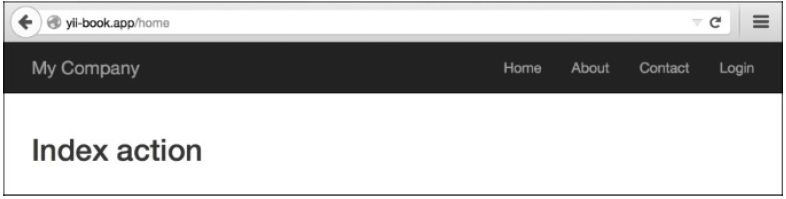

3. 尝试运行`/about`页面：

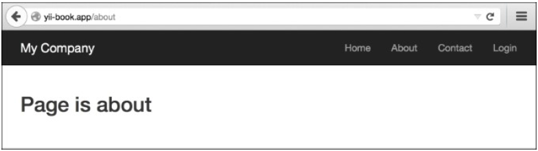

### 工作原理...

下面我们来回顾都做了些什么，以及是如何工作的。我们的第一条规则是：

```
'home' => 'test/index',
```

`test/index`是什么？在Yii应用中，每一个控制器和它的动作都有相应的内部路由。对于一个内部路由，它的格式是`moduleID/controllerID/actionID`。例如，`TestController`的`actionPage`方法对应的路由是`test/page`。所以，为了获取控制器ID，你应该用它的不带`Controller`后缀的名称，并将它的首字母小写。为了获取一个动作ID，你应该用它的不带`action`前缀的方法名，同样将其首字母小写。

现在，什么是home？为了以更好的方式理解它，我们需要知道，至少是表面上，当我们使用不同的URL访问我们的应用时，都发生了些什么。

当我们使用`/home`时，URL路由从上到下一个一个的检查我们的规则，尝试找到和输入URL匹配的规则。如果找到了，那么路由将会从一个分配给它的内部路由中获取到控制器和它的动作，并执行它。所以，`/home`是URL模式，它定义了URL将会被处理的规则。

### 更多...

你也可以使用一个特殊的语法创建参数化的规则。回顾一下第三条规则：

```
'page/<alias>' => test/page',
```

这里我们定义了一个alias参数，它应该在URL中`/page/`后边被指定。它可以是任何东西，并会被传递给`$alias`参数：

```
TestController::actionPage($alias)
```

你可以为这样一个参数定义一个模式。我们为第二条规则做同样的事情：

```
'<alias:about>' => test/page'
```

这里的alias应该匹配`about`，否则这条规则不能被应用。

### 参考

欲了解更多信息，参考如下地址：

- [http://www.yiiframework.com/doc-2.0/guide-runtime-routing.html](http://www.yiiframework.com/doc-2.0/guide-runtime-routing.html)
- [http://www.yiiframework.com/doc-2.0/guide-runtime-url-handling.html](http://www.yiiframework.com/doc-2.0/guide-runtime-url-handling.html)
- [http://www.yiiframework.com/doc-2.0/yii-web-urlmanager.html](http://www.yiiframework.com/doc-2.0/yii-web-urlmanager.html)
- *在URL规则中使用正则表达式*小节

## 生成URLs

Yii不仅允许你将URL路由到不同的控制器动作上，而且可以通过执行一个正确的内部路由和它的参数来生成一个URL。这非常有用，因为在开发应用过程中，你可以将精力集中在内部路由上，只需要在上线前关注一下真实的URL。永远不要直接指定URL，并确保你使用了Yii URL工具集。它会允许你修改URL，而且不需要修改很多应用代码。

### 准备

1. 按照官方指南[http://www.yiiframework.com/doc-2.0/guide-start-installation.html](http://www.yiiframework.com/doc-2.0/guide-start-installation.html)的描述，使用Composer包管理器创建一个新的应用。
2. 找到`@app/config/web.php`文件，并替换规则数组：

```
'urlManager' => array(
    'enablePrettyUrl' => true,
    'showScriptName' => false,
),
```

3. 配置你的应用服务器来使用干净的URL。如果你在使用带有`mod_rewrite`的Apache，并打开了`AllowOverride`，那么你就可以添加如下内容到`@app/web`文件夹下的`.htaccess`文件中：

```
Options +FollowSymLinks
IndexIgnore */*
RewriteEngine on
# if a directory or a file exists, use it directly
RewriteCond %{REQUEST_FILENAME} !-f
RewriteCond %{REQUEST_FILENAME} !-d
# otherwise forward it to index.php
RewriteRule . index.php
```

### 如何做...

1. 在`@app/controllers`目录中，使用如下代码创建`BlogController`：

```
<?php
namespace app\controllers;
use yii\web\Controller;
class BlogController extends Controller
{
    public function actionIndex()
    {
        return $this->render('index');
    }
    public function actionRssFeed($param)
    {
        return $this->renderContent('This is RSS feed for our blog and ' . $param);
    }
    public function actionArticle($alias)
    {
        return $this->renderContent('This is an article with alias ' . $alias);
    }
    public function actionList()
    {
        return $this->renderContent('Blog\'s articles here');
    }
    public function actionHiTech()
    {
        return $this->renderContent('Just a test of action which contains more than one words in the name') ;
    }
}
```

这是我们的博客控制器，我们将会给它生成自定义URL。

2. 在`@app/controllers`文件夹中，使用如下代码创建`TestController`：

```
<?php
namespace app\controllers;
use Yii;
use yii\web\Controller;
class TestController extends Controller
{
    public function actionUrls()
    {
        return $this->render('urls');
    }
}
```

3. 在`@app/views`文件夹中，创建`test`文件夹，以及`urls.php`视图文件，文件内容如下：

```
<?php
use yii\helpers\Url;
use yii\helpers\Html;
?>
    <h1>Generating URLs</h1>
    <h3>Generating a link with URL to <i>blog</i> controller and
        <i>article</i> action with alias as param</h3>
<?= Html::a('Link Name', ['blog/article', 'alias' => 'someAlias']); ?>
    <h3>Current url</h3>
<?=Url::to('')?>
    <h3>Current Controller, but you can specify an action</h3>
<?=Url::toRoute(['view', 'id' => 'contact']);?>
    <h3>Current module, but you can specify controller and
        action</h3>
<?= Url::toRoute('blog/article')?>
    <h3>An absolute route to blog/list </h3>
<?= Url::toRoute('/blog/list')?>
    <h3> URL for <i>blog</i> controller and action <i>HiTech</i>
    </h3>
<?= Url::toRoute('blog/hi-tech')?>
    <h3>Canonical URL for current page</h3>
<?= Url::canonical()?>
<h3>Getting a home URL</h3>
<?= Url::home()?>
<h3>Saving a URL of the current page and getting it for
    re-use</h3>
<?php Url::remember()?>
<?=Url::previous()?>
<h3>Creating URL to <i>blog</i> controller and <i>rss-feed</i>
    action while URL helper isn't available</h3>
<?=Yii::$app->urlManager->createUrl(['blog/rss-feed', 'param' => 'someParam'])?>
<h3>Creating an absolute URL to <i>blog</i> controller and
    <i>rss-feed</i></h3>
<p>It's very useful for emails and console applications</p>
<?=Yii::$app->urlManager->createAbsoluteUrl(['blog/rss-feed', 'param' => 'someParam'])?>
```

4. 打开`http://yii-book.app/test/urls`你将会看到如下输出（参考先前代码中全部方法的列表）：

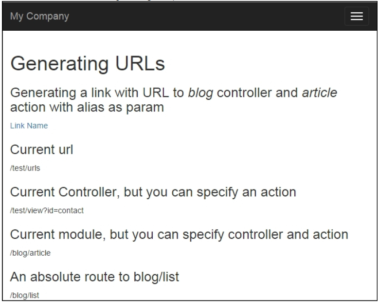

### 工作原理...

我们需要生成URL，指向`BlogController`的控制器动作（RssFeed, Article, List, HiTech）。

```
<?= Html::a('Link Name', ['blog/article', 'alias' => 'someAlias']); ?>
```

依赖于我们需要的地方，有不同的方式可以做到这些，但是基础是一样的。下面列出一些生成URL的方法。

什么是内部路由？每一个控制器和它的动作有相应的路由。路由的格式是`moduleID/controllerID/actionID`。例如，`BlogController`的`actionHiTech`方法对应于`blog/hi-tech`路由。

为了获取控制器ID，你应该用它的不带`Controller`后缀的名称，并将它的首字母小写。为了获取一个动作ID，你应该用它的不带`action`前缀的方法名，同样将每个单词的首字母小写，并使用`-`符号分割（例如`actionHiTech`将会是`hi-tech`）。

`$_GET`变量做为参数会被传递给用内部路由指定的动作中。例如，如果我们想为`BlogController::actionArticle`创建一个URL，并将`$_GET['name']`传递给它，可以按如下方式进行：

```
<?= Html::a('Link Name', ['blog/article', 'alias' => 'someAlias']); ?>
```

在你的应用内部，可以使用相对URL，绝对URL应该被用于指向你的网站（例如其它网站）外部，或者用于链接到能被外部访问的资源上（RSS feeds，email等等）。

你可以很容易的使用URL管理器。URL管理器是一个内置应用组件，名叫`urlManager`。你必须使用这个组件，它可以通过`Yii::$app->urlManager`从web和console被访问到。

当你不能获得一个控制器实例时，例如，当你实施一个控制台应用，你可以使用如下两个`urlManager`创建方法：

```
<?=Yii::$app->urlManager->createUrl(['blog/rss-feed', 'param' => 'someParam'])?>
<?=Yii::$app->urlManager->createAbsoluteUrl(['blog/rss-feed','param' => 'someParam'])?>
```

### 更多...

欲了解更多信息，参考如下URL：

- [https://en.wikipedia.org/wiki/Canonical_link_element](https://en.wikipedia.org/wiki/Canonical_link_element)
- [http://www.yiiframework.com/doc-2.0/guide-structure-controllers.html](http://www.yiiframework.com/doc-2.0/guide-structure-controllers.html)
- [http://www.yiiframework.com/doc-2.0/guide-runtime-routing.html](http://www.yiiframework.com/doc-2.0/guide-runtime-routing.html)
- [http://www.yiiframework.com/doc-2.0/guide-helper-url.html](http://www.yiiframework.com/doc-2.0/guide-helper-url.html)
- [http://www.yiiframework.com/doc-2.0/yii-web-urlmanager.html](http://www.yiiframework.com/doc-2.0/yii-web-urlmanager.html)

### 参考

- *配置URL规则*小节

## 在URL规则中使用正则表达式

Yii URL路由器的一个隐藏特性是，你可以使用正则表达式来处理地址。

### 准备

1. 按照官方指南[http://www.yiiframework.com/doc-2.0/guide-start-installation.html](http://www.yiiframework.com/doc-2.0/guide-start-installation.html)的描述，使用Composer包管理器创建一个新的应用。
2. 在你的`@app/controllers`文件夹中，使用如下代码创建`PostController.php`：

```
<?php
namespace app\controllers;
use yii\helpers\Html;
use yii\web\Controller;
class PostController extends Controller
{
    public function actionView($alias)
    {
        return $this->renderContent(Html::tag('h2', 'Showing post with alias ' . Html::encode($alias)
        ));
    }
    public function actionIndex($type = 'posts', $order = 'DESC')
    {
        return $this->renderContent(Html::tag('h2', 'Showing ' . Html::encode($type) . ' ordered ' . Html::encode($order)));
    }
    public function actionHello($name)
    {
        return $this->renderContent(Html::tag('h2', 'Hello, ' . Html::encode($name) . '!'));
    }
}
```

这是我们的应用控制器，我们将会使用自定义URL来方法它。

3. 配置你的应用服务器，来使用干净的URL。如果你在使用带有`mod_rewrite`的Apache，并打开了`AllowOverride`，那么你就可以添加如下内容到`@web`文件夹下的`.htaccess`文件中：

```
Options +FollowSymLinks
IndexIgnore */*
RewriteEngine on
# if a directory or a file exists, use it directly
RewriteCond %{REQUEST_FILENAME} !-f
RewriteCond %{REQUEST_FILENAME} !-d
# otherwise forward it to index.php
RewriteRule . index.php
```

### 如何做...

我们希望我们的`PostController`动作根据一些指定的规则接受参数，并将其它所有不匹配的参数给以`404 not found`的HTTP响应。此外，`post/index`应该有一个alias URL archive。

添加如下`urlManager`组件配置到`@app/config/web.php`：

```
'components' => [
    // ..
    'urlManager' => [
        'enablePrettyUrl' => true,
        'rules' => [
            'post/<alias:[-a-z]+>' => 'post/view',
            '<type:(archive|posts)>' => 'post/index',
            '<type:(archive|posts)>/<order:(DESC|ASC)>' => 'post/index',
            'sayhello/<name>' => 'post/hello',
        ]
    ],
    // ..
],
```

如下URL将会成功：

- `http://yii-book.app/post/test`
- `http://yii-book.app/posts`
- `http://yii-book.app/archive`
- `http://yii-book.app/posts/ASC`
- `http://yii-book.app/sayhello`

如下URL将会失败：

- `http://yii-book.app/archive/test`
- `http://yii-book.app/post/another_post`

下面的截图展示了`http://yii-book.app/post/test`运行是成功的：

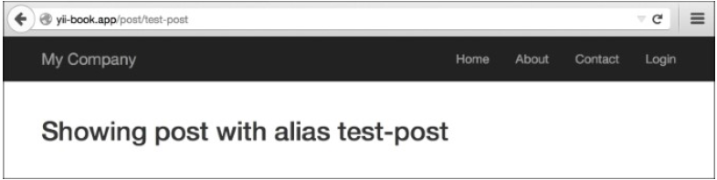

下面的截图展示了`http://yii-book.app/archive`也可以运行成功：


下面的截图展示`http://yii-book.app/archive/test`没有运行成功，并有一个报错：

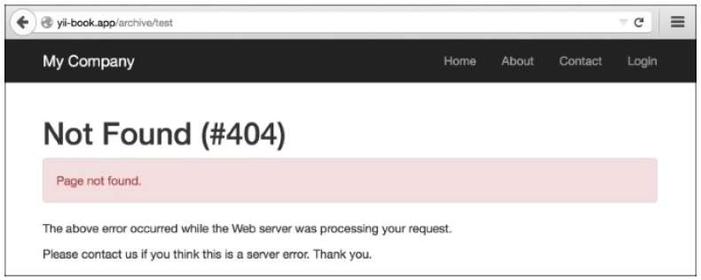

### 工作原理...

你可以在参数定义和规则的其它部分使用正则表达式。下面我们一条一条的看这些规则：

```
'post/<alias:[-a-z]+>' => 'post/view',
```

alias参数应该包含一个或多个英文单词或者一个`-`。其它符号不被允许。

```
'(posts|archive)' => 'post/index',
'(posts|archive)/<order:(DESC|ASC)>' => 'post/index',
```

`posts`和`archive`都会指向`post/index`。`order`参数只接受两个值——`DESC`和`ASC`：

```
'sayhello/<name>' => 'post/hello',
```

你应该指定名称部分，但是没有对可以使用的单词做限制。注意到不管使用的规则是什么，开发者不应该假设输入的数据是安全的。

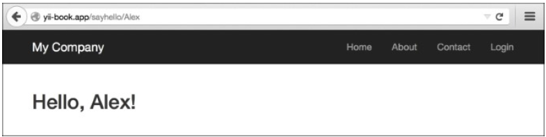

### 更多...

欲了解更多关于正则表达式的信息，你可以使用如下资源：

- [http://www.php.net/manual/en/reference.pcre.pattern.syntax.php](http://www.php.net/manual/en/reference.pcre.pattern.syntax.php)
- [http://regex.info/](http://regex.info/)提供的*掌握正则表达式，Jeffrey Friedl*

### 参考

- *配置URL规则*小节

## 使用一个基础控制器

在许多框架中，通常会在指导中提出基础控制器的概念，它可以被其它控制器扩展。在Yii中，它不在指导中，因为你可以用其它多种方式很灵活的达到。但是，使用一个基础控制器是可能的，并且是有用的。

假设我们想添加添加一些控制器，它们只能被登录的用于访问。我们当然可以为每一个控制器单独设置一些限制，但是我们将会用一种更好的方式来做到它。

### 准备

按照官方指南[http://www.yiiframework.com/doc-2.0/guide-start-installation.html](http://www.yiiframework.com/doc-2.0/guide-start-installation.html)的描述，使用Composer包管理器创建一个新的应用。

### 如何做...

1. 首先，我们需要一个基础控制器，它只能被登录的用于使用。创建`@app/components/BaseController.php`，内容如下：

```
<?php
namespace app\components;
use Yii;
use yii\web\Controller;
use yii\filters\AccessControl;
class BaseController extends Controller
{
    public function actions()
    {
        return [
            'error' => ['class' => 'yii\web\ErrorAction'],
        ];
    }
    public function behaviors()
    {
        return [
            'access' => [
                'class' => AccessControl::className(),
                'rules' => [
                    [
                        'allow' => true,
                        'actions' => 'error'
                    ],
                    [
                        'allow' => true,
                        'roles' => ['@'],
                    ],
                ],
            ]
        ];
    }
}
```

这个控制器有一个动作map，此外还有一个错误动作。

2. 现在，使用Gii创建`TestController`，但是将基础类设置为`app/components/BaseController`：

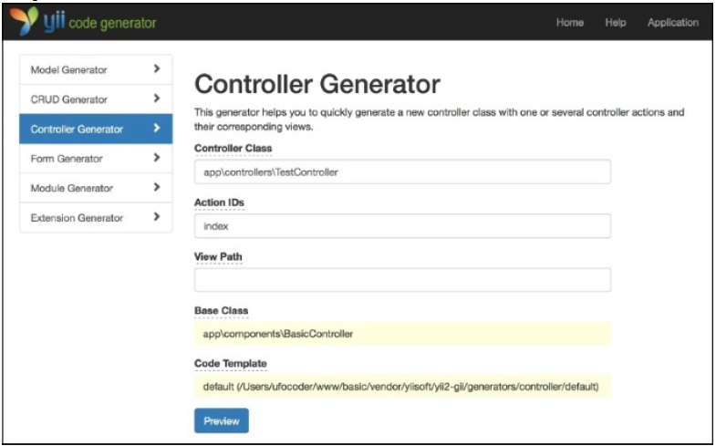

你将会得到类似如下的输出：

```
<?php
namespace app\controllers;
class TestController extends \app\components\BaseController
{
    public function actionIndex()
    {
        return $this->render('index');
    }
}
```

3. 现在，你的`TestController`只能被登录用户访问，尽管我们没有在`TestController`控制器中做明确的说明。你可以在登出的时候通过访问`http://yii-book.app/index.php?r=test/index`来检查它。

### 工作原理...

这个把戏只是一个类继承。如果过滤器或者访问控制规则不在`TestController`，那么他们将会从`SecureController`中调用。

### 更多...

如果你需要继承基础控制器的方法，记住它不能被覆盖。例如，我们需要添加一个页面动作到控制器的动作map中：

```
<?php
namespace app\controllers;
use yii\helpers\ArrayHelper;
use app\components\BaseController;
class TestController extends BaseController
{
    public function actions()
    {
        return ArrayHelper::merge(parent::actions(), [
            'page' => [
                'class' => 'yii\web\ViewAction',
            ],
        ]);
    }
    public function behaviors()
    {
        $behaviors = parent::behaviors();
        $rules = $behaviors['access']['rules'];
        $rules = ArrayHelper::merge(
            $rules,
            [
                [
                    'allow' => true,
                    'actions' => ['page']
                ]
            ]
        );
        $behaviors['access']['rules'] = $rules;
        return $behaviors;
    }
    public function actionIndex()
    {
        return $this->render('index');
    }
}
```

欲了解更多信息，参考[http://www.yiiframework.com/doc-2.0/yii-base-controller.html](http://www.yiiframework.com/doc-2.0/yii-base-controller.html)。

## 使用独立动作

在Yii中，你可以定义控制器动作作为独立的类，然后连接它们到你的控制器上。这将会帮助你复用一些常用功能。

例如，你可以为自动完成字段移动后端到一个动作中并保存，而不需要再次一遍一遍的写。

另外一个例子是，我们可以创建所有的CRUD操作作为分开的独立动作。我们将会写、创建、查看和删除模型的动作，并查看模型的操作列表。

### 准备

1. 按照官方指南[http://www.yiiframework.com/doc-2.0/guide-start-installation.html](http://www.yiiframework.com/doc-2.0/guide-start-installation.html)的描述，使用Composer包管理器创建一个新的应用。
2. 创建`post`表。使用如下命令创建migration：

```
./yii migrate/create create_post_table
```

3. 更新刚刚创建的migration的方法和导出的类列表：

```
<?php
use yii\db\Schema;
use yii\db\Migration;
class m150719_152435_create_post_table extends Migration
{
    const TABLE_NAME = '{{%post}}';
    public function up()
    {
        $tableOptions = null;
        if ($this->db->driverName === 'mysql') {
            $tableOptions = 'CHARACTER SET utf8 COLLATE utf8_general_ci ENGINE=InnoDB';
        }
        $this->createTable(self::TABLE_NAME, [
            'id' => Schema::TYPE_PK,
            'title' => Schema::TYPE_STRING.'(255) NOT NULL',
            'content' => Schema::TYPE_TEXT.' NOT NULL',
        ], $tableOptions);
        for ($i = 1; $i < 7; $i++) {
            $this->insert(self::TABLE_NAME, [
                'title' => 'Test article #'.$i,
                'content' => 'Lorem ipsum dolor sit amet, consectetur adipiscing elit. '
                    .'Sed sit amet mauris est. Sed at dignissim dui. '
                    .'Phasellus arcu massa, facilisis a fringilla sit amet, '
                    .'rhoncus ut enim.',
            ]);
        }
    }
    public function down()
    {
        $this->dropTable(self::TABLE_NAME);
    }
}
```

4. 使用如下命名安装所有的migration：

```
./yii migrate up
```

5. 使用Gii创建`Post`。

### 如何做...

1. 创建独立动作`@app/actions/CreateAction.php`：

```
<?php
namespace app\actions;
use Yii;
use yii\base\Action;
class CreateAction extends Action
{
    public $modelClass;
    public function run()
    {
        $model = new $this->modelClass();
        if ($model->load(Yii::$app->request->post()) && $model->save()) {
            $this->controller->redirect(['view', 'id' => $model->getPrimaryKey()]);
        } else {
            return $this->controller->render('//crud/create', [
                'model' => $model
            ]);
        }
    }
}
```

2. 创建独立动作`@app/actions/DeleteAction.php`：

```
<?php
namespace app\actions;
use yii\base\Action;
use yii\web\NotFoundHttpException;
class DeleteAction extends Action
{
    public $modelClass;
    public function run($id)
    {
        $class = $this->modelClass;
        if (($model = $class::findOne($id)) === null) {
            throw new NotFoundHttpException('The requested page does not exist.');
        }
        $model->delete();
        return $this->controller->redirect(['index']);
    }
}
```

3. 创建独立动作`@app/actions/IndexAction.php`：

```
<?php
namespace app\actions;
use yii\base\Action;
use yii\data\Pagination;
class IndexAction extends Action
{
    public $modelClass;
    public $pageSize = 3;
    public function run()
    {
        $class = $this->modelClass;
        $query = $class::find();
        $countQuery = clone $query;
        $pages = new Pagination([
            'totalCount' => $countQuery->count(),
        ]);
        $pages->setPageSize($this->pageSize);
        $models = $query->offset($pages->offset)
            ->limit($pages->limit)
            ->all();
        return $this->controller->render('//crud/index', [
            'pages' => $pages,
            'models' => $models
        ]);
    }
}
```

4. 创建独立动作`@app/actions/ViewAction.php`：

```
<?php
namespace app\actions;
use yii\base\Action;
use yii\web\NotFoundHttpException;
class ViewAction extends Action
{
    public $modelClass;
    public function run($id)
    {
        $class = $this->modelClass;
        if (($model = $class::findOne($id)) === null) {
            throw new NotFoundHttpException('The requested page does not exist.');
        }
        return $this->controller->render('//crud/view', [
            'model' => $model
        ]);
    }
}
```

5. 创建视图文件`@app/views/crud/create.php`：

```
<?php
use yii\helpers\Html;
use yii\widgets\ActiveForm;
/*
* @var yii\web\View $this
*/
?>
    <h1><?= Yii::t('app', 'Create post'); ?></h1>
<?php $form = ActiveForm::begin();?>
<?php $form->errorSummary($model); ?>
<?= $form->field($model, 'title')->textInput() ?>
<?= $form->field($model, 'content')->textarea() ?>
<?= Html::submitButton(Yii::t('app', 'Create'), ['class' =>
    'btn btn-primary']) ?>
<?php ActiveForm::end(); ?>
```

6. 创建视图文件`@app/views/crud/index.php`：

```
<?php
use yii\widgets\LinkPager;
use yii\helpers\Html;
use yii\helpers\Url;
/*
* @var yii\web\View $this
* @var yii\data\Pagination $pages
* @var array $models
*/
?>
<h1>Posts</h1>
<?= Html::a('+ Create a post', Url::toRoute('post/create')); ?>
<?php foreach ($models as $model):?>
<h3><?= Html::encode($model->title);?></h3>
<p><?= Html::encode($model->content);?></p>
    <p>
        <?= Html::a('view', Url::toRoute(['post/view', 'id' =>
            $model->id]));?> |
        <?= Html::a('delete', Url::toRoute(['post/delete', 'id'
        => $model->id]));?>
    </p>
<?php endforeach; ?>
<?= LinkPager::widget([
    'pagination' => $pages,
]); ?>
```

7. 创建视图文件`@app/views/crud/view.php`：

```
<?php
use yii\helpers\Html;
use yii\helpers\Url;
/*
* @var yii\web\View $this
* @var app\models\Post $model
*/
?>
<p><?= Html::a('< back to posts', Url::toRoute('post/index'));
    ?></p>
<h2><?= Html::encode($model->title);?></h2>
<p><?= Html::encode($model->content);?></p>
```

为了使用独立动作，我们在动作map中通过复写动作方法定义它。

8. 运行`post/index`：

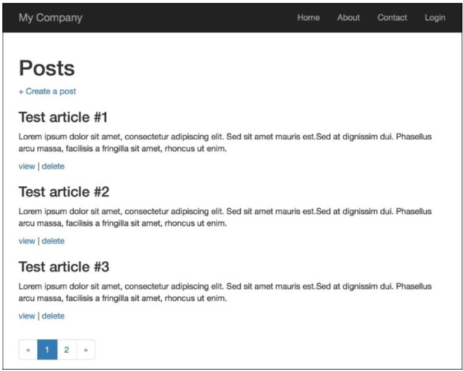

### 工作原理...

每一个控制器可以从独立动作中创建，就像是在拼图。区别是你可以是独立动作非常灵活，并在很多地方复用。

在我们的动作中，我们定义了`modelClass`公共属性，它能在`PostController`的`actions`方法中设置一个指定的类。

### 参考

欲了解更多信息， 参考[http://www.yiiframework.com/doc-2.0/guide-structurecontrollers.html#standalone-actions](http://www.yiiframework.com/doc-2.0/guide-structurecontrollers.html#standalone-actions)。

## 创建一个自定义过滤器

过滤器是一种对象，它会在控制器动作之前或者之后运行。例如，一个访问控制过滤器可能会在动作之前运行，确保它们只能被特殊的终端用户访问；一个内容压缩过滤器可能会在动作之后运行，用于在发送给终端用户之前压缩响应内容。

一个过滤器可能由一个前处理器（在动作之前执行）和/或一个后处理器（在动作之后执行）。过滤器本质上是一种特殊的行为。因此，使用过滤器和使用行为是一样的。

假设我们有一个web应用，它提供了一个用户界面，只在指定的小时内工作，例如从上午10点到下午6点。

### 准备

按照官方指南[http://www.yiiframework.com/doc-2.0/guide-start-installation.html](http://www.yiiframework.com/doc-2.0/guide-start-installation.html)的描述，使用Composer包管理器创建一个新的应用。

### 如何做...

1. 创建一个控制器`@app/controllers/TestController.php`：

```
<?php
namespace app\controllers;
use app\components\CustomFilter;
use yii\helpers\Html;
use yii\web\Controller;
class TestController extends Controller
{
    public function behaviors()
    {
        return [
            'access' => [
                'class' => CustomFilter::className(),
            ],
        ];
    }
    public function actionIndex()
    {
        return $this->renderContent(Html::tag('h1',
            'This is a test content'
        ));
    }
}
```

2. 创建一个新的过滤器`@app/components/CustomFilter.php`：

```
<?php
namespace app\components;
use Yii;
use yii\base\ActionFilter;
use yii\web\HttpException;
class CustomFilter extends ActionFilter
{
    const WORK_TIME_BEGIN = 10;
    const WORK_TIME_END = 18;
    protected function canBeDisplayed()
    {
        $hours = date('G');
        return $hours >= self::WORK_TIME_BEGIN && $hours <= self::WORK_TIME_END;
    }
    public function beforeAction($action)
    {
        if (!$this->canBeDisplayed())
        {
            $error = 'This part of website works from '
                . self::WORK_TIME_BEGIN . ' to '
                . self::WORK_TIME_END . ' hours.';
            throw new HttpException(403, $error);
        }
        return parent::beforeAction($action);
    }
    public function afterAction($action, $result)
    {
        if (Yii::$app->request->url == '/test/index') {
            Yii::trace("This is the index action");
        }
        return parent::afterAction($action, $result);
    }
}
```

3. 如果你在指定的时间之外访问页面，你将得到如下结果：

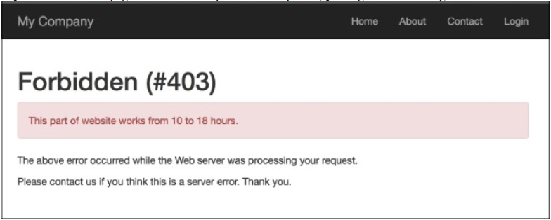

### 工作原理...

首先，我们添加一些代码到我们的控制器中，它实现了我们的自定义过滤器：

```
public function behaviors()
{
return [
    'access' => [
        'class' => CustomFilter::className(),
    ],
];
}
```

默认情况下，过滤器会应用到控制器所有的动作上，但是我们可以指定哪些动作可以被应用，或者哪些动作不被应用。

你有两个动作——`beforeAction`和`afterAction`。第一个会在控制器动作执行之前运行，第二个会在之后运行。

在我们的简单的例子中，我们定义了一个条件，如果时间早于早上10点，不允许访问网站，并且在after方法中，我们只是运行了一个trace方法，如果当前路径是`test/index`的话。

你可以在debugger中看到这个结果，在`log`部分：

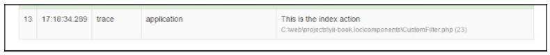

在真实的应用中，过滤器是比较复杂的，并且，Yii2提供了需要内置的过滤器，例如core、authentication、content negotiator，HTTP cache end等等。

### 参考

欲了解更多信息，参考[http://www.yiiframework.com/doc-2.0/guidestructure-filters.html](http://www.yiiframework.com/doc-2.0/guidestructure-filters.html)。

## 展示静态页面

如果你有一些静态页面，并且不会经常修改他们，那么不值得查询数据库，并为他们做页面管理。

### 准备

按照官方指南[http://www.yiiframework.com/doc-2.0/guide-start-installation.html](http://www.yiiframework.com/doc-2.0/guide-start-installation.html)的描述，使用Composer包管理器创建一个新的应用。

### 如何做...

1. 创建一个测试控制器文件`@app/controllers/TestController.php`：

```
<?php
namespace app\controllers;
use yii\web\Controller;
class TestController extends Controller
{
    public function actions()
    {
        return [
            'page' => [
                'class' => 'yii\web\ViewAction',
            ]
        ];
    }
}
```

2. 现在，将你的页面放进`views/test/pages`，命名为`index.php`和`contact.php`。`index.php`文件的内容如下：

```
<h1>Index</h1>
content of index file
Contact.php content is:
<h2>Contacts</h2>
<p>Our contact: contact@localhost</p>
```

3. 现在你可以通过访问URL检查你的页面
4. `http://yii-book.app/index.php?r=test/page&view=contact`：


5. 或者，如果你配置干净的URL格式的话，你可以访问`http://yii-book.app/test/page/view/about`。

### 工作原理...

我们连接了外部动作，名叫`\yii\web\ViewAction`，它只是尝试去找到一个视图，和`$_GET`参数提供的名称一致。如果找到了，展示它。如果找不到，将会给一个`404 not found`的页面。如果没有设置`viewParam`，将会使用默认值`defaultView`。

### 更多...

#### 关于ViewAction

`\yii\web\ViewAction`有一些有用的参数。列表如下：

| 参数名称 | 描述 |
|--|--|
| defaultView | 如果用户没有在GET参数中提供`yii\web\ViewAction::$viewParam`，默认视图的名称。默认值是'index'。格式应该是`path/to/view`。同`GET`参数中的类似 |
| layout | 应用到请求视图的布局名称。它会在视图被渲染前分配给`yii\base\Controller::$layout`。默认值是null，意味着使用控制器的布局。如果为false，不使用布局。 |
| viewParam | 包含请求视图名称`GET`参数的名称 |
| viewPrefix | 这是一个字符串，会作为一个前缀附加到用户指定的视图名称上，构成一个完整的视图名称。例如，如果一个用户请求是`tutorial/chap1`，相应的视图名称是`pages/tutorial/chap1`，假设前缀是`pages`。真实的视图文件又`yii\base\View::findViewFile()`决定。 |

#### 配置URL规则

`ViewAction`动作为你提供了一种方式，可以用于修改你的控制器，但是这个URL看着像`http://yii-book.app/index.php?r=test/page&page=about`。为了使URL更短更可读，添加一个URL规则到`urlManager`组件：

```
'<view:about>' => 'test/page'
```

如果`urlManager`组件配置正确，你将会得到如下页面：


为了配置`urlManager`组件，参考*配置URL规则*小节。

### 参考

欲了解更多信息，参考如下地址：

- [http://www.yiiframework.com/doc-2.0/yii-web-viewaction.html](http://www.yiiframework.com/doc-2.0/yii-web-viewaction.html)
- [http://www.yiiframework.com/doc-2.0/guide-structure-views.html#rendering-static-pages](http://www.yiiframework.com/doc-2.0/guide-structure-views.html#rendering-static-pages)
- *配置URL规则*小节

## 使用flash消息

当你使用一个form编辑一个模型时，删除一个模型，或者做其它操作，这是一个好习惯，告诉用户是否工作正常，或者发生了错误。典型情况下，在一些动作之后，例如编辑一个form，一个重定向将会发生，并且我们需要在页面上展示一条信息。但是，我们应该如何将它从当前页面传递到重定向目标，然后清理干净？flash消息将会帮助我们。

### 准备

按照官方指南[http://www.yiiframework.com/doc-2.0/guide-start-installation.html](http://www.yiiframework.com/doc-2.0/guide-start-installation.html)的描述，使用Composer包管理器创建一个新的应用。

### 如何做...

1. 创建一个控制器`@app/controllers/TestController.php`：

```
<?php
namespace app\controllers;
use Yii;
use yii\web\Controller;
use yii\filters\AccessControl;
class TestController extends Controller
{
    public function behaviors()
    {
        return [
            'access' => [
                'class' => AccessControl::className(),
                'rules' => [
                    [
                        'allow' => true,
                        'roles' => ['@'],
                        'actions' => ['user']
                    ],
                    [
                        'allow' => true,
                        'roles' => ['?'],
                        'actions' => ['index', 'success',
                            'error']
                    ],
                ],
                'denyCallback' => function ($rule, $action) {
                    Yii::$app->session->setFlash('error',
                        'This section is only for registered users.');
                    $this->redirect(['index']);
                },
            ],
        ];
    }
    public function actionUser()
    {
        return $this->renderContent('user');
    }
    public function actionSuccess()
    {
        Yii::$app->session->setFlash('success', 'Everything went fine!');
        $this->redirect(['index']);
    }
    public function actionError()
    {
        Yii::$app->session->setFlash('error', 'Everything went wrong!');
        $this->redirect(['index']);
    }
    public function actionIndex()
    {
        return $this->render('index');
    }
}
```

2. 此外，创建`@app/views/common/alert.php`视图：

```
<?php
use yii\bootstrap\Alert;
?>
<?php if (Yii::$app->session->hasFlash('success')):?>
    <?= Alert::widget([
        'options' => ['class' => 'alert-success'],
        'body' => Yii::$app->session->getFlash('success'),
    ]);?>
<?php endif ?>
<?php if (Yii::$app->session->hasFlash('error')) :?>
    <?= Alert::widget([
        'options' => ['class' => 'alert-danger'],
        'body' => Yii::$app->session->getFlash('error'),
    ]);?>
<?php endif; ?>
```

3. 创建视图`@app/views/test/index.php`：

```
<?php
/* @var $this yii\web\View */
?>
<?= $this->render('//common/alert') ?>
<h2>Guest page</h2>
<p>There's a content of guest page</p>
```

4. 创建视图`@app/views/test/user.php`：

```
<?php
/* @var $this yii\web\View */
?>
<?= $this->render('//common/alert') ?>
<h2>User page</h2>
<p>There's a content of user page</p>
```

5. 现在，如果你访问`http://yii-book.app/index.php?r=test/success`，你将会被重定向到`http://yii-book.app/index.php?r=test/index`，并展示了一条成功的消息：

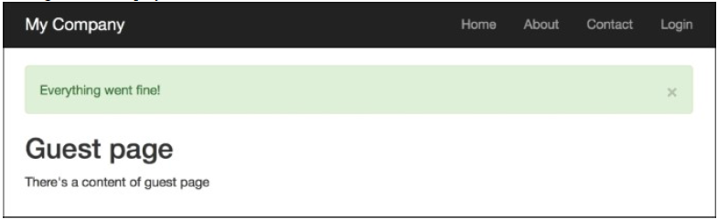

6. 此外，如果你访问`http://yii-book.app/index.php?r=test/error`，你将会被重重定向到相同的页面上，但是会得到一条错误消息。刷新`index`页面，消息将会隐藏：

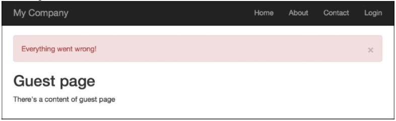

7. 尝试运行`http://yii-book.app/index.php?r=test/user`。你将会被重定向到`http://yii-book.app/index.php?r=test/index`，并会在`denyCallback`函数中执行并展示一条错误消息：

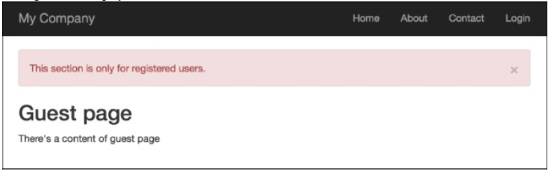

### 工作原理...

我们使用`Yii::$app->session->('success', 'Everything went fine!')`设置一条flash消息。本质上，它保存了一条消息到一个session中，所以在最低等级上，我们的消息被保存在`$_SESSION`中，直到`Yii::$app->session->getFlash('success')`被调用，然后`$_SESSION`键会被删除。

这个flash消息将会在请求中访问之后被自动删除。

### 更多...

#### getAllFlashes()方法

有时你需要处理所有的flashs。你可以使用一个简单的方式来处理它，如下所示：

```
$flashes = Yii::$app->session->getAllFlashes();
<?php foreach ($flashes as $key => $message): ?>
<?= Alert::widget([
    'options' => ['class' => 'alert-info'],
    'body' => $message,
]);
?>
<?php endforeach; ?>
```

#### removeAllFlashes()方法

当你需要flush所有的flash时，使用下面的方法：

```
Yii::$app->session->removeAllFlashes();
```

#### removeFlash()方法

当你需要移除指定的键，使用如下方法：

```
Yii::$app->session->removeFlash('success');
```

在这个例子中，我们添加一个非常有用的回调函数，它设置一条错误信息，并重定向到`test/index`页面上。

### 参考

欲了解更多信息，参考：

- [http://www.yiiframework.com/doc-2.0/yii-web-session.html](http://www.yiiframework.com/doc-2.0/yii-web-session.html)
- [http://www.yiiframework.com/doc-2.0/yii-bootstrap-alert.html](http://www.yiiframework.com/doc-2.0/yii-bootstrap-alert.html)

## 在一个视图中使用控制器上下文

Yii视图非常强大，并且有许多特性。其中一个就是你可以在一个视图中使用控制器上下文。所以，我们来试下吧。

### 准备

按照官方指南[http://www.yiiframework.com/doc-2.0/guide-start-installation.html](http://www.yiiframework.com/doc-2.0/guide-start-installation.html)的描述，使用Composer包管理器创建一个新的应用。

### 如何做...

1. 创建`controllers/ViewController.php`：

```
<?php
namespace app\controllers;
use yii\web\Controller;
class ViewController extends Controller
{
    public $pageTitle;
    public function actionIndex()
    {
        $this->pageTitle = 'Controller context test';
        return $this->render('index');
    }
    public function hello()
    {
        if (!empty($_GET['name'])) {
            echo 'Hello, ' . $_GET['name'] . '!';
        }
    }
}
```

2. 现在，我们创建`views/view.php`来展示我们可以做的事情：

```
<h1><?= $this->context->pageTitle ?></h1>
<p>Hello call. <?php $this->context->hello() ?></p>
```

3. 为了测试它，你可以访问`/index.php?r=view/index&name=Alex`：

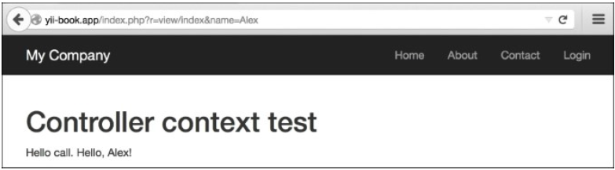

### 工作原理...

我们在一个视图中使用`$this`来引用当前运行的控制器。当做这些事情的时候，我们可以调用一个控制器方法，并访问他的属性。最常使用的属性是`pageTitle`，它表示当前页面的标题。在视图中，有许多内置的方法特别有用，例如`renderPartials`和小组件。

### 更多...

[http://www.yiiframework.com/doc-2.0/guide-structure-views.html#accessing-data-in-views](http://www.yiiframework.com/doc-2.0/guide-structure-views.html#accessing-data-in-views)地址包含了`CController`的API文档，这里你可以到方法的列表，这些你可以用在你的视图中。

## 部分复用视图

Yii支持部分视图，所以，如果你有一个块，其中没有太多的逻辑，你希望可以复用，或者想实施电子邮件模板，部分视图是处理这种问题的正确方法。

假设我们有两个Twitter账户，其中一个用与博客，另外一个用于公司活动，我们的目标是在指定的页面上输出Twitter时间线。

### 准备

1. 按照官方指南[http://www.yiiframework.com/doc-2.0/guide-start-installation.html](http://www.yiiframework.com/doc-2.0/guide-start-installation.html)的描述，使用Composer包管理器创建一个新的应用。
2. 为`php_net`和`yiiframework`两个用户在`https://twitter.com/settings/widgets/`创建Twitter小组件，并为每一个创建的小组件找到`data-widget-id`值。

### 如何做...

1. 创建一个控制器`@app/controllers/BlogController.php`：

```
<?php
namespace app\controllers;
use yii\web\Controller;
class BlogController extends Controller
{
    public function actionIndex()
    {
        $posts = [
            [
                'title' => 'First post',
                'content' => 'There\'s an example of reusing views with partials.',
            ],
            [
                'title' => 'Second post',
                'content' => 'We use twitter widget.'
            ],
        ];
        return $this->render('index', [
            'posts' => $posts
        ]);
    }
}
```

2. 创建一个名为`@app/views/common/twitter.php`的视图文件，并粘贴从Twitter复制过来的嵌入代码。你将会得到如下代码：

```
<?php
/* @var $this \yii\web\View */
/* @var $widget_id integer */
/* @var $screen_name string */
?>
    <script>!function(d,s,id){var
            js,fjs=d.getElementsByTagName(s)[0],p=/^http:/.test(d.location)?
                'http':'https';if(!d.getElementById(id)){js=d.createElement(s);j
            s.id=id;js.src=p+"://platform.twitter.com/
            widgets.js";fjs.parentNode.insertBefore(js,fjs);}}(document,"scr
            ipt","twitter-wjs");</script>
<?php if ($widget_id && $screen_name): ?>
    <a class="twitter-timeline"
       data-widget-id="<?= $widget_id?>"
       href="https://twitter.com/<?= $screen_name?>"
       height="300">
        Tweets by @<?= $screen_name?>
    </a>
<?php endif;?>
```

3. 创建一个视图`@app/views/blog/index.php`：

```
<?php
/* @var $category string */
/* @var $posts array */
/* @var $this \yii\web\View */
?>
<div class="row">
    <div class="col-xs-7">
        <h1>Posts</h1>
        <hr>
        <?php foreach ($posts as $post): ?>
            <h3><?= $post['title']?></h3>
            <p><?= $post['content']?></p>
        <?php endforeach;?>
    </div>
    <div class="col-xs-5">
        <?= $this->render('//common/twitter', [
            'widget_id' => '620531418213576704',
            'screen_name' => 'php_net',
        ]);?>
    </div>
</div>
```

4. 使用如下内容替换`@app/views/site/about.php`文件的内容：

```
<?php
use yii\helpers\Html;
/* @var $this yii\web\View */
$this->title = 'About';
?>
<div class="col-xs-7">
    <h1><?= Html::encode($this->title) ?></h1>
    <p>
        This is the About page. You may modify this page.
    </p>
</div>
<div class="col-xs-5">
    <?= $this->render('//common/twitter', [
        'widget_id' => '620526086343012352',
        'screen_name' => 'yiiframework'
    ]);?>
</div>
```

5. 尝试运行`index.php?r=blog/index`：

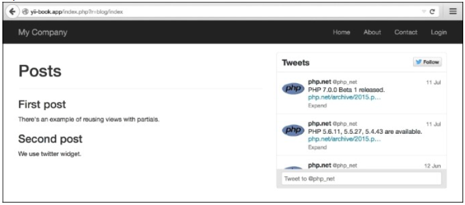

6. 尝试运行`index.php?r=site/about`：

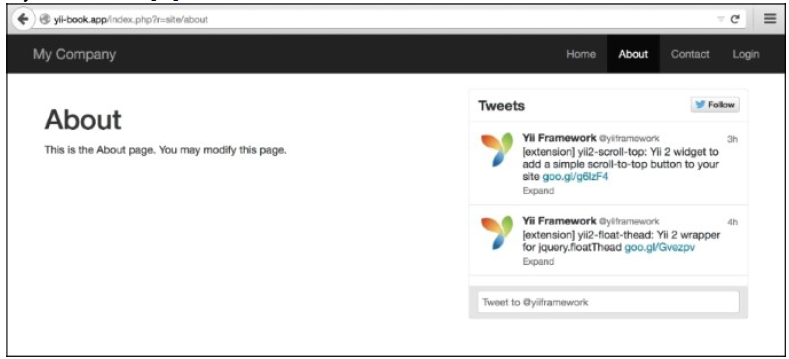

### 工作原理...

在当前例子中，两个视图使用一个额外的参数渲染了`@app/views/common/twitter.php`，从而构成Twitter小组件。注意到视图可以在控制器、小组件或者其它任何地方渲染，方法是通过调用视图渲染方法。例如，`\yii\base\Controller::render`做和`\yii\base\View::render`相同的模板处理，不同点是前者不使用布局。

在每一个视图文件中，我们可以使用$this访问View类的两个实例，所以任何视图文件都可以在其它任何视图中通过调用`render`方法调用。

### 更多...

欲了解更多信息，参考[http://www.yiiframework.com/doc-2.0/guidestructureviews.html#rendering-views](http://www.yiiframework.com/doc-2.0/guidestructureviews.html#rendering-views)。

## 使用blocks

Yii的一个特性是，你可以在你的视图中使用blocks。基本的思想是，你可以渲染一些输出，然后在一个视图中复用它。一个好的例子是，为你的布局定义额外的内容区域，然后在其它任何地方填充他们。

在先前的版本中，Yii 1.1，blocks被叫做clips。

### 准备

按照官方指南[http://www.yiiframework.com/doc-2.0/guide-start-installation.html](http://www.yiiframework.com/doc-2.0/guide-start-installation.html)的描述，使用Composer包管理器创建一个新的应用。

### 如何做...

1. 对于我们的例子，我们需要在我们的布局中定义两个区域——`beforeContent`和`footer`。
2. 打开`@app/views/layouts/main.php`并将如下内容插入到内容输出前：

```
<?php if(!empty($this->blocks['beforeContent'])) echo $this->blocks['beforeContent']; ?>
```

3. 然后，使用如下代码替换footer代码：

```
<footer class="footer">
    <div class="container">
        <?php if (!empty($this->blocks['footer'])):
            echo $this->blocks['footer'] ?>
        <?php else: ?>
            <p class="pull-left">&copy; My Company <?= date('Y') ?></p>
            <p class="pull-right"><?= Yii::powered() ?></p>
        <?php endif; ?>
    </div>
</footer>
```

4. 完成了！然后，添加一个新的动作到`controllers/SiteController.php`，名叫`blocks`：

```
public function actionBlocks()
{
    return $this->render('blocks');
}
```

5. 现在，创建一个视图文件`views/site/blocks.php`：

```
<?php
use \yii\Helpers\Html;
/* @var $this \yii\web\View */
?>
<?php $this->beginBlock('beforeContent');
echo Html::tag('pre', 'Your IP is ' . Yii::$app->request->userIP);
$this->endBlock(); ?>
<?php $this->beginBlock('footer');
echo Html::tag('h3', 'My custom footer block');
$this->endBlock(); ?>
<h1>Blocks usage example</h1>
```

6. 现在，当你打开你的`/index.php?r=site/blocks`页面，你应该能在页面内容之前获得你的IP，以及一个build-with note in the footer：

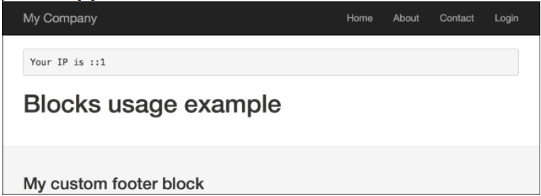

### 工作原理...

我们用代码标记一个区域，它会检查一个指定的block是否存在，并且如果这个block存在，这个代码就会输出它。然后，我们使用指定的控制器方法为我们定义的blocks记录内容，这两个方法是`beginBlock`和`endBlock`。

从控制器，你可以很容易地通过`$this->view->blocks['blockID']`访问我们的block的变量。

### 更多...

- *在一个视图中使用控制器上下文*小节
- [http://www.yiiframework.com/doc-2.0/guide-structure-views.html#using-blocks](http://www.yiiframework.com/doc-2.0/guide-structure-views.html#using-blocks)

## 使用装饰器

在Yii中，我们可以将内容封装到一个装饰器中。装饰器的常用方法是布局。当你使用你的控制器的渲染方法渲染一个视图的时候，Yii自动使用主布局装饰它。让我们创建一个简单的装饰器，它会正确的格式化引用。

### 准备

按照官方指南[http://www.yiiframework.com/doc-2.0/guide-start-installation.html](http://www.yiiframework.com/doc-2.0/guide-start-installation.html)的描述，使用Composer包管理器创建一个新的应用。

### 如何做...

1. 首先，我们将会创建一个装饰器文件`@app/views/decorators/quote.php`：

```
<div class="quote">
    <h2>&ldquo;<?= $content?>&rdquo;, <?= $author?></h2>
</div>
```

2. 现在，使用如下代码替换`@app/views/site/index.php`文件的内容：

```
<?php
use yii\widgets\ContentDecorator;
/* @var */
?>
<?php ContentDecorator::begin([
        'viewFile' => '@app/views/decorators/quote.php',
        'view' => $this,
        'params' => ['author' => 'S. Freud']
    ]
);?>
    Time spent with cats is never wasted.
<?php ContentDecorator::end();?>
```

3. 现在，你的**Home**页面应该会如下所示：

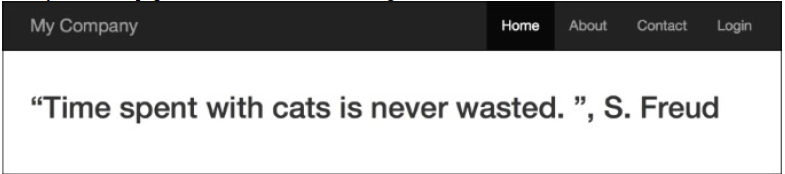

### 工作原理...

装饰器非常简单。`ContentDecorator::begin()`和`ContentDecorator::end()`之间的任何东西都会被渲染到一个`$content`变量中，并传递到一个装饰器模板中。然后，这个装饰器模板被渲染，并被插入到`ContentDecorator::end()`被调用的地方中。

我们可以使用`ContentDecorator::begin()`第二个参数传递额外的变量到装饰器模板中，例如之前的例子中我们传递了author变量。

注意我们使用了`@app/views/decorators/quote.php`作为视图路径。

### 参考

- [http://www.yiiframework.com/doc-2.0/yii-widgets-contentdecorator.html](http://www.yiiframework.com/doc-2.0/yii-widgets-contentdecorator.html)提供了更多关于装饰器的详情
- *在一个视图中使用控制器上下文*小节

## 定义多个布局

大部分应用位所有的视图使用同一个布局。但是，有些情况需要使用多个布局。例如，一个应用在不同的页面上有不同的布局：博客有两个额外的列，文章有一个额外的列，归档没有额外的列。

### 准备

按照官方指南[http://www.yiiframework.com/doc-2.0/guide-start-installation.html](http://www.yiiframework.com/doc-2.0/guide-start-installation.html)的描述，使用Composer包管理器创建一个新的应用。

### 如何做...

1. 在`views/layouts`中创建两个布局：`blog`和`articles`。`blog`的代码如下：

```
<?php $this->beginContent('//layouts/main')?>
    <div>
        <?= $content ?>
    </div>
    <div class="sidebar tags">
        <ul>
            <li><a href="#php">PHP</a></li>
            <li><a href="#yii">Yii</a></li>
        </ul>
    </div>
    <div class="sidebar links">
        <ul>
            <li><a href="http://yiiframework.com/">Yiiframework</a></li>
            <li><a href="http://php.net/">PHP</a></li>
        </ul>
    </div>
<?php $this->endContent()?>
```

2. `articles`的代码如下：

```
<?php
/* @var $this yii\web\View */
?>
<?php $this->beginContent('@app/views/layouts/main.php'); ?>
    <div class="container">
        <div class="col-xs-8">
            <?= $content ?>
        </div>
        <div class="col-xs-4">
            <h4>Table of contents</h4>
            <ol>
                <li><a href="#intro">Introduction</a></li>
                <li><a href="#quick-start">Quick start</a></li>
                <li>..</li>
            </ol>
        </div>
    </div>
<?php $this->endContent() ?>
```

3. 创建一个视图文件`views/site/content.php`：

```
<h1>Title</h1>
<p>Lorem ipsum dolor sit amet, consectetur adipisicing elit,
sed do eiusmod tempor incididunt ut labore et dolore magna
aliqua. Ut enim ad minim veniam, quis nostrud exercitation
ullamco laboris nisi ut aliquip ex ea commodo consequat. Duis
aute irure dolor in reprehenderit in voluptate velit esse
cillum dolore eu fugiat nulla pariatur.</p>
```

4. 创建三个控制器，名叫`BlogController`、`ArticleController`、`PortfolioController`，每一个都一个index动作。`controllers/BlogController.php`文件内容如下：

```
<?php
namespace app\controllers;
use yii\web\Controller;
class BlogController extends Controller
{
    public $layout = 'blog';
    public function actionIndex()
    {
        return $this->render('//site/content');
    }
}
```

5. `controllers/ArticleController.php`文件的内容如下：

```
<?php
namespace app\controllers;
use yii\web\Controller;
class ArticleController extends Controller
{
    public $layout = 'articles';
    public function actionIndex()
    {
        return $this->render('//site/content');
    }
}
```

6. `controllers/PortfolioController.php`文件的内容如下：

```
<?php
namespace app\controllers;
use yii\web\Controller;
class PortfolioController extends Controller
{
    public function actionIndex()
    {
        return $this->render('//site/content');
    }
}
```

7. 尝试运行`http://yii-book.app/?r=blog/index`：

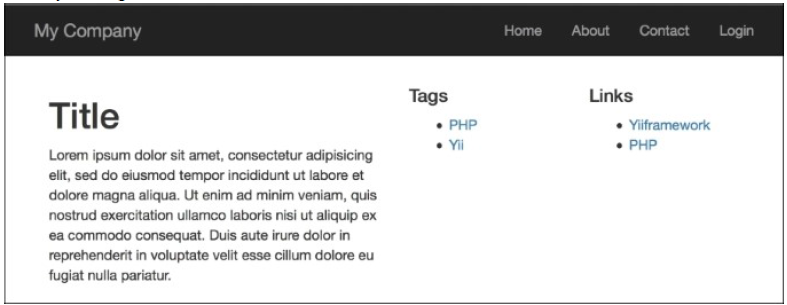

8. 尝试运行`http://yii-book.app/?r=article/index`：

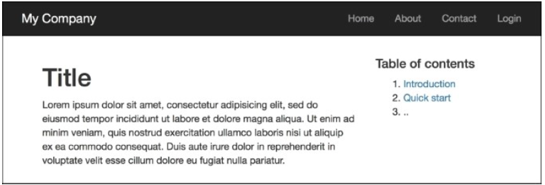

9. 尝试运行`http://yii-book.app/?r=portfolio/index`：

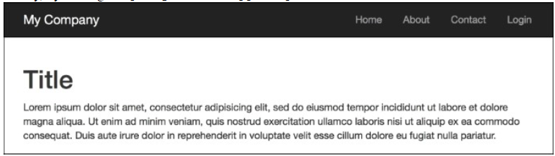

### 工作原理...

我们为博客和文章定义了两个额外的布局。因为我们不想从主布局中拷贝和粘贴相同的部分，我们使用`$this->beginContent`和`$this->endContent`做额外的布局装饰器。

所以，我们使用一个在文章布局的内部渲染的视图，作为主布局的`$content`。

### 参考

- [http://www.yiiframework.com/doc-2.0/guide-structure-views.html#nested-layouts](http://www.yiiframework.com/doc-2.0/guide-structure-views.html#nested-layouts)提供了关于布局更多的细节
- *在一个视图中使用控制器上下文*小节
- *使用装饰器*小节

## 页码和数据排序

在最新的Yii发布版本中，焦点从直接使用Active Record移到了grids、lists和data providers。但是，有时直接使用Active Record是更好的。下面我们来看如果列出分好页的AR记录，并有能力对他们进行排序。在这部分中，我们将会创建电影的一个列表，并通过数据库中的一些属性对他们进行排序。在我们的例子中，我们将会通过电影标题和租用率对他们进行排序。

### 准备

1. 按照官方指南[http://www.yiiframework.com/doc-2.0/guide-start-installation.html](http://www.yiiframework.com/doc-2.0/guide-start-installation.html)的描述，使用Composer包管理器创建一个新的应用。
2. 从[http://dev.mysql.com/doc/index-other.html](http://dev.mysql.com/doc/index-other.html)下载Sakila数据库。
3. 执行下载的SQL：首先是schema，然后是数据。
4. 在`config/main.php`中配置DB连接，来使用Sakila数据库。
5. 使用Gii生成`Film`模型

### 如何做...

1. 首先，你需要创建`@app/controllers/FilmController.php`：

```
<?php
namespace app\controllers;
use app\models\Film;
use yii\web\Controller;
use yii\data\Pagination;
use yii\data\Sort;
class FilmController extends Controller
{
    public function actionIndex()
    {
        $query = Film::find();
        $countQuery = clone $query;
        $pages = new Pagination(['totalCount' => $countQuery->count()]);
        $pages->pageSize = 5;
        $sort = new Sort([
            'attributes' => [
                'title',
                'rental_rate'
            ]
        ]);
        $models = $query->offset($pages->offset)
            ->limit($pages->limit)
            ->orderBy($sort->orders)
            ->all();
        return $this->render('index', [
            'models' => $models,
            'sort' => $sort,
            'pages' => $pages
        ]);
    }
}
```

2. 现在，让我们实现`@app/views/film/index.php`：

```
<?php
use yii\widgets\LinkPager;
/**
 * @var \app\models\Film $models
 * @var \yii\web\View $this
 * @var \yii\data\Pagination $pages
 * @var \yii\data\Sort $sort
 */
?>
    <h1>Films List</h1>
    <p><?=$sort->link('title')?> |
        <?=$sort->link('rental_rate')?></p>
<?php foreach ($models as $model): ?>
    <div class="list-group">
        <h4 class="list-group-item-heading"> <?=$model->title ?>
            <label class="label label-default">
                <?=$model->rental_rate ?>
            </label>
        </h4>
        <p class="list-group-item-text"><?=$model->description
            ?></p>
    </div>
<?php endforeach ?>
<?=LinkPager::widget([
    'pagination' => $pages
]); ?>
```

3. 尝试访问`http://yii-book.app/index.php?r=film/index`。你应该能得到一个工作的分页，和允许通过电影标题和租用率排序的链接：

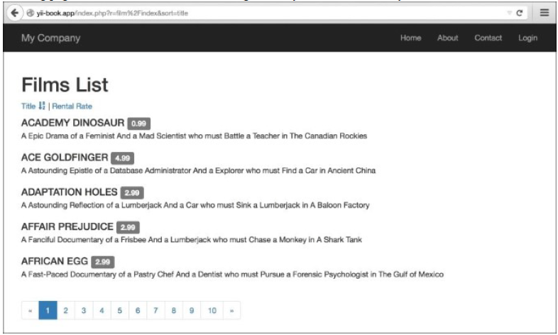

### 工作原理...

首先，我们得到了全部模型的数量，通过将这个数传递给`Pagination`实例的`totalCount`变量，初始化了新的分页组件实例。然后我们使用`$page->pageSize`字段为我们的分页设置每页的大小。然后，我们为这个模型创建了一个sorter实例，指定了我们希望用作排序的模型属性，并通过调用`orderBy`应用排序条件到查询，然后将其传递给`$sort->orders`做为一个参数。然后，我们调用了`all()`从DB中获取记录。

现在，我们有了模型的列表、页面以及被用于link pager的数据，以及我们用于生成排序连接的sorter。

在这个视图中，我们使用我们搜集的数据。首先，我们使用`Sort::link`生成链接。然后，我们列出模型。最后，使用*LinkPager*小组件，我们渲染了分页控制。

### 参考

访问如下地址，获取更多关于分页和排序的信息：

- [http://www.yiiframework.com/doc-2.0/yii-data-pagination.html](http://www.yiiframework.com/doc-2.0/yii-data-pagination.html)
- [http://www.yiiframework.com/doc-2.0/yii-data-sort.html](http://www.yiiframework.com/doc-2.0/yii-data-sort.html)
- [http://www.yiiframework.com/doc-2.0/guide-output-pagination.html](http://www.yiiframework.com/doc-2.0/guide-output-pagination.html)
- [http://www.yiiframework.com/doc-2.0/guide-output-sorting.html](http://www.yiiframework.com/doc-2.0/guide-output-sorting.html)