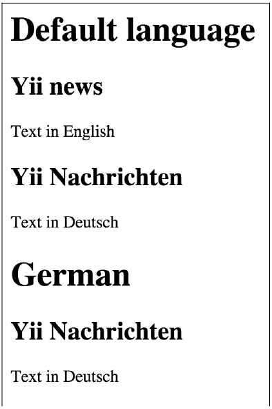

## 自定义ActiveQuery类

默认情况下，所有的Active Record查询是由`\yii\db\ActiveQuery`支持的。为了在一个Active Record中使用一个自定义的查询类，你可以重写`\yii\db\ActiveRecord::find()`方法，并返回一个你的自定义查询类的实例。

### 准备

1. 按照官方指南[http://www.yiiframework.com/doc-2.0/guide-start-installation.html](http://www.yiiframework.com/doc-2.0/guide-start-installation.html)的描述，使用Composer包管理器创建一个新的应用。
2. 设置数据库连接，创建一个名为`post`的表：

```sql
DROP TABLE IF EXISTS ''post'';
CREATE TABLE IF NOT EXISTS ''post'' (
''id'' INT(10) UNSIGNED NOT NULL AUTO_INCREMENT,
''lang'' VARCHAR(5) NOT NULL DEFAULT ''en'',
''title'' VARCHAR(255) NOT NULL,
''text'' TEXT NOT NULL,
PRIMARY KEY (''id'')
);
INSERT INTO ''post''(''id'',''lang'',''title'',''text'')
VALUES (1,''en_us'',''Yii news'',''Text in English''),
(2,''de'',''Yii Nachrichten'',''Text in Deutsch'');
```

3. 使用Gii生成一个`Post`模型，并选中**Generate ActiveQuery**选项，这会生成`PostQuery`类。

### 如何做...

1. 为`models/PostQuery.php`添加如下方法：

```php
<?php
namespace app\models;
/**
 * This is the ActiveQuery class for [[Post]].
 *
 * @see Post
 */
class PostQuery extends \yii\db\ActiveQuery
{
/**
 * @param $lang
 *
 * @return $this
 */
    public function lang($lang)
    {
        return $this->where([ 'lang' => $lang ]);
    }
}
```

2. 现在，我们可以使用我们的模型。创建`controllers/DbController.php`：

```php
<?php
namespace app\controllers;
use app\models\Post;
use yii\helpers\Html;
use yii\web\Controller;
/**
 * Class DbController.
 * @package app\controllers
 */
class DbController extends Controller
{
    public function actionIndex()
    {
        // Get posts written in default application language
        $posts = Post::find()->all();

        echo Html::tag('h1', 'Default language');
        foreach ($posts as $post) {
            echo Html::tag('h2', $post->title);
            echo $post->text;
        }

        // Get posts written in German
        $posts = Post::find()->lang('de')->all();
        
        echo Html::tag('h1', 'German');
        foreach ($posts as $post) {
            echo Html::tag('h2', $post->title);
            echo $post->text;
        }
    }
}
```

3. 现在运行`db/index`你会得到类似如下截图所示的输出：



### 工作原理...

我们在`Post`模型中重写了`find`方法，并扩展了ActiveQuery类。`lang`方法返回指定语言值的ActiveQuery。为了支持链式调用，`lang`返回自身模型的实例。

### 参考

欲了解更多信息，参考如下地址：

- [http://www.yiiframework.com/doc-2.0/guide-db-active-record.html#customizing-query-classes](http://www.yiiframework.com/doc-2.0/guide-db-active-record.html#customizing-query-classes)
- [http://www.yiiframework.com/doc-2.0/guide-intro-upgrade-from-v1.html#active-record](http://www.yiiframework.com/doc-2.0/guide-intro-upgrade-from-v1.html#active-record)