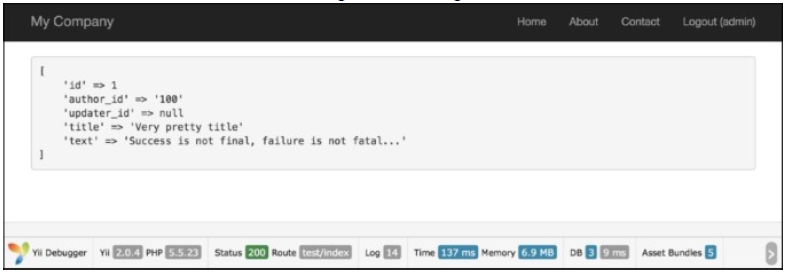

## 自动设置一个作者

`Blameable` behavior允许你自动更新一个或多个作者的字段。它主要用于生成`created_by`和`update_by`字段的数据。和时间戳行为类似，你可以很容易为这个行为指定一些特殊的参数和必要的事件。

回顾上节中的例子。在我们的博客应用中也有帖子。例如，假设我们的博客模型叫做`BlogPost`。模型有`author_id`字段，它标明创建这个帖子的人，以及`updater_id`，它标明更新这个帖子的人。我们希望在创建或者更新模型事件时自动填写这些字段。现在你将学习如何做到这个。

### 准备

1. 按照官方指南[http://www.yiiframework.com/doc-2.0/guide-start-installation.html](http://www.yiiframework.com/doc-2.0/guide-start-installation.html)的描述，使用Composer包管理器创建一个新的应用。
2. 设置数据库连接并创建一个名叫`blog_post`的表：

```sql
DROP TABLE IF EXISTS 'blog_post';
CREATE TABLE IF NOT EXISTS 'blog_post' (
  'id' INT(10) UNSIGNED NOT NULL AUTO_INCREMENT,
  'author_id' INT(10) UNSIGNED DEFAULT NULL,
  'updater_id' INT(10) UNSIGNED DEFAULT NULL,
  'title' VARCHAR(255) NOT NULL,
  'text' TEXT NOT NULL,
  PRIMARY KEY ('id')
);
```

3. 使用Gii为`blog_post`表生成`BlogPost`模型。

### 如何做...

1. 添加如下`behaviors`方法到`models/BlogPost.php`：

```php
<?php
namespace app\models;
use Yii;
use yii\db\BaseActiveRecord;
/**
 * This is the model class for table "blog_post".
 *
 * @property integer $id
 * @property integer $author_id
 * @property integer $updater_id
 * @property string $title
 * @property string $text
 */
class BlogPost extends \yii\db\ActiveRecord
{
    /**
     * @return array
     */
    public function behaviors()
    {
        return [
            [
                'class' => 'yii\behaviors\BlameableBehavior',
                'attributes' => [
                    BaseActiveRecord::EVENT_BEFORE_INSERT =>
                        'author_id',
                    BaseActiveRecord::EVENT_BEFORE_UPDATE =>
                        'updater_id'
                ]
            ]
        ];
    }
}
```

2. 创建`controllers/TestController.php`：

```php
<?php
namespace app\controllers;
use app\models\BlogPost;
use app\models\User;
use Yii;
use yii\helpers\Html;
use yii\helpers\VarDumper;
use yii\web\Controller;
/**
 * Class TestController.
 * @package app\controllers
 */
class TestController extends Controller
{
    public function actionIndex()
    {
        $users = new User();
        $identity = $users->findIdentity(100);
        Yii::$app->user->setIdentity($identity);
        $blogPost = new BlogPost();
        $blogPost->title = 'Very pretty title';
        $blogPost->text = 'Success is not final, failure is not fatal...';
        $blogPost->save();
        return $this->renderContent(Html::tag('pre',
            VarDumper::dumpAsString(
                $blogPost->attributes
            )));
    }
}
```

3. 运行`test/index`，你将会得到如下结果：


### 工作原理...

默认情况下，`Blameable`行为填充`created_by`和`updated_by`字段，但是我们根据需求改变。

我们也指定了模型事件和字段，所以在模型创建时，`author_id`将会填充。类似地，在模型更新时，我们将会填充`updater_id`。

`Blameable`所做的就是当创建或者更新模型事件发生时，将当前的用户ID值插入到`created_by`和`updated_by`字段。这是非常便利的一个方法。每次创建或者更新模型时，我们将自动填充必要的字段。

这对于一些项目非常有用，例如对于大型系统，当多个用户是管理员，你需要知道谁都做了些什么。你也可以为前端实现使用这个。例如，如果你有一个`blog_comment`表，你希望使用这个方法来记录评论的作者。此外，你可以在控制器中设置作者的字段，但这个行为帮助你避免写不必要的和额外的代码。这将非常有效并且简单。

### 更多...

有时我们希望使用一个id填充`author_id`和`updater_id`，而不是当前用户。在这种情况下，我们需要拆除这个行为：

```php
$model->detachBehavior('blammable');
```

### 参考

欲了解更多信息，参考[http://www.yiiframework.com/doc-2.0/yii-behaviorsblameablebehavior.html](http://www.yiiframework.com/doc-2.0/yii-behaviorsblameablebehavior.html)。