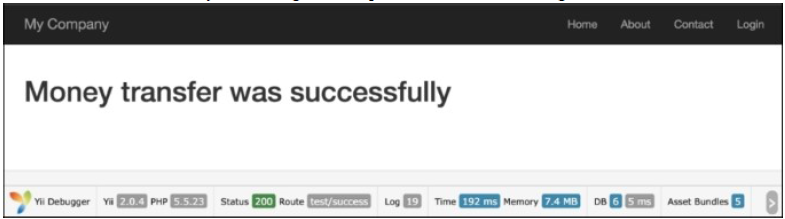
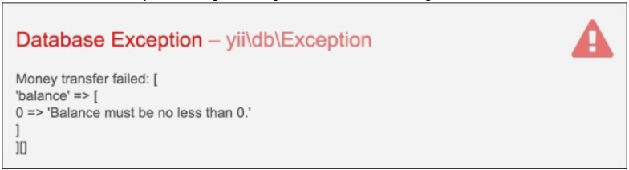

## 事务

在现代数据库中，事务可以做一些别的事情，例如保证在别人写数据的时候你没有访问数据的权限。但是，基本的思想是一样的——事务能保证无论发生什么事情，你使用的数据都是可感知的。他们保证不存在这样这样一种情况，钱从一个账户中拿走了，但没有进入另外一个账户中。

Yii2支持强大的带有保存点的事务机制。

一个经典的例子是，将钱从一个银行账户转移到另外一个银行账户中。为了做到这一点，首先你需要从源账户中取出钱，然后转移到目标账户中。这个操作必须全部成功。如果半道终止了，钱将会丢失。例如，我们有一个接收账户和一个发送账户。我们需要将钱从发送账户转移到接收账户中。假设我们有一个账户模型。

### 准备...

账户模型非常简单，只包含`id`和`balance`两个字段。

1. 按照官方指南[http://www.yiiframework.com/doc-2.0/guide-start-installation.html](http://www.yiiframework.com/doc-2.0/guide-start-installation.html)的描述，使用Composer包管理器创建一个新的应用。
2. 创建一个migration，它会使用如下命令添加一个账户表：

```
./yii migrate/create create_account_table
```

3. 同时，使用如下代码更新刚刚创建的migration：

```php
<?php
use yii\db\Schema;
use yii\db\Migration;
class m150620_062034_create_account_table extends Migration
{
    const TABLE_NAME = '{{%account}}';
    public function up()
    {
        $tableOptions = null;
        if ($this->db->driverName === 'mysql') {
            $tableOptions = 'CHARACTER SET utf8 COLLATE utf8_general_ci ENGINE=InnoDB';
        }
        $this->createTable(self::TABLE_NAME, [
            'id' => Schema::TYPE_PK,
            'balance' => ' NUMERIC(15,2) DEFAULT NULL',
        ], $tableOptions);
    }
    public function down()
    {
        $this->dropTable(self::TABLE_NAME);
    }
}
```

4. 然后使用如下命令安装migration：

```
./yii migrate up
```

5. 使用Gii为账户表创建模型。
6. 创建一个migration，他会添加一些测试`Account`模型到表中：

```
./yii migrate/create add_account_records
```

7. 同时，使用如下代码更新刚刚创建的migration：

```php
<?php
use yii\db\Migration;
use app\models\Account;
class m150620_063252_add_account_records extends Migration
{
    public function up()
    {
        $accountFirst = new Account();
        $accountFirst->balance = 1110;
        $accountFirst->save();
        $accountSecond = new Account();
        $accountSecond->balance = 779;
        $accountSecond->save();
        $accountThird = new Account();
        $accountThird->balance = 568;
        $accountThird->save();
        return true;
    }
    public function down()
    {
        $this->truncateTable('{{%account}}');
        return false;
    }
}
```

### 如何做...

1. 添加如下规则到`models/Account.php`中的`rules`方法：

```php
public function rules()
{
    return [
        //..
        [['balance'], 'number', 'min' => 0],
        //..
    ];
}
```

2. 假设balance只能是正的，不能是负值。
3. 给`TestController`创建success和error动作：

```php
<?php
namespace app\controllers;
use app\models\Account;
use Yii;
use yii\db\Exception;
use yii\helpers\Html;
use yii\helpers\VarDumper;
use yii\web\Controller;
class TestController extends Controller
{
    public function actionSuccess()
    {
        $transaction = Yii::$app->db->beginTransaction();
        try {
            $recipient = Account::findOne(1);
            $sender = Account::findOne(2);
            $transferAmount = 177;
            $recipient->balance += $transferAmount;
            $sender->balance -= $transferAmount;
            if ($sender->save() && $recipient->save()) {
                $transaction->commit();
                return $this->renderContent(
                    Html::tag('h1', 'Money transfer was successfully')
                );
            } else {
                $transaction->rollBack();
                throw new Exception('Money transfer failed:' .
                    VarDumper::dumpAsString($sender->getErrors()) .
                    VarDumper::dumpAsString($recipient->getErrors())
                );
            }
        } catch ( Exception $e ) {
            $transaction->rollBack();
            throw $e;
        }
    }
    public function actionError()
    {
        $transaction = Yii::$app->db->beginTransaction();
        try {
            $recipient = Account::findOne(1);
            $sender = Account::findOne(3);
            $transferAmount = 1000;
            $recipient->balance += $transferAmount;
            $sender->balance -= $transferAmount;
            if ($sender->save() && $recipient->save()) {
                $transaction->commit();
                return $this->renderContent(
                    Html::tag('h1', 'Money transfer was successfully')
                );
            } else {
                $transaction->rollBack();
                throw new Exception('Money transfer failed: ' .
                    VarDumper::dumpAsString($sender->getErrors()) .
                    VarDumper::dumpAsString($recipient->getErrors())
                );
            }
        } catch ( Exception $e ) {
            $transaction->rollBack();
            throw $e;
        }
    }
}
```

4. 运行`test/success`你会得到如下输出：



5. 在这中情况下，如果发生了一些错误，事务机制不会更新接收者账户和发送者账户。
6. 运行`test/error`你将会得到如下输出：



如果你记得，我们给`Account`模型添加了一条规则，所以我们的账户只能是正的。在这种情况下，事务将会回滚，它阻止了从发送者账户中取出钱，但没有钱到接收者账户中的情况。

### 参考

欲了解更多信息，参考：

- [http://www.yiiframework.com/doc-2.0/guide-db-dao.html#performing-transactions](http://www.yiiframework.com/doc-2.0/guide-db-dao.html#performing-transactions)
- [http://www.yiiframework.com/doc-2.0/guide-db-dao.html#nesting-transactions](http://www.yiiframework.com/doc-2.0/guide-db-dao.html#nesting-transactions)