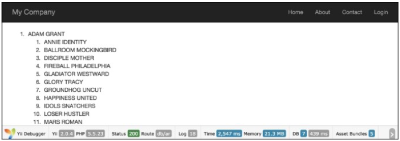
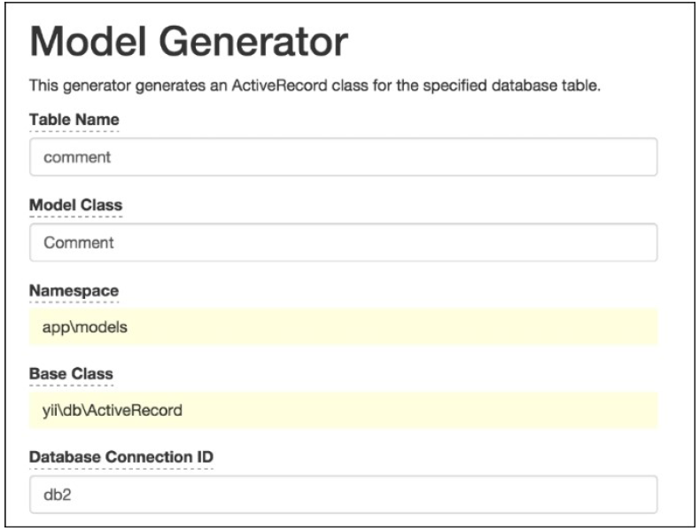
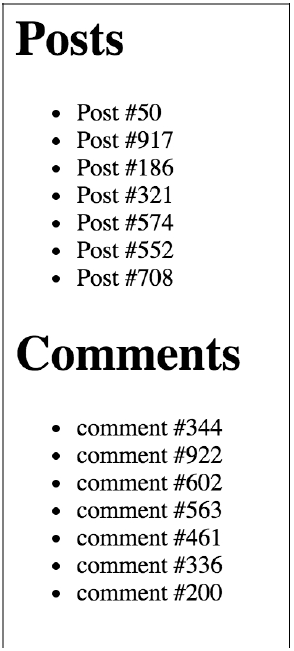
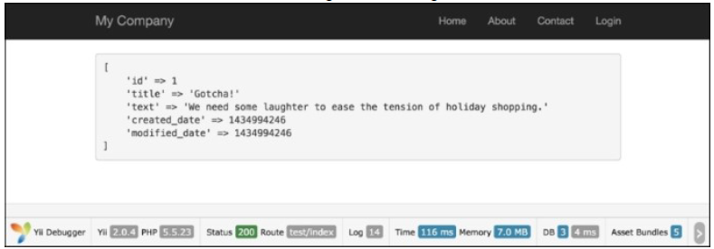
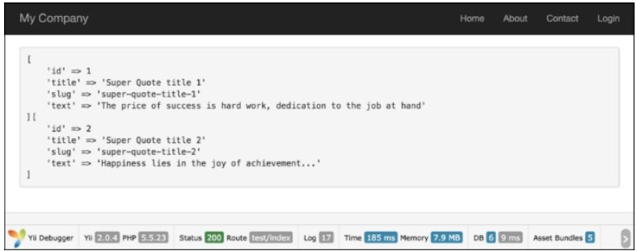
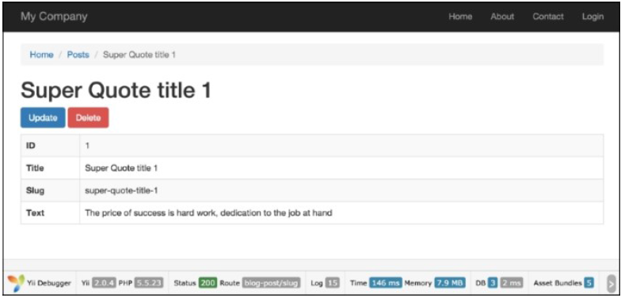
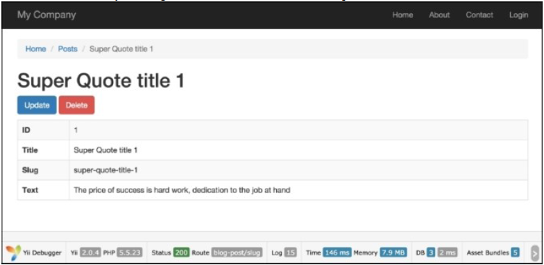
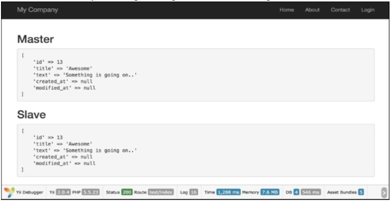
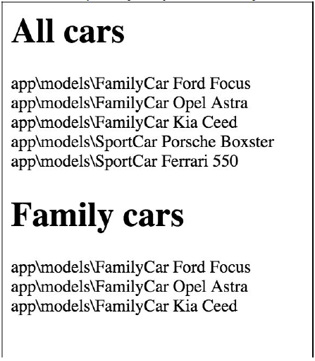

# 第3章 ActiveRecord, Model, 数据库

在本章中，我们将会讨论如下话题：

- 从数据库中获取数据
- 定义和使用多个数据库连接
- 自定义ActiveQuery类
- 使用AR event-like方法处理model fields
- 自动化时间戳
- 自动设置一个作者
- 自动设置一个slug
- 事务
- 复制和读写分离
- 实现单表继承

## 介绍

在本章中，你将学习如何高效使用数据库，什么时候应该使用models而什么时候不应该，如何使用多个数据库，如何自动预处理Active Record fields，如何使用事务，等等。

## 从数据库中获取数据

今天大多数应用都在使用数据库。不论是一个小网站，还是一个大型社交网站，至少其中一部分功能是由数据库驱动的。

Yii引入了三种方法来允许你使用数据库。他们是：

- Active Record
- Query Builder
- SQL via DAO

我们将使用这三种方法从`film`、`film_actor`、`actor`表中获取数据，并将他们展示在一个列表中。同时，我们将会比较它们的执行时间和内存占用情况，来决定这些方法的使用场景。

### 准备

1. 按照官方指南[http://www.yiiframework.com/doc-2.0/guide-start-installation.html](http://www.yiiframework.com/doc-2.0/guide-start-installation.html)的描述，使用Composer包管理器创建一个新的应用。
2. 从[http://dev.mysql.com/doc/index-other.html](http://dev.mysql.com/doc/index-other.html)下载Sakila数据库。
3. 执行下载好的SQLs；首先是schema，然后是数据。
4. 在`config/main.php`中配置数据库连接，使用Sakila数据库。
5. 使用Gii为actor和film表创建模型。

### 如何做...

1. 创建`app/controllers/DbController.php`：

```
<?php
namespace app\controllers;
use app\models\Actor;
use Yii;
use yii\db\Query;
use yii\helpers\ArrayHelper;
use yii\helpers\Html;
use yii\web\Controller;
/**
 * Class DbController
 * @package app\controllers
 */
class DbController extends Controller
{
/**
 * Example of Active Record usage.
 *
 * @return string
 */
    public function actionAr()
    {
        $records = Actor::find()
            ->joinWith('films')
            ->orderBy('actor.first_name,
actor.last_name, film.title')
            ->all();
        return $this->renderRecords($records);
    }
    /**
     * Example of Query class usage.
     *
     * @return string
     */
    public function actionQuery()
    {
        $rows = (new Query())
            ->from('actor')
            ->innerJoin('film_actor',
                'actor.actor_id=film_actor.actor_id')
            ->leftJoin('film',
                'film.film_id=film_actor.film_id')
            ->orderBy('actor.first_name, actor.last_name,
actor.actor_id, film.title')
            ->all();
        return $this->renderRows($rows);
    }
    /**
     * Example of SQL execution usage.
     *
     * @return string
     */
    public function actionSql()
    {
        $sql = 'SELECT *
FROM actor a
JOIN film_actor fa ON fa.actor_id = a.actor_id
JOIN film f ON fa.film_id = f.film_id
ORDER BY a.first_name, a.last_name, a.actor_id,
f.title';
        $rows = Yii::$app->db->createCommand($sql)->queryAll();
        return $this->renderRows($rows);
    }
    /**
     * Render records for Active Record array.
     *
     * @param array $records
     *
     * @return string
     */
    protected function renderRecords(array $records = [])
    {
        if (!$records) {
            return $this->renderContent('Actor list is empty.');
        }
        $items = [];
        foreach ($records as $record) {
            $actorFilms = $record->films
                ?
                Html::ol(ArrayHelper::getColumn($record->films, 'title')): null;
            $actorName = $record->first_name.'
'.$record->last_name;
            $items[] = $actorName.$actorFilms;
        }
        return $this->renderContent(Html::ol($items, [
            'encode' => false,
        ]));
    }
    /**
     * Render rows for result of query.
     *
     * @param array $rows
     *
     * @return string
     */
    protected function renderRows(array $rows = [])
    {
        if (!$rows) {
            return $this->renderContent('Actor list is empty.');
        }
        $items = [];
        $films = [];
        $actorId = null;
        $actorName = null;
        $actorFilms = null;
        $lastActorId = $rows[0]['actor_id'];
        foreach ($rows as $row) {
            $actorId = $row['actor_id'];
            $films[] = $row['title'];
            if ($actorId != $lastActorId) {
                $actorName = $row['first_name'].'
'.$row['last_name'];
                $actorFilms = $films ? Html::ol($films) : null;
                $items[] = $actorName.$actorFilms;
                $films = [];
                $lastActorId = $actorId;
            }
        }
        if ($actorId == $lastActorId) {
            $actorFilms = $films ? Html::ol($films) : null;
            $items[] = $actorName.$actorFilms;
        }
        return $this->renderContent(Html::ol($items, [
            'encode' => false,
        ]));
    }
}
```

2. 这里，我们有三个actions分别对应于三种不同的方法。
3. 运行上面的`db/ar`、`db/query`、`db/sql`三个actions之后，你应该得到了一个展示200个演员和他们演过的1000个电影的树，截图如下：



4. 在页面底部，提供了关于内存使用和执行时间的信息。运行这段代码的绝对时间可能不同，但相对大小应该是一致的：

| 方法 | 内存使用（MB） | 执行时间（秒） |
|--|--|--|
| Active Record | 21.4 | 2.398 |
| Query Builder | 28.3 | 0.477 |
| SQL(DAO) | 27.6 | 0.481 |

### 工作原理...

`actionAr`方法使用Active Record方法获取了模型的实例。我们使用Gii生成的`Actor`模型来获取所有的演员，并指定`joinWith=>'films'`来获取对应的电影，它使用一个简单的查询或者通过关系预先加载，这是由Gii从`InnoDB`表外键为我们创建的。然后迭代所有的演员和电影，打印出他们的名字。

`actionQuery`函数使用Query Builder。首先我们使用`\yii\db\Query`为当前数据库连接创建了一个查询。然后依次加入查询部分`from`、`joinInner`和`leftJoin`。这些方法自动escape值、表和field名称。`\yii\db\Query`的函数`all()`返回了原始数据库的行数组。每一行也是一个数组，索引是field名称。我们将结果传给了`renderRows`，它负责渲染。

`actionSql`是一样的，不同的是我们直接传递SQL，而不是一个接着一个。值得一提的是，我们应该使用`Yii::app()->db->quoteValue`手动escape参数值：

`renderRows`方法渲染了Query Builder。

`renderRecords`方法渲染了active records。

| 方法 | Active Record | Query Builder | SQL(DAO) |
|---|---|---|---|
| 语法 | 能为你处理SQL。<br />Gii会为你创建模型和关系。<br />使用完全面向对象风格的模型和整洁的API。<br />生成一个适当嵌套的模型的数组作为结果。 | 整洁的API，适于一步步创建查询。<br />生成原始数据数组作为结果。 | 适用于复杂的SQL。<br />手动qoute值和关键字。<br />不太适用于一步步创建查询。<br />生成原始数据数组作为结果。 |
| 性能 | 相对于SQL和Query Builder，内存占用率高，执行时间长。 | Okay | Okay |
| 更多特性 | 自动quote值和名称。<br />Behaviors. Before/after hook.<br />校验。Prototyping select. | 自动quote值和名称 | 无 |
| 适用于 | 为单个模型更新、删除和创建（当使用form时尤为便利） | 适用于大量的数据，并能一步步创建查询。 | 使用纯SQL进行复杂的查询，并有尽可能好的性能。 |

### 更多...

欲了解更多有关Yii操作数据库，参考如下资源：

- [http://www.yiiframework.com/doc-2.0/guide-db-dao.html](http://www.yiiframework.com/doc-2.0/guide-db-dao.html)
- [http://www.yiiframework.com/doc-2.0/guide-db-query-builder.html](http://www.yiiframework.com/doc-2.0/guide-db-query-builder.html)
- [http://www.yiiframework.com/doc-2.0/guide-db-active-record.html](http://www.yiiframework.com/doc-2.0/guide-db-active-record.html)

## 定义和使用多个数据库连接

对于新的单机web应用，多数据库连接并不常用。但是，当你为一个已经存在的系统附加一个应用是，你很可能需要另外一个数据库连接。

在本节中，你将会学习如何定义多个数据库连接并利用DAO、Query Builder和Active Record模型使用它们。

### 准备

1. 按照官方指南[http://www.yiiframework.com/doc-2.0/guide-start-installation.html](http://www.yiiframework.com/doc-2.0/guide-start-installation.html)的描述，使用Composer包管理器创建一个新的应用。
2. 创建两个MySQL数据库，名字分别叫`db1`和`db2`。
3. 在`db1`中创建一个名叫`post`的表：

```
DROP TABLE IF EXISTS 'post';
CREATE TABLE IF NOT EXISTS 'post' (
  'id' INT(10) UNSIGNED NOT NULL AUTO_INCREMENT,
  'title' VARCHAR(255) NOT NULL,
  'text' TEXT NOT NULL,
  PRIMARY KEY ('id')
);
```

4. 在`db2`中创建一个名叫`comment`的表：

```
DROP TABLE IF EXISTS 'comment';
CREATE TABLE IF NOT EXISTS 'comment' (
  'id' INT(10) UNSIGNED NOT NULL AUTO_INCREMENT,
  'text' TEXT NOT NULL,
  'post_id' INT(10) UNSIGNED NOT NULL,
  PRIMARY KEY ('id')
);
```

### 如何做...

1. 首先配置数据库连接。打开`config/main.php`文件，按照官方指南中的描述，定义一个主连接：

```
'db' => [
    'connectionString' =>'mysql:host=localhost;dbname=db1',
    'username' => 'root',
    'password' => '',
    'charset' => 'utf8',
],
```

2. 复制它，重命名`db`组件为`db2`，并相应修改`connectionString`。同时，你需要按照如下方式添加`class`：

```
'db2' => [
    'class'=>'yii\db\Connection',
    'connectionString' => 'mysql:host=localhost;dbname=db2',
    'username' => 'root',
    'password' => '',
    'charset' => 'utf8',
],
```

3. 现在你有两个数据库连接，你可以按如下方式利用DAO和Query Builder使用它们：

```
$rows1 = Yii::$app->db->createCommand($sql)->queryAll();
$rows2 = Yii::$app->db2->createCommand($sql)->queryAll();
```

4. 现在，如何我们需要使用Active Record模型，首先我们需要使用Gii创建Post和Comment模型。你可以为每一个模型选择一个合适的连接。当你创建Comment模型时，将数据库连接ID设置为`db2`，如下截图所示：



5. 现在你可以按往常一样使用`Comment`模型，并创建`controllers/DbController.php`：

```
<?php
namespace app\controllers;
use app\models\Post;
use app\models\Comment;
use yii\helpers\ArrayHelper;
use yii\helpers\Html;
use yii\web\Controller;
/**
 * Class DbController.
 * @package app\controllers
 */

class DbController extends Controller
{
    public function actionIndex()
    {
        $post = new Post();
        $post->title = 'Post #'.rand(1, 1000);
        $post->text = 'text';
        $post->save();
        $posts = Post::find()->all();
        echo Html::tag('h1', 'Posts');
        echo Html::ul(ArrayHelper::getColumn($posts, 'title'));
        $comment = new Comment();
        $comment->post_id = $post->id;
        $comment->text = 'comment #'.rand(1, 1000);
        $comment->save();
        $comments = Comment::find()->all();
        echo Html::tag('h1', 'Comments');
        echo Html::ul(ArrayHelper::getColumn($comments,
            'text'));
    }
}
```

6. 运行`db/index`多次，然后你将会看到记录保存到了两个数据库中，如下截图所示：



### 工作原理...

在Yii中，你可以通过配置文件添加和配置你自己的组件。对于非标准的组件，例如`db2`，你必须指定组件类。类似地，你可以添加`db3`、`db4`或者其他组件，例如`facebookApi`。剩余的数组键值对分别赋值给了组件的公共属性。

### 更多...

依赖于使用的RDBMS，有一个额外的事情可以做，能让我们更方便的使用多个数据库。

#### 跨数据库关系

如果你使用的是MySQL，你可以为你的模型创建跨数据库的关系。为了做到这一步，你应该为`Comment`模型的表名添加数据库名称：

```
class Comment extends \yii\db\ActiveRecord
{
//...
    public function tableName()
    {
        return 'db2.comment';
    }
//...
}
```

现在，如果在`Post`模型中你定义了一个评论关系，你可以按如下方式使用：

```
$posts = Post::find()->joinWith('comments')->all();
```

### 参考

欲了解更多信息，参考[http://www.yiiframework.com/doc-2.0/guide-db-dao.html#creating-dbconnections](http://www.yiiframework.com/doc-2.0/guide-db-dao.html#creating-dbconnections)

## 自定义ActiveQuery类

默认情况下，所有的Active Record查询是由`\yii\db\ActiveQuery`支持的。为了在一个Active Record中使用一个自定义的查询类，你可以重写`\yii\db\ActiveRecord::find()`方法，并返回一个你的自定义查询类的实例。

### 准备

1. 按照官方指南[http://www.yiiframework.com/doc-2.0/guide-start-installation.html](http://www.yiiframework.com/doc-2.0/guide-start-installation.html)的描述，使用Composer包管理器创建一个新的应用。
2. 设置数据库连接，创建一个名为`post`的表：

```
DROP TABLE IF EXISTS ''post'';
CREATE TABLE IF NOT EXISTS ''post'' (
''id'' INT(10) UNSIGNED NOT NULL AUTO_INCREMENT,
''lang'' VARCHAR(5) NOT NULL DEFAULT ''en'',
''title'' VARCHAR(255) NOT NULL,
''text'' TEXT NOT NULL,
PRIMARY KEY (''id'')
);
INSERT INTO ''post''(''id'',''lang'',''title'',''text'')
VALUES (1,''en_us'',''Yii news'',''Text in English''),
(2,''de'',''Yii Nachrichten'',''Text in Deutsch'');
```

3. 使用Gii生成一个`Post`模型，并选中**Generate ActiveQuery**选项，这会生成`PostQuery`类。

### 如何做...

1. 为`models/PostQuery.php`添加如下方法：

```
<?php
namespace app\models;
/**
 * This is the ActiveQuery class for [[Post]].
 *
 * @see Post
 */
class PostQuery extends \yii\db\ActiveQuery
{
/**
 * @param $lang
 *
 * @return $this
 */
    public function lang($lang)
    {
        return $this->where([ 'lang' => $lang ]);
    }
}
```

2. 现在，我们可以使用我们的模型。创建`controllers/DbController.php`：

```
<?php
namespace app\controllers;
use app\models\Post;
use yii\helpers\Html;
use yii\web\Controller;
/**
 * Class DbController.
 * @package app\controllers
 */
class DbController extends Controller
{
    public function actionIndex()
    {
        // Get posts written in default application language
        $posts = Post::find()->all();

        echo Html::tag('h1', 'Default language');
        foreach ($posts as $post) {
            echo Html::tag('h2', $post->title);
            echo $post->text;
        }

        // Get posts written in German
        $posts = Post::find()->lang('de')->all();
        
        echo Html::tag('h1', 'German');
        foreach ($posts as $post) {
            echo Html::tag('h2', $post->title);
            echo $post->text;
        }
    }
}
```

3. 现在运行`db/index`你会得到类似如下截图所示的输出：


### 工作原理...

我们在`Post`模型中重写了`find`方法，并扩展了ActiveQuery类。`lang`方法返回指定语言值的ActiveQuery。为了支持链式调用，`lang`返回自身模型的实例。

### 参考

欲了解更多信息，参考如下地址：

- [http://www.yiiframework.com/doc-2.0/guide-db-active-record.html#customizing-query-classes](http://www.yiiframework.com/doc-2.0/guide-db-active-record.html#customizing-query-classes)
- [http://www.yiiframework.com/doc-2.0/guide-intro-upgrade-from-v1.html#active-record](http://www.yiiframework.com/doc-2.0/guide-intro-upgrade-from-v1.html#active-record)

## 使用AR event-like方法处理model fields

Yii中实现的Active Record非常强大，并有很多特性。其中一个特性就是event-like方法，你可以在将存入数据库之前或者从数据库中取出来时，利用它预处理模型字段，也可以删除和模型相关的数据等等。

在本节中，我们将会链接post文本中所有的URL，并列出所有存在的Active Record event-like方法。

### 准备

1. 按照官方指南[http://www.yiiframework.com/doc-2.0/guide-start-installation.html](http://www.yiiframework.com/doc-2.0/guide-start-installation.html)的描述，使用Composer包管理器创建一个新的应用。
2. 设置数据库连接并创建一个名叫`post`的表：

```
DROP TABLE IF EXISTS 'post';
CREATE TABLE IF NOT EXISTS 'post' (
  'id' INT(10) UNSIGNED NOT NULL AUTO_INCREMENT,
  'title' VARCHAR(255) NOT NULL,
  'text' TEXT NOT NULL,
  PRIMARY KEY ('id')
);
```

3. 使用Gii生成`Post`模型。

### 如何做...

1. 添加如下方法到`models/Post.php`：

```
/**
* @param bool $insert
*
* @return bool
*/
public function beforeSave($insert)
{
    $this->text = preg_replace(
        '~((?:https?|ftps?)://.*?)(|$)~iu', 
        '<a href="\1">\1</a>\2', 
        $this->text
    );
    return parent::beforeSave($insert);
}
```

2. 现在尝试保存一个包含链接的帖子，创建`controllers/TestController.php`：

```
<?php
namespace app\controllers;
use app\models\Post;
use yii\helpers\Html;
use yii\helpers\VarDumper;
use yii\web\Controller;
/**
 * Class TestController.
 * @package app\controllers
 */
class TestController extends Controller
{
    public function actionIndex()
    {
        $post = new Post();
        $post->title = 'links test';
        $post->text = 'before http://www.yiiframework.com/
after';
        $post->save();
        return $this->renderContent(Html::tag('pre',
            VarDumper::dumpAsString(
                $post->attributes
            )));
    }
}
```

3. 现在，运行`test/index`。你会得到如下结果：


### 工作原理...

`ActiveRecord`类中实现的方法`beforeSave`是在保存之前执行的。使用一个正则表达式，我们将所有的URL替换成链接。为了防止保存，你可以返回false。

### 参考

- 欲了解更多信息，访问[http://www.yiiframework.com/doc-2.0/guide-db-activerecord.
html#active-record-life-cycles](http://www.yiiframework.com/doc-2.0/guide-db-activerecord.
html#active-record-life-cycles)。
- 第一章*基础*中的*使用事件*小节
- *自动化时间戳*小节
- *自动设置一个作者*小节
- *自动设置一个slug*小节

## 自动化时间戳

举个例子，我们有一个简单的博客应用。在任何一个博客中，有帖子、评论等等。我们希望在创建或者更新帖子时，生成时间戳。假设我们的帖子模型是`BlogPost`。

### 准备

1. 按照官方指南[http://www.yiiframework.com/doc-2.0/guide-start-installation.html](http://www.yiiframework.com/doc-2.0/guide-start-installation.html)的描述，使用Composer包管理器创建一个新的应用。
2. 设置数据库连接并创建一个表名叫`blog_post`：

```
DROP TABLE IF EXISTS 'blog_post';
CREATE TABLE IF NOT EXISTS 'blog_post' (
  'id' INT(10) UNSIGNED NOT NULL AUTO_INCREMENT,
  'title' VARCHAR(255) NOT NULL,
  'text' TEXT NOT NULL,
  'created_date' INTEGER,
  'modified_date'INTEGER,
  PRIMARY KEY ('id')
);
```

3. 使用Gii为`blog_post`表创建一个模型。

### 如何做...

1. 将如下方法添加到`models/BlogPost.php`：

```
/**
 * @return array
 */
public function behaviors()
{
    return [
        'timestamp'=> [
            'class' => 'yii\behaviors\TimestampBehavior',
            'createdAtAttribute' => 'creation_date',
            'updatedAtAttribute' => 'modified_date'
        ]
    ];
}
```

2. 创建`controllers/TestController.php`：

```
<?php
namespace app\controllers;
use app\models\BlogPost;
use yii\helpers\Html;
use yii\helpers\VarDumper;
use yii\web\Controller;
/**
 * Class TestController.
 * @package app\controllers
 */
class TestController extends Controller
{
    public function actionIndex()
    {
        $blogPost = new BlogPost();
        $blogPost->title = 'Gotcha!';
        $blogPost->text = 'We need some laughter to ease the
tension of holiday shopping.';
        $blogPost->save();
        return $this->renderContent(Html::tag('pre',
            VarDumper::dumpAsString($blogPost->attributes)
        ));
    }
}
```

3. 现在运行`test/index`，你将会得到如下结果：



### 工作原理...

默认情况下，Timestamp behavior填充`created_at`（创建模型时的时间戳）和`updated_at`（更新模型时的时间戳）。这样命名这些字段是标准经验，但也可以根据实际需求进行修改。

### 更多...

例如我们的字段名称是`creation_date`和`modified_date`。

根据这些字段使用behavior来配置我们的模型。此外，我们应该添加我们的behavior的代码到我们的`Post`模型：

```
<?php
namespace app\models;
use Yii;
use yii\db\BaseActiveRecord;
class Post extends \yii\db\ActiveRecord
{
// ..
    public function behaviors()
    {
        return [
            [
                'class' => 'yii\behaviors\TimestampBehavior',
                'attributes' => [
                    BaseActiveRecord::EVENT_BEFORE_INSERT =>
                        'creation_date',
                    BaseActiveRecord::EVENT_BEFORE_UPDATE =>
                        'modified_date',
                ]
            ]
        ];
    }
// ..
}
```

在这个例子中，我们设定了`creation_date`和`modified_date`，在创建和更新时分别使用如下事件：`EVENT_BEFORE_INSERT`和`EVENT_BEFORE_UPDATE`。

#### 其它...

在一些场景中，你可能希望保存时间戳。例如你希望给一个特定的控制器动作更新`last_login`字段。在这种情况下，你可以使用如下方式触发时间戳更新：

```
$model->touch('last_login');
```

注意`touch()`不能用于新模型，否则你得到`InvalidCallException`异常：

```
$model = new Post();
$model->touch('creation_date');
```

`touch()`方法在它内部调用模型保存，所以你不需要再次调用。

### 参考

欲了解更多信息，参考[http://www.yiiframework.com/doc-2.0/guide-conceptbehaviors.html#using-timestampbehavior](http://www.yiiframework.com/doc-2.0/guide-conceptbehaviors.html#using-timestampbehavior)

## 自动设置一个作者

`Blameable` behavior允许你自动更新一个或多个作者的字段。它主要用于生成`created_by`和`update_by`字段的数据。和时间戳行为类似，你可以很容易为这个行为指定一些特殊的参数和必要的事件。

回顾上节中的例子。在我们的博客应用中也有帖子。例如，假设我们的博客模型叫做`BlogPost`。模型有`author_id`字段，它标明创建这个帖子的人，以及`updater_id`，它标明更新这个帖子的人。我们希望在创建或者更新模型事件时自动填写这些字段。现在你将学习如何做到这个。

### 准备

1. 按照官方指南[http://www.yiiframework.com/doc-2.0/guide-start-installation.html](http://www.yiiframework.com/doc-2.0/guide-start-installation.html)的描述，使用Composer包管理器创建一个新的应用。
2. 设置数据库连接并创建一个名叫`blog_post`的表：

```
DROP TABLE IF EXISTS 'blog_post';
CREATE TABLE IF NOT EXISTS 'blog_post' (
  'id' INT(10) UNSIGNED NOT NULL AUTO_INCREMENT,
  'author_id' INT(10) UNSIGNED DEFAULT NULL,
  'updater_id' INT(10) UNSIGNED DEFAULT NULL,
  'title' VARCHAR(255) NOT NULL,
  'text' TEXT NOT NULL,
  PRIMARY KEY ('id')
);
```

3. 使用Gii为`blog_post`表生成`BlogPost`模型。

### 如何做...

1. 添加如下`behaviors`方法到`models/BlogPost.php`：

```
<?php
namespace app\models;
use Yii;
use yii\db\BaseActiveRecord;
/**
 * This is the model class for table "blog_post".
 *
 * @property integer $id
 * @property integer $author_id
 * @property integer $updater_id
 * @property string $title
 * @property string $text
 */
class BlogPost extends \yii\db\ActiveRecord
{
    /**
     * @return array
     */
    public function behaviors()
    {
        return [
            [
                'class' => 'yii\behaviors\BlameableBehavior',
                'attributes' => [
                    BaseActiveRecord::EVENT_BEFORE_INSERT =>
                        'author_id',
                    BaseActiveRecord::EVENT_BEFORE_UPDATE =>
                        'updater_id'
                ]
            ]
        ];
    }
}
```

2. 创建`controllers/TestController.php`：

```
<?php
namespace app\controllers;
use app\models\BlogPost;
use app\models\User;
use Yii;
use yii\helpers\Html;
use yii\helpers\VarDumper;
use yii\web\Controller;
/**
 * Class TestController.
 * @package app\controllers
 */
class TestController extends Controller
{
    public function actionIndex()
    {
        $users = new User();
        $identity = $users->findIdentity(100);
        Yii::$app->user->setIdentity($identity);
        $blogPost = new BlogPost();
        $blogPost->title = 'Very pretty title';
        $blogPost->text = 'Success is not final, failure is not fatal...';
        $blogPost->save();
        return $this->renderContent(Html::tag('pre',
            VarDumper::dumpAsString(
                $blogPost->attributes
            )));
    }
}
```

3. 运行`test/index`，你将会得到如下结果：


### 工作原理...

默认情况下，`Blameable`行为填充`created_by`和`updated_by`字段，但是我们根据需求改变。

我们也指定了模型事件和字段，所以在模型创建时，`author_id`将会填充。类似地，在模型更新时，我们将会填充`updater_id`。

`Blameable`所做的就是当创建或者更新模型事件发生时，将当前的用户ID值插入到`created_by`和`updated_by`字段。这是非常便利的一个方法。每次创建或者更新模型时，我们将自动填充必要的字段。

这对于一些项目非常有用，例如对于大型系统，当多个用户是管理员，你需要知道谁都做了些什么。你也可以为前端实现使用这个。例如，如果你有一个`blog_comment`表，你希望使用这个方法来记录评论的作者。此外，你可以在控制器中设置作者的字段，但这个行为帮助你避免写不必要的和额外的代码。这将非常有效并且简单。

### 更多...

有时我们希望使用一个id填充`author_id`和`updater_id`，而不是当前用户。在这种情况下，我们需要拆除这个行为：

```
$model->detachBehavior('blammable');
```

### 参考

欲了解更多信息，参考[http://www.yiiframework.com/doc-2.0/yii-behaviorsblameablebehavior.html](http://www.yiiframework.com/doc-2.0/yii-behaviorsblameablebehavior.html)。

## 自动设置一个slug

在web中，slug是一个用于URL中的短文本，用来标识和描述一个资源。slug是URL的一部分，它使用可读的关键词标定一个网页。Sluggable行为是Yii2模型行为，它能为我们生成唯一的slugs。

在本节中，我们将会指导你修改Yii默认URL，修改成一个用户友好和搜索引擎友好的格式。Yii通过一个sluggable行为为这个提供内置支持。

### 准备

1. 按照官方指南[http://www.yiiframework.com/doc-2.0/guide-start-installation.html](http://www.yiiframework.com/doc-2.0/guide-start-installation.html)的描述，使用Composer包管理器创建一个新的应用。
2. 设置数据库连接，并创建一个名为`blog_post`的表：

```
DROP TABLE IF EXISTS 'blog_post';
CREATE TABLE IF NOT EXISTS 'blog_post' (
  'id' INT(10) UNSIGNED NOT NULL AUTO_INCREMENT,
  'title' VARCHAR(255) NOT NULL,
  'slug' VARCHAR(255) NOT NULL,
  'text' TEXT NOT NULL,
  PRIMARY KEY ('id')
);
```

3. 使用Gii为帖子表创建一个模型。

### 如何做...

1. 为`models/BlogPost.php`添加如下`behaviors`方法：

```
<?php
namespace app\models;
use Yii;
use yii\db\BaseActiveRecord;
class BlogPost extends \yii\db\ActiveRecord
{
    // ..
    public function behaviors()
    {
        return [
            [
                'class' => 'yii\behaviors\SluggableBehavior',
                'attribute' => 'title',
                'slugAttribute' => 'slug',
                'immutable'=> false,
                'ensureUnique' => true
            ]
        ];
    }
    // ..
}
```

2. 创建`controllers/TestController.php`：

```
<?php
namespace app\controllers;
use app\models\BlogPost;
use Yii;
use yii\helpers\Html;
use yii\helpers\VarDumper;
use yii\web\Controller;
/**
 * Class TestController
 * @package app\controllers
 */
class TestController extends Controller
{
    public function actionIndex()
    {
        $blogPostA = new BlogPost();
        $blogPostA->title = 'Super Quote title 1';
        $blogPostA->text = 'The price of success is hard work, dedication to the job at hand';
        $blogPostA->save();
        $blogPostB = new BlogPost();
        $blogPostB->title = 'Super Quote title 2';
        $blogPostB->text = 'Happiness lies in the joy of achievement...';
        $blogPostB->save();
        return $this->renderContent(
            '<pre>' .
            VarDumper::dumpAsString(
                $blogPostA->attributes
            ).
            VarDumper::dumpAsString(
                $blogPostB->attributes
            ) .
            '</pre>'
        );
    }
}
```

3. 结果如下：



### 工作原理...

- Yii为`SluggableBehavior`提供了一些友好的增强功能。
- 例如，一旦一个搜索引擎记录了一个slug，你不要再修改页面的URL。
- 不可变的属性告诉Yii在首次创建后保持slug不变——尽管标题被修改了。
- 如果用户输入消息覆盖了内容，`ensureUnique`属性将会自动附加一个唯一的后缀到复件中。这保证了每一个消息都有一个唯一的URL，即时是消息是唯一的。
- 如果你创建了另一个帖子，和之前有相同的内容，你将会看到它的slug自动增加为hot-update-for-ios-devices-2。

#### 注意

**注意**：如果你收到了一个关于这个不可变属性的错误，也许是因为你需要运行Composer来更新你的Yii到最新版本。

### 更多...

1. 使用Gii为模型`app\models\Post`生成CRUD和控制器`app\controllers\BlogPostController`。
2. 添加如下动作到`app\controllers\BlogPostController`：

```
/**
 * @param $slug
 *
 * @return string
 * @throws NotFoundHttpException
 */
public function actionSlug($slug)
{
    $model = BlogPost::findOne(['slug'=>$slug]);
    if ($model === null) {
        throw new NotFoundHttpException('The requested page does not exist.');
    }
    return $this->render('view', [
        'model' => $model,
    ]);
}
```

3. 如果你使用slug值`sluggablebehavior-test`运行`blogpost/slug`，你将会得到如下结果：



4. 建议使用一个`Post`模型的实例完成先前的slug小节。
5. 为了美化URL，在`config/web.php`中添加如下`urlManager`组件：

```
//..
'urlManager' => [
    'enablePrettyUrl' => true,
    'rules' => [
        'blog-post' => 'blog-post/index',
        'blog-post/index' => 'blog-post/index',
        'blog-post/create' => 'blog-post/create',
        'blog-post/view/<id:\d+>' => 'blog-post/view',
        'blog-post/update/<id:\d+>' => 'blog-post/update',
        'blog-post/delete/<id:\d+>' => 'blog-post/delete',
        'blog-post/<slug>' => 'blog-post/slug',
        'defaultRoute' => '/site/index',
    ],
]
//..
```

6. 注意`blog-post/<slug>' => 'blog-post/slug`规则。
7. 如果你使用你的slug URL访问网页，例如`index.php/blog-post/super-quote-title-1/`，你将会得到类似步骤3中的结果：



### 参考

欲了解更多信息，参考：

- [http://www.yiiframework.com/doc-2.0/yii-behaviors-sluggablebehavior.html](http://www.yiiframework.com/doc-2.0/yii-behaviors-sluggablebehavior.html)
- [http://www.yiiframework.com/doc-2.0/guide-runtime-routing.html#url-rules](http://www.yiiframework.com/doc-2.0/guide-runtime-routing.html#url-rules)

## 事务

在现代数据库中，事务可以做一些别的事情，例如保证在别人写数据的时候你没有访问数据的权限。但是，基本的思想是一样的——事务能保证无论发生什么事情，你使用的数据都是可感知的。他们保证不存在这样这样一种情况，钱从一个账户中拿走了，但没有进入另外一个账户中。

Yii2支持强大的带有保存点的事务机制。

一个经典的例子是，将钱从一个银行账户转移到另外一个银行账户中。为了做到这一点，首先你需要从源账户中取出钱，然后转移到目标账户中。这个操作必须全部成功。如果半道终止了，钱将会丢失。例如，我们有一个接收账户和一个发送账户。我们需要将钱从发送账户转移到接收账户中。假设我们有一个账户模型。

### 准备...

账户模型非常简单，只包含`id`和`balance`两个字段。

1. 按照官方指南[http://www.yiiframework.com/doc-2.0/guide-start-installation.html](http://www.yiiframework.com/doc-2.0/guide-start-installation.html)的描述，使用Composer包管理器创建一个新的应用。
2. 创建一个migration，它会使用如下命令添加一个账户表：

```
./yii migrate/create create_account_table
```

3. 同时，使用如下代码更新刚刚创建的migration：

```
<?php
use yii\db\Schema;
use yii\db\Migration;
class m150620_062034_create_account_table extends Migration
{
    const TABLE_NAME = '{{%account}}';
    public function up()
    {
        $tableOptions = null;
        if ($this->db->driverName === 'mysql') {
            $tableOptions = 'CHARACTER SET utf8 COLLATE utf8_general_ci ENGINE=InnoDB';
        }
        $this->createTable(self::TABLE_NAME, [
            'id' => Schema::TYPE_PK,
            'balance' => ' NUMERIC(15,2) DEFAULT NULL',
        ], $tableOptions);
    }
    public function down()
    {
        $this->dropTable(self::TABLE_NAME);
    }
}
```

4. 然后使用如下命令安装migration：

```
./yii migrate up
```

5. 使用Gii为账户表创建模型。
6. 创建一个migration，他会添加一些测试`Account`模型到表中：

```
./yii migrate/create add_account_records
```

7. 同时，使用如下代码更新刚刚创建的migration：

```
<?php
use yii\db\Migration;
use app\models\Account;
class m150620_063252_add_account_records extends Migration
{
    public function up()
    {
        $accountFirst = new Account();
        $accountFirst->balance = 1110;
        $accountFirst->save();
        $accountSecond = new Account();
        $accountSecond->balance = 779;
        $accountSecond->save();
        $accountThird = new Account();
        $accountThird->balance = 568;
        $accountThird->save();
        return true;
    }
    public function down()
    {
        $this->truncateTable('{{%account}}');
        return false;
    }
}
```

### 如何做...

1. 添加如下规则到`models/Account.php`中的`rules`方法：

```
public function rules()
{
    return [
        //..
        [['balance'], 'number', 'min' => 0],
        //..
    ];
}
```

2. 假设balance只能是正的，不能是负值。
3. 给`TestController`创建success和error动作：

```
<?php
namespace app\controllers;
use app\models\Account;
use Yii;
use yii\db\Exception;
use yii\helpers\Html;
use yii\helpers\VarDumper;
use yii\web\Controller;
class TestController extends Controller
{
    public function actionSuccess()
    {
        $transaction = Yii::$app->db->beginTransaction();
        try {
            $recipient = Account::findOne(1);
            $sender = Account::findOne(2);
            $transferAmount = 177;
            $recipient->balance += $transferAmount;
            $sender->balance -= $transferAmount;
            if ($sender->save() && $recipient->save()) {
                $transaction->commit();
                return $this->renderContent(
                    Html::tag('h1', 'Money transfer was successfully')
                );
            } else {
                $transaction->rollBack();
                throw new Exception('Money transfer failed:' .
                    VarDumper::dumpAsString($sender->getErrors()) .
                    VarDumper::dumpAsString($recipient->getErrors())
                );
            }
        } catch ( Exception $e ) {
            $transaction->rollBack();
            throw $e;
        }
    }
    public function actionError()
    {
        $transaction = Yii::$app->db->beginTransaction();
        try {
            $recipient = Account::findOne(1);
            $sender = Account::findOne(3);
            $transferAmount = 1000;
            $recipient->balance += $transferAmount;
            $sender->balance -= $transferAmount;
            if ($sender->save() && $recipient->save()) {
                $transaction->commit();
                return $this->renderContent(
                    Html::tag('h1', 'Money transfer was successfully')
                );
            } else {
                $transaction->rollBack();
                throw new Exception('Money transfer failed: ' .
                    VarDumper::dumpAsString($sender->getErrors()) .
                    VarDumper::dumpAsString($recipient->getErrors())
                );
            }
        } catch ( Exception $e ) {
            $transaction->rollBack();
            throw $e;
        }
    }
}
```

4. 运行`test/success`你会得到如下输出：


5. 在这中情况下，如果发生了一些错误，事务机制不会更新接收者账户和发送者账户。
6. 运行`test/error`你将会得到如下输出：


如果你记得，我们给`Account`模型添加了一条规则，所以我们的账户只能是正的。在这种情况下，事务将会回滚，它阻止了从发送者账户中取出钱，但没有钱到接收者账户中的情况。

### 参考

欲了解更多信息，参考：

- [http://www.yiiframework.com/doc-2.0/guide-db-dao.html#performing-transactions](http://www.yiiframework.com/doc-2.0/guide-db-dao.html#performing-transactions)
- [http://www.yiiframework.com/doc-2.0/guide-db-dao.html#nesting-transactions](http://www.yiiframework.com/doc-2.0/guide-db-dao.html#nesting-transactions)

## 复制和读写分离

在本节中，我们将学习如何复制和读写分离。我们将会看到slave和master服务器如何帮助我们做到这些。

### 准备

1. 按照官方指南[http://www.yiiframework.com/doc-2.0/guide-start-installation.html](http://www.yiiframework.com/doc-2.0/guide-start-installation.html)的描述，使用Composer包管理器创建一个新的应用。
2. 设置数据库连接并创建一个名叫`post`的表：

```
DROP TABLE IF EXISTS 'blog_post';
CREATE TABLE IF NOT EXISTS 'blog_post' (
  'id' INT(10) UNSIGNED NOT NULL AUTO_INCREMENT,
  'title' VARCHAR(255) NOT NULL,
  'text' TEXT NOT NULL,
  'created_at' INTEGER,
  'modified_at'INTEGER,
  PRIMARY KEY ('id')
);
```

3. 为表`blog_post`创建`BlogPost`模型。
4. 按照文章[https://www.digitalocean.com/community/tutorials/how-to-set-up-master-slave-replication-inmysql/](https://www.digitalocean.com/community/tutorials/how-to-set-up-master-slave-replication-inmysql/)中的描述，在你的数据库服务器之间，配置主从复制。
5. 在`config/main.php`中配置`db`组件，下面是个例子：

```
'components' => [
    // ..
    'db' => [
        'class' => 'yii\db\Connection',
        'dsn' => 'mysql:host=4.4.4.4;dbname=masterdb',
        'username' => 'master',
        'password' => 'pass',
        'charset' => 'utf8',
        'slaveConfig' => [
            'username' => 'slave',
            'password' => 'pass',
        ],
        // list of slave configurations
        'slaves' => [
            ['dsn' => 'mysql:host=5.5.5.5;dbname=slavedb']
        ]
    ],
    //..
]
```

### 如何做...

1. 创建`TestController.php`：

```
<?php
namespace app\controllers;
use app\models\BlogPost;
use Yii;
use yii\helpers\Html;
use yii\helpers\VarDumper;
use yii\web\Controller;
/**
 * Class TestController
 * @package app\controllers
 */
class TestController extends Controller
{
    public function actionIndex(){
        $masterModel = new BlogPost();
        $masterModel->title = 'Awesome';
        $masterModel->text = 'Something is going on..';
        $masterModel->save();
        $postId = $masterModel->id;
        $replModel = BlogPost::findOne($postId);
        return $this->renderContent(
            Html::tag('h2', 'Master') .
            Html::tag('pre', VarDumper::dumpAsString(
                $masterModel
                    ? $masterModel->attributes
                    : null
            )) .
            Html::tag('h2', 'Slave') .
            Html::tag('pre', VarDumper::dumpAsString(
                $replModel
                    ? $replModel->attributes
                    : null
            ))
        );
    }
}
```

2. 运行`test/index`，你将会得到如下输出：



### 工作原理...

slave服务器用于数据读取，master服务器用于数据写入。ActiveRecord模型保存到master服务器中，数据复制到slave服务器中，然后`$replModel`在它上边找到。

### 更多...

`\yii\db\Connection`组件支持负载均衡和slaves之间的失效转移。当首都执行一个读查询时，`\yii\db\Connection`组件将会随机挑选一个slave并进行连接。如果这个slave死掉了，它将会尝试另外一个。如果所有的slaves都不可用，它将会连接到master。通过配置一个服务器状态缓存，死掉的服务器将会被记住，它将会在一段时间内不会被使用。

### 参考

欲了解更多信息，参考如下链接：

- [http://www.yiiframework.com/doc-2.0/guide-db-dao.html#replication-and-read-write-splitting](http://www.yiiframework.com/doc-2.0/guide-db-dao.html#replication-and-read-write-splitting)
- [http://dev.mysql.com/doc/refman/5.6/en/replication.html](http://dev.mysql.com/doc/refman/5.6/en/replication.html)
- [http://docs.mongodb.org/manual/tutorial/deploy-replica-set/](http://docs.mongodb.org/manual/tutorial/deploy-replica-set/)
- [http://docs.mongodb.org/manual/tutorial/deploy-replica-set-for-testing/](http://docs.mongodb.org/manual/tutorial/deploy-replica-set-for-testing/)

## 实现单表继承

关系数据库不支持继承。如果我们需要在数据库中存储继承，我们需要通过代码来支持它。这个代码应该是高效的，从而它应该生成尽量少的JOINs。一个常见的解决方法是*Matrin Fowler*提出的，叫做**单表继承**。

当我们使用这个模式时，我们在一张表中存储所有的类树数据，并使用这个类型字段来决定模型的每一行。

作为一个例子，我们希望实现如下单表继承：

Car
|- SportCar
|- FamilyCar

### 准备

1. 按照官方指南[http://www.yiiframework.com/doc-2.0/guide-start-installation.html](http://www.yiiframework.com/doc-2.0/guide-start-installation.html)的描述，使用Composer包管理器创建一个新的应用。
2. 创建并设置一个数据库，添加如下表格：

```
DROP TABLE IF EXISTS 'car';
CREATE TABLE 'car' (
  'id' int(10) UNSIGNED NOT NULL AUTO_INCREMENT,
  'name' varchar(255) NOT NULL,
  'type' varchar(100) NOT NULL,
  PRIMARY KEY ('id')
);
INSERT INTO 'car' ('name', 'type')
  VALUES ('Ford Focus', 'family'),
  ('Opel Astra', 'family'),
  ('Kia Ceed', 'family'),
  ('Porsche Boxster', 'sport'),
  ('Ferrari 550', 'sport');
```

3. 使用Gii为`car`表创建一个`Car`模型，并未`Car`模型生成ActiveQuery。

### 如何做...

1. 添加如下方法和属性到`models/CarQuery.php`：

```
/**
 * @var
 */
public $type;
/**
 * @param \yii\db\QueryBuilder $builder
 *
 * @return \yii\db\Query
 */
public function prepare($builder)
{
    if ($this->type !== null) {
        $this->andWhere(['type' => $this->type]);
    }
    return parent::prepare($builder);
}
```

2. 创建`models/SportCar.php`：

```
<?php
namespace app\models;
use Yii;
/**
 * Class SportCar
 * @package app\models
 */
class SportCar extends Car
{
    const TYPE = 'sport';
    /**
     * @return CarQuery
     */
    public static function find()
    {
        return new CarQuery(get_called_class(), ['where' =>
            ['type' => self::TYPE]]);
    }
    /**
     * @param bool $insert
     *
     * @return bool
     */
    public function beforeSave($insert)
    {
        $this->type = self::TYPE;
        return parent::beforeSave($insert);
    }
}
```

3. 创建`models/FamilyCar.php`：

```
<?php
namespace app\models;
use Yii;
/**
 * Class FamilyCar
 * @package app\models
 */
class FamilyCar extends Car
{
    const TYPE = 'family';
    /**
     * @return CarQuery
     */
    public static function find()
    {
        return new CarQuery(get_called_class(), ['where' =>
            ['type' => self::TYPE]]);
    }
    /**
     * @param bool $insert
     *
     * @return bool
     */
    public function beforeSave($insert)
    {
        $this->type = self::TYPE;
        return parent::beforeSave($insert);
    }
}
```

4. 添加如下方法到`models/Car.php`：

```
/**
 * @param array $row
 *
 * @return Car|FamilyCar|SportCar
 */
public static function instantiate($row)
{
    switch ($row['type']) {
        case SportCar::TYPE:
            return new SportCar();
        case FamilyCar::TYPE:
            return new FamilyCar();
        default:
            return new self;
    }
}
```

5. 添加`TestController`：

```
<?php
namespace app\controllers;
use app\models\Car;
use app\models\FamilyCar;
use Yii;
use yii\helpers\Html;
use yii\web\Controller;
/**
 * Class TestController
 * @package app\controllers
 */
class TestController extends Controller
{
    public function actionIndex()
    {
        echo Html::tag('h1', 'All cars');
        $cars = Car::find()->all();
        foreach ($cars as $car) {
            // Each car can be of class Car, SportCar or FamilyCar
            echo get_class($car).' '.$car->name."<br />";
        }
        
        echo Html::tag('h1', 'Family cars');
        $familyCars = FamilyCar::find()->all();
        foreach($familyCars as $car)
        {
            // Each car should be FamilyCar
            echo get_class($car).' '.$car->name."<br />";
        }
    }
}
```

6. 运行`test/index`，你将会得到如下输出：



### 工作原理...

基础模型`Car`是一个典型的Yii AR模型，除了他有两个额外的方法。`tableName`方法明确声明了模型使用的表名。单对于`Car`模型，这没有意义，单对于子模型，它将会返回相同的car表，这就是我们想要的——整个类树用一个表。instantiate方法被用于AR内部，当我们调用方法例如`Car::find()->all()`，用于创建一个模型的实例。我们使用一个`switch`来创建不同的类。

`SportCar`和`FamilyCar`模型只是设置了缺省的AR作用域，所以当我们使用`SportCar::model()->`方法查询模型时，我们只会得到`SportCar`模型。

### 参考

参考如下地址，了解更多关于单表继承模式，和Yii Active Record实现：

- [http://martinfowler.com/eaaCatalog/singleTableInheritance.html](http://martinfowler.com/eaaCatalog/singleTableInheritance.html)
- [https://blog.liip.ch/archive/2012/03/27/table-inheritance-with-doctrine.html](https://blog.liip.ch/archive/2012/03/27/table-inheritance-with-doctrine.html)
- [http://www.yiiframework.com/doc/api/CActiveRecord/](http://www.yiiframework.com/doc/api/CActiveRecord/)