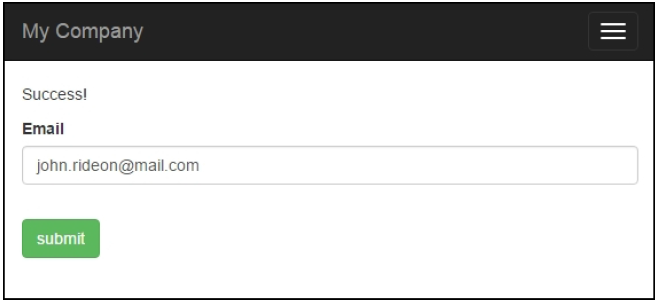
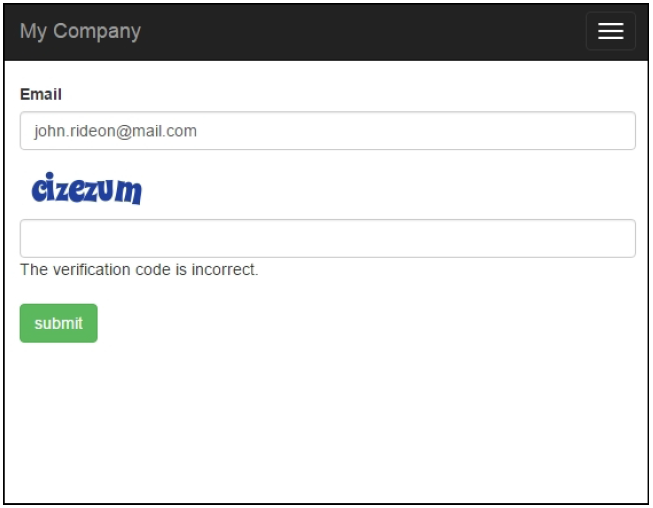

## 添加和自定义CaptchaWidget

现如今在互联网上，如果你放出了一个没有做垃圾信息防护的表单，你将会在短时间内收到大量的垃圾数据。Yii有一个验证码组件，它可以让添加这样的防护非常简单。唯一的问题是没有系统的使用说明。

在接下来的例子中，我们将会给一个简单的表单添加验证码防护。

### 准备

1. 按照官方指南[http://www.yiiframework.com/doc-2.0/guide-start-installation.html](http://www.yiiframework.com/doc-2.0/guide-start-installation.html)的描述，使用Composer包管理器创建一个新的应用。
2. 创建一个表单模型，`@app/models/EmailForm.php`：

```php
<?php
namespace app\models;
use yii\base\Model;
class EmailForm extends Model
{
    public $email;
    public function rules()
    {
        return [
            ['email', 'email']
        ];
    }
}
```

3. 创建控制器`@app/controllers/EmailController.php`：

```php
<?php
namespace app\controllers;
use Yii;
use yii\web\Controller;
use app\models\EmailForm;
class EmailController extends Controller
{
    public function actionIndex(){
        $success = false;
        $model = new EmailForm();
        if ($model->load(Yii::$app->request->post()) && $model->validate()) {
            Yii::$app->session->setFlash('success', 'Success!');
        }
        return $this->render('index', [
            'model' => $model,
            'success' => $success,
        ]);
    }
}
```

4. 创建一个视图，`@app/views/email/index.php`：

```php
<?php
use yii\helpers\Html;
use yii\captcha\Captcha;
use yii\widgets\ActiveForm;
?>
<?php if (Yii::$app->session->hasFlash('success')): ?>
    <div class="alert alert-success"><?=Yii::$app->session->getFlash('success')?></div>
<?php else: ?>
    <?php $form = ActiveForm::begin()?>
    <div class="control-group">
        <div class="controls">
            <?= $form->field($model, 'email')->textInput(['class' => 'form-control']); ?>
            <?php echo Html::error($model, 'email', ['class' => 'help-block'])?>
        </div>
    </div>
    <?php if (Captcha::checkRequirements() &&
        Yii::$app->user->isGuest): ?>
        <div class="control-group">
            <?= $form->field($model, 'verifyCode')-widget(\yii\captcha\Captcha::classname(), [
                'captchaAction' => 'email/captcha'
            ]) ?>
        </div>
    <?php endif; ?>
    <div class="control-group">
        <label class="control-label" for=""></label>
        <div class="controls">
            <?=Html::submitButton('Submit', ['class' => 'btn btn-success'])?>
        </div>
    </div>
    <?php ActiveForm::end()?>
<?php endif;?>
```

5. 现在，我们有了一个电子邮件提交表单，如下截图所示，它验证了电子邮件字段。让我们添加验证码：



### 如何做...

1. 首先我们需要自定义表单模型。我们需要添加`$verifyCode`，它会保存输入的验证码，并为它添加一个验证规则：

```php
<?php
namespace app\models;
use yii\base\Model;
use yii\captcha\Captcha;
class EmailForm extends Model
{
    public $email;
    public $verifyCode;
    public function rules()
    {
        return [
            ['email', 'email'],
            ['verifyCode', 'captcha', 'skipOnEmpty' => !Captcha::checkRequirements(), 'captchaAction' => 'email/captcha']
        ];
    }
}
```

2. 然后添加一个外部动作到控制器中：

```php
public function actions()
{
    return [
        'captcha' => [
            'class' => 'yii\captcha\CaptchaAction',
        ],
    ];
}
```

3. 在视图中，我们需要展示一个额外的字段和验证码图片：

```php
...
<?php if (Captcha::checkRequirements() &&
    Yii::$app->user->isGuest): ?>
    <div class="control-group">
        <?=Captcha::widget([
            'model' => $model,
            'attribute' => 'verifyCode',
        ]);?>
        <?php echo Html::error($model, 'verifyCode')?>
    </div>
<?php endif; ?>
...
```

4. 同时，不要忘记在视图的头部添加`Captcha`导入：

```php
<?php
    use yii\helpers\Html;
    use yii\captcha\Captcha;
?>
```

5. 完成了。现在你可以运行电子邮件控制器，可以在动作动看到验证码，如下截图所示：



如果屏幕上没有错误，表单中没有`Captcha`字段，很有可能是因为你没有安装PHP扩展GD或者Imagick。验证码依赖于GD或者Imagick生成图片。我们添加了几个`Captcha::checkRequirement()`检查，所以当图片不会展示时，不使用验证码，应用仍可以正常工作。

### 工作原理...

在视图中，我们调用验证码小部件渲染`img`标签，将`src`属性指向控制器中的验证码动作。在这个动作中，生成了一张带有随机单词的图片。生成的单词需要用户输入到表单中。它被存储在一个用户session中，并向用户展示了一张图片。党用户输入电子邮箱和验证码到表单中时，我们将这些值赋给表单模型，并进行校验。对于验证码的校验，我们使用`CaptchaValidator`。它会从用户session获取验证码，并和输入的验证码进行比较。如果不匹配，模型数据会被认为是不合法的。

### 更多...

如果你使用`accessRules`控制器方法来限制对控制器动作的访问，不要忘记授权每一个人都能访问他们：

```php
public function behaviors()
{
    return [
        'access' => [
            'class' => AccessControl::className(),
            'rules' => [
                [
                    'actions' => ['index', 'captcha'],
                    'allow' => true,
                ]
            ],
        ],
    ];
}
```