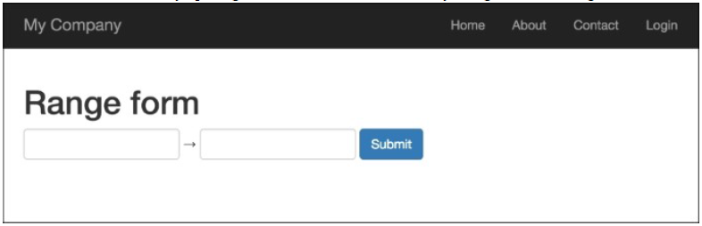
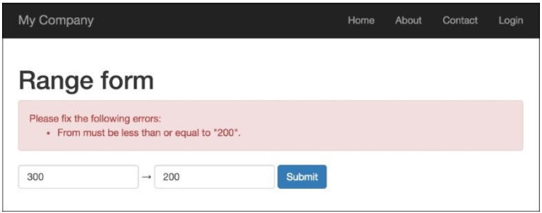
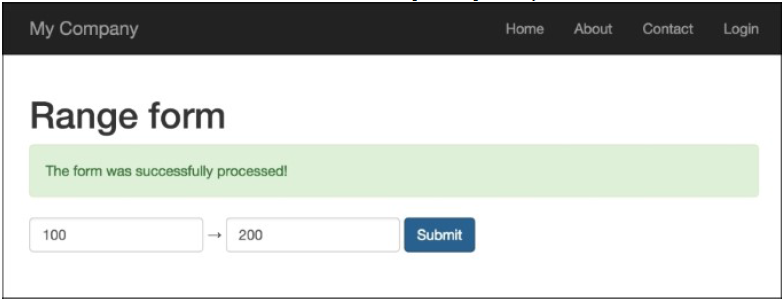

## 创建一个自定义输入小部件

Yii有一套非常好的表单小部件，但和其它框架一样，Yii并不能涵盖所有。在本小节中，我们将会学习如何创建自己的输入小部件。这里我们将创建一个范围输入小部件。

### 准备

按照官方指南[http://www.yiiframework.com/doc-2.0/guide-start-installation.html](http://www.yiiframework.com/doc-2.0/guide-start-installation.html)的描述，使用Composer包管理器创建一个新的应用。

### 如何做...

1. 创建一个小组件文件`@app/components/RangeInputWidget.php`：

```php
<?php
namespace app\components;
use yii\base\Exception;
use yii\base\Model;
use yii\base\Widget;
use yii\helpers\Html;
class RangeInputWidget extends Widget
{
    public $model;
    public $attributeFrom;
    public $attributeTo;
    public $htmlOptions = [];
    protected function hasModel()
    {
        return $this->model instanceof Model&&
        $this->attributeFrom !== null&& $this->attributeTo !== null;
    }
    public function run()
    {
        if (!$this->hasModel()) {
            throw new Exception('Model must be set');
        }
        return Html::activeTextInput($this->model, $this->attributeFrom, $this->htmlOptions) 
            .' &rarr; ' 
            .Html::activeTextInput($this->model, $this->attributeTo, $this->htmlOptions);
    }
}
```

2. 创建一个控制器文件`@app/controllers/RangeController.php`：

```php
<?php
namespace app\controllers;
use Yii;
use yii\web\Controller;
use app\models\RangeForm;
class RangeController extends Controller
{
    public function actionIndex()
    {
        $model = new RangeForm();
        if ($model->load(Yii::$app->request->post()) &&
            $model->validate()) {
            Yii::$app->session->setFlash('rangeFormSubmitted',
                'The form was successfully processed!'
            );
        }
        return $this->render('index', array(
            'model' => $model,
        ));
    }
}
```

3. 创建一个表单文件`@app/models/RangeForm.php`：

```php
<?php
namespace app\models;
use yii\base\Model;
class RangeForm extends Model
{
    public $from;
    public $to;
    public function rules()
    {
        return [
            [['from', 'to'], 'number', 'integerOnly' => true],
            ['from', 'compare', 'compareAttribute' => 'to',
                'operator' => '<='],
        ];
    }
}
```

4. 创建一个视图文件`@app/views/range/index.php`：

```php
<?php
use yii\helpers\Html;
use yii\bootstrap\ActiveForm;
use app\components\RangeInputWidget;
?>

<h1>Range form</h1>
<?php if (Yii::$app->session->hasFlash('rangeFormSubmitted')):
    ?>
    <div class="alert alert-success">
        <?= Yii::$app->session->getFlash('rangeFormSubmitted');
        ?>
    </div>
<?php endif?>
<?= Html::errorSummary($model, ['class'=>'alert alert-danger'])?>
<?php $form = ActiveForm::begin([
    'options' => [
        'class' => 'form-inline'
    ]
]); ?>
<div class="form-group">
    <?= RangeInputWidget::widget([
        'model' => $model,
        'attributeFrom' => 'from',
        'attributeTo' => 'to',
        'htmlOptions' => [
            'class' =>'form-control'
        ]
    ]) ?>
</div>
<?= Html::submitButton('Submit', ['class' => 'btn btn-primary', 'name' => 'contact-button']) ?>
<?php ActiveForm::end(); ?>

```

5. 打开网页`index.php?r=range`运行`range`控制器：



6. 第一个文本输入字段输入200，第二个输入300：



7. 如果第一个值比第二个值大，小部件会输出一个错误。尝试输入正确的值，分别输入100和200：



### 工作原理...

范围输入小部件需要如下四个参数：

- `model`：如果没有设置，会抛出一个异常
- `attributeFrom`：用于设置范围的最小值
- `attributeTo`：用于设置范围的最大值
- `htmlOptions`：会被传递给每一个输入

这个小部件用在表单验证，被用于检查第一个值是否小于等于第二个值。

### 更多...

Yii2框架有一个官方Twitter Bootstrap扩展，它提供了一系列Twitter Bootstrap小部件的封装。在你使用自己的小部件时，检查有否有Bootstrap可用[http://www.yiiframework.com/doc-2.0/extbootstrap-index.html](http://www.yiiframework.com/doc-2.0/extbootstrap-index.html)。

### 参考

欲了解更多关于小部件的信息，可以使用如下资源：

- [http://www.yiiframework.com/doc-2.0/yii-base-widget.html](http://www.yiiframework.com/doc-2.0/yii-base-widget.html)
- [https://github.com/yiisoft/yii2-bootstrap/blob/master/docs/guide/usage-widgets.md](https://github.com/yiisoft/yii2-bootstrap/blob/master/docs/guide/usage-widgets.md)