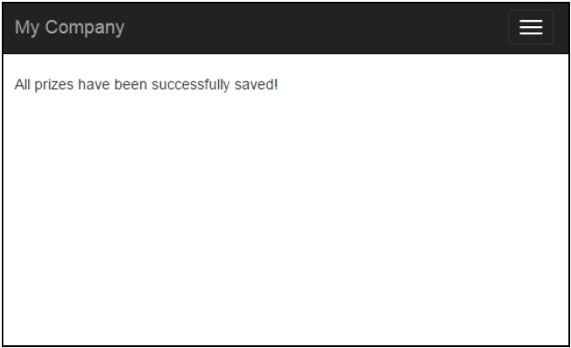
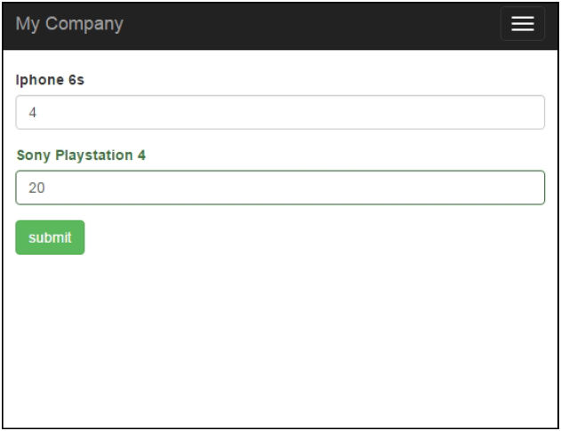

## Tabular输入

在本小节中，我们将会想你展示如何使用一个模型保存和验证相关的模型。有时候你需要在一个表单中处理多个相同种类的模型。

例如，我们有竞赛和为竞赛准备的奖牌。任何一个竞赛可能包含没有限制个的奖牌。所以，我们需要能够创建有多个奖牌的竞赛，进行验证，展示错误，保存主模型（竞赛模型）和所有相关模型（多个奖牌模型）到数据库。

### 准备

1. 按照官方指南[http://www.yiiframework.com/doc-2.0/guide-start-installation.html](http://www.yiiframework.com/doc-2.0/guide-start-installation.html)的描述，使用Composer包管理器创建一个新的应用。
2. 使用如下命令为竞赛和奖牌表创建migrations：

```
./yii migrate/create create_table_contest_and_prize_table
```

更新刚刚创建的migrations的方法`up()`和`down()`：

```
public function up()
{
    $tableOptions = null;
    if ($this->db->driverName === 'mysql') {
        $tableOptions = 'CHARACTER SET utf8 COLLATE
utf8_general_ci ENGINE=InnoDB';
    }
    $this->createTable('{{%contest}}', [
        'id' => Schema::TYPE_PK,
        'name' => Schema::TYPE_STRING . ' NOT NULL',
    ], $tableOptions);
    $this->createTable('{{%prize}}', [
        'id' => Schema::TYPE_PK,
        'name' => Schema::TYPE_STRING,
        'amount' => Schema::TYPE_INTEGER,
    ], $tableOptions);
    $this->createTable('{{%contest_prize_assn}}', [
        'contest_id' => Schema::TYPE_INTEGER,
        'prize_id' => Schema::TYPE_INTEGER,
    ], $tableOptions);
    $this->addForeignKey('fk_contest_prize_assn_contest_id', '{{%contest_prize_assn}}', 'contest_id', '{{%contest}}', 'id');
    $this->addForeignKey('fk_contest_prize_assn_prize_id', '{{%contest_prize_assn}}', 'prize_id', '{{%prize}}', 'id');
}

public function down()
{
    $this->dropForeignKey('fk_contest_prize_assn_contest_id', '{{%contest_prize_assn}}');
    $this->dropForeignKey('fk_contest_prize_assn_prize_id', '{{%contest_prize_assn}}');
    $this->dropTable('{{%contest_prize_assn}}');
    $this->dropTable('{{%prize}}');
    $this->dropTable('{{%contest}}');
}
```

3. 然后，使用如下命令进行安装：

```
./yii migrate/up
```

4. 使用Gii创建竞赛、奖牌和`ContestPrizeAssn`模型。

### 如何做...

1. 创建`@app/controllers/ContestController.php`：

```
<?php
namespace app\controllers;
use app\models\Contest;
use app\models\ContestPrizeAssn;
use app\models\Prize;
use Yii;
use yii\base\Model;
use yii\helpers\VarDumper;
use yii\web\Controller;
class ContestController extends Controller
{
    public function actionCreate()
    {
        $contestName = 'Happy New Year';
        $firstPrize = new Prize();
        $firstPrize->name = 'Iphone 6s';
        $firstPrize->amount = 4;
        $secondPrize = new Prize();
        $secondPrize->name = 'Sony Playstation 4';
        $secondPrize->amount = 2;
        $contest = new Contest();
        $contest->name = $contestName;
        $prizes = [$firstPrize, $secondPrize];
        if ($contest->validate() &&
            Model::validateMultiple($prizes)) {
            $contest->save(false);
            foreach ($prizes as $prize) {
                $prize->save(false);
                $contestPrizeAssn = new ContestPrizeAssn();
                $contestPrizeAssn->prize_id = $prize->id;
                $contestPrizeAssn->contest_id = $contest>id;
                $contestPrizeAssn->save(false);
            }
            return $this->renderContent(
                'All prizes have been successfully saved!'
            );
        } else {
            return $this->renderContent(
                VarDumper::dumpAsString($contest->getErrors())
            );
        }
    }
    public function actionUpdate()
    {
        $prizes = Prize::find()->all();
        if (Model::loadMultiple($prizes,
                Yii::$app->request->post()) &&
            Model::validateMultiple($prizes)) {
            foreach ($prizes as $prize) {
                $prize->save(false);
            }
            return $this->renderContent(
                'All prizes have been successfully saved!'
            );
        }
        return $this->render('update', ['prizes' => $prizes]);
    }
}
```

2. 创建`@app/views/contest/update.php`：

```
<?php
use yii\helpers\Html;
use yii\widgets\ActiveForm;
$form = ActiveForm::begin();
foreach ($prizes as $i => $prize) {
    echo $form->field($prize, "[$i]amount")->label($prize->name);
}
echo Html::submitButton('submit' , ['class' => 'btn btn-success']);
ActiveForm::end();
```

### 工作原理...

以下信息展示了如何应用tabular到Yii中。

在`contest/update`动作中，我们会展示所有的奖牌并同时进行编辑。我们使用了两个特殊的Yii方法：

- `Model::loadMultiple()`：这个方法使用终端用户的数据填充了多个模型
- `Model::vilidateMultiple()`：这个方法同时验证了多个模型

因为我们已经使用了`vilidateMultiple()`验证了所有的模型，我们给`save()`传递`false`参数来避免再次校验。

首先，访问`/index.php?r=contest/create`页面，访问过以后，这个页面将会验证并创建带有两个奖牌的'Happy New Year'，并将奖牌传递给当前竞赛模型。你应该注意到只有当合法时，我们才会保存竞赛模型和奖牌：



它是通过如下条件提供的：

```
if ($contest->validate() && Model::validateMultiple($prizes)) { ...}
```

访问`/index.php?r=contest/update`：



在`@app/views/contest/update.php`中，对于每一个奖牌，我们渲染了一个名称和一个输入框。我们必须给每一个输入框添加一个序号，这样`Model::loadMultiple()`才能识别出每个输入框对应着哪个模型。

综上，这个方法被用于搜集tabular输入数据：你需要在一个视图的表单中，同时搜集一个父模型和多个相关模型的数据。

### 参考

欲了解更多信息，参考如下地址：

- [http://www.yiiframework.com/doc-2.0/guide-input-tabular-input.html#collecting-tabular-input](http://www.yiiframework.com/doc-2.0/guide-input-tabular-input.html#collecting-tabular-input)