# 第四章 表单

在本章中，我们将讨论如下话题：

- 自定义校验器
- 上传文件
- 添加和自定义CaptchaWidget
- 自定义Captcha
- 创建一个自定义输入小部件
- Tabular输入
- 条件校验器
- 带有多个模型的复杂表单
- 依赖AJAX的下拉列表
- AJAX校验器
- 创建一个自定义客户端的校验器

## 介绍

Yii使得使用forms非常容易，并且关于它的文档非常完整。但仍有一些问题需要说明和例子。我们将在本章中介绍说明。

## 自定义校验器

Yii提供了一套内置表单校验器，基本覆盖了所有典型的开发需求，并且是高度可配置的。但是，在一些情况下，开发者可能需要创建一个自定义校验器。

本小节会给出一个例子，创建一个检查单词个数的独立校验器。

### 准备

按照官方指南[http://www.yiiframework.com/doc-2.0/guide-start-installation.html](http://www.yiiframework.com/doc-2.0/guide-start-installation.html)的描述，使用Composer包管理器创建一个新的应用。

### 如何做...

1. 创建一个独立校验器`@app/components/WordsValidator.php`：

```
<?php
namespace app\components;
use yii\validators\Validator;
class WordsValidator extends Validator
{
    public $size = 50;
    public function validateValue($value){
        if (str_word_count($value) > $this->size) {
            return ['The number of words must be less than {size}', ['size' => $this->size]];
        }
        return false;
    }
}
```

2. 创建一个`Article`模型`@app/models/Article.php`：

```
<?php
namespace app\models;
use app\components\WordsValidator;
use yii\base\Model;
class Article extends Model
{
    public $title;
    public function rules()
    {
        return [
            ['title', 'string'],
            ['title', WordsValidator::className(), 'size' =>
                10],
        ];
    }
}
```

3. 创建`@app/controllers/ModelValidationController.php`：

```
<?php
namespace app\controllers;
use app\models\Article;
use yii\helpers\Html;
use yii\web\Controller;
class ModelValidationController extends Controller
{
    private function getLongTitle()
    {
        return 'There is a very long content for current article, '.'it should be less then ten words';
    }
    private function getShortTitle()
    {
        return 'There is a shot title';
    }
    private function renderContentByModel($title)
    {
        $model = new Article();
        $model->title = $title;
        if ($model->validate()) {
            $content = Html::tag('div', 'Model is valid.',[
                'class' => 'alert alert-success',
            ]);
        } else {
            $content = Html::errorSummary($model, [
                'class' => 'alert alert-danger',
            ]);
        }
        return $this->renderContent($content);
    }
    public function actionSuccess()
    {
        $title = $this->getShortTitle();
        return $this->renderContentByModel($title);
    }
    public function actionFailure()
    {
        $title = $this->getLongTitle();
        return $this->renderContentByModel($title);
    }
}
```

4. 访问`index.php?r=model-validation/success`来运行`modelValidation`控制器的`success`动作：

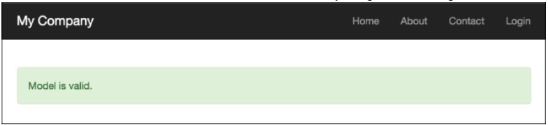

5. 访问`index.php?r=model-validation/failure`来运行`modelValidation`控制器的`failure`动作：

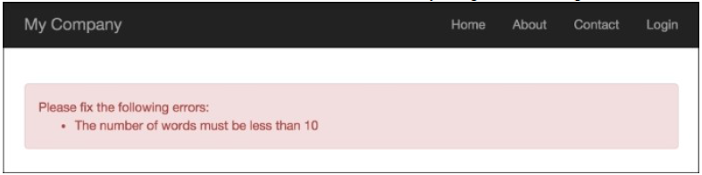

6. 创建`@app/controllers/AdhocValidationController.php`：

```
<?php
namespace app\controllers;
use app\components\WordsValidator;
use app\models\Article;
use yii\helpers\Html;
use yii\web\Controller;
class AdhocValidationController extends Controller
{
    private function getLongTitle()
    {
        return 'There is a very long content for current article, '.'it should be less then ten words';
    }
    private function getShortTitle()
    {
        return 'There is a shot title';
    }
    private function renderContentByTitle($title)
    {
        $validator = new WordsValidator([
            'size' => 10,
        ]);
        if ($validator->validate($title, $error)) {
            $content = Html::tag('div', 'Value is valid.',[
                'class' => 'alert alert-success',
            ]);
        } else {
            $content = Html::tag('div', $error, [
                'class' => 'alert alert-danger',
            ]);
        }
        return $this->renderContent($content);
    }
    public function actionSuccess()
    {
        $title = $this->getShortTitle();
        return $this->renderContentByTitle($title);
    }
    public function actionFailure()
    {
        $title = $this->getLongTitle();
        return $this->renderContentByTitle($title);
    }
}
```

7. 访问`index.php?r=adhoc-validation/success`来运行`adhocValidation`控制器的`success`动作：

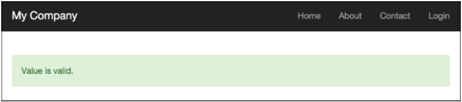

8. 访问`index.php?r=adhoc-validation/failure`来运行`adhocValidation`控制器的`failure`动作：

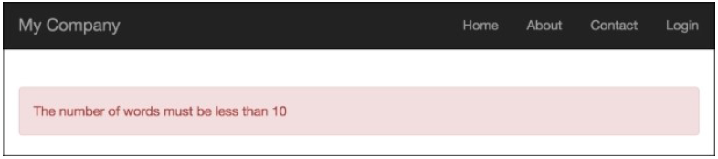

### 工作原理

首先我们创建了一个独立的校验器，它会使用`str_word_count`函数来检查单词的数量，然后演示了两个使用例子：

- 作为`Article`模型的校验规则使用这个校验器
- 作为一个特定的校验器使用这个校验器

### 参考

欲了解更多信息，参考如下链接：

- [http://www.yiiframework.com/doc-2.0/guide-input-validation.html](http://www.yiiframework.com/doc-2.0/guide-input-validation.html)
- [http://www.yiiframework.com/doc-2.0/guide-tutorial-corevalidators.html](http://www.yiiframework.com/doc-2.0/guide-tutorial-corevalidators.html)

## 上传文件

处理文件上传对于web应用是非常常见的一个任务。Yii有一些非常有用的内置类。让我们创建一个简单的表单，它允许上传ZIP压缩包，并保存到`/uploads`文件夹中。

### 准备

1. 按照官方指南[http://www.yiiframework.com/doc-2.0/guide-start-installation.html](http://www.yiiframework.com/doc-2.0/guide-start-installation.html)的描述，使用Composer包管理器创建一个新的应用。
2. 创建`@app/web/uploads`文件夹

### 如何做...

1. 我们将会以一个模型开始，创建`@app/models/Upload.php`：

```
<?php
namespace app\models;
use yii\base\Model;
use yii\web\UploadedFile;
class UploadForm extends Model
{
    /**
     * @var UploadedFile
     */
    public $file;
    public function rules()
    {
        return [
            ['file', 'file', 'skipOnEmpty' => false,
                'extensions' => 'zip'],
        ];
    }
    public function upload()
    {
        if ($this->validate()) {
            $this->file->saveAs('uploads/' .
                $this->file->baseName . '.' . $this->file->extension);
            return true;
        } else {
            return false;
        }
    }
}
```

2. 现在我们来看控制器，创建`@app/controllers/UploadController.php`：

```
<?php
namespace app\controllers;
use Yii;
use yii\web\Controller;
use app\models\UploadForm;
use yii\web\UploadedFile;
class UploadController extends Controller
{
    public function actionUpload()
    {
        $model = new UploadForm();
        if (Yii::$app->request->isPost) {
            $model->file = UploadedFile::getInstance($model,
                'file');
            if ($model->upload()) {
                return $this->renderContent("File {$model->file->name} is uploaded successfully");
            }
        }
        return $this->render('index', ['model' => $model]);
    }
}
```

3. 最后是`@app/views/upload/index.php`：

```
<?php
use yii\widgets\ActiveForm;
use yii\helpers\Html;
?>
<?php $form = ActiveForm::begin(['options' => ['enctype' => 'multipart/form-data']]) ?>
    <?= $form->field($model, 'file')->fileInput() ?>
    <?= Html::submitButton('Upload', ['class' => 'btn-success'])?>
<?php ActiveForm::end() ?>
```

4. 现在运行upload控制器，并尝试上传ZIP压缩包和其他文件：

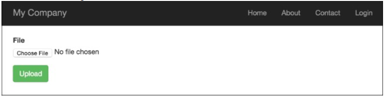

### 工作原理...

我们使用的模型非常简单，我们只是定义了一个字段，名叫`$file`，以及一个使用`FileValidator`文件校验器的校验规则，它只读取ZIP文件。

我们创建一个模型的实例，并在提交表单的时候使用`$_POST`中的数据填充它：

```
$model->file = UploadedFile::getInstance($model, 'file');
if ($model->upload()) {
    return $this->renderContent("File {$model->file->name} is uploaded successfully");
}
```

然后我们使用`UploadFile::getInstance`，它给我们`UploadFile`的实例。当上传文件的时候，它是对`$_FILE`数组的封装。通过调用模型的`validate`方法，我们确保这个文件是一个ZIP压缩包，然后我们使用`UploadFile::saveAs`保存文件。

为了上传文件，HTML表单必须满足如下两个重要的需求：

- 必须使用`POST`方法
- `enctype`属性必须设置为`multipart/form-data`

记住你需要添加`enctype`选项到表单，这样文件才能正确上传。

我们可以使用`Html`帮助类或者带有`htmlOptions`集合的`ActiveForm`来生成HTML。这里使用的HTML是：

```
<?= Html::beginForm('', 'post', ['enctype'=>'multipart/form-data'])?>
```

最后，我们为模型的file属性展示了一个错误和一个字段，并渲染了一个提交按钮。

### 更多...

为了上传多个文件，Yii2实现了两个特殊的方法。

例如，你已经定义了`$imageFiles`，在你的模型、视图文件中所有都是一样的，除了一些细小的差别：

```
...
<?= $form->field($model, 'imageFiles[]')->fileInput(['multiple' => true, 'accept' => 'image/*']) ?>
...
```

为了获取所有文件的实例，你必须调用`UploadFile::getInstances()`而不是`UploadFile::getInstance()`：

```
..
$model->imageFiles = UploadedFile::getInstances($model, 'imageFiles');
..
```

可以使用简单的代码来处理并保存多个文件：

```
foreach ($this->imageFiles as $file) {
    $file->saveAs('uploads/' . $file->baseName . '.' .$file->extension);
}
```

### 参考

欲了解更多信息，参考：

- [http://www.yiiframework.com/doc-2.0/guide-input-file-upload.html](http://www.yiiframework.com/doc-2.0/guide-input-file-upload.html)
- [http://www.yiiframework.com/doc-2.0/guide-input-file-upload.html#uploading-multiple-files](http://www.yiiframework.com/doc-2.0/guide-input-file-upload.html#uploading-multiple-files)

## 添加和自定义CaptchaWidget

### 准备

### 如何做...

### 工作原理...

### 更多...


## 自定义Captcha

### 准备

### 如何做...

### 参考


## 创建一个自定义输入小部件

### 准备

### 如何做...

### 工作原理...

### 更多...

### 参考


## Tabular输入

### 准备

### 如何做...

### 工作原理...

### 参考


## 条件校验器

### 准备

### 如何做...

### 工作原理...

### 参考


## 带有多个模型的复杂表单

### 准备

### 如何做...

### 工作原理...

### 参考


## 依赖AJAX的下拉列表

### 准备

### 如何做...

### 工作原理...


## AJAX校验器

### 准备

### 如何做...

### 工作原理...

### 参考


## 创建一个自定义客户端的校验器

### 准备

### 如何做...

### 工作原理...

### 更多...

### 参考


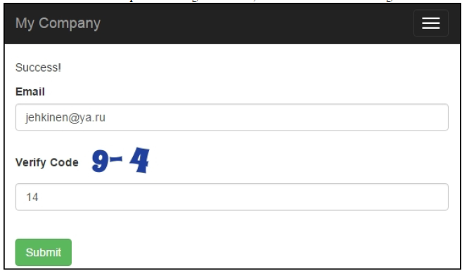


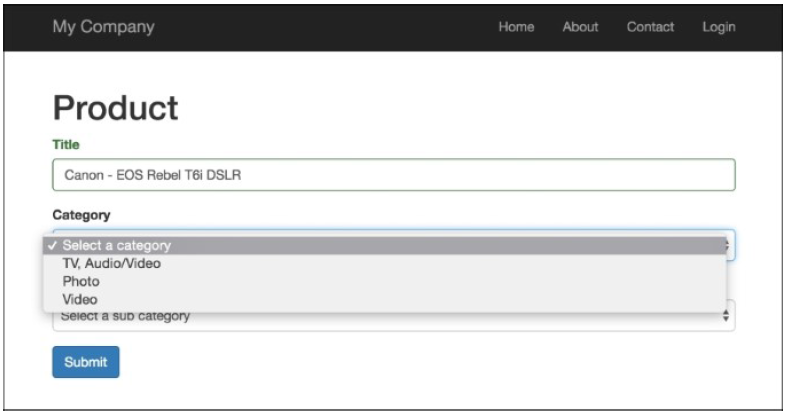

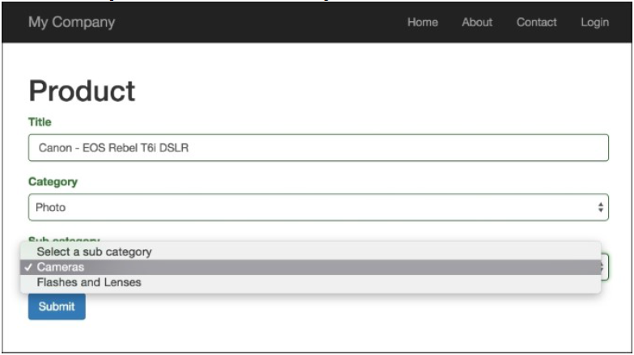

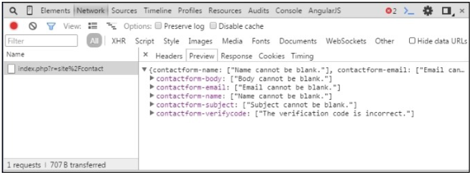

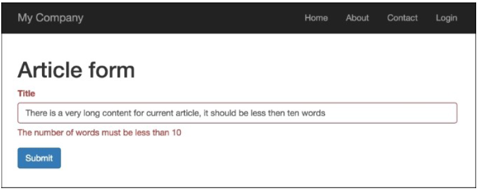

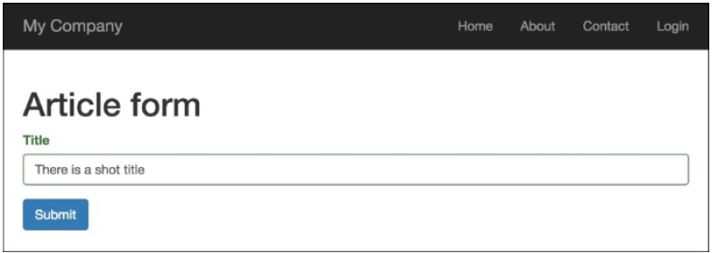