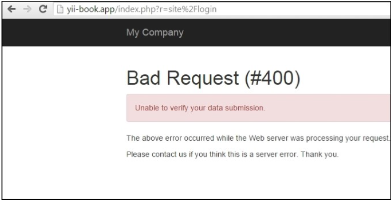

## 防止CSRF

CSRF是一个跨站请求伪造（cross-site request forgery）的缩写，恶意用户可以欺骗用户的浏览器，当用户登录时静默执行一次HTTP请求。

一个例子就是将一张不可见的图片标签的`src`属性指向`http://example.com/site/logout`。尽管`image`标签是在其他网站上，你仍然会从`example.com`上注销。CSRF的后果非常严重：破坏网站数据，阻止所有的用户登录，暴露私有数据等等。

关于CSRF的事实是：

- 因为CSRF一般是由受害者的浏览器执行的，攻击者一般不能修改HTTP请求头。但是，仍有一些浏览器和Flash插件漏洞允许用户篡改请求头，所以我们不能只依赖于这些。
- 攻击者应该传送和普通用户一样的参数和值。

处理CSRF一种比较好的方法是在表单提交，以及使用HTTP规范的GET请求时，传送和检查一个唯一的token。

Yii包括一个内置的token生成器和token检查。此外，它可以自动插入一个token到HTML表单中。

为了防止CSRF，你应该做到如下这些：

- `GET`请求不能修改应用的状态
- 保持Yii CSRF保护一直是开着的

在本小节中，我们将会看到如何确保我们的应用能免受CSRF攻击。

### 准备

按照官方指南[http://www.yiiframework.com/doc-2.0/guide-start-installation.html](http://www.yiiframework.com/doc-2.0/guide-start-installation.html)的描述，使用Composer包管理器创建一个新的应用。

### 如何做...

1. 为了打开放CSRF保护，我们应该在`config/main.php`中添加如下内容：

```
'components' => [
    //..
    'request' => [
        //..
        'enableCsrfValidation' => true,
        //..
    ],
    //..
],
```

2. 选项`enableCsrfValidation`的缺省值是`true`。当CSRF校验是激活状态时，提交到Yii web应用的表单必须来自同一应用。如果不是的话，将会返回`400 HTTP exception`。

注意到这个特性要求用户的客户端接受cookies。

3. 配置好应用以后，你应该使用`ActiveForm::beginForm`和`CHtml::endForm`，而不是HTML表单标签：

```
<?php $form = ActiveForm::begin(['id' => 'login-form']); ?>
    <input type='text' name='name'
    .........
<?php ActiveForm::end(); ?>
```

4. 或者手工添加：

```
<form action='#' method='POST'>
    <input type="hidden" name="<?= Yii::$app->request->csrfParam ?>" value="<?=Yii::$app->request->getCsrfToken()?>" />
    ....
</form>
```

5. 在第一个例子中，Yii自动添加一个隐藏的token字段：

```
<form action="/csrf/create" method="post">
<div style="display:none"><input type="hidden" value="e4d1021e79ac269e8d6289043a7a8bc154d7115a" name="YII_CSRF_TOKEN" />
```

6. 如果你将这个表单保存为HTML，并尝试提交，你将会得到如下一个错误信息，截图如下所示：



### 工作原理...

本质上，在渲染表单时，我们做如下代码：

```
if ($request->enableCsrfValidation && !strcasecmp($method, 'post')) {
    $hiddenInputs[] = static::hiddenInput($request->csrfParam, $request->getCsrfToken());
}
if (!empty($hiddenInputs)) {
    $form .= "\n" . implode("\n", $hiddenInputs);
}
```

在先前的代码中，`getCsrfToken()`生成一个唯一的token值，并将它写到一个cookie中。然后，在接下来的请求中，cookie和`POST`值做了比较。如果他们不匹配，将会展示一条错误信息，而不是正常的数据处理。

如果你需要执行一个`POST`请求，打不希望使用`CHtml`构建一个表单，你可以传递一个参数，名称从`Yii::app()->request->csrfParam`获取，值从`Yii::$app->request->getCsrfToken()`获取。

### 更多...

来看一些更多的特性。

为所有的动作禁用CSRF tokens。

1. 如果你对使用`enableCsrfValidation`有问题，你可以关闭它。
2. 为了禁用CSRF，将这个代码添加到你的控制器中：

```
public function beforeAction($action) {
    $this->enableCsrfValidation = false;
    return parent::beforeAction($action);
}
```

#### 为一个指定的动作禁用CSRF  tokens

```
public function beforeAction($action) {
    $this->enableCsrfValidation = ($action->id !== "actionId");
    return parent::beforeAction($action);
}
```

#### 为Ajax调用执行CSRF校验

当在main布局中启用`enableCsrfValidation`选项时，添加`csrfMetaTags`：

```
<head>
    .......
    <?= Html::csrfMetaTags() ?>
</head>
```

现在你可以将其添加到ajax调用上

```
var csrfToken = $('meta[name="csrf-token"]').attr("content");
$.ajax({
    url: 'request'
    type: 'post',
    dataType: 'json',
    data: {param1: param1, _csrf : csrfToken},
});
```

#### 更多

如果你的应用需要更高级别的安全，例如是一个银行管理系统，需要采取更多的措施。

首先，你可以在`config/main.php`中关闭“记住我”特性：

```
'components' => [
    ..
    'user' => [
        ..
        'enableAutoLogin' => false,
        ..
    ],
    ..
],
```

注意到如果`enabledSession`选项是`true`时，将不会有效。

然后，你可以降低session过期时间：

```
'components' => [
    ..
    'session' => [
        ..
        'timeout' => 200,
        ..
    ],
    ..
],
```

这为数据设置了过期时间，过期之后，数据会被当做垃圾，并被清理掉。

当然，这些措施会降低用户体验，但是会提升安全属性。

#### 正确使用GET和POST

HTTP不建议使用`GET`方法来修改数据和状态。遵守这个规则是一个好的实践。它不会防止所有类型的CSRF，但是至少会防止一些注入，例如``。

### 参考

为了了解更多SQL注入，使用Yii处理数据库，参考如下地址：

- [http://en.wikipedia.org/wiki/Cross-site_request_forgery](http://en.wikipedia.org/wiki/Cross-site_request_forgery)
- [http://www.yiiframework.com/doc-2.0/guide-security-best-practices.html#avoiding-csrf](http://www.yiiframework.com/doc-2.0/guide-security-best-practices.html#avoiding-csrf)
- [http://www.yiiframework.com/doc-2.0/yii-web-request.html#$enableCsrfValidation-detail](http://www.yiiframework.com/doc-2.0/yii-web-request.html#$enableCsrfValidation-detail)
- *防止CSS*小节