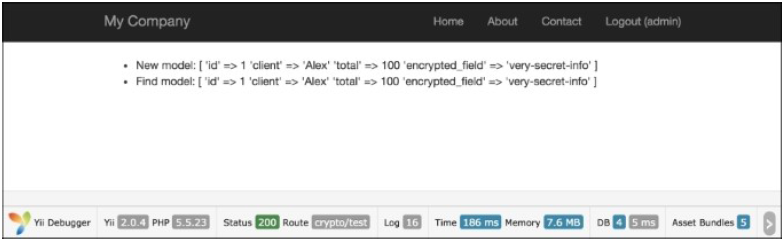
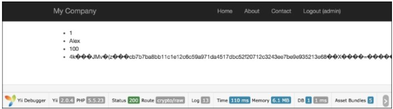

## 加密和解密数据

Yii2框架包含了一个特殊的安全组件，它提供了一套方法来处理常见的安全相关的任务。`\yii\base\Security`类需要`OpenSSL`PHP扩展，而不是`mcrypt`。

### 准备

1. 按照官方指南[http://www.yiiframework.com/doc-2.0/guide-start-installation.html](http://www.yiiframework.com/doc-2.0/guide-start-installation.html)的描述，使用Composer包管理器创建一个新的应用。
2. 设置数据库连接，并创建一个名叫`order`的表，如下所示：

```
DROP TABLE IF EXISTS `order`;
CREATE TABLE IF NOT EXISTS `order` (
    `id` INT(10) UNSIGNED NOT NULL AUTO_INCREMENT,
    `client` VARCHAR(255) NOT NULL,
    `total` FLOAT NOT NULL,
    `encrypted_field` BLOB NOT NULL,
    PRIMARY KEY (`id`)
);
```

3. 使用Gii生成Order模型。

### 如何做...

1. 添加一个额外的key参数到`config/params.php`：

```
<?php
return [
    'adminEmail' => 'admin@example.com',
    'key' => 'mysecretkey'
];
```

2. 给`Order`模型添加`behaviors`和`helper`属性：

```
public $encrypted_field_temp;
public function behaviors()
{
    return [
        [
            'class' => AttributeBehavior::className(),
            'attributes' => [
                ActiveRecord::EVENT_BEFORE_INSERT => 'encrypted_field',
                ActiveRecord::EVENT_BEFORE_UPDATE => 'encrypted_field',
            ],
            'value' => function ($event) {
                $event->sender->encrypted_field_temp = $event->sender->encrypted_field;
                return Yii::$app->security->encryptByKey(
                    $event->sender->encrypted_field, 
                    Yii::$app->params['key']
                );
            },
        ],
        [
            'class' => AttributeBehavior::className(),
            'attributes' => [
                ActiveRecord::EVENT_AFTER_INSERT => 'encrypted_field',
                ActiveRecord::EVENT_AFTER_UPDATE => 'encrypted_field',
            ],
            'value' => function ($event) {
                return $event->sender->encrypted_field_temp;
            },
        ],
        [
            'class' => AttributeBehavior::className(),
            'attributes' => [
                ActiveRecord::EVENT_AFTER_FIND => 'encrypted_field',
            ],
            'value' => function ($event) {
                return Yii::$app->security->decryptByKey(
                    $event->sender->encrypted_field,
                    Yii::$app->params['key']
                );
            },
        ],
    ];
}
```

3. 添加`controller/CryptoController.php`：

```
<?php
namespace app\controllers;
use app\models\Order;
use Yii;
use yii\db\Query;
use yii\helpers\ArrayHelper;
use yii\helpers\Html;
use yii\helpers\VarDumper;
use yii\web\Controller;
/**
 * Class CryptoController.
 * @package app\controllers
 */
class CryptoController extends Controller
{
    public function actionTest()
    {
        $newOrder = new Order();
        $newOrder->client = "Alex";
        $newOrder->total = 100;
        $newOrder->encrypted_field = 'very-secret-info';
        $newOrder->save();
        $findOrder = Order::findOne($newOrder->id);
        return $this->renderContent(Html::ul([
            'New model: ' . VarDumper::dumpAsString($newOrder->attributes),
            'Find model: ' . VarDumper::dumpAsString($findOrder->attributes)
        ]));
    }
    public function actionRaw()
    {
        $row = (new Query())->from('order')
            ->where(['client' => 'Alex'])
            ->one();
        return $this->renderContent(Html::ul(
            $row
        ));
    }
}
```

4. 运行`crypto/test`：



5. 为了查看原始数据，运行`crypto/raw`：



### 工作原理...

首先，我们已经添加了`AttributeBehavior`，当特定事件发生时，它会自动处理我们的数据。我们特定的事件是`ActiveRecord::EVENT_AFTER_INSERT`、`ActiveRecord::EVENT_AFTER_UPDATE`和`ActiveRecord::EVENT_AFTER_FIND`。

在插入和更新事件期间，我们使用了一个特殊的方法`Yii::$app->security->encryptByKey();`加密了我们的数据。在保存到数据库前，这个方法使用HKDF和一个随机盐来加密我们的数据。从数据库中获取数据以后，我们也可以使用`ActiveRecord::EVENT_AFTER_FIND`方法来解密我们的数据。在这个例子中，我们也使用了特殊的Yii2方法`Yii::$app->security->encryptByKey();`。这个方法接受两个参数：加密的数据和key。

### 更多...

除了数据加密和解密以外，一个安全的组件也提供了基于标准算法的key derivation、数据防破坏和密码校验。

#### 使用密码

校验一个密码：

```
if (Yii::$app->getSecurity()->validatePassword($password, $hash)) {
    // all good, logging user in
} else {
    // wrong password
}
```

### 参考

为了了解更多关于SQL注入和使用Yii处理数据库的知识，参考[http://www.yiiframework.com/doc-2.0/guide-security-passwords.html](http://www.yiiframework.com/doc-2.0/guide-security-passwords.html)。