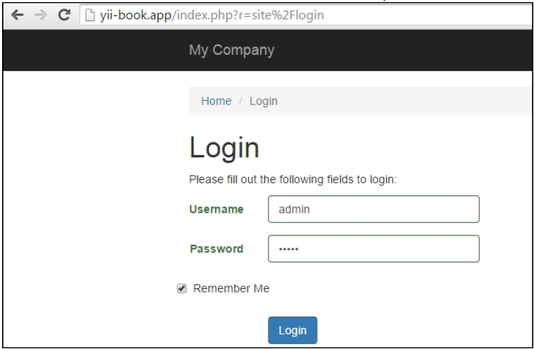
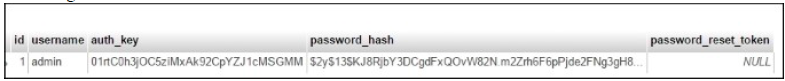
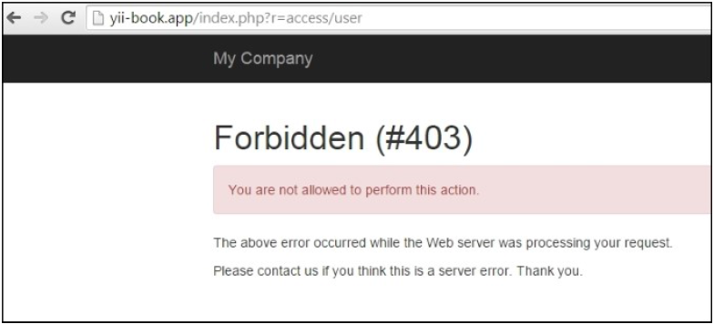
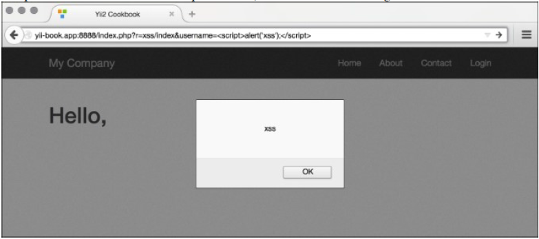
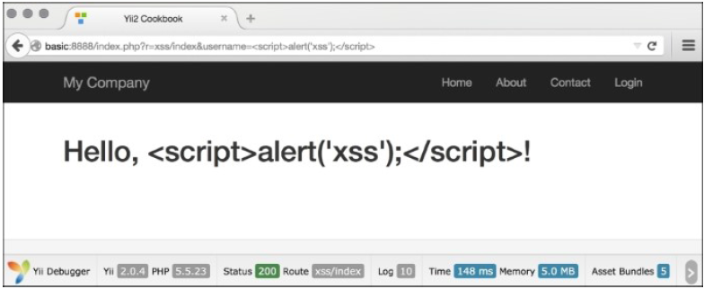
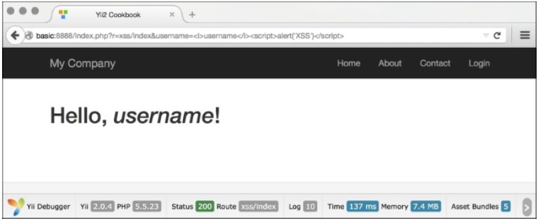
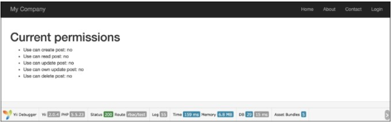
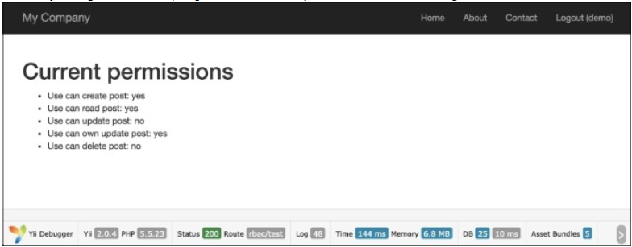
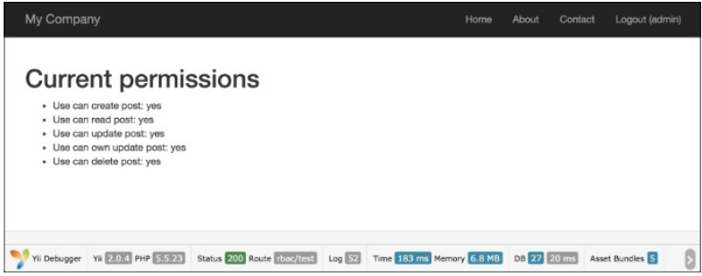
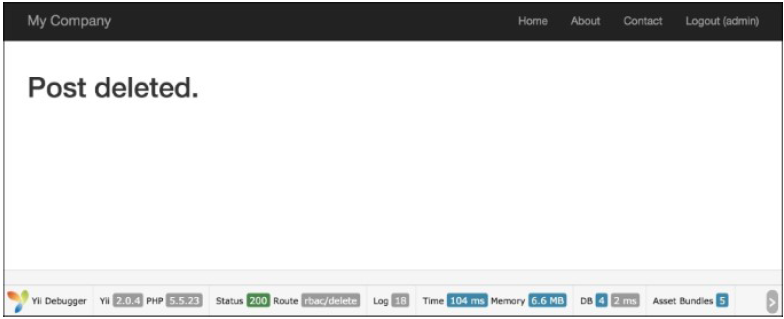

# 第五章 安全

在本章中，我们将会讨论如下话题：

- 身份验证
- 使用控制器过滤器
- 防止XSS
- 防止SQL注入
- 防止CSRF
- 使用RBAC
- 加密/解密数据

## 介绍

安全是任何web应用非常重要的一部分。

在本章中，你将会学习如何根据一般web应用安全准则（过滤输入，转义输出）来保持你应用的安全性。我们将会讨论多个话题，例如创建自己的应用过滤器、防止XSS、CSRF和SQL注入，转移输出，以及使用基于角色的访问控制。欲了解安全最佳实践，参考[http://www.yiiframework.com/doc-2.0/guidesecurity-best-practices.html#avoiding-debug-info-and-tools-at-production](http://www.yiiframework.com/doc-2.0/guidesecurity-best-practices.html#avoiding-debug-info-and-tools-at-production)。

身份验证

大部分应用都会为用户提供登录或者重置忘记的密码的功能。在Yii2中，缺省情况下，我们没有这个机会。对于`basic`应用模板，默认情况下，Yii只提供了两个测试用户，这个两个用户是在`User`模型中写死的。所以，我们必须实现特殊的代码，来使得用户能数据库中登录。

### 准备

1. 按照官方指南[http://www.yiiframework.com/doc-2.0/guide-start-installation.html](http://www.yiiframework.com/doc-2.0/guide-start-installation.html)的描述，使用Composer包管理器创建一个新的应用。
2. 在你的配置的组件部分，添加：

```
'user' => [
    'identityClass' => 'app\models\User',
    'enableAutoLogin' => true,
],
```

3. 创建一个`User`表。输入如下命令创建migration：

```
./yii migrate/create create_user_table
```

4. 更新刚刚创建的migration：

```
<?php
use yii\db\Schema;
use yii\db\Migration;
class m150626_112049_create_user_table extends Migration
{
    public function up()
    {
        $tableOptions = null;
        if ($this->db->driverName === 'mysql') {
            $tableOptions = 'CHARACTER SET utf8 COLLATE utf8_general_ci ENGINE=InnoDB';
        }
        $this->createTable('{{%user}}', [
            'id' => Schema::TYPE_PK,
            'username' => Schema::TYPE_STRING . ' NOT NULL',
            'auth_key' => Schema::TYPE_STRING . '(32) NOT NULL',
            'password_hash' => Schema::TYPE_STRING . ' NOT NULL',
            'password_reset_token' => Schema::TYPE_STRING,
        ], $tableOptions);
    }
    public function down()
    {
        $this->dropTable('{{%user}}');
    }
}
```

5. 更新已存在的模型`models/User`：

```
<?php
namespace app\models;
use yii\db\ActiveRecord;
use yii\web\IdentityInterface;
use yii\base\NotSupportedException;
use Yii;
class User extends ActiveRecord implements IdentityInterface
{
    /**
     * @inheritdoc
     */
    public function rules()
    {
        return [
            ['username', 'required'],
            ['username', 'unique'],
            ['username', 'string', 'min' => 3],
            ['username', 'match', 'pattern' =>
                '~^[A-Za-z][A-Za-z0-9]+$~', 'message' => 'Username can contain only alphanumeric characters.'],
            [['username', 'password_hash',
                'password_reset_token'],
                'string', 'max' => 255
            ],
            ['auth_key', 'string', 'max' => 32],
        ];
    }
    
    /**
     * @inheritdoc
     */
    public static function findIdentity($id)
    {
        return static::findOne($id);
    }
    
    public static function findIdentityByAccessToken($token, $type = null)
    {
        throw new NotSupportedException('"findIdentityByAccessToken" is not implemented.');
    }
    
    /**
     * Finds user by username
     *
     * @param string $username
     * @return User
     */
    public static function findByUsername($username)
    {
        return static::findOne(['username' => $username]);
    }
    
    /**
     * @inheritdoc
     */
    public function getId()
    {
        return $this->getPrimaryKey();
    }
    
    /**
     * @inheritdoc
     */
    public function getAuthKey()
    {
        return $this->auth_key;
    }
    
    /**
     * @inheritdoc
     */
    public function validateAuthKey($authKey)
    {
        return $this->getAuthKey() === $authKey;
    }
    
    /**
     * Validates password
     *
     * @param string $password password to validate
     * @return boolean if password provided is valid for current
    user
     */
    public function validatePassword($password)
    {
        return Yii::$app->getSecurity()->validatePassword($password, $this->password_hash);
    }
    
    /**
     * Generates password hash from password and sets it to the model
     *
     * @param string $password
     */
    public function setPassword($password)
    {
        $this->password_hash =
            Yii::$app->getSecurity()->generatePasswordHash($password);
    }
    
    /**
     * Generates "remember me" authentication key
     */
    public function generateAuthKey()
    {
        $this->auth_key =
            Yii::$app->getSecurity()->generateRandomString();
    }
    
    /**
     * Generates new password reset token
     */
    public function generatePasswordResetToken()
    {
        $this->password_reset_token =
            Yii::$app->getSecurity()->generateRandomString() . '_' . time();
    }
    
    /**
     * Finds user by password reset token
     *
     * @param string $token password reset token
     * @return static|null
     */
    public static function findByPasswordResetToken($token)
    {
        $expire =
            Yii::$app->params['user.passwordResetTokenExpire'];
        $parts = explode('_', $token);
        $timestamp = (int) end($parts);
        if ($timestamp + $expire < time()) {
            return null;
        }
        return static::findOne([
            'password_reset_token' => $token
        ]);
    }
}
```

6. 创建一个migration，它会添加一个测试用户：

```
./yii migrate/create create_test_user
```

7. 更新刚刚创建的migrate：

```
<?php
use yii\db\Migration;
use app\models\User;
class m150626_120355_create_test_user extends Migration
{
    public function up()
    {
        $testUser = new User();
        $testUser->username = 'admin';
        $testUser->setPassword('admin');
        $testUser->generateAuthKey();
        $testUser->save();
    }
    public function down()
    {
        User::findByUsername('turbulence')->delete();
        return false;
    }
}
```

8. 安装所有的migration：

```
./yii migrate up
```

### 如何做...

1. 访问`site/login`，输入`admin/admin`凭证：



2. 如果你完成了这些步骤，你就能登录。

### 工作原理...

1. 首先，为用户表创建一个migration。除了ID和用户名，我们的表还包含特殊的字段，例如`auth_key`（主要用途是通过cookie验证用户的身份），`password_hash`（处于安全原因，我们不能存储密码本身，而应该只是存储密码的hash），以及`password_reset_token`（当用户需要重置密码时使用）。
2. 安装和`create_test_user` migration之后的结果如下图所示：



我们已经为`User`模型添加了特殊的方法，并且修改了继承`class User extends ActiveRecord implements IdentityInterface`，因为我们需要能从数据库中找到用户。

你也可以从高级app[https://github.com/yiisoft/yii2-appadvanced/blob/master/common/models/User.php](https://github.com/yiisoft/yii2-appadvanced/blob/master/common/models/User.php)中复制用户模型`User。

### 参考

欲了解更多信息，参考[http://www.yiiframework.com/doc-2.0/guide-securityauthentication.html](http://www.yiiframework.com/doc-2.0/guide-securityauthentication.html)。

## 使用控制器过滤器

在许多例子中，我们需要过滤输入的数据，或者基于这些数据执行一些动作。例如，使用自定义过滤器，我们可以使用IP过滤访问者，强制用户使用HTTPS，或者在使用应用之前，重定向用户到一个安装页面。

在Yii2中，过滤器本质上是一种特殊的behavior，所以使用过滤器和使用behavior是一样的。

Yii有许多内置的过滤器：

- Core
- Custom
- Authentication
- Content Negotiator
- HttpCache
- PageCache
- RateLimiter
- Verb
- Cors

在本小节中，我们将实现如下内容：

- 对控制器动作的访问限制到只有登录的用户
- 对控制器动作的访问限制到指定的IP
- 只允许指定用户角色访问

## 准备

1. 按照官方指南[http://www.yiiframework.com/doc-2.0/guide-start-installation.html](http://www.yiiframework.com/doc-2.0/guide-start-installation.html)的描述，使用Composer包管理器创建一个新的应用。
2. 创建`app/components/AccessRule.php`：

```
<?php
namespace app\components;
use app\models\User;
class AccessRule extends \yii\filters\AccessRule {
    /**
     * @inheritdoc
     */
    protected function matchRole($user)
    {
        if (empty($this->roles)) {
            return true;
        }
        $isGuest = $user->getIsGuest();
        foreach ($this->roles as $role) {
            switch($role) {
                case '?':
                    return ($isGuest) ? true : false;
                case User::ROLE_USER:
                    return (!$isGuest) ? true : false;
                case $user->identity->role: // Check if the user is logged in, and the roles match
                    return (!$isGuest) ? true : false;
                default:
                    return false;
            }
        }
        return false;
    }
}
```

3. 创建`app/controllers/AccessController.php`：

```
<?php
namespace app\controllers;
use app\models\User;
use Yii;
use yii\filters\AccessControl;
use app\components\AccessRule;
use yii\web\Controller;
class AccessController extends Controller
{
    public function behaviors()
    {
        return [
            'access' => [
                'class' => AccessControl::className(),
                // We will override the default rule config with the new AccessRule class
                'ruleConfig' => [
                    'class' => AccessRule::className(),
                ],
                'rules' => [
                    [
                        'allow' => true,
                        'actions' => ['auth-only'],
                        'roles' => [User::ROLE_USER]
                    ],
                    [
                        'allow' => true,
                        'actions' => ['ip'],
                        'ips' => ['127.0.0.1'],
                    ],
                    [
                        'allow' => true,
                        'actions' => ['user'],
                        'roles' => [ User::ROLE_ADMIN],
                    ],
                    [
                        'allow' => false,
                    ]
                ],
            ]
        ];
    }
    public function actionAuthOnly()
    {
        echo "Looks like you are authorized to run me.";
    }
    public function actionIp()
    {
        echo "Your IP is in our list. Lucky you!";
    }
    public function actionUser()
    {
        echo "You're the right man. Welcome!";
    }
}
```

4. 修改`User`类：

```
<?php
namespace app\models;
class User extends \yii\base\Object implements \yii\web\IdentityInterface
{
    // add roles contstants
    CONST ROLE_USER = 200;
    CONST ROLE_ADMIN = 100;
    public $id;
    public $username;
    public $password;
    public $authKey;
    public $accessToken;
    public $role;
    private static $users = [
        '100' => [
            'id' => '100',
            'username' => 'admin',
            'password' => 'admin',
            'authKey' => 'test100key',
            'accessToken' => '100-token',
            'role' => USER::ROLE_ADMIN // add admin role for admin user
        ],
        '101' => [
            'id' => '101',
            'username' => 'demo',
            'password' => 'demo',
            'authKey' => 'test101key',
            'accessToken' => '101-token',
            'role' => USER::ROLE_USER // add user role for admin user
        ],
    ];
    //…
}
```

### 如何做...

1. 为了使用`AccessControl`，在你的控制器的`behaviors()`方法中声明：

```
public function behaviors()
{
    return [
        'access' => [
            'class' => AccessControl::className(),
            'rules' => [
                [
                    'allow' => true,
                    'actions' => ['auth-only'],
                    'roles' => ['@'],
                ],
                [
                    'allow' => true,
                    'actions' => ['ip'],
                    'ips' => ['127.0.0.1'],
                ],
                [
                    'allow' => true,
                    'actions' => ['user'],
                    'roles' => ['admin'],
                ],
                [
                    'allow' => true,
                    'actions' => ['user'],
                    'matchCallback' => function ($rule, $action) {
                        return preg_match('/MSIE9/',$_SERVER['HTTP_USER_AGENT']) !== false;
                    }
                ],
                ['allow' => false]
            ],
        ]
    ];
}
```

2. 尝试使用IE浏览器和其他浏览器运行控制器动作，使用`admin`和`demo`用户。

### 工作原理...

我们开始限制控制器动作给已经登录的用户，查看如下`rules`数组中的代码：

```
[
    'allow' => true,
    'actions' => ['auth-only'],
    'roles' => [User::ROLE_USER]
],
```

每一个数组都是一个访问规则。你可以使用`allow=true`或者`allow=>false`。对于每一个规则，有若干个参数。

缺省情况下，Yii不会拒绝任何事情，所以如果你需要最大程度的安全，考虑添加`['allow' => false]`到规则的末尾。

在我们的规则中，我们使用了两个参数。第一个是动作参数，它指定的该规则会应用在哪些动作上。第二个参数时角色参数，它指定了该规则会应用于哪些角色上。

Yii2内置访问控制默认只支持两个角色：游客（未登录），用符号`?`指定，登录的用户，用服务`@`指定。

使用简单的访问控制，我们可以基于用户的登录状态限制对指定页面的访问。如果用户在未登录状态下访问这些页面，Yii会将他们重定向到登录页面。

规则会一个接一个执行，从第一个开始，直到能匹配上一个。如果没有一个能匹配，那么该访问被认为是允许的。

下一个任务是限制指定IP的访问。在这个例子中，涉及如下两个访问规则：

```
[
    'allow' => true,
    'actions' => ['ip'],
    'ips' => ['127.0.0.1'],
],
```

第一个规则允许指定IP列表中的IP访问。在我们的例子中，我们使用了一个回路地址，它指向我们自己的电脑。尝试将其修改为`127.0.0.2`，看看当IP地址不匹配时是什么表现。第二个规则是拒绝所以，包括其它所有IP。

接下来，我们只允许指定用户角色访问：

```
[
    'allow' => true,
    'actions' => ['user'],
    'roles' => [ User::ROLE_ADMIN],
],
```

上边的规则允许`admin`角色的用户访问user动作，因此，如果你以`admin`登录，你将可以访问，但如果你以`demo`登录，将会被拒绝。



我们重写了标准`AccessRule`类，存放在`components/AccessRule.php`。在我们的`AccessRule`类内部，我们重写了`matchRole`方法，在这我们获取并检查了当前用户的角色，并使用我们的规则进行匹配。

最后，我们需要拒绝指定浏览器的访问。在本小节中，我们只拒绝IE 9的访问。这个规则被放在了首位，所以它首先会执行：

```
[
    'all`ow' => true,
    'actions' => ['user'],
    'matchCallback' => function ($rule, $action) {
        return preg_match('/MSIE 9/',$_SERVER['HTTP_USER_AGENT'])!==false;
    }`
],
```

我们使用的这个检测技术是不可靠的，因为MSIE在其它很多用户代理中都会包含。想了解用户代理字符串的列表，可以参考`http://www.useragentstring.com/`。

在上边的代码中，我们使用了另外一个过滤规则属性，名叫`matchCallback`。这个属性表明只有当函数中的属性返回`true`时规则会生效。

我们的函数检查用户代理字符串是否包含MSIE 9.0字符串。你可以根据自己的需求，指定任何PHP代码。

### 参考

为了了解更多有关访问控制和过滤器的信息，参考如下地址：

- [http://www.yiiframework.com/doc-2.0/guide-structure-filters.html](http://www.yiiframework.com/doc-2.0/guide-structure-filters.html)
- [http://www.yiiframework.com/doc-2.0/yii-filters-accesscontrol.html](http://www.yiiframework.com/doc-2.0/yii-filters-accesscontrol.html)
- [http://www.yiiframework.com/doc-2.0/yii-filters-accessrule.html](http://www.yiiframework.com/doc-2.0/yii-filters-accessrule.html)
- [https://github.com/yiisoft/yii2/blob/master/docs/guide/structure-filters.md](https://github.com/yiisoft/yii2/blob/master/docs/guide/structure-filters.md)
- [http://www.yiiframework.com/doc-2.0/guide-security-authorization.html#access-control-filter](http://www.yiiframework.com/doc-2.0/guide-security-authorization.html#access-control-filter)
- `使用RBAC`小节

## 防止XSS

XSS代表跨站脚本，它允许注入一个客户端的脚本（通常是JavaScript）到被用户观看的网页。考虑客户端脚本的能力，这会导致非常严重的后果，比如绕过安全检查、获取其它用户的身份或者数据泄露。

在本小节中，我们将会看到如何使用`\yii\helpers\Html`和`\yii\helpers\HtmlPurifier`来转义输出从而防止XSS。

### 准备

1. 按照官方指南[http://www.yiiframework.com/doc-2.0/guide-start-installation.html](http://www.yiiframework.com/doc-2.0/guide-start-installation.html)的描述，使用Composer包管理器创建一个新的应用。
2. 创建`controllers/XssController.php`：

```
<?php
namespace app\controllers;
use Yii;
use yii\helpers\Html;
use yii\web\Controller;
/**
 * Class SiteController.
 * @package app\controllers
 */
class XssController extends Controller
{
    /**
     * @return string
     */
    public function actionIndex()
    {
        $username = Yii::$app->request->get('username', 'nobody');
        return $this->renderContent(Html::tag('h1',
            'Hello, ' . $username . '!'
        ));
    }
}
```

3. 通常情况下，他会被使用为`/xss/simple?username=Administrator`。然而，因为没有考虑安全准则*过滤输入，转移输出*，恶意的用户能够使用如下方式使用它：

```
/xss/simple?username=<script>alert('XSS');</script>
```

4. 上边的代码将会导致一个脚本注入，如下截图所示：



### 如何做...

执行如下步骤：

1. 为了防止上边屏幕截图中的XSS警报，我们需要将其传给浏览器之前进行转义。方法如下：

```
<?php
namespace app\controllers;
use Yii;
use yii\helpers\Html;
use yii\web\Controller;
/**
 * Class SiteController.
 * @package app\controllers
 */
class XssController extends Controller
{
    /**
     * @return string
     */
    public function actionIndex()
    {
        $username = Yii::$app->request->get('username', 'nobody');
        return $this->renderContent(Html::tag('h1', Html::encode('Hello, ' . $username . '!')));
    }
}
```

2. 现在你就不会看到警告了，而是得到正确的转义的HTML，截图如下所示：



3. 因此，基本的规则是，转义所有动态的数据。例如，我们应该为名字链接做同样的转义：

```
use \yii\helpers\Html;
echo Html::a(Html::encode($_GET['username']), array());
```

完成了。你的页面能防止XSS。如果我们希望一些HTML能通过怎么办？我们不能再使用`\yii\helpers\Html::encode`，因为它会将HTML输出为代码，而我们需要是的是实际的表示。幸运的是，Yii有一个工具，它能让你过滤恶意的HTML。这个工具名叫`HTML Purifier`，使用方法如下：

```
<?php
namespace app\controllers;
use Yii;
use yii\helpers\Html;
use yii\helpers\HtmlPurifier;
use yii\web\Controller;
/**
 * Class SiteController.
 * @package app\controllers
 */
class XssController extends Controller
{
    /**
     * @return string
     */
    public function actionIndex()
    {
        $username = Yii::$app->request->get('username', 'nobody');
        $content = Html::tag('h1', 'Hello, ' . $username . '!');
        return $this->renderContent(
            HtmlPurifier::process($content)
        );
    }
}
```

现在如果我们使用如下地址访问`/xss/index?username=<i>username</i>!<script>alert('XSS')</script>`，HTML净化器会移除恶意的部分，我们将会得到如下结果：



### 工作原理

1. 深入底层看，`\yii\helpers\Html::encode`类似如下所示：

```
public static function encode($content, $doubleEncode = true)
{
    return htmlspecialchars($content, ENT_QUOTES | ENT_SUBSTITUTE, 
        Yii::$app ? Yii::$app->charset : 'UTF-8',
        $doubleEncode);
}
```

2. 所以本质上是用PHP的`htmlspecialchars`函数，只要第三个参数能正确传递，这个函数非常安全。

`\yii\helpers\HtmlPurifier`使用HTML净化库，这是解决HTML中XSS最先进的解决方案。我们使用了它的默认配置，这对绝大部分用户输入的内容都是有效的。

### 更多...

关于XSS和HTML净化器需要多了解一些东西。接下来的部分就会讨论。

#### XSS类型

XSS注入有两个主要的类型，如下：

- 非持久
- 持久

第一种类型是本小节中最常用的XSS类型；在大部分不安全的web应用中都可以发现。用户传递的数据不会被存储，所以注入脚本只有当用户输入的时候才会执行。但是，这看上去仍然不安全。恶意的用户可以将XSS放在一个链接中，然后放在别的网站上；当其它用户点击访问时，就会发生XSS注入。

第二种情况更验证，因为由恶意用户输入的数据被存储在了数据库中，并被展示给了很多网络用户。使用这种类型的XSS，恶意用户甚至可以通过命令，使其它用户删除他们能访问的数据，摧毁你的网站。

### 参考

欲了解更多关于XSS以及如何处理它，参考如下资源：

- [http://htmlpurifier.org/docs](http://htmlpurifier.org/docs)
- [http://ha.ckers.org/xss.html](http://ha.ckers.org/xss.html)
- [http://shiflett.org/blog/2007/may/character-encoding-and-xss](http://shiflett.org/blog/2007/may/character-encoding-and-xss)

## 防止SQL注入

SQL注入是一种代码注入，它利用了数据库层的易损性，允许你执行任意SQL，允许恶意用户删除数据或者提升自己的权限。

在本小节中，我们将会看到易损代码的例子，以及如何修复他们。

### 准备

1. 按照官方指南[http://www.yiiframework.com/doc-2.0/guide-start-installation.html](http://www.yiiframework.com/doc-2.0/guide-start-installation.html)的描述，使用Composer包管理器创建一个新的应用。
2. 执行如下SQL：

```
DROP TABLE IF EXISTS `user`;
CREATE TABLE `user` (
  `id` int(11) unsigned NOT NULL AUTO_INCREMENT,
  `username` varchar(100) NOT NULL,
  `password` varchar(32) NOT NULL,
  PRIMARY KEY (`id`)
);
INSERT INTO `user`(`id`,`username`,`password`) VALUES ('1','Alex','202cb962ac59075b964b07152d234b70');
INSERT INTO `user`(`id`,`username`,`password`) VALUES ('2','Qiang','202cb962ac59075b964b07152d234b70');
```

3. 使用Gii生成`User`模型。

### 如何做...

1. 首先，我们将会实现一个简单的动作，检查通过URL传递过来的用户名和密码是否是正确的。创建`app/controllers/SqlController.php`：

```
<?php
namespace app\controllers;
use app\models\User;
use Yii;
use yii\base\Controller;
use yii\base\Exception;
use yii\helpers\ArrayHelper;
use yii\helpers\Html;
/**
 * Class SqlController.
 * @package app\controllers
 */
class SqlController extends Controller
{
    protected function renderContentByResult($result)
    {
        if ($result) {
            $content = "Success";
        } else {
            $content = "Failure";
        }
        return $this->renderContent($content);
    }
    public function actionSimple()
    {
        $userName = Yii::$app->request->get('username');
        $password = Yii::$app->request->get('password');
        $passwordHash = md5($password);
        $sql = "SELECT * FROM `user`"
            ." WHERE `username` = '".$userName."'"
            ." AND password = '".$passwordHash."' LIMIT |1";
        $result = Yii::$app->db->createCommand($sql)->queryOne();
        return $this->renderContentByResult($result);
    }
}
```

2. 访问`/sql/simple?username=test&password=test`。因为我们不知道两组用户名和密码，正如所预料的，会打印失败。
3. 现在尝试访问`/sql/simple?username=%27+or+%271%27%3D%271%27%3B+--&password=whatever`。这一次，它让我们通过了，尽管实际上我们并不知道真正的身份。解压的部分`username`的值如下所示：

```
' or '1'='1'; --
```

4. 关闭quote，从而语法是正确的。添加`OR '1'='1'`，它使得条件永远是正确的。使用`; --`来结束查询并注释剩余的部分。
5. 因为没有做转义，整个查询语句是：

```
SELECT * FROM user WHERE username = '' or '1'='1'; --' AND password = '008c5926ca861023c1d2a36653fd88e2' LIMIT 1;
```

6. 修复这个问题最好的方法是使用prepared statement，如下所示：

```
public function actionPrepared()
{
    $userName = Yii::$app->request->get('username');
    $password = Yii::$app->request->get('password');
    $passwordHash = md5($password);
    $sql = "SELECT * FROM `user`"
        ." WHERE `username` = :username"
        ." AND password = :password LIMIT 1";
    $command = Yii::$app->db->createCommand($sql);
    $command->bindValue(':username', $userName);
    $command->bindValue(':password', $passwordHash);
    $result = $command->queryOne();
    return $this->renderContentByResult($result);
}
```

7. 现在使用相同的恶意参数检查`/sql/prepared`。这一次是正常的并且收到了失败的消息。相同的准则被应用到了ActiveRecord上。唯一的不同是AR使用了其它语法：

```
public function actionAr()
{
    $userName = Yii::$app->request->get('username');
    $password = Yii::$app->request->get('password');
    $passwordHash = md5($password);
    $result = User::findOne([
        'username' => $userName,
        'password' => $passwordHash
    ]);
    return $this->renderContentByResult($result);
}
```

8. 在先前的代码中，我们以键值对的样式使用了`username`和`password`参数。先前的代码我们只使用了第一个参数，这会很容易受到攻击：

```
public function actionWrongAr()
{
    $userName = Yii::$app->request->get('username');
    $password = Yii::$app->request->get('password');
    $passwordHash = md5($password);
    $condition = "`username` = '".$userName." AND `password` ='".$passwordHash."'";
    $result = User::find()->where($condition)->one();
    return $this->renderContentByResult($result);
}
```

9. 如果正确使用，prepared statement可以防止所有类型的SQL注入。但是，这里还会有一些常见的问题：

- 你可以为一个参数绑定一个值，所以，如果你希望查询`WHERE IN (1,2,3,4)`，你必须创建和绑定4个参数。
- prepared statement不能用于表名，列名，以及其它关键词。

10. 当使用`ActiveRecord`时，通过添加`where`可以解决第一个问题：

```
public function actionIn()
{
    $names = ['Alex', 'Qiang'];
    $users = User::find()->where(['username' => $names])->all();
    return $this->renderContent(Html::ul(
        ArrayHelper::getColumn($users, 'username')
    ));
}
```

11. 第二个问题有多种解决方法。第一种方法是依赖active record和PDO quoting：

```
public function actionColumn()
{
    $attr = Yii::$app->request->get('attr');
    $value = Yii::$app->request->get('value');
    $users = User::find()->where([$attr => $value])->all();
    return $this->renderContent(Html::ul(
        ArrayHelper::getColumn($users, 'username')
    ));
}
```

12. 但是最安全的方法是使用白名单：

```
public function actionWhiteList()
{
    $attr = Yii::$app->request->get('attr');
    $value = Yii::$app->request->get('value');
    $allowedAttr = ['username', 'id'];
    if (!in_array($attr, $allowedAttr)) {
        throw new Exception("Attribute specified is not allowed.");
    }
    $users = User::find()->where([$attr => $value])->all();
    return $this->renderContent(Html::ul(
        ArrayHelper::getColumn($users, 'username')
    ));
}
```

### 工作原理...

防止SQL注入时，主要的目标是正确过滤输入。在所有的情况下，除了表名，我们使用了prepared statements——大多数关系数据库都支持的特性。他们允许你创建一次statement，然后多次使用，他们提供了安全的方法来绑定参数。

在Yii中，你可以为Active Record和DAO使用prepared statement。当使用DAO时，可以使用`bindValue`和`bindParam`来达到目的。当我们希望执行多个同类型但值不同的查询时，非常有用。

```
public function actionBind()
{
    $userName = 'Alex';
    $passwordHash = md5('password1');
    $sql = "INSERT INTO `user` (`username`, `password`) VALUES (:username, :password);";
    // insert first user
    $command = Yii::$app->db->createCommand($sql);
    $command->bindParam('username', $userName);
    $command->bindParam('password', $passwordHash);
    $command->execute();
    // insert second user
    $userName = 'Qiang';
    $passwordHash = md5('password2');
    $command->execute();
    return $this->renderContent(Html::ul(
        ArrayHelper::getColumn(User::find()->all(), 'username')
    ));
}
```

大部分Active Record方法接受参数。安全起见，你应该使用他们，而不是将原始数据传进去。

至于quoting表名，列和其它关键词，你可以依赖Active Record，或者使用白名单方法。

### 参考

欲了解更多关于SQL注入，以及使用Yii配合数据库工作，参考如下地址：

- [http://www.slideshare.net/billkarwin/sql-injection-myths-and-fallacies](http://www.slideshare.net/billkarwin/sql-injection-myths-and-fallacies)
- [http://www.yiiframework.com/doc-2.0/yii-db-connection.html](http://www.yiiframework.com/doc-2.0/yii-db-connection.html)
- [http://www.yiiframework.com/doc-2.0/yii-db-command.html](http://www.yiiframework.com/doc-2.0/yii-db-command.html)
- [http://www.yiiframework.com/doc-2.0/guide-security-best-practices.html#avoiding-sql-injections](http://www.yiiframework.com/doc-2.0/guide-security-best-practices.html#avoiding-sql-injections)
- 第三章*Active Model，模型和数据库*中的*从数据库获取数据*小节

## 防止CSRF

CSRF是一个跨站请求伪造（cross-site request forgery）的缩写，恶意用户可以欺骗用户的浏览器，当用户登录时静默执行一次HTTP请求。

一个例子就是将一张不可见的图片标签的`src`属性指向`http://example.com/site/logout`。尽管`image`标签是在其他网站上，你仍然会从`example.com`上注销。CSRF的后果非常严重：破坏网站数据，阻止所有的用户登录，暴露私有数据等等。

关于CSRF的事实是：

- 因为CSRF一般是由受害者的浏览器执行的，攻击者一般不能修改HTTP请求头。但是，仍有一些浏览器和Flash插件漏洞允许用户篡改请求头，所以我们不能只依赖于这些。
- 攻击者应该传送和普通用户一样的参数和值。

处理CSRF一种比较好的方法是在表单提交，以及使用HTTP规范的GET请求时，传送和检查一个唯一的token。

Yii包括一个内置的token生成器和token检查。此外，它可以自动插入一个token到HTML表单中。

为了防止CSRF，你应该做到如下这些：

- `GET`请求不能修改应用的状态
- 保持Yii CSRF保护一直是开着的

在本小节中，我们将会看到如何确保我们的应用能免受CSRF攻击。

### 准备

按照官方指南[http://www.yiiframework.com/doc-2.0/guide-start-installation.html](http://www.yiiframework.com/doc-2.0/guide-start-installation.html)的描述，使用Composer包管理器创建一个新的应用。

### 如何做...

1. 为了打开放CSRF保护，我们应该在`config/main.php`中添加如下内容：

```
'components' => [
    //..
    'request' => [
        //..
        'enableCsrfValidation' => true,
        //..
    ],
    //..
],
```

2. 选项`enableCsrfValidation`的缺省值是`true`。当CSRF校验是激活状态时，提交到Yii web应用的表单必须来自同一应用。如果不是的话，将会返回`400 HTTP exception`。

注意到这个特性要求用户的客户端接受cookies。

3. 配置好应用以后，你应该使用`ActiveForm::beginForm`和`CHtml::endForm`，而不是HTML表单标签：

```
<?php $form = ActiveForm::begin(['id' => 'login-form']); ?>
    <input type='text' name='name'
    .........
<?php ActiveForm::end(); ?>
```

4. 或者手工添加：

```
<form action='#' method='POST'>
    <input type="hidden" name="<?= Yii::$app->request->csrfParam ?>" value="<?=Yii::$app->request->getCsrfToken()?>" />
    ....
</form>
```

5. 在第一个例子中，Yii自动添加一个隐藏的token字段：

```
<form action="/csrf/create" method="post">
<div style="display:none"><input type="hidden" value="e4d1021e79ac269e8d6289043a7a8bc154d7115a" name="YII_CSRF_TOKEN" />
```

6. 如果你将这个表单保存为HTML，并尝试提交，你将会得到如下一个错误信息，截图如下所示：


### 工作原理...

本质上，在渲染表单时，我们做如下代码：

```
if ($request->enableCsrfValidation && !strcasecmp($method, 'post')) {
    $hiddenInputs[] = static::hiddenInput($request->csrfParam, $request->getCsrfToken());
}
if (!empty($hiddenInputs)) {
    $form .= "\n" . implode("\n", $hiddenInputs);
}
```

在先前的代码中，`getCsrfToken()`生成一个唯一的token值，并将它写到一个cookie中。然后，在接下来的请求中，cookie和`POST`值做了比较。如果他们不匹配，将会展示一条错误信息，而不是正常的数据处理。

如果你需要执行一个`POST`请求，打不希望使用`CHtml`构建一个表单，你可以传递一个参数，名称从`Yii::app()->request->csrfParam`获取，值从`Yii::$app->request->getCsrfToken()`获取。

### 更多...

来看一些更多的特性。

为所有的动作禁用CSRF tokens。

1. 如果你对使用`enableCsrfValidation`有问题，你可以关闭它。
2. 为了禁用CSRF，将这个代码添加到你的控制器中：

```
public function beforeAction($action) {
    $this->enableCsrfValidation = false;
    return parent::beforeAction($action);
}
```

#### 为一个指定的动作禁用CSRF  tokens

```
public function beforeAction($action) {
    $this->enableCsrfValidation = ($action->id !== "actionId");
    return parent::beforeAction($action);
}
```

#### 为Ajax调用执行CSRF校验

当在main布局中启用`enableCsrfValidation`选项时，添加`csrfMetaTags`：

```
<head>
    .......
    <?= Html::csrfMetaTags() ?>
</head>
```

现在你可以将其添加到ajax调用上

```
var csrfToken = $('meta[name="csrf-token"]').attr("content");
$.ajax({
    url: 'request'
    type: 'post',
    dataType: 'json',
    data: {param1: param1, _csrf : csrfToken},
});
```

#### 更多

如果你的应用需要更高级别的安全，例如是一个银行管理系统，需要采取更多的措施。

首先，你可以在`config/main.php`中关闭“记住我”特性：

```
'components' => [
    ..
    'user' => [
        ..
        'enableAutoLogin' => false,
        ..
    ],
    ..
],
```

注意到如果`enabledSession`选项是`true`时，将不会有效。

然后，你可以降低session过期时间：

```
'components' => [
    ..
    'session' => [
        ..
        'timeout' => 200,
        ..
    ],
    ..
],
```

这为数据设置了过期时间，过期之后，数据会被当做垃圾，并被清理掉。

当然，这些措施会降低用户体验，但是会提升安全属性。

#### 正确使用GET和POST

HTTP不建议使用`GET`方法来修改数据和状态。遵守这个规则是一个好的实践。它不会防止所有类型的CSRF，但是至少会防止一些注入，例如``。

### 参考

为了了解更多SQL注入，使用Yii处理数据库，参考如下地址：

- [http://en.wikipedia.org/wiki/Cross-site_request_forgery](http://en.wikipedia.org/wiki/Cross-site_request_forgery)
- [http://www.yiiframework.com/doc-2.0/guide-security-best-practices.html#avoiding-csrf](http://www.yiiframework.com/doc-2.0/guide-security-best-practices.html#avoiding-csrf)
- [http://www.yiiframework.com/doc-2.0/yii-web-request.html#$enableCsrfValidation-detail](http://www.yiiframework.com/doc-2.0/yii-web-request.html#$enableCsrfValidation-detail)
- *防止CSS*小节

## 使用RBAC

基于角色的访问控制（RBAC）提供了简单但是非常强大的中心化访问控制。它是Yii中最强大的访问控制方法。在指导中有关于它的描述，但因为比较复杂和强大，如果不了解一些底层原理的话，比较难以理解。

在本小节中，我们将会take the roles hierarchy from the definitive guide, import it, and explain what is happening internally.

### 准备

1. 按照官方指南[http://www.yiiframework.com/doc-2.0/guide-start-installation.html](http://www.yiiframework.com/doc-2.0/guide-start-installation.html)的描述，使用Composer包管理器创建一个新的应用。
2. 创建一个MySQL数据库并配置。
3. 在`config/main.php`和`config/console.php`中配置`authManager`组件：

```
return [
    // ...
    'components' => [
        'authManager' => [
            'class' => 'yii\rbac\DbManager',
        ],
        // ...
    ],
];
```

4. 运行migration：

```
yii migrate --migrationPath=@yii/rbac/migrations
```

### 如何做...

执行如下步骤：

1. 创建访问规则`rbac/AuthorRule.php`：

```
<?php
namespace app\rbac;
use yii\rbac\Rule;
/**
 * Class AuthorRule.
 * @package app\rbac
 */
class AuthorRule extends Rule
{
    public $name = 'isAuthor';
    /**
     * @param int|string $user
     * @param \yii\rbac\Item $item
     * @param array $params
     *
     * @return bool
     */
    public function execute($user, $item, $params)
    {
        return isset($params['post']) ?
            $params['post']->createdBy == $user : false;
    }
}
```

2. 创建一个控制台命令`command/RbacController.php`，`init`RBAC规则命令：

```
<?php
namespace app\commands;
use app\models\User;
use Yii;
use yii\console\Controller;
/**
 * Class RbacController.
 * @package app\commands
 */
class RbacController extends Controller
{
    public function actionInit()
    {
        $auth = Yii::$app->authManager;
        $createPost = $auth->createPermission('createPost');
        $createPost->description = 'Create a post';
        $updatePost = $auth->createPermission('updatePost');
        $updatePost->description = 'Update a post';
        $updatePost = $auth->createPermission('updatePost');
        $updatePost->description = 'Update a post';
        $deletePost = $auth->createPermission('deletePost');
        $deletePost->description = 'Delete a post';
        $readPost = $auth->createPermission('readPost');
        $readPost->description = 'Read a post';
        $authorRule = new \app\rbac\AuthorRule();
        // add permissions
        $auth->add($createPost);
        $auth->add($updatePost);
        $auth->add($deletePost);
        $auth->add($readPost);
        $auth->add($authorRule);
        // add the "updateOwnPost" permission and associate the rule with it.
        $updateOwnPost = $auth->createPermission('updateOwnPost');
        $updateOwnPost->description = 'Update own post';
        $updateOwnPost->ruleName = $authorRule->name;
        $auth->add($updateOwnPost);
        $auth->addChild($updateOwnPost, $updatePost);
        // create Author role
        $author = $auth->createRole('author');
        $auth->add($author);
        $auth->addChild($author, $createPost);
        $auth->addChild($author, $updateOwnPost);
        $auth->addChild($author, $readPost);
        // create Admin role
        $admin = $auth->createRole('admin');
        $auth->add($admin);
        $auth->addChild($admin, $updatePost);
        $auth->addChild($admin, $deletePost);
        $auth->addChild($admin, $author);
        // assign roles
        $auth->assign($admin, User::findByUsername('admin')->id);
        $auth->assign($author, User::findByUsername('demo')->id);
        echo "Done!\n";
    }
}
```

3. 在控制台中运行：

```
yii rbac/init
```

4. 创建`controllers/RbacController.php`：

```
<?php
namespace app\controllers;
use app\models\User;
use stdClass;
use Yii;
use yii\filters\AccessControl;
use yii\helpers\Html;
use yii\web\Controller;
/**
 * Class RbacController.
 */
class RbacController extends Controller
{
    public function behaviors()
    {
        return [
            'access' => [
                'class' => AccessControl::className(),
                'rules' => [
                    [
                        'allow' => true,
                        'actions' => ['delete'],
                        'roles' => ['deletePost'],
                    ],
                    [
                        'allow' => true,
                        'actions' => ['test'],
                    ],
                ],
            ],
        ];
    }
    public function actionDelete()
    {
        return $this->renderContent(
            Html::tag('h1', 'Post deleted.')
        );
    }
    /**
     * @param $description
     * @param $rule
     * @param array $params
     *
     * @return string
     */
    protected function renderAccess($description, $rule, $params = [])
    {
        $access = Yii::$app->user->can($rule, $params);
        return $description.': '.($access ? 'yes' : 'no');
    }
    public function actionTest()
    {
        $post = new stdClass();
        $post->createdBy = User::findByUsername('demo')->id;
        return $this->renderContent(
            Html::tag('h1', 'Current permissions').
            Html::ul([
                $this->renderAccess('Use can create post',
                    'createPost'),
                $this->renderAccess('Use can read post',
                    'readPost'),
                $this->renderAccess('Use can update post',
                    'updatePost'),
                $this->renderAccess('Use can own update post',
                    'updateOwnPost', [
                        'post' => $post,
                    ]),
                $this->renderAccess('Use can delete post',
                    'deletePost'),
            ])
        );
    }
}
```

5. 运行一次`rbac/test`检查access to all the created permissions of the RBAC hierachy：



6. 然后尝试使用`demo`登录（密码是`demo`），再次运行`rbac/test`：



7. 然后尝试使用`admin`登录（密码是`admin`），再次运行`rbac/test`：



8. 用`demo`用户登录，运行`rbac/delete`：


9. 用`admin`用户登录，运行`rbac/delete`：



### 工作原理...

Yii模仿`NIST RBAC`模型实现了一个一般的层次化的RBAC。它通过应用组件`authManager`提供了RBAC功能。

RBAC层级是一个有向无环图，也就是说，它由结点和有向连接边组成。有三种类型的结点：角色、权限和规则。

角色是权限（例如创建帖子和更新帖子）的集合。一个角色可以分配给一个或多个用户。为了检查用户是否有某个指定的权限，我们可以检查这个用户是否被赋予了拥有该权限的角色。

角色和权限都可以以等级化的方式组织。特别地，一个角色可以包含其它角色和权限，并且权限可以包含其它权限。Yii实现了一个偏序层级，它包含了特定的`tree`等级。当一个角色包含一个权限时，反过来说是不正确的。

为了测试权限，我们创建了两个动作。第一个动作是`test`，包含了创建权限和角色的检查器。第二个动作是`delete`，它被访问过滤器限制了访问。访问过滤的规则如下所示：

```
[
    'allow' => true,
    'actions' => ['delete'],
    'roles' => ['deletePost'],
],
```

这意味着，我们允许所有拥有`deletePost`权限的用户运行`deletePost`动作。Yii以检查`deletePost`权限开始。注意到访问规则元素被命名为`roles`，你可以指定一个RBAC等级节点，无论是角色、规则还是权限。检查`updatePost`是复杂的：

```
Yii::$app->user->can('updatePost', ['post' => $post]);
```

我们使用第二个参数来传递一个帖子（在我们的例子中，我们使用`stdClass`来模拟它）。如果用户以`demo`登录，然后获得了`updatePost`的权限。如果你很幸运，你只需要go through `updatePost`，`updateOwnPost`和作者。

因为`updateOwnPost`有一个定义好的规则，它会在传参给`checkAccess`时运行。如果结果为真，访问将会得到授权。因为Yii不知道最短的方法是什么，它会尝试检查所有可能性直至成功，或者没有剩余的备选项。

### 更多...

下面是一些有用的技巧，能让你更方便的使用RBAC。

#### 保持层级简单和高效

遵守如下建议来提升性能，并降低层级复杂性：

- 避免给一个用户关联多个角色
- 不要连接相同类型的结点：例如，避免连接两个task

#### 命名RBAC结点

一个复杂的层级如果不使用一些命名习惯的话会很难理解。能帮助我们降低复杂性的惯例是：

```
[group_][own_]entity_action
```

只有当当前用户是元素的拥有者时，才能修改这个元素的能力。这是，会使用`own`这个关键词。`group`只是一个命名空间。`entity`是我们工作的实体名称，`action`是我们执行的动作。

例如，如果我们需要创建一个规则，它决定了用户是否可以删除一个博客文章，我们把它命名为`blog_post_delete`。如果这个规则决定了用户是否可以编辑他自己的评论，我们将会把它命名为`blog_own_comment_edit`。

### 参考

为了了解更多关于SQL注入和使用Yii处理数据库，参考如下链接：

- [http://csrc.nist.gov/rbac/sandhu-ferraiolo-kuhn-00.pdf](http://csrc.nist.gov/rbac/sandhu-ferraiolo-kuhn-00.pdf)
- [http://en.wikipedia.org/wiki/Role-based_access_control](http://en.wikipedia.org/wiki/Role-based_access_control)
- [http://en.wikipedia.org/wiki/Directed_acyclic_graph](http://en.wikipedia.org/wiki/Directed_acyclic_graph)
- [http://www.yiiframework.com/doc-2.0/guide-security-authorization.html#role-based-accesscontrol-rbac](http://www.yiiframework.com/doc-2.0/guide-security-authorization.html#role-based-accesscontrol-rbac)
- *使用控制器过滤器*小节

## 加密和解密数据

Yii2框架包含了一个特殊的安全组件，它提供了一套方法来处理常见的安全相关的任务。`\yii\base\Security`类需要`OpenSSL`PHP扩展，而不是`mcrypt`。

### 准备

1. 按照官方指南[http://www.yiiframework.com/doc-2.0/guide-start-installation.html](http://www.yiiframework.com/doc-2.0/guide-start-installation.html)的描述，使用Composer包管理器创建一个新的应用。
2. 设置数据库连接，并创建一个名叫`order`的表，如下所示：

```
DROP TABLE IF EXISTS `order`;
CREATE TABLE IF NOT EXISTS `order` (
    `id` INT(10) UNSIGNED NOT NULL AUTO_INCREMENT,
    `client` VARCHAR(255) NOT NULL,
    `total` FLOAT NOT NULL,
    `encrypted_field` BLOB NOT NULL,
    PRIMARY KEY (`id`)
);
```

3. 使用Gii生成Order模型。

### 如何做...

1. 添加一个额外的key参数到`config/params.php`：

```
<?php
return [
    'adminEmail' => 'admin@example.com',
    'key' => 'mysecretkey'
];
```

2. 给`Order`模型添加`behaviors`和`helper`属性：

```
public $encrypted_field_temp;
public function behaviors()
{
    return [
        [
            'class' => AttributeBehavior::className(),
            'attributes' => [
                ActiveRecord::EVENT_BEFORE_INSERT => 'encrypted_field',
                ActiveRecord::EVENT_BEFORE_UPDATE => 'encrypted_field',
            ],
            'value' => function ($event) {
                $event->sender->encrypted_field_temp = $event->sender->encrypted_field;
                return Yii::$app->security->encryptByKey(
                    $event->sender->encrypted_field, 
                    Yii::$app->params['key']
                );
            },
        ],
        [
            'class' => AttributeBehavior::className(),
            'attributes' => [
                ActiveRecord::EVENT_AFTER_INSERT => 'encrypted_field',
                ActiveRecord::EVENT_AFTER_UPDATE => 'encrypted_field',
            ],
            'value' => function ($event) {
                return $event->sender->encrypted_field_temp;
            },
        ],
        [
            'class' => AttributeBehavior::className(),
            'attributes' => [
                ActiveRecord::EVENT_AFTER_FIND => 'encrypted_field',
            ],
            'value' => function ($event) {
                return Yii::$app->security->decryptByKey(
                    $event->sender->encrypted_field,
                    Yii::$app->params['key']
                );
            },
        ],
    ];
}
```

3. 添加`controller/CryptoController.php`：

```
<?php
namespace app\controllers;
use app\models\Order;
use Yii;
use yii\db\Query;
use yii\helpers\ArrayHelper;
use yii\helpers\Html;
use yii\helpers\VarDumper;
use yii\web\Controller;
/**
 * Class CryptoController.
 * @package app\controllers
 */
class CryptoController extends Controller
{
    public function actionTest()
    {
        $newOrder = new Order();
        $newOrder->client = "Alex";
        $newOrder->total = 100;
        $newOrder->encrypted_field = 'very-secret-info';
        $newOrder->save();
        $findOrder = Order::findOne($newOrder->id);
        return $this->renderContent(Html::ul([
            'New model: ' . VarDumper::dumpAsString($newOrder->attributes),
            'Find model: ' . VarDumper::dumpAsString($findOrder->attributes)
        ]));
    }
    public function actionRaw()
    {
        $row = (new Query())->from('order')
            ->where(['client' => 'Alex'])
            ->one();
        return $this->renderContent(Html::ul(
            $row
        ));
    }
}
```

4. 运行`crypto/test`：


5. 为了查看原始数据，运行`crypto/raw`：


### 工作原理...

首先，我们已经添加了`AttributeBehavior`，当特定事件发生时，它会自动处理我们的数据。我们特定的事件是`ActiveRecord::EVENT_AFTER_INSERT`、`ActiveRecord::EVENT_AFTER_UPDATE`和`ActiveRecord::EVENT_AFTER_FIND`。

在插入和更新事件期间，我们使用了一个特殊的方法`Yii::$app->security->encryptByKey();`加密了我们的数据。在保存到数据库前，这个方法使用HKDF和一个随机盐来加密我们的数据。从数据库中获取数据以后，我们也可以使用`ActiveRecord::EVENT_AFTER_FIND`方法来解密我们的数据。在这个例子中，我们也使用了特殊的Yii2方法`Yii::$app->security->encryptByKey();`。这个方法接受两个参数：加密的数据和key。

### 更多...

除了数据加密和解密以外，一个安全的组件也提供了基于标准算法的key derivation、数据防破坏和密码校验。

#### 使用密码

校验一个密码：

```
if (Yii::$app->getSecurity()->validatePassword($password, $hash)) {
    // all good, logging user in
} else {
    // wrong password
}
```

### 参考

为了了解更多关于SQL注入和使用Yii处理数据库的知识，参考[http://www.yiiframework.com/doc-2.0/guide-security-passwords.html](http://www.yiiframework.com/doc-2.0/guide-security-passwords.html)。
