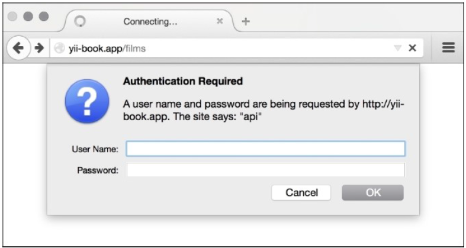

## 身份校验

在本小节中我们将会设置身份校验模型。

### 准备

重复*创建一个REST服务器*小节中*准备*和*如何做*的所有步骤。

### 如何做...

1. 修改`@app/controllers/FilmController`：

```
<?php
namespace app\controllers;
use app\models\User;
use Yii;
use yii\helpers\ArrayHelper;
use yii\rest\ActiveController;
use yii\filters\auth\HttpBasicAuth;
class FilmController extends ActiveController
{
    public $modelClass = 'app\models\Film';
    public function behaviors()
    {
        return ArrayHelper::merge(parent::behaviors(),[
            'authenticator' => [
                'authMethods' => [
                    'basicAuth' => [
                        'class' =>HttpBasicAuth::className(),
                        'auth' => function ($username,$password) {
                            $user =User::findByUsername($username);
                            if ($user !== null && $user->validatePassword($password)){
                                return $user;
                            }
                            return null;
                        },
                    ]
                ]
            ]
        ]);
    }
}
```

在浏览器中打开`http://yii-book.app/films`，确保我们配置了HTTP基本身份验证：



尝试身份验证。在控制台中运行如下命令：

```
curl -i -H "Accept:application/json" "http://yii-book.app/films"
```

你将会得到如下结果：

```
HTTP/1.1 401 Unauthorized
Date: Thu, 24 Sep 2015 01:01:24 GMT
Server: Apache
X-Powered-By: PHP/5.5.23
Www-Authenticate: Basic realm="api"
Content-Length: 149
Content-Type: application/json; charset=UTF-8
{"name":"Unauthorized","message":"You are requesting with an invalid credential.","code":0,"status":401,"type":"yii\\web\\UnauthorizedHttp
Exception"}
```

1. 现在尝试使用`cURL`进行`auth`：

```
curl -i -H "Accept:application/json" -u admin:admin "http://yii-book.app/films"
```

2. 你将会得到类似如下结果：

```
HTTP/1.1 200 OK
Date: Thu, 24 Sep 2015 01:01:40 GMT
Server: Apache
X-Powered-By: PHP/5.5.23
Set-Cookie: PHPSESSID=8b3726040bf8850ebd07209090333103; path=/;
HttpOnly
Expires: Thu, 19 Nov 1981 08:52:00 GMT
Cache-Control: no-store, no-cache, must-revalidate,
post-check=0, pre-check=0
Pragma: no-cache
X-Pagination-Total-Count: 5
X-Pagination-Page-Count: 1
X-Pagination-Current-Page: 1
X-Pagination-Per-Page: 20
Link: <http://yii-book.app/films?page=1>; rel=self
Content-Length: 301
Content-Type: application/json; charset=UTF-8
[{"id":1,"title":"Interstellar","release_year":2014},{"id":2,"ti
tle":"Harry Potter and the Philosopher's
Stone","release_year":2001},{"id":3,"title":"Back to the
Future","release_year":1985},{"id":4,"title":"Blade
Runner","release_year":1982},{"id":5,"title":"Dallas Buyers
Club","release_year":2013}]
```

### 工作原理...

我们将`authenticator`行为添加到了`HttpBasicAuth`类中，所以我们将可以通过登录名和密码进行身份校验。你可以实现官方文档中RESTful web服务部分的任意身份校验方法。

### 更多...

其它发送access token的方法：

- HTTP基础验证
- 查询参数
- OAuth

Yii支持所有这些身份校验方法。

### 参考

欲了解更多信息，参考[http://www.yiiframework.com/doc-2.0/guide-rest-rate-limiting.html](http://www.yiiframework.com/doc-2.0/guide-rest-rate-limiting.html)。