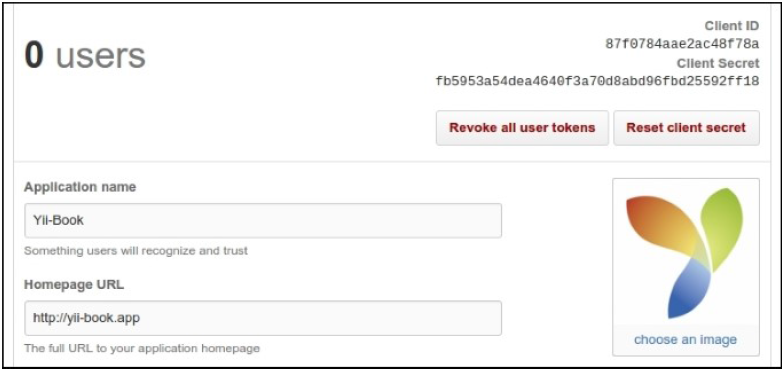
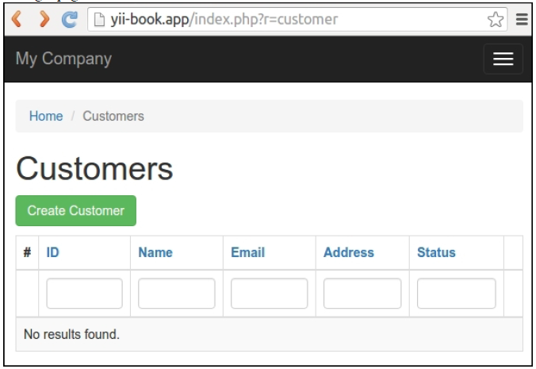
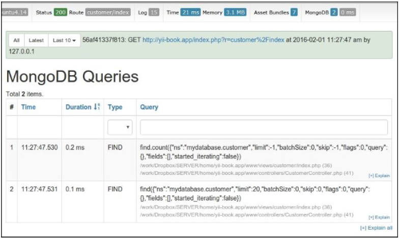
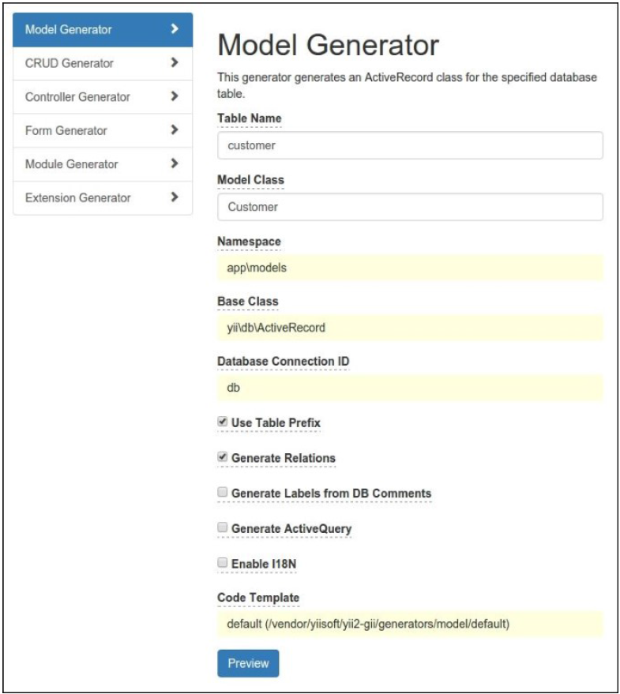
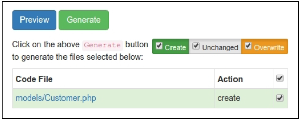
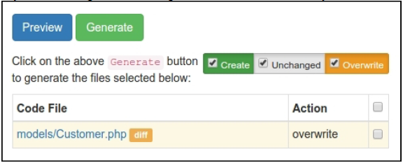
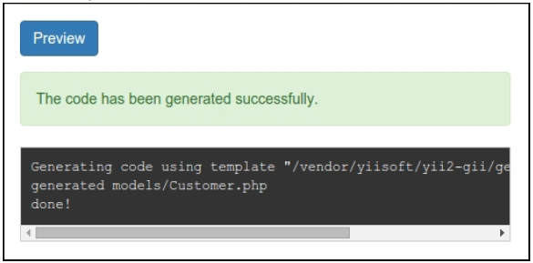
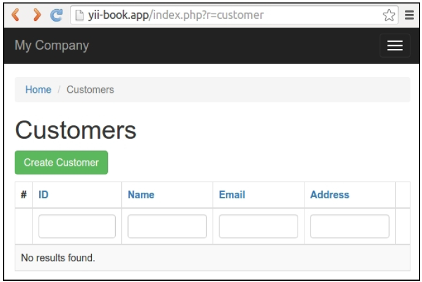

# 官方扩展

## 介绍

## 认证客户端

### 准备

### 如何做...

### 工作原理...

### 参考

## SwitchMailer电子邮件库

### 准备

### 如何做...

#### 发送纯文本电子邮件

#### 注意

#### 发送HTML内容

#### 使用SMTP

#### 注意

#### 添加附件和图片

### 如何做...

### 参考

## Fake fixture 数据生成器

### 准备

### 如何做...

#### 使用你自己的数据类型

### 工作原理...

#### 注意

### 参考

## Imagine库

### 准备

### 如何做...

#### 作为工厂使用

#### 使用内部方法

### 工作原理...

### 参考

## MongoDB驱动

### 准备

###如何做...

#### 基本用法

#### 注意

### 工作原理...

### 参考

## ElasticSearch引擎适配器

### 准备

### 如何做...

#### 使用查询类

#### 使用ActiveRecord

#### 使用ElasticSearch调试板

### 工作原理...

#### 注意

### 参考

## Gii代码生成器

### 准备

### 如何做...

#### 使用GUI

#### 使用CLI

### 工作原理...

### 参考

## Pjax JQuery插件

### 准备

### 如何做...

#### 指定一个自定义ID

#### 使用ActiveForm

#### 使用客户端脚本

### 工作原理...

### 参考

## Redis数据库驱动

### 准备

### 如何做...

#### 直接使用方法

#### 使用ActiveRecord

### 工作原理...

### 参考

