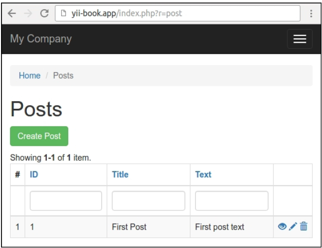

## 创建可重用控制器动作

常用的动作，例如通过主键删除AR模型，或者从AJAX autocomplete获取数据，可以移到可复用控制器动作中，然后附加到需要的控制器上。

在这个小节中，我们将会创建一个可复用删除动作，它会通过主键删除指定的AR模型。

### 准备

1. 按照官方指南[http://www.yiiframework.com/doc-2.0/guide-start-installation.html](http://www.yiiframework.com/doc-2.0/guide-start-installation.html)的描述，使用Composer包管理器创建一个新的`yii2-app-basic`应用。
2. 创建一个新的数据库并配置它。
3. 创建并应用如下migration：

```phpphp
<?php
use yii\db\Migration;
class m160308_093233_create_post_table extends Migration
{
    public function up()
    {
        $this->createTable('{{%post}}', [
            'id' => $this->primaryKey(),
            'title' => $this->string()->notNull(),
            'text' => $this->text()->notNull(),
        ]);
    }
    public function down()
    {
        $this->dropTable('{{%post}}');
    }
}
```

4. 使用Gii为帖子和评论生成模型。
5. 在Gii中生成标准的CRUD控制器`app\controllers\PostController`。
6. 确保CRUD正常工作：



7. 在一个成功的例子中，添加一些帖子示例。

### 如何做...

执行如下步骤：

1. 创建动作文件夹，添加`DeleteAction`独立动作：

```php
<?php
namespace app\actions;
use yii\base\Action;
use yii\base\InvalidConfigException;
use yii\web\MethodNotAllowedHttpException;
use yii\web\NotFoundHttpException;
class DeleteAction extends Action
{
    public $modelClass;
    public $redirectTo = ['index'];
    public function init()
    {
        if (empty($this->modelClass)) {
            throw new InvalidConfigException('Empty model class.');
        }
        parent::init();
    }
    public function run($id)
    {
        if (!\Yii::$app->getRequest()->getIsPost()) {
            throw new MethodNotAllowedHttpException('Method not allowed.');
        }
        $model = $this->findModel($id);
        $model->delete();
        return $this->controller->redirect($this->redirectTo);
    }
    /**
     * @param $id
     * @return \yii\db\ActiveRecord
     * @throws NotFoundHttpException
     */
    private function findModel($id)
    {
        $class = $this->modelClass;
        if (($model = $class::findOne($id)) !== null) {
            return $model;
        } else {
            throw new NotFoundHttpException('Page does not exist.');
        }
    }
}
```

2. 现在我们需要将它附加到`controllers/PostController.php`控制器中。移除控制器的`actionDelete`和`behaviors`方法，并在`actions`方法中附加你自己的动作：

```php
<?php
namespace app\controllers;
use app\actions\DeleteAction;
use Yii;
use app\models\Post;
use app\models\PostSearch;
use yii\web\Controller;
use yii\web\NotFoundHttpException;
class PostController extends Controller
{
    public function actions()
    {
        return [
            'delete' => [
                'class' => DeleteAction::className(),
                'modelClass' => Post::className(),
            ],
        ];
    }
    public function actionIndex() { ... }
    public function actionView($id) { ... }
    public function actionCreate() { ... }
    public function actionUpdate($id) { ... }
    protected function findModel($id)
    {
        if (($model = Post::findOne($id)) !== null) {
            return $model;
        } else {
            throw new NotFoundHttpException('The requested page does not exist.');
        }
    }
}
```

3. 完成了。确保删除操作可以正常工作，并且在删除之后，你将会被重定向到一个对应的index动作中。

### 工作原理...

为了创建一个额外的控制器动作，你需要从`yii\base\Action`中继承你的类。唯一需要强制实现的方法是`run`。在我们的例子中，它使用Yii的自动参数绑定特性，从`$_GET`接收名叫`$id`的参数，并尝试删除一个对应的模型。

为了是它可配置，我们创建了两个可配置的公共属性。`modelName`保存了模型的名称，以及`redirectTo`指定了用户会被重定向的路由。

这个配置本身是通过在你的控制器中实现动作方法来完成的。这里，你可以附加这个动作一次或者多次，并配置它的公共属性。

如果你需要重定向到别的动作，或者渲染一个指定的视图，你可以通过控制器属性，访问原始的控制器对象。

### 参考

- 欲了解更多关于控制器和动作的信息，参考[http://www.yiiframework.com/doc-2.0/guide-structure-controllers.html](http://www.yiiframework.com/doc-2.0/guide-structure-controllers.html)
- 本章中的*创建可复用控制器*小节