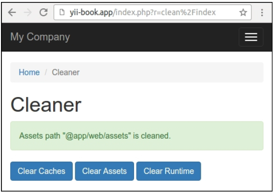

## 创建可重用控制器

在Yii中，你可以创建可复用的控制器。如果你创建许多应用或者控制器，他们有相同的类型，将所有常用的代码移动到一个可复用的控制器中将会节省很多时间。

在本小节中，我们将会尝试创建一个常用的`CleanController`，它会清理临时文件夹以及flush缓存数据。

### 准备

按照官方指南[http://www.yiiframework.com/doc-2.0/guide-start-installation.html](http://www.yiiframework.com/doc-2.0/guide-start-installation.html)的描述，使用Composer包管理器创建一个新的`yii2-app-basic`应用。

### 如何做...

执行如下步骤，创建可复用的控制器：

1. 创建`cleaner`目录，并添加独立`CleanController`控制器：

```php
<?php
namespace app\cleaner;
use Yii;
use yii\filters\VerbFilter;
use yii\helpers\FileHelper;
use yii\web\Controller;
class CleanController extends Controller
{
    public $assetPaths = ['@app/web/assets'];
    public $runtimePaths = ['@runtime'];
    public $caches = ['cache'];
    public function behaviors()
    {
        return [
            'verbs' => [
                'class' => VerbFilter::className(),
                'actions' => [
                    'assets' => ['post'],
                    'runtime' => ['post'],
                    'cache' => ['post'],
                ],
            ],
        ];
    }
    public function actionIndex()
    {
        return $this->render('@app/cleaner/views/index');
    }
    public function actionAssets()
    {
        foreach ((array)$this->assetPaths as $path) {
            $this->cleanDir($path);
            Yii::$app->session->addFlash(
                'cleaner',
                'Assets path "' . $path . '" is cleaned.'
            );
        }
        return $this->redirect(['index']);
    }
    public function actionRuntime()
    {
        foreach ((array)$this->runtimePaths as $path) {
            $this->cleanDir($path);
            Yii::$app->session->addFlash(
                'cleaner',
                'Runtime path "' . $path . '" is cleaned.'
            );
        }
        return $this->redirect(['index']);
    }
    public function actionCache()
    {
        foreach ((array)$this->caches as $cache) {
            Yii::$app->get($cache)->flush();
            Yii::$app->session->addFlash(
                'cleaner',
                'Cache "' . $cache . '" is cleaned.'
            );
        }
        return $this->redirect(['index']);
    }
    private function cleanDir($dir)
    {
        $iterator = new \DirectoryIterator(Yii::getAlias($dir));
        foreach($iterator as $sub) {
            if(!$sub->isDot() && $sub->isDir()) {
                FileHelper::removeDirectory($sub->getPathname());
            }
        }
    }
}
```

2. 为`actionIndex`方法创建`cleaner/views/index.php`视图文件：actionIndex

```php
<?php
use yii\helpers\Html;
/* @var $this yii\web\View */
$this->title = 'Cleaner';
$this->params['breadcrumbs'][] = $this->title;
?>
<div class="clean-index">
    <h1><?= Html::encode($this->title) ?></h1>
    <?php if (Yii::$app->session->hasFlash('cleaner')): ?>
        <?php foreach
        ((array)Yii::$app->session->getFlash('cleaner', []) as
         $message): ?>
            <div class="alert alert-success">
                <?= $message ?>
            </div>
        <?php endforeach; ?>
    <?php endif; ?>
    <p>
        <?= Html::a('Clear Caches', ['cache'], [
            'class' => 'btn btn-primary',
            'data' => [
                'confirm' => 'Are you sure you want to clear all cache data?',
                'method' => 'post',
            ],
        ]) ?>
        <?= Html::a('Clear Assets', ['assets'],
            ['class' => 'btn btn-primary',
                'data' => [
                    'confirm' => 'Are you sure you want to clear all temporary assets?',
                    'method' => 'post',
                ],
            ]) ?>
        <?= Html::a('Clear Runtime', ['runtime'],
            ['class' => 'btn btn-primary',
                'data' => [
                    'confirm' => 'Are you sure you want to clear all runtime files?',
                    'method' => 'post',
                ],
            ]) ?>
    </p>
</div>

```

3. 配置`config/web.php`的`controllerMap`部分，附加控制器到应用中：

```php
$config = [
    'id' => 'basic',
    'basePath' => dirname(__DIR__),
    'bootstrap' => ['log'],
    'controllerMap' => [
        'clean' => 'app\cleaner\CleanController',
    ],
    'components' => [
        ...
    ]
    ...
];
```

4. 添加一个新的条目到主菜单中：

```php
echo Nav::widget([
    'options' => ['class' => 'navbar-nav navbar-right'],
    'items' => [
        ['label' => 'Home', 'url' => ['/site/index']],
        ['label' => 'Cleaner', 'url' => ['/clean/index']],
        ['label' => 'About', 'url' => ['/site/about']],
        ...
    ],
]);
```

5. 打开控制器，并清理assets：



6. 如果你用的是yii2高级应用模板，只需要在配置中指定正确的路径：

```php
'controllerMap' => [
    'clean' => 'app\cleaner\CleanController',
    'assetPaths' => [
        '@backend/web/assets',
        '@frontend/web/assets',
    ],
    'runtimePaths' => [
        '@backend/runtime',
        '@frontend/runtime',
        '@console/runtime',
    ],
],
```

现在我们可以附加这个控制器到任何应用中。

### 工作原理...

当你运行一个应用时，假如路由是`clean/index`，指向`CleanController::actionIndex`，Yii检查`controllerMap`是否定义了。因为这里我们有一个干净的控制器，Yii会执行它，而不是像常用的方式。

在这个控制器中，我们定义了`assetPaths`，`runtimePaths`和`caches`属性，这能够连接这个控制器到应用的不同路径和缓存结构。当附加这个控制器的时候设置它。

### 参考

- 为了更多关于控制器和控制器map的信息，参考[http://www.yiiframework.com/doc-2.0/guide-structure-controllers.html](http://www.yiiframework.com/doc-2.0/guide-structure-controllers.html)
- 本章中的*创建可复用控制器*小节