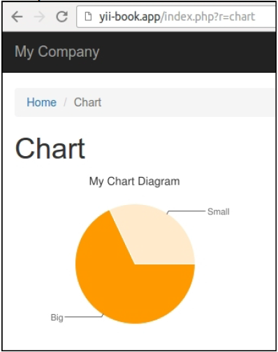

## 创建小部件

小部件是视图中可复用的部分，它不仅会渲染一些数据，而且还能依赖于一些逻辑。它甚至可以从模型中获取数据，并使用它自己的视图，所以它就像一个简化的可复用的模块。

下面我们来创建一个小部件，它会使用Google API画一个饼状图。

### 准备

按照官方指南[http://www.yiiframework.com/doc-2.0/guide-start-installation.html](http://www.yiiframework.com/doc-2.0/guide-start-installation.html)的描述，使用Composer包管理器创建一个新的`yii2-app-basic`应用。

###如何做...

1. 创建`widgets`目录，并添加`ChartWidget`类：

```
<?php
namespace app\widgets;
use yii\base\Widget;
class ChartWidget extends Widget
{
    public $title;
    public $width = 300;
    public $height = 200;
    public $data = [];
    public $labels = [];
    public function run()
    {
        $path = 'http://chart.apis.google.com/chart';
        $query = http_build_query([
            'chtt' => $this->title,
            'cht' => 'pc',
            'chs' => $this->width . 'x' . $this->height,
            'chd' => 't:' . implode(',', $this->data),
            'chds' => 'a',
            'chl' => implode('|', $this->labels),
            'chxt' => 'y',
            'chxl' => '0:|0|' . max($this->data)
        ]);
        $url = $path . '?' . $query;
        return $this->render('chart', [
            'url' => $url,
        ]);
    }
}
```

2. 创建`widgets/views/chart.php`视图：

```
<?php
use yii\helpers\Html;
/* @var $this yii\web\View */
/* @var $url string */
?>
<div class="chart">
    <?= Html::img($url) ?>
</div>
```

3. 创建一个`ChartController`控制器：

```
<?php
namespace app\controllers;
use yii\base\Controller;
class ChartController extends Controller
{
    public function actionIndex()
    {
        return $this->render('index');
    }
}
```

4. 添加`views/chart/index.php`视图：

```
<?php
use app\widgets\ChartWidget;
use yii\helpers\Html;
/* @var $this yii\web\View */
$this->title = 'Chart';
$this->params['breadcrumbs'][] = $this->title;
?>
<div class="site-about">
    <h1><?= Html::encode($this->title) ?></h1>
    <?= ChartWidget::widget([
        'title' => 'My Chart Diagram',
        'data' => [
            100 - 32,
            32,
        ],
        'labels' => [
            'Big',
            'Small',
        ],
    ]) ?>
</div>
```

5. 现在尝试运行这个动作。你应该能看到一个饼状图，如下所示：



6. 你可以展示不同尺寸和数据集的图。

### 工作原理...

和其它类型的扩展一样，我们创建一些可以配置的公共属性，在调用一个小部件时使用它的`widget`方法。在这个例子中，我们配置了标题、数据集和数据标签。

小部件的主方法是`run()`。在我们的小部件中，我们生成一个URL，并渲染小部件视图，它使用Google charting API来打印``标签。

### 参考

- 欲了解更多关于小部件的信息，参考[http://www.yiiframework.com/doc-2.0/guide-structurewidgets.html](http://www.yiiframework.com/doc-2.0/guide-structurewidgets.html)
- 本章中的*制作可发布的扩展*小节