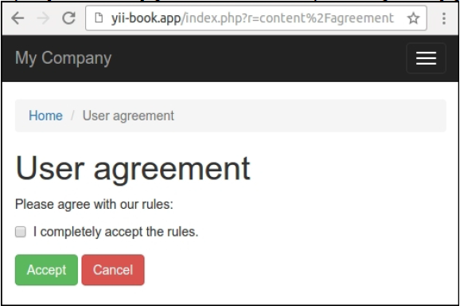
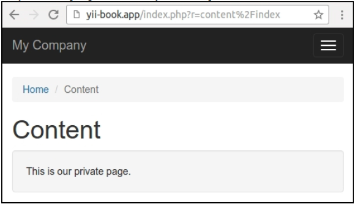

## 创建过滤器

过滤器是一个类，它可以在动作之前或者之后执行。它可以被用于修改执行上下文，或者装饰输出。在我们的例子中，我们将会实现一个简单的访问过滤器，它允许用户只能在接受了**用户协议**之后才能看到私有的内容。

### 准备

按照官方指南[http://www.yiiframework.com/doc-2.0/guide-start-installation.html](http://www.yiiframework.com/doc-2.0/guide-start-installation.html)的描述，使用Composer包管理器创建一个新的`yii2-app-basic`应用。

### 如何做...

1. 创建协议表单模型：

```php
<?php
namespace app\models;
use yii\base\Model;
class AgreementForm extends Model
{
    public $accept;
    public function rules()
    {
        return [
            ['accept', 'required'],
            ['accept', 'compare', 'compareValue' => 1,
                'message' => 'You must agree the rules.'],
        ];
    }
    public function attributeLabels()
    {
        return [
            'accept' => 'I completely accept the rules.'
        ];
    }
}
```

2. 创建协议检查服务：

```php
<?php
namespace app\services;
use Yii;
use yii\web\Cookie;
class AgreementChecker
{
    public function isAllowed()
    {
        return Yii::$app->request->cookies->has('agree');
    }
    public function allowAccess()
    {
        Yii::$app->response->cookies->add(new Cookie([
            'name' => 'agree',
            'value' => 'on',
            'expire' => time() + 3600 * 24 * 90, // 90 days
        ]));
    }
}
```

它使用了协议cookies进行了封装。

3. 创建`filter`类：

```php
<?php
namespace app\filters;
use app\services\AgreementChecker;
use Yii;
use yii\base\ActionFilter;
class AgreementFilter extends ActionFilter
{
    public function beforeAction($action)
    {
        $checker = new AgreementChecker();
        if (!$checker->isAllowed()) {
            Yii::$app->response->redirect(['/content/agreement'])->send();
            return false;
        }
        return true;
    }
}
```

4. 创建内容控制器，并将过滤器附加到行为上：

```php
<?php
namespace app\controllers;
use app\filters\AgreementFilter;
use app\models\AgreementForm;
use app\services\AgreementChecker;
use Yii;
use yii\web\Controller;
class ContentController extends Controller
{
    public function behaviors()
    {
        return [
            [
                'class' => AgreementFilter::className(),
                'only' => ['index'],
            ],
        ];
    }
    public function actionIndex()
    {
        return $this->render('index');
    }
    public function actionAgreement()
    {
        $model = new AgreementForm();
        if ($model->load(Yii::$app->request->post()) &&
            $model->validate()) {
            $checker = new AgreementChecker();
            $checker->allowAccess();
            return $this->redirect(['index']);
        } else {
            return $this->render('agreement', [
                'model' => $model,
            ]);
        }
    }
}
```

5. 添加私有内容到`views/content/index.php`：

```php
<?php
use yii\helpers\Html;
/* @var $this yii\web\View */
$this->title = 'Content';
$this->params['breadcrumbs'][] = $this->title;
?>
<div class="site-about">
    <h1><?= Html::encode($this->title) ?></h1>
    <div class="well">
        This is our private page.
    </div>
</div>
```

6. 给表单添加`views/content/agreement.php`视图：

```php
<?php
use yii\helpers\Html;
use yii\bootstrap\ActiveForm;
/* @var $this yii\web\View */
/* @var $form yii\bootstrap\ActiveForm */
/* @var $model app\models\AgreementForm */
$this->title = 'User agreement';
$this->params['breadcrumbs'][] = $this->title;
?>
<div class="site-login">
    <h1><?= Html::encode($this->title) ?></h1>
    <p>Please agree with our rules:</p>
    <?php $form = ActiveForm::begin(); ?>
    <?= $form->field($model, 'accept')->checkbox() ?>
    <div class="form-group">
        <?= Html::submitButton('Accept', ['class' => 'btn btn-success']) ?>
        <?= Html::a('Cancel', ['/site/index'], ['class' => 'btn btn-danger']) ?>
    </div>
    <?php ActiveForm::end(); ?>
</div>
```

7. 添加主菜单项到`views/layouts/main.php`：

```php
echo Nav::widget([
    'options' => ['class' => 'navbar-nav navbar-right'],
    'items' => [
        ['label' => 'Home', 'url' => ['/site/index']],
        ['label' => 'Content', 'url' => ['/content/index']],
        ['label' => 'About', 'url' => ['/site/about']],
    //...
    ],
]);
```

8. 尝试打开内容页。过滤器会将你重定向到协议页上：



9. 只有在接受协议之后，你才可以看到私有内容：



10. 此外，你可以附加这个过滤器到其他控制器或者模块上。

### 工作原理...

过滤器应该继承了`yii\base\ActionFilter`类，它继承了`yii\base\Behavior`。如果我们想做前过滤或者后过滤，我们可以复写`beforeAction`或者`afterAction`方法。

例如，我们可以检查用户访问，并在遇到失败情况时，抛出HTTP异常。在这个小节中，如果指定的cookie的值不存在，我们将用户重定向到协议页上。

```php
class AgreementFilter extends ActionFilter
{
    public function beforeAction($action)
    {
        $checker = new AgreementChecker();
        if (!$checker->isAllowed()) {
            Yii::$app->response->redirect(['/content/agreement'])->send();
            return false;
        }
        return true;
    }
}
```

你可以附加过滤器到任何控制器或者模块上。为了指定必要路由的列表，只需要使用`only`或者`except`选项。例如，我们只为控制器的index动作应用我们的过滤器：

```php
public function behaviors()
{
    return [
        [
            'class' => AgreementFilter::className(),
            'only' => ['index'],
        ],
    ];
}
```

**注意**：不要忘记，对于`beforeAction`方法，成功的时候返回一个`true`。否则，这个控制器动作将不会被执行。

### 参考

欲了解更多关于过滤器的信息，参考[http://www.yiiframework.com/doc-2.0/guide-structurefilters.html](http://www.yiiframework.com/doc-2.0/guide-structurefilters.html)。

对于内置的缓存和访问控制过滤器，参考：

- [http://www.yiiframework.com/doc-2.0/guide-caching-http.html](http://www.yiiframework.com/doc-2.0/guide-caching-http.html)
- [http://www.yiiframework.com/doc-2.0/guide-securityauthorization.html](http://www.yiiframework.com/doc-2.0/guide-securityauthorization.html)
- *创建模型行为*小节