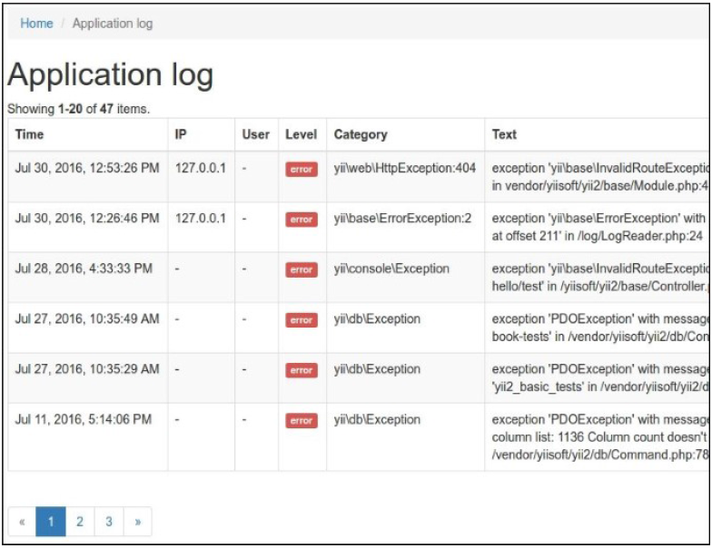

## 创建模块

如果你创建了一个复杂的应用部分，并希望他有一些可自定义的自由度，并用于下一个项目中，很可能你需要创建一个模块。在这个小节中，我们将会看到如何创建一个应用日志查看模块。

### 准备

按照官方指南[http://www.yiiframework.com/doc-2.0/guide-start-installation.html](http://www.yiiframework.com/doc-2.0/guide-start-installation.html)的描述，使用Composer包管理器创建一个新的`yii2-app-basic`应用。

### 如何做...

首先我们来做一些计划。

在`yii2-app-basic`中使用缺省配置，所有的日志被存放在`runtime/logs/app.log`文件中。我们可以使用正则表达式将所有的消息从文件中提取出来，然后将他们展示在**GridView**小部件上。此外，我们允许用户为日志文件配置自定义路径。

执行如下步骤：

1. 创建`modules/log`文件夹，并创建`Module`类文件：

```php
<?php
namespace app\modules\log;
class Module extends \yii\base\Module
{
    public $file = '@runtime/logs/app.log';
}
```

2. 创建一个简单的模型，用于从日志文件中转换每行内容：

```php
<?php
namespace app\modules\log\models;
use yii\base\Object;
class LogRow extends Object
{
    public $time;
    public $ip;
    public $userId;
    public $sessionId;
    public $level;
    public $category;
    public $text;
}
```

3. 写一个日志文件读取类，它会解析文件每行内容，逆序排列，返回`LogRow`模型的实例向量：

```php
<?php
namespace app\modules\log\services;
use app\modules\log\models\LogRow;
class LogReader
{
    public function getRows($file)
    {
        $result = [];
        $handle = @fopen($file, "r");
        if ($handle) {
            while (($row = fgets($handle)) !== false) {
                $pattern =
                    '#^' .
                    '(?P<time>\d{4}\-\d{2}\-\d{2}\d{2}:\d{2}:\d{2}) ' .
                    '\[(?P<ip>[^\]]+)\]' .
                    '\[(?P<userId>[^\]]+)\]' .
                    '\[(?P<sessionId>[^\]]+)\]' .
                    '\[(?P<level>[^\]]+)\]' .
                    '\[(?P<category>[^\]]+)\]' .
                    ' (?P<text>.*?)' .
                    '(\$\_(GET|POST|REQUEST|COOKIE|SERVER) = \[)?' .
                    '$#i';
                if (preg_match($pattern, $row, $matches)) {
                    if ($matches['text']) {
                        $result[] = new LogRow([
                            'time' => $matches['time'],
                            'ip' => $matches['ip'],
                            'userId' => $matches['userId'],
                            'sessionId' =>
                                $matches['sessionId'],
                            'level' => $matches['level'],
                            'category' => $matches['category'],
                            'text' => $matches['text'],
                        ]);
                    }
                }
            }
            fclose($handle);
        }
        return array_reverse($result);
    }
}
```

4. 添加一个帮助类，用于为日志等级展示美化的HTML-badges：

```php
<?php
namespace app\modules\log\helpers;
use yii\helpers\ArrayHelper;
use yii\helpers\Html;
class LogHelper
{
    public static function levelLabel($level)
    {
        $classes = [
            'error' => 'danger',
            'warning' => 'warning',
            'info' => 'primary',
            'trace' => 'default',
            'profile' => 'success',
            'profile begin' => 'info',
            'profile end' => 'info',
        ];
        $class = ArrayHelper::getValue($classes, $level,
            'default');
        return Html::tag('span', Html::encode($level), ['class' => 'label-' . $class]);
    }
}
```

5. 创建一个模块控制器，它会从读取器中获取行的数组，并将他们传递给`ArrayDataProvider`：

```php
<?php
namespace app\modules\log\controllers;
use app\modules\log\services\LogReader;
use yii\data\ArrayDataProvider;
use yii\web\Controller;
class DefaultController extends Controller
{
    public function actionIndex()
    {
        $reader = new LogReader();
        $dataProvider = new ArrayDataProvider([
            'allModels' => $reader->getRows($this->getFile()),
        ]);
        return $this->render('index', [
            'dataProvider' => $dataProvider,
        ]);
    }
    private function getFile()
    {
        return \Yii::getAlias($this->module->file);
    }
}
```

6. 现在，创建`modules/log/default/index.php`视图文件：

```php
<?php
use app\modules\log\helpers\LogHelper;
use app\modules\log\models\LogRow;
use yii\grid\GridView;
use yii\helpers\Html;
/* @var $this yii\web\View */
/* @var $dataProvider yii\data\ArrayDataProvider */
$this->title = 'Application log';
$this->params['breadcrumbs'][] = $this->title;
?>
<div class="log-index">
    <h1><?= Html::encode($this->title) ?></h1>
    <?= GridView::widget([
        'dataProvider' => $dataProvider,
        'columns' => [
            [
                'attribute' => 'time',
                'format' => 'datetime',
                'contentOptions' => [
                    'style' => 'white-space: nowrap',
                ],
            ],
            'ip:text:IP',
            'userId:text:User',
            [
                'attribute' => 'level',
                'value' => function (LogRow $row) {
                    return LogHelper::levelLabel($row->level);
                },
                'format' => 'raw',
            ],
            'category',
            'text',
        ],
    ]) ?>
</div>
```

7. 在文件`config/web.php`中附加模块到你的应用中：

```php
$config = [
    'id' => 'basic',
    'basePath' => dirname(__DIR__),
    'bootstrap' => ['log'],
    'modules' => [
        'log' => 'app\modules\log\Module',
    ],
    'components' => [
    ],
    //...
];
```

8. 在`views/layouts/main.php`文件中添加一个到这个控制器的链接：

```php
echo Nav::widget([
    'options' => ['class' => 'navbar-nav navbar-right'],
    'items' => [
        ['label' => 'Home', 'url' => ['/site/index']],
        ['label' => 'Log', 'url' => ['/log/default/index']],
        ['label' => 'About', 'url' => ['/site/about']],
        ['label' => 'Contact', 'url' => ['/site/contact']],
        //...
    ],
]);
NavBar::end();
```

9. 访问`/index.php?r=log`，确保这个模块可以正常工作：



### 工作原理...

你可以通过独立的模块来组织你的控制器、模型、视图和其它组件，并将他们附加到你的应用中。你可以使用Gii或者手动生成一个模块模板。

没一个模块包含一个主模块类，我们可以定义可配置的属性，定义修改路径，附加控制器等等。默认情况下，使用Gii生成的模块会运行默认控制器的`index`动作。

### 参考

- 欲了解更多关于模块的信息，以及最佳实践，参考[http://www.yiiframework.com/doc-2.0/guide-structure-modules.html](http://www.yiiframework.com/doc-2.0/guide-structure-modules.html)
- *制作可发布扩展*小节