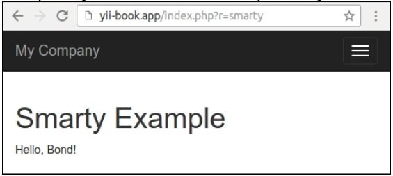

## 创建一个自定义视图渲染器

这里有许多PHP模板引擎。Yii2只提供原生PHP模板。如果你想使用一个存在的模板引擎，或者创建你自己的，你需要实现它——当然，如果还没有被Yii社区实现的话。

在本小节中，我们将会重新实现Smarty模板支持。

### 准备

1. 按照官方指南[http://www.yiiframework.com/doc-2.0/guide-start-installation.html](http://www.yiiframework.com/doc-2.0/guide-start-installation.html)的描述，使用Composer包管理器创建一个新的`yii2-app-basic`应用。
2. 安装Smarty库：

```
composer require smarty/smarty
```

### 如何做...

执行如下步骤，创建一个自定义视图渲染器：

1. 创建`smarty/ViewRenderer.php`：

```php
<?php
namespace app\smarty;
use Smarty;
use Yii;
class ViewRenderer extends \yii\base\ViewRenderer
{
    public $cachePath = '@runtime/smarty/cache';
    public $compilePath = '@runtime/smarty/compile';
    /**
     * @var Smarty
     */
    private $smarty;
    public function init()
    {
        $this->smarty = new Smarty();
        $this->smarty->setCompileDir(Yii::getAlias($this->compilePath));
        $this->smarty->setCacheDir(Yii::getAlias($this->cachePath));
        $this->smarty->setTemplateDir([
            dirname(Yii::$app->getView()->getViewFile()),
            Yii::$app->getViewPath(),
        ]);
    }
    public function render($view, $file, $params)
    {
        $templateParams = empty($params) ? null : $params;
        $template = $this->smarty->createTemplate($file, null,
            null, $templateParams, false);
        $template->assign('app', \Yii::$app);
        $template->assign('this', $view);
        return $template->fetch();
    }
}
```

2. 现在，我们需要连接这个视图渲染器到应用中。在`config/web.php`文件中，我们需要添加视图组件的渲染器：

```php
'components' => [
    //....
    'view' => [
        'renderers' => [
            'tpl' => [
                'class' => 'app\smarty\ViewRenderer',
            ],
        ],
    ],
    //...
];
```

3. 现在让我们测试它。创建一个新的`SmartyController`：

```php
<?php
namespace app\controllers;
use yii\web\Controller;
class SmartyController extends Controller
{
    public function actionIndex()
    {
        return $this->render('index.tpl', [
            'name' => 'Bond',
        ]);
    }
}
```

4. 接下来，我们需要创建`views/smarty/index.tpl`视图：

```php
<div class="smarty-index">
    <h1>Smarty Example</h1>
    <p>Hello, {$name}!</p>
</div>
```

5. 尝试访问这个控制器。如果成功的话，你应该能得到如下输出：



### 工作原理...

视图渲染器继承了`yii\base\ViewRenderer`抽象类，并只需要实现一个方法`render`：

```php
<?php
namespace yii\base;
abstract class ViewRenderer extends Component
{
    /**
     * Renders a view file.
     *
     * This method is invoked by [[View]] whenever it tries to render a view.
     * Child classes must implement this method to render the given view file.
     *
     * @param View $view the view object used for rendering the file.
     * @param string $file the view file.
     * @param array $params the parameters to be passed to the view file.
     * @return string the rendering result
     */
    abstract public function render($view, $file, $params);
}
```

因此，我们会获得一个视图组件、文件路径和渲染变量。我们需要处理这个问题，并返回渲染的结果。在我们的例子中，处理它自己是通过Smarty模板引擎完成的，所以我们需要正确的初始化它，并调用它的处理方法：

```php
class ViewRenderer extends \yii\base\ViewRenderer
{
    public $cachePath = '@runtime/smarty/cache';
    public $compilePath = '@runtime/smarty/compile';
    private $smarty;
    public function init()
    {
        $this->smarty = new Smarty();
        $this->smarty->setCompileDir(Yii::getAlias($this->compilePath));
        $this->smarty->setCacheDir(Yii::getAlias($this->cachePath));
        $this->smarty->setTemplateDir([
            dirname(Yii::$app->getView()->getViewFile()),
            Yii::$app->getViewPath(),
        ]);
    }
//…
}
```

将Yii临时文件存放在应用runtime文件夹中是一个好习惯。这就是为什么我们设置`compile`文件夹（Smarty存储它的编译为PHP的模板）到`runtime/smarty/compile`。

渲染它自己非常简单：

```php
public function render($view, $file, $params)
{
    $templateParams = empty($params) ? null : $params;
    $template = $this->smarty->createTemplate($file, null, null,
        $templateParams, false);
    $template->assign('app', \Yii::$app);
    $template->assign('this', $view);
    return $template->fetch();
}
```

通过`$this->render`设置的数据被传递到Smarty模板。此外，我们创建特殊的Smarty模板变量，名叫`app`和`this`，它分别指向`Yii:$app`和`Yii::$app->view`，这允许我们在一个模板内部获取应用属性。

然后，我们就可以渲染这个模板了。

### 参考

你可以立刻使用带有插件和配置支持的Smarty视图渲染器，在[https://github.com/yiisoft/yii2-smarty](https://github.com/yiisoft/yii2-smarty)。

为了了解更多关于Smarty和视图渲染器，参考如下地址：

- [http://www.smarty.net](http://www.smarty.net)
- [http://www.yiiframework.com/doc-2.0/guide-tutorial-templateengines.html](http://www.yiiframework.com/doc-2.0/guide-tutorial-templateengines.html)
- [http://www.yiiframework.com/doc-2.0/guide-structure-views.html](http://www.yiiframework.com/doc-2.0/guide-structure-views.html)