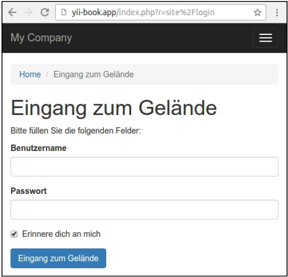
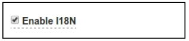

## 创建一个多语言应用

每一天，我们会见越来越多的国际公司、软件产品和信息资源，他们发布的内容都是多语言的。Yii2提供内置i18n支持，用于制作多语言应用。

在本小节中，我们翻译应用接口到不同的语言上。

### 准备

按照官方指南[http://www.yiiframework.com/doc-2.0/guide-start-installation.html](http://www.yiiframework.com/doc-2.0/guide-start-installation.html)的描述，使用Composer包管理器创建一个新的`yii2-app-basic`应用。

### 如何做...

1. 在`views/layouts/main.php`文件修改主菜单标签，使用`Yii::t('app/nav', '...')`方法：

```php
echo Nav::widget([
    'options' => ['class' => 'navbar-nav navbar-right'],
    'items' => [
        ['label' => Yii::t('app/nav', 'Home'), 'url' => ['/site/index']],
        ['label' => Yii::t('app/nav', 'About'), 'url' => ['/site/about']],
        ['label' => Yii::t('app/nav', 'Contact'), 'url' => ['/site/contact']],
        //...
    ],
]);
```

2. 修改所有的标题和面包屑，使用`Yii::t('app, '...')`方法：

```php
$this->title = Yii::t('app', 'Contact');
$this->params['breadcrumbs'][] = $this->title;
```

3. 此外，修改你所有按钮的标签：

```php
<div class="form-group">
<?= Html::submitButton(Yii::t('app', 'Submit'), ['class' => 'btn btn-primary'']) ?>
</div>
```

修改其它硬编码的信息：

```php
<p>
<?= Yii::t('app', 'The above error occurred while the Web server was processing your request.') ?>
</p>
```

4. 修改你的`LoginForm`表单的属性标签：

```php
class LoginForm extends Model
{
    ...
    public function attributeLabels()
    {
        return [
            'username' => Yii::t('app/user', 'Username'),
            'password' => Yii::t('app/user', 'Password'),
            'rememberMe' => Yii::t('app/user', 'Remember Me'),
        ];
    }
}
```

此外，修改`ContactForm`模型的属性标签：

```php
class ContactForm extends Model
{
    ...
    public function attributeLabels()
    {
        return [
            'name' => Yii::t('app/contact', 'Name'),
            'email' => Yii::t('app/contact', 'Email'),
            'subject' => Yii::t('app/contact', 'Subject'),
            'body' => Yii::t('app/contact', 'Body'),
            'verifyCode' => Yii::t('app', 'Verification Code'),
        ];
    }
}
```

它会输出翻译后的标签。

5. 为了准备翻译，创建`messages`目录。马上，我们可以为所有需要的语言创建翻译文件。我们可以手动制作，但是有一个很有用的爬虫，它会扫描所有的项目文件，并为所有的消息构建`Yii::t()`构造。我们来使用它。
6. 为消息扫描器生成配置文件：

```
./yii message/config-template config/messages.php
```

7. 打开配置文件，设置如下值：

```php
<?php
return [
    'sourcePath' => '@app',
    'languages' => ['de', 'fr'],
    'translator' => 'Yii::t',
    'sort' => false,
    'removeUnused' => false,
    'markUnused' => true,
    'only' => ['*.php'],
    'except' => [
        '.svn',
        '.git',
        '.gitignore',
        '.gitkeep',
        '.hgignore',
        '.hgkeep',
        '/messages',
        '/vendor',
    ],
    'format' => 'php',
    'messagePath' => '@app/messages',
    'overwrite' => true,
    'ignoreCategories' => [
        'yii',
    ],
];
```

8. 运行爬虫，并将这个配置文件传递给它：

```
./yii message config/messages.php
```

9. 在处理过以后，我们能得到如下文件夹结构：

```
messages
├── de
│   ├── app
│   │   ├── contact.php
│   │   ├── nav.php
│   │   └── user.php
│   └── app.php
└── fr
    ├── app
    │   ├── contact.php
    │   ├── nav.php
    │   └── user.php
    └── app.php
```

10. 例如，`messages/de/app/contact`包含如下内容：

```php
<?php
...
return [
    'Body' => '',
    'Email' => '',
    'Name' => '',
    'Subject' => '',
];
```

11. 它是一个纯PHP数组，原始的句子会放在keys的的位置，翻译后的消息会放在values的位置上。
12. 只需要将翻译成德语的内容放在值的位置上：

```php
<?php
...
return [
    'Password' => 'Passwort',
    'Remember Me' => 'Erinnere dich an mich',
    'Username' => 'Benutzername',
];
```

13. 在`config/web.php`文件中附加这些翻译到应用的`i18n`组件上：

```php
$config = [
    'id' => 'basic',
    'basePath' => dirname(__DIR__),
    'bootstrap' => ['log'],
    'components' => [
        //…
        'i18n' => [
            'translations' => [
                'app*' => [
                    'class' => 'yii\i18n\PhpMessageSource',
                    'sourceLanguage' => 'en-US',
                ],
            ],
        ],
        'db' => require(__DIR__ . '/db.php'),
    ],
    'params' => $params,
];
```

14. 打开登录页面，会有默认语言：


15. 修改应用语言为`de`：

```php
$config = [
    'id' => 'basic',
    'language' => 'de',
    'basePath' => dirname(__DIR__),
    'bootstrap' => ['log'],
    ...
];
```

然后刷新登录页面：



16. 内置的框架消息和默认校验错误也会被自动翻译。

### 工作原理...

Yii2提供`Yii::t()`方法，用于通过`i18n`组件翻译接口消息，它支持不用的源类型。在本小节中，我们使用的是`yii\i18n\hpMessageSource`，它用纯PHP文件存储了翻译后的消息。

这个框架没有人工智能，不支持自己翻译消息。你必须在文件或者在数据库中放好准备好的翻译，框架会从消息源中获取需要的信息。

你可以手动设置当前语言：

```php
$config = [
    'id' => 'basic',
    'language' => 'de',
    ...
];
```

如果不在配置文件中设置语言的话，你可以在运行时设置应用语言：

```php
Yii::$app->language = 'fr';
```

例如，如果你存放用户语言在`User`模型的`lang`字段上，你可以创建语言加载器：

```php
<?php
namespace app\bootstrap;
use yii\base\BootstrapInterface;
class LanguageBootstrap implements BootstrapInterface
{
    public function bootstrap($app)
    {
        if (!$app->user->isGuest) {
            $app->language = $app->user->identity->lang;
        }
    }
}
```

在bootstraping列表中注册这个类：

```php
$config = [
    'id' => 'basic',
    'basePath' => dirname(__DIR__),
    'bootstrap' => ['log', 'app'bootstrap\LanguageBoostrap'],
    ...
];
```

现在，每一个认证的用户将会看到他们自己语言的界面。

此外，你可以复写`yii\web\UrlManager`，用于将当前语言作为GET参数传递，或者是一个URL的前缀方式传递。此外，作为备选项，你可以在浏览器的cookie中存放选择的语言。

当你使用Gii生成模型或者其它代码时，你可以检查如下选项：



在生成的代码中，所有的标签都被嵌入到`Yii::t()`中。

**注意**：本小节中我们没有讨论模型内容的翻译。但是，例如，你可以在数据库中独立的表中存放翻译后的文本（例如`post_lang`表存放帖子模型表），并使用`Yii::$app->language`属性，获取当前语言，并为你的模型提取需要的内容。

### 参考

欲了解Yii2中更多关于国际化的信息，参考[http://www.yiiframework.com/doc-2.0/guide-tutorial-i18n.html](http://www.yiiframework.com/doc-2.0/guide-tutorial-i18n.html)。