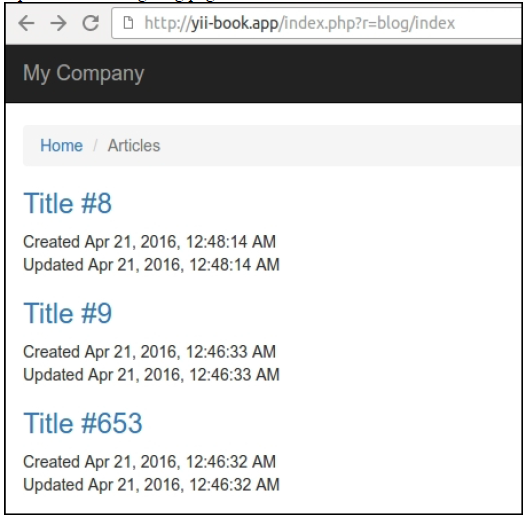
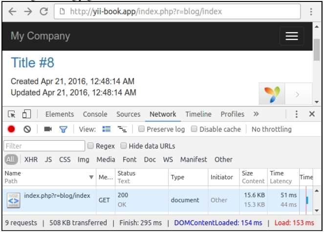
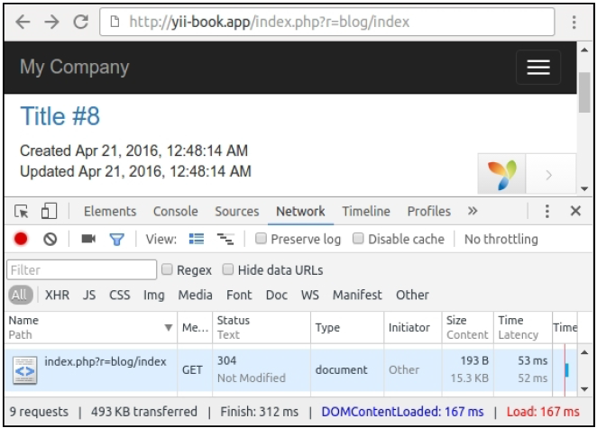
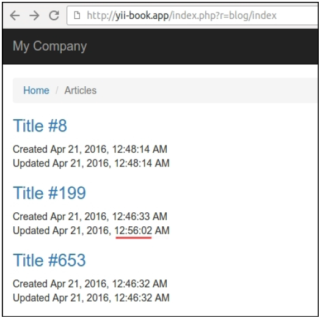
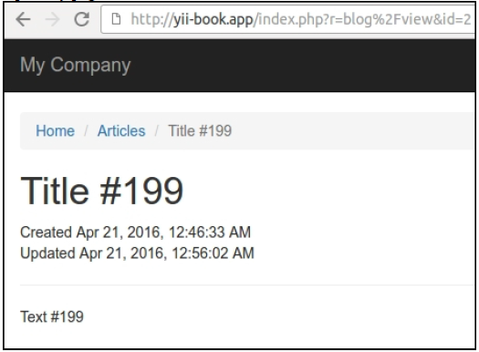
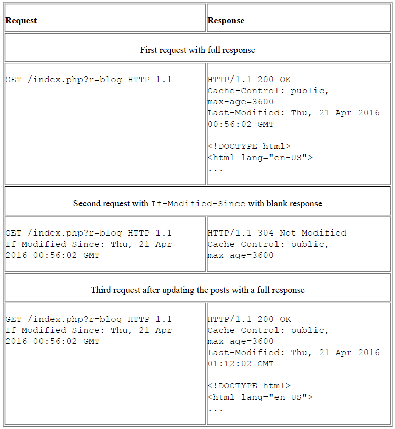
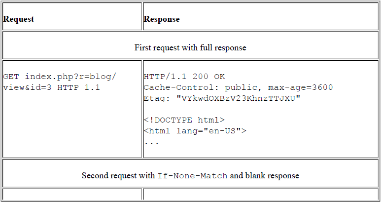
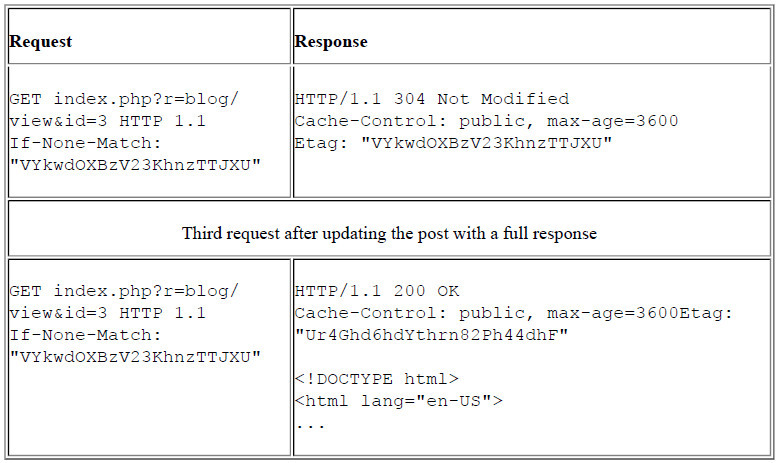

## Leveraging HTTP缓存

不只是服务端的缓存，你通过设置HTTP头可以使用客户端缓存。

在这个小节中，我们将会讨论基于`Last-Modified`和`ETag`头的全页缓存。

### 准备

按照官方指南[http://www.yiiframework.com/doc-2.0/guide-start-installation.html](http://www.yiiframework.com/doc-2.0/guide-start-installation.html)的描述，使用Composer包管理器创建一个新的`yii2-app-basic`应用。

1. 创建并运行migration：

```php
<?php
use yii\db\Migration;
class m160308_093233_create_example_tables extends Migration
{
    public function up()
    {
        $this->createTable('{{%article}}', [
            'id' => $this->primaryKey(),
            'created_at' => $this->integer()->unsigned()->notNull(),
            'updated_at' =>
                $this->integer()->unsigned()->notNull(),
            'title' => $this->string()->notNull(),
            'text' => $this->text()->notNull(),
        ]);
    }
    public function down()
    {
        $this->dropTable('{{%article}}');
    }
}
```

2. 创建`Article`模型：

```php
<?php
namespace app\models;
use Yii;
use yii\behaviors\TimestampBehavior;
use yii\db\ActiveRecord;
class Article extends ActiveRecord
{
    public static function tableName()
    {
        return '{{%article}}';
    }
    public function behaviors()
    {
        return [
            TimestampBehavior::className(),
        ];
    }
}
```

3. 创建带有如下动作的博客控制器：

```php
<?php
namespace app\controllers;
use app\models\Article;
use yii\web\Controller;
use yii\web\NotFoundHttpException;
class BlogController extends Controller
{
    public function actionIndex()
    {
        $articles = Article::find()->orderBy(['id' =>
            SORT_DESC])->all();
        return $this->render('index', array(
            'articles' => $articles,
        ));
    }
    public function actionView($id)
    {
        $article = $this->findModel($id);
        return $this->render('view', array(
            'article' => $article,
        ));
    }
    public function actionCreate()
    {
        $n = rand(0, 1000);
        $article = new Article();
        $article->title = 'Title #' . $n;
        $article->text = 'Text #' . $n;
        $article->save();
        echo 'OK';
    }
    public function actionUpdate($id)
    {
        $article = $this->findModel($id);
        $n = rand(0, 1000);
        $article->title = 'Title #' . $n;
        $article->text = 'Text #' . $n;
        $article->save();
        echo 'OK';
    }
    private function findModel($id)
    {
        if (($model = Article::findOne($id)) !== null) {
            return $model;
        } else {
            throw new NotFoundHttpException('The requested page does not exist.');
        }
    }
}
```

4. 添加`views/blog/index.php`视图：

```php
<?php
use yii\helpers\Html;
$this->title = 'Articles';;
$this->params['breadcrumbs'][] = $this->title;
?>
<?php foreach($articles as $article): ?>
    <h3><?= Html::a(Html::encode($article->title), ['view',
            'id' => $article->id]) ?></h3>
    <div>Created <?= Yii::$app->formatter->asDatetime($article->created_at) ?></div>
    <div>Updated <?= Yii::$app->formatter->asDatetime($article->updated_at) ?></div>
<?php endforeach ?>
```

5. 添加视图`views/blog/view.php`：

```php
<?php
use yii\helpers\Html;
$this->title = $article->title;
$this->params['breadcrumbs'][] = ['label' => 'Articles', 'url' => ['index']];
$this->params['breadcrumbs'][] = $this->title;
?>
<h1><?= Html::encode($article->title) ?></h1>
<div>Created <?= Yii::$app->formatter->asDatetime($article->created_at) ?></div>
<div>Updated <?= Yii::$app->formatter->asDatetime($article->updated_at) ?></div>
<hr />
<p><?= Yii::$app->formatter->asNtext($article->text) ?></p>
```

### 如何做...

执行如下步骤来leverage HTTP缓存：

1. 访问`http://yii-book.app/index.php?r=blog/create`三次，来创建三个文章。
2. 打开如下博客地址：



3. 在你的浏览器中打开开发者控制台，每次刷新页面都可以看到`200 OK`的响应状态：



4. 打开`BlogController`并附加如下行为：

```php
<?php
class BlogController extends Controller
{
    public function behaviors()
    {
        return [
            [
                'class' => 'yii\filters\HttpCache',
                'only' => ['index'],
                'lastModified' => function ($action, $params) {
                    return Article::find()->max('updated_at');
                },
            ],
            [
                'class' => 'yii\filters\HttpCache',
                'only' => ['view'],
                'etagSeed' => function ($action, $params) {
                    $article = $this->findModel(\Yii::$app->request->get('id'));
                    return serialize([$article->title, $article->text]);
                },
            ],
        ];
    }
    // ...
}
```

5. 接下来，刷新页面几次，并检查服务器返回的是`304 Not Modified`，而不是`200 OK`：



6. 使用如下URL打开相关页面，更新相关文章：`http://yiibook.app/index.php?r=blog/update`。
7. 更新过博客页面以后，检查服务器首次返回的是`200 OK`，接着就是`304 Not Modified`，并确认你在页面上看到了新的更新时间：



8. 从我们的页面上打开任何页面：



确认服务器首次返回的是`200 OK`，以及接下来的请求是`304 Not Modified`。

### 工作原理...

在HTTP头的帮助下，你的浏览器用基于时间和基于内容的方法，来检查缓存响应内容的可用性。

#### 上次修改时间

这个方法建议服务端必须返回每个文章的上次修改时间。在存储这个这个日期之后，我们的浏览器可以在接下来的每次请求中，在`If-Modified-Since`头设置这个值。

我们必须附加这个`action`过滤器到我们的控制器中，并指定`lastModified`回到：

```php
<?php
class BlogController extends Controller
{
    public function behaviors()
    {
        return [
            [
                'class' => 'yii\filters\HttpCache',
                'only' => ['index'],
                'lastModified' => function ($action, $params) {
                    return Article::find()->max('updated_at');
                },
            ],
            // ...
        ];
    }
    // ...
}
```

`\yii\filters\HttpCache`类调用这个回调，并将返回值和`$_SERVER['HTTP_IF_MODIFIED_SINCE']`系统变量进行比较。如果这个文章没有改变，`HttpCache`将会发送一个轻量级的`304`响应头，而且不需要运行这个动作。

但是，如果文档更新了，这个缓存将会失效，服务端将会返回一个完整的响应。



作为`Last-Modified`的备选或者补充，你可以使用`ETag`。

#### Entity标签

如果我们没有存储上次修改时间，我们可以使用自定义hash，它可以基于文章的内容生成。

例如，我们可以为我们的文档使用一个内容标题，来做了一个hash值：

```php
class BlogController extends Controller
{
    public function behaviors()
    {
        return [
            [
                'class' => 'yii\filters\HttpCache',
                'only' => ['view'],
                'etagSeed' => function ($action, $params) {
                    $article =
                        $this->findModel(\Yii::$app->request->get('id'));
                    return serialize([$article->title,
                        $article->text]);
                },
            ],
        ];
    }
    // ...
}
```

这个`HttpCache`过滤器会将这个tag附加到服务器响应的`ETag`头变量上。

在存储了`ETag`之后，我们的浏览器会为接下来的每次请求附加它在`If-None-Match`头上。

如果这个文档仍然为改变，`HttpCache`将会发送一个轻量级的`304`响应头，并且不需要运行这个动作。





当这个缓存是合法的，我们的应用将会发送`304 Not Modified`响应头，而不是页面内容，而且不会重复运行控制器和动作。

### 参考

- 欲了解更多关于HTTP缓存，参考[https://developers.google.com/web/fundamentals/performance/optimizing-content-efficiency/http-caching](https://developers.google.com/web/fundamentals/performance/optimizing-content-efficiency/http-caching)
- 对于Yii2中的HTTP缓存，参考[http://www.yiiframework.com/doc-2.0/guide-cachinghttp.html](http://www.yiiframework.com/doc-2.0/guide-cachinghttp.html)