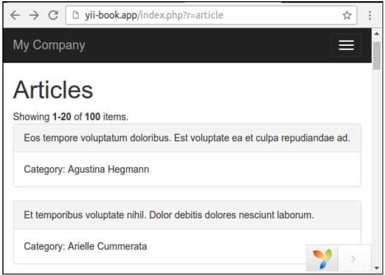
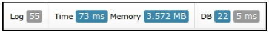
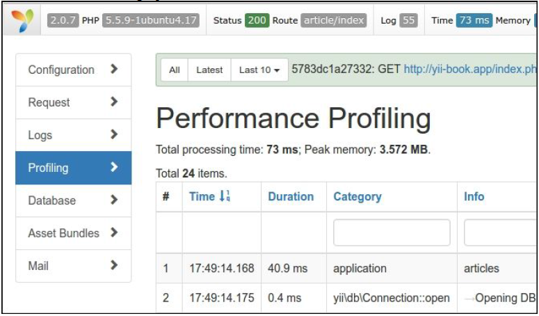
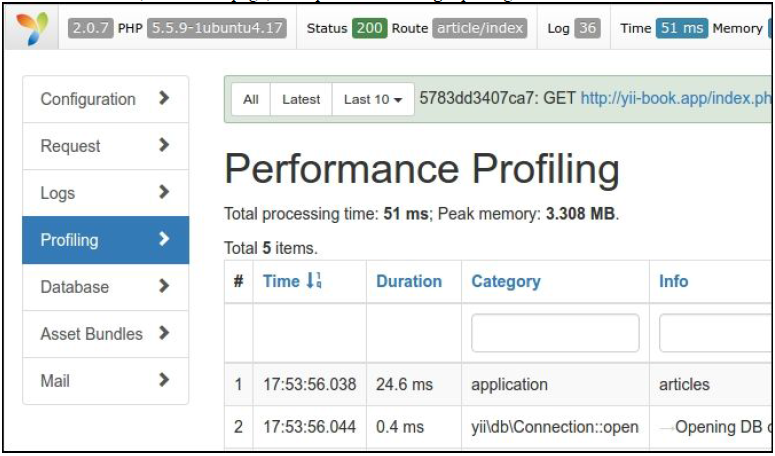
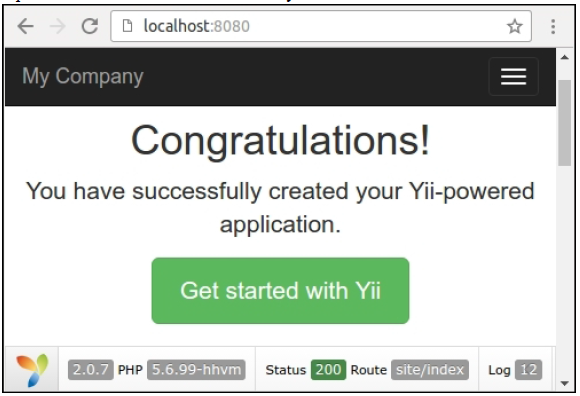
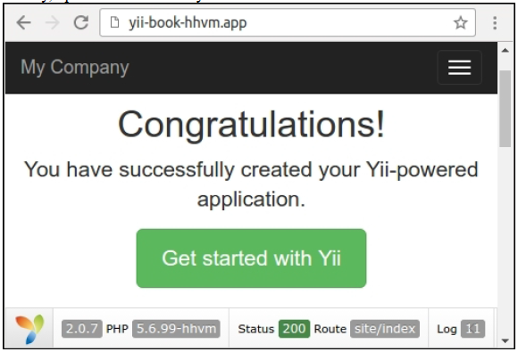

# 性能调优

在本章中，我们将会讨论如下话题：

- 使用最佳实践
- 加速session处理
- 使用缓存依赖和chains
- profiling一个Yii应用
- Leveraging HTTP缓存
- 合并和最小化资源
- 在HHVM上运行Yii2

Yii是现有最快的框架中的一个。然后，当开发和部署一个应用时，有一些免费的额外性能和遵守最佳实践是有好处的。在本章中，你将会看到如何配置Yii来获取额外的性能。此外，你将会了解到一些最佳实践，可用于开发你的应用，能顺畅的运行，知道你有非常高的负载。

## 使用最佳实践

在本小节中，你将会看到如何配置Yii2，得到最好的性能，以及额外的创建响应式应用的原则。这些原则既是常用的也是Yii相关的。因此，我们将能使用这些原则，甚至不使用Yii2时也可以。

### 准备

按照官方指南[http://www.yiiframework.com/doc-2.0/guide-start-installation.html](http://www.yiiframework.com/doc-2.0/guide-start-installation.html)的描述，使用Composer包管理器创建一个新的`yii2-app-basic`应用。

### 如何做...

1. 更新你的PHP到最新的稳定版本。PHP的主发布版可能会带来非常大的性能提升。关掉调试模式，并设置为`prod`环境。这可以通过编辑`web/index.php`：

```
defined('YII_DEBUG') or define('YII_DEBUG', false);
defined('YII_ENV') or define('YII_ENV', 'prod');
```

**注意**：在`yii2-app-advanced`应用框架中，你可以使用shell命令`php init`，以及选择生产环境，用于加载优化的`index.php`和配置文件。

2. 激活`cache`组件：

```
'components' => [
    'cache' => [
        'class' => 'yii\caching\FileCache',
    ],
],
```

你可以使用任何缓存存储，不只是`FileCache`。此外，你可以注册多个缓存应用组件，并使用`Yii::$app->cache`和`Yii::$app->cache2`来获取不同的数据类型：

```
'components' => [
    'cache' => [
        'class' => 'yii\caching\MemCache',
        'useMemcached' => true,
    ],
    'cache2' => [
        'class' => 'yii\caching\FileCache',
    ],
],
```

这个框架默认在它自己的类中使用`cache`组件。

3. 为`db`组件激活表schema缓存：

```
return [
    // ...
    'components' => [
        // ...
        'cache' => [
            'class' => 'yii\caching\FileCache',
        ],
        'db' => [
            'class' => 'yii\db\Connection',
            'dsn' => 'mysql:host=localhost;dbname=mydatabase',
            'username' => 'root',
            'password' => '',
            'enableSchemaCache' => true,
            // Optional. Default value is 3600 seconds
            'schemaCacheDuration' => 3600,
            // Optional. Default value is 'cache'
            'schemaCache' => 'cache',
        ],
    ],
];
```

4. 使用纯数据，而不是ActiveRecord对象来列出元素的集合。

```
$categoriesArray = Categories::find()->asArray()->all();
```

5. 在`foreach`中使用`each()`而不是`all()`来获取大量的结果：

```
foreach (Post::find()->each() as $post) {
    // ...
}
```

6. 因为Composer的autoloader被用于包含大部分的第三方类文件，你应该考虑通过如下命令优化它：

```
composer dump-autoload -o
```

### 工作原理...

当`YII_DEBUG`被设置为`false`时，Yii关闭了所有trace级别的日志，并使用较少的错误处理代码。此外，当你设置`YII_ENV`为`prod`时，你的应用不会加载Yii和Debug面板模块。

设置`schemaCachingDuration`为一个以秒为单位的数字，允许Yii的ActiveRecord缓存数据的schema。对于生产环境，我们非常建议这样做，它会大幅提高ActiveRecord的性能。为了使它能功能，你需要正确的配置`cache`：

```
'cache' => [
    'class' => 'yii\cache\FileCache',
],
```

激活缓存对其它Yii组件也有正面的影响。例如，Yii路由或者urlManager从cache路由开始。

当然，你可以进入到一种情况，先前的设置对于显著的提升性能没有帮助。在大部分情况下，这意味着这个应用本身是一个瓶颈，你需要更多的硬件。

- **服务端性能只是重点中的一部分**：服务端性能只是所有能影响全局性能中的一个点。通过优化客户端，例如CSS、图像和Javascript文件，正确的缓存和减少HTTP请求的数量，可以有一个很好的可见的性能提升，即使是没有优化PHP代码。
- **不使用Yii做事**：有些事情如果不使用Yii可以很好的完成。例如，实时修改图像大小在一个独立的PHP脚本中进行会更快，可以避免额外的负载。
- **Active Record和Query Builder以及SQL对比**：在对性能比较敏感的应用部分使用Query Builder和SQL。一般情况下，AR对于添加和编辑记录非常有用，因为它添加一个很方便的校验层，但当查询记录时并没有什么用。
- **经常检查慢查询**：如果开发者意外忘记给一个表格添加索引，当数据库经常被读取时，数据库就会成为性能瓶颈；反之亦然，如果添加太多的索引，而又要经常写数据。同样的事情会发生在选择不必要的数据以及不需要的JOINs。
- **缓存或者保存重型过程的结果**：如果你可以在每一个页面加载过程中避免运行一个重型过程，这最好了。例如，保存或者缓存解析的markdown文本，净化一次后（这是一个非常耗资源的过程），以后就是可以直接用于展示的HTML了。
- **处理太多的过程**：有时有太多的过程需要立即处理。它可以创建复杂的报告，或者只是简单的发送电子邮件（如果你的项目加载的很重）。在这种情况下，最好将它放入到队列中，然后使用cron或者其它指定的工具来处理。

### 参考

欲了解更多关于性能调优和缓存的信息，参考如下地址：

- [http://www.yiiframework.com/doc-2.0/guide-tutorial-performance-tuning.html](http://www.yiiframework.com/doc-2.0/guide-tutorial-performance-tuning.html)
- [http://www.yiiframework.com/doc-2.0/guide-caching-overview.html](http://www.yiiframework.com/doc-2.0/guide-caching-overview.html)

## 加速session处理

在PHP中原生的session处理在大部分情况下已经非常好了。但至少有两个可能原因，你希望改变session的处理方式：

- 当使用多个服务器时，需要有统一的session存储。
- 默认的PHP session使用文件，所以最大的性能瓶颈在磁盘I/O上。
- 默认的PHP session是阻塞并发的session存储。在这个小节中，我们将会看到如何使用Yii做高效的session存储。

### 准备

按照官方指南[http://www.yiiframework.com/doc-2.0/guide-start-installation.html](http://www.yiiframework.com/doc-2.0/guide-start-installation.html)的描述，使用Composer包管理器创建一个新的`yii2-app-basic`应用。并安装Memcache服务器和`memcache` PHP扩展。

### 如何做...

我们使用apache的`ab`工具对网站做压力测试。它是和apache二进制文件一起发布，所以如果正在使用apache，你将会在`bin`文件夹中找到它。

1. 运行如下命令，并将网址替换成你的正在使用的网站的网址：

```
ab -n 1000 -c 5 http://yii-book.app/index.php?r=site/contact
```

这将会发送1000次请求，一次发送5个，并会得到如下输出统计：

```
This is ApacheBench, Version 2.3 <$Revision: 1528965 $>
Copyright 1996 Adam Twiss, Zeus Technology Ltd,
http://www.zeustech.net/
Licensed to The Apache Software Foundation,
http://www.apache.org/
...
Server Software: nginx
Server Hostname: yii-book.app
Server Port: 80
Document Path: /index.php?r=site/contact
Document Length: 14866 bytes
Concurrency Level: 5
Time taken for tests: 10.961 seconds
Complete requests: 1000
Failed requests: 0
Total transferred: 15442000 bytes
HTML transferred: 14866000 bytes
Requests per second: 91.24 [#/sec] (mean)
Time per request: 54.803 [ms] (mean)
Time per request: 10.961 [ms] (mean, across all
concurrent requests)
Transfer rate: 1375.84 [Kbytes/sec] received
Connection Times (ms)
min mean[+/-sd] median max
Connect: 0 0 0.0 0 0
Processing: 18 55 324.9 29 4702
Waiting: 15 41 255.1 24 4695
Total: 18 55 324.9 29 4702
```

我们对每秒请求次数指标（requests-per-second，简称QPS）感兴趣。这个值意味着这个网站在并发数为5的情况下，每秒可以处理91.24次请求。

**注意**：注意调试并没有关闭，因为我们对修改session处理速度感兴趣。

2. 现在添加如下代码到`/config/web.php`组件部分：

```
'session' => array(
    'class' => 'yii\web\CacheSession',
    'cache' => 'sessionCache',
),
'sessionCache' => array(
    'class' => 'yii\caching\MemCache',
),
```

3. 再次以相同的设置运行`ab`。这次，你应该能得到更好的结果。在我的例子中，QPS是139.07。这意味着`Memcache`，作为一个session处理器，相对于基于文件的session处理器提升了52%的性能。

**注意**：不要依赖于这里提供的精确的结果。它依赖于软件版本、设置和使用的硬件。经常尝试在你即将部署应用的环境中，运行所有的测试。

4. 通过选择正确的session处理后端，你可以得到一个显著的性能提升。Yii支持更多的缓存后端out-of-the-box，包括WinCache、XCache和Zend Data Cache，它来自于Zend Server。而且，你可以实施你自己的缓存后端，来使用快速的noSQL存储，例如Redis。

### 工作原理...

默认情况下，Yii使用原生PHP session；这意味着大部分情况下使用文件系统。文件系统并不能高效的处理高并发请求。

Memcache或者其它平台在如下情况下，能很好的执行：

```
'session' => array(
    'class' => 'yii\web\CacheSession',
    'cache' => 'sessionCache',
),
'sessionCache' => array(
    'class' => 'yii\caching\MemCache',
),
```

在先前的配置部分，我们在Yii中使用`CacheSession`作为一个session处理器。使用这个组件，我们可以委托session处理器为`cache`中指定的缓存组件。这次我们使用`MemCache`。

当使用一个memcached后端，你应该考虑到这个事实，当使用这些解决方案时，当缓存达到最大存储容量时，应用用户可能丢失session。

**注意**：注意到，当为一个session使用一个缓存后端时，你不能依赖于一个session作为一个临时数据存储，因为在memcached中将不会有更多内存来存储更多数据。在这个例子中，只需要清理所有的数据，并清除其中的一部分。

如果你在使用多个服务器，你不能使用文件存储。没有办法来分享多个服务器之间的session数据。在memcached的例子中，这非常容易，因为它可以被多个服务器访问。

此外，对于分享session数据，你可以使用`DbSession`：

```
return [
    // ...
    'components' => [
        'session' => [
            'class' => 'yii\web\DbSession',
        ],
    ],
];
```

现在，在你的数据库中创建一个张新表：

```
CREATE TABLE session (
    id CHAR(40) NOT NULL PRIMARY KEY,
    expire INTEGER,
    data BLOB
)
```

### 更多...

尽可能关闭session是一个好主意。如果你不想在当前的请求中在session中存储任何数据，你甚至可以在你的控制器动作一开始就关闭它。这样，在你的应用中即使是使用文件作为存储也是没关系的。

使用如下命令：

```
Yii:$app->session->close();
```

### 参考

欲了解更多关于性能和缓存的信息，参考如下地址：

- [http://www.yiiframework.com/doc-2.0/guide-tutorial-performance-tuning.html](http://www.yiiframework.com/doc-2.0/guide-tutorial-performance-tuning.html)
- [http://www.yiiframework.com/doc-2.0/guide-caching-overview.html](http://www.yiiframework.com/doc-2.0/guide-caching-overview.html)

## 使用缓存依赖和chains

Yii支持需要缓存后端，但是使Yii缓存灵活的是依赖和依赖chaining支持。有一些情况，你不能简单的只缓存1个小时的数据，因为信息随时可能会边。

在这个小节中，我们将会学习如何缓存整个页面，并能在有更新时获取最新的数据。这个页面是一个仪表盘类型的，将会展示5个最新添加的文章，以及总数。

**注意**：注意一个操作不能被编辑 as it is added，但是一个文章可以。

### 准备

按照官方指南[http://www.yiiframework.com/doc-2.0/guide-start-installation.html](http://www.yiiframework.com/doc-2.0/guide-start-installation.html)的描述，使用Composer包管理器创建一个新的`yii2-app-basic`应用。

1. 在`config/web.php`中激活缓存组件：

```
return [
    // ...
    'components' => [
        'cache' => ['class' => 'yii\caching\FileCache',

        ],
    ],
];
```

2. 设置一个新的数据库，并将它配置到`config/db.php`中：
3. 运行如下migration：

```
<?php
use yii\db\Schema;
use yii\db\Migration;
class m160308_093233_create_example_tables extends Migration
{
    public function up()
    {
        $tableOptions = null;
        if ($this->db->driverName === 'mysql') {
            $tableOptions = 'CHARACTER SET utf8 COLLATE utf8_general_ci ENGINE=InnoDB';
        }
        $this->createTable('{{%account}}', [
            'id' => Schema::TYPE_PK,
            'amount' => Schema::TYPE_DECIMAL . '(10,2) NOT NULL',
        ], $tableOptions);
        $this->createTable('{{%article}}', [
            'id' => Schema::TYPE_PK,
            'title' => Schema::TYPE_STRING . ' NOT NULL',
            'text' => Schema::TYPE_TEXT . ' NOT NULL',
        ], $tableOptions);
    }
    public function down()
    {
        $this->dropTable('{{%article}}');
        $this->dropTable('{{%account}}');
    }
}
```

4. 使用Yii为account和article表生成模型。
5. 创建`protected/controllers/DashboardController.php`：

```
<?php
namespace app\controllers;
use app\models\Account;
use app\models\Article;
use yii\web\Controller;
class DashboardController extends Controller
{
    public function actionIndex()
    {
        $total = Account::find()->sum('amount');
        $articles = Article::find()->orderBy('id DESC')->limit(5)->all();
        return $this->render('index', array(
            'total' => $total,
            'articles' => $articles,
        ));
    }
    public function actionRandomOperation()
    {
        $rec = new Account();
        $rec->amount = rand(-1000, 1000);
        $rec->save();
        echo 'OK';
    }
    public function actionRandomArticle()
    {
        $n = rand(0, 1000);
        $article = new Article();
        $article->title = "Title #".$n;
        $article->text = "Text #".$n;
        $article->save();
        echo 'OK';
    }
}
```

6. 创建`views/dashboard/index.php`：

```
<?php
use yii\helpers\Html;
/* @var $this yii\web\View */
/* @var $total int */
/* @var $articles app\models\Article[] */
?>
    <h1>Total: <?= $total ?></h1>
    <h2>5 latest articles:</h2>
<?php foreach($articles as $article): ?>
    <h3><?= Html::encode($article->title) ?></h3>
    <div><?= Html::encode($article->text) ?></div>
<?php endforeach ?>
```

7. 运行`dashboard/random-operation`和`dashboard/random-article`几次，然后，运行`dashboard/index`你将会看到如下所示的截图：


8. 在页面的底部，点击调试面板上数据库查询的数量：


看到一个查询列表：


### 如何做...

执行如下步骤：

1. 我们需要修改控制器的代码：

```
<?php
namespace app\controllers;
use app\models\Account;
use app\models\Article;
use yii\caching\DbDependency;
use yii\caching\TagDependency;
use yii\web\Controller;
class DashboardController extends Controller
{
    public function behaviors()
    {
        return [
            'pageCache' => [
                'class' => 'yii\filters\PageCache',
                'only' => ['index'],
                'duration' => 24 * 3600 * 365, // 1 year
                'dependency' => [
                    'class' => 'yii\caching\ChainedDependency',
                    'dependencies' => [
                        new TagDependency(['tags' =>
                            ['articles']]),
                        new DbDependency(['sql' => 'SELECT MAX(id) FROM ' . Account::tableName()])
                    ]
                ],
            ],
        ];
    }

    public function actionIndex()
    {
        $total = Account::find()->sum('amount');
        $articles = Article::find()->orderBy('id DESC')->limit(5)->all();
        return $this->render('index', array(
            'total' => $total,
            'articles' => $articles,
        ));
    }
    public function actionRandomOperation()
    {
        $rec = new Account();
        $rec->amount = rand(-1000, 1000);
        $rec->save();
        echo 'OK';
    }

    public function actionRandomArticle()
    {
        $n = rand(0, 1000);
        $article = new Article();
        $article->title = "Title #".$n;
        $article->text = "Text #".$n;
        $article->save();
        TagDependency::invalidate(\Yii::$app->cache,
            'articles');
        echo 'OK';
    }
}
```

2. 完成了。现在，在加载`dashboard/index`几次以后，你将会看到只有1个查询，如下所示：


此外，尝试运行`dashboard/random-operation`或者`dashboard/randomarticle`，并刷新`dashboard/index`。数据将会改变：


### 工作原理...

为了修改最少的代码，并达到最高的性能，我们使用一个过滤器来作全页缓存：

```
public function behaviors()
{
    return [
        'pageCache' => [
            'class' => 'yii\filters\PageCache',
            'only' => ['index'],
            'duration' => 24 * 3600 * 365, // 1 year
            'dependency' => [
                'class' => 'yii\caching\ChainedDependency',
                'dependencies' => [
                    new TagDependency(['tags' => ['articles']]),
                    new DbDependency(['sql' => 'SELECT MAX(id) FROM account'])
                ]
            ],
        ],
    ];
}
```

先前的代码意味着我们在`index`动作中应用一个全页缓存。这个页面将会缓存1年，并且如果数据改变了，这个缓存将会刷新。因此，一般情况下，依赖工作如下：

- 按依赖中的描述，第一次运行会获取最新的数据，保存以备之后调用，并更新缓存
- 按依赖中的描述，获取最新的数据，获取保存的数据，然后比较两者
- 如果相等，使用缓存的数据
- 如果不相等，更新缓存，使用最新的数据，并保存最新依赖数据，以备以后调用

在我们的例子中，使用了两个类型的依赖——标签和DB。

### 参考

## 使用Yii profiling一个应用

### 准备

```
<?php
use yii\db\Migration;
class m160308_093233_create_example_tables extends Migration
{
    public function up()
    {
        $tableOptions = null;
        if ($this->db->driverName === 'mysql') {
            $tableOptions = 'CHARACTER SET utf8 COLLATE utf8_general_ci ENGINE=InnoDB';
        }
        $this->createTable('{{%category}}', [
            'id' => $this->primaryKey(),
            'name' => $this->string()->notNull(),
        ], $tableOptions);
        $this->createTable('{{%article}}', [
            'id' => $this->primaryKey(),
            'category_id' => $this->integer()->notNull(),
            'title' => $this->string()->notNull(),
            'text' => $this->text()->notNull(),
        ], $tableOptions);
        $this->createIndex('idx-article-category_id',
            '{{%article}}', 'category_id');
        $this->addForeignKey('fk-article-category_id',
            '{{%article}}', 'category_id', '{{%category}}', 'id');
    }
    public function down()
    {
        $this->dropTable('{{%article}}');
        $this->dropTable('{{%category}}');
    }
}
```

```
<?php
namespace app\commands;
use app\models\Article;
use app\models\Category;
use Faker\Factory;
use yii\console\Controller;
class DataController extends Controller
{
    public function actionInit()
    {
        $db = \Yii::$app->db;
        $faker = Factory::create();
        $transaction = $db->beginTransaction();
        try {
            $categories = [];
            for ($id = 1; $id <= 100; $id++) {
                $categories[] = [
                    'id' => $id,
                    'name' => $faker->name,
                ];
            }
            $db->createCommand()->batchInsert(Category::tableName(), ['id', 'name'], $categories)->execute();
            $articles = [];
            for ($id = 1; $id <= 100; $id++) {
                $articles[] = [
                    'id' => $id,
                    'category_id' => $faker->numberBetween(1, 100),
                    'title' => $faker->text($maxNbChars = 100),
                    'text' => $faker->text($maxNbChars = 200),
                ];
            }
            $db->createCommand()
                ->batchInsert(Article::tableName(), ['id', 'category_id', 'title', 'text'], $articles)->execute();
            $transaction->commit();
        } catch (\Exception $e) {
            $transaction->rollBack();
            throw $e;
        }
    }
}
```

```
./yii data/init
```

```
<?php
namespace app\controllers;
use Yii;
use app\models\Article;
use yii\data\ActiveDataProvider;
use yii\web\Controller;
class ArticleController extends Controller
{
    public function actionIndex()
    {
        $query = Article::find();
        $dataProvider = new ActiveDataProvider([
            'query' => $query,
        ]);
        return $this->render('index', [
            'dataProvider' => $dataProvider,
        ]);
    }
}
```


```
<?php
use yii\helpers\Html;
use yii\widgets\ListView;
/* @var $this yii\web\View */
/* @var $dataProvider yii\data\ActiveDataProvider */
$this->title = 'Articles';
$this->params['breadcrumbs'][] = $this->title;
?>
<div class="article-index">
    <h1><?= Html::encode($this->title) ?></h1>
    <?= ListView::widget([
        'dataProvider' => $dataProvider,
        'itemOptions' => ['class' => 'item'],
        'itemView' => '_item',
    ]) ?>
</div>
```

```
<?php
use yii\helpers\Html;
/* @var $this yii\web\View */
/* @var $model app\models\Article */
?>
<div class="panel panel-default">
    <div class="panel-heading"><?= Html::encode($model->title);
        ?></div>
    <div class="panel-body">
        Category: <?= Html::encode($model->category->name) ?>
    </div>
</div>
```

### 如何做...




```
<div class="article-index">
    <h1><?= Html::encode($this->title) ?></h1>
    <?php Yii::beginProfile('articles') ?>
    <?= ListView::widget([
        'dataProvider' => $dataProvider,
        'itemOptions' => ['class' => 'item'],
        'itemView' => '_item',
    ]) ?>
    <?php Yii::endProfile('articles') ?>
</div>
```





```
class ArticleController extends Controller
{
    public function actionIndex()
    {
        $query = Article::find()->with('category');
        $dataProvider = new ActiveDataProvider([
            'query' => $query,
        ]);
        return $this->render('index', [
            'dataProvider' => $dataProvider,
        ]);
    }
}
```



### 工作原理...

```
Yii::beginProfile('articles');
// ...
Yii::endProfile('articles');
```

```
Yii::beginProfile('outer');
    Yii::beginProfile('inner');
        // ...
    Yii::endProfile('inner');
Yii::endProfile('outer');
```


### 参考

## Leveraging HTTP缓存

### 准备

```
<?php
use yii\db\Migration;
class m160308_093233_create_example_tables extends Migration
{
    public function up()
    {
        $this->createTable('{{%article}}', [
            'id' => $this->primaryKey(),
            'created_at' => $this->integer()->unsigned()->notNull(),
            'updated_at' =>
                $this->integer()->unsigned()->notNull(),
            'title' => $this->string()->notNull(),
            'text' => $this->text()->notNull(),
        ]);
    }
    public function down()
    {
        $this->dropTable('{{%article}}');
    }
}
```


```
<?php
namespace app\models;
use Yii;
use yii\behaviors\TimestampBehavior;
use yii\db\ActiveRecord;
class Article extends ActiveRecord
{
    public static function tableName()
    {
        return '{{%article}}';
    }
    public function behaviors()
    {
        return [
            TimestampBehavior::className(),
        ];
    }
}
```


```
<?php
namespace app\controllers;
use app\models\Article;
use yii\web\Controller;
use yii\web\NotFoundHttpException;
class BlogController extends Controller
{
    public function actionIndex()
    {
        $articles = Article::find()->orderBy(['id' =>
            SORT_DESC])->all();
        return $this->render('index', array(
            'articles' => $articles,
        ));
    }
    public function actionView($id)
    {
        $article = $this->findModel($id);
        return $this->render('view', array(
            'article' => $article,
        ));
    }
    public function actionCreate()
    {
        $n = rand(0, 1000);
        $article = new Article();
        $article->title = 'Title #' . $n;
        $article->text = 'Text #' . $n;
        $article->save();
        echo 'OK';
    }
    public function actionUpdate($id)
    {
        $article = $this->findModel($id);
        $n = rand(0, 1000);
        $article->title = 'Title #' . $n;
        $article->text = 'Text #' . $n;
        $article->save();
        echo 'OK';
    }
    private function findModel($id)
    {
        if (($model = Article::findOne($id)) !== null) {
            return $model;
        } else {
            throw new NotFoundHttpException('The requested page does not exist.');
        }
    }
}
```

```
<?php
use yii\helpers\Html;
$this->title = 'Articles';;
$this->params['breadcrumbs'][] = $this->title;
?>
<?php foreach($articles as $article): ?>
    <h3><?= Html::a(Html::encode($article->title), ['view',
            'id' => $article->id]) ?></h3>
    <div>Created <?= Yii::$app->formatter->asDatetime($article->created_at) ?></div>
    <div>Updated <?= Yii::$app->formatter->asDatetime($article->updated_at) ?></div>
<?php endforeach ?>
```

```
<?php
use yii\helpers\Html;
$this->title = $article->title;
$this->params['breadcrumbs'][] = ['label' => 'Articles', 'url' => ['index']];
$this->params['breadcrumbs'][] = $this->title;
?>
<h1><?= Html::encode($article->title) ?></h1>
<div>Created <?= Yii::$app->formatter->asDatetime($article->created_at) ?></div>
<div>Updated <?= Yii::$app->formatter->asDatetime($article->updated_at) ?></div>
<hr />
<p><?= Yii::$app->formatter->asNtext($article->text) ?></p>
```


### 如何做...


```
<?php
class BlogController extends Controller
{
    public function behaviors()
    {
        return [
            [
                'class' => 'yii\filters\HttpCache',
                'only' => ['index'],
                'lastModified' => function ($action, $params) {
                    return Article::find()->max('updated_at');
                },
            ],
            [
                'class' => 'yii\filters\HttpCache',
                'only' => ['view'],
                'etagSeed' => function ($action, $params) {
                    $article = $this->findModel(\Yii::$app->request->get('id'));
                    return serialize([$article->title, $article->text]);
                },
            ],
        ];
    }
    // ...
}
```


### 工作原理...


#### 上次修改时间

```
<?php
class BlogController extends Controller
{
    public function behaviors()
    {
        return [
            [
                'class' => 'yii\filters\HttpCache',
                'only' => ['index'],
                'lastModified' => function ($action, $params) {
                    return Article::find()->max('updated_at');
                },
            ],
            // ...
        ];
    }
    // ...
}
```

#### Entity标签

```
class BlogController extends Controller
{
    public function behaviors()
    {
        return [
            [
                'class' => 'yii\filters\HttpCache',
                'only' => ['view'],
                'etagSeed' => function ($action, $params) {
                    $article =
                        $this->findModel(\Yii::$app->request->get('id'));
                    return serialize([$article->title,
                        $article->text]);
                },
            ],
        ];
    }
    // ...
}
```

### 参考

## 和并和最小化assets


### 准备

### 如何做...

```
<!DOCTYPE html>
<html lang="en-US">
<head>
    ...
    <title>My Yii Application</title>
    <link href="/assets/9b3b2888/css/bootstrap.css"
          rel="stylesheet">
    <link href="/css/site.css" rel="stylesheet">
</head>
<body>
...
<script src="/assets/25f82b8a/jquery.js"></script>
<script src="/assets/f4307424/yii.js"></script>
<script src="/assets/9b3b2888/js/bootstrap.js"></script>
</body>
</html>
```


```
<?php
Yii::setAlias('@webroot', __DIR__ . '/../web');
Yii::setAlias('@web', '/');
```

```
yii asset/template assets.php
```


```
<?php
return [
    'jsCompressor' => 'java -jar compiler.jar --js {from}
--js_output_file {to}',
    'cssCompressor' => 'java -jar yuicompressor.jar --type css
{from} -o {to}',
    'bundles' => [
        'app\assets\AppAsset',
        'yii\bootstrap\BootstrapPluginAsset',
    ],
    'targets' => [
        'all' => [
            'class' => 'yii\web\AssetBundle',
            'basePath' => '@webroot/assets',
            'baseUrl' => '@web/assets',
            'js' => 'all-{hash}.js',
            'css' => 'all-{hash}.css',
        ],
    ],
    'assetManager' => [
        'basePath' => '@webroot/assets',
        'baseUrl' => '@web/assets',
    ],
];
```

```
<?php
return [
    'all' => [
        'class' => 'yii\\web\\AssetBundle',
        'basePath' => '@webroot/assets',
        'baseUrl' => '@web/assets',
        'js' => [
            'all-fe792d4766bead53e7a9d851adfc6ec2.js',
        ],
        'css' => [
            'all-37cfb42649f74eb0a4bfe0d0e715c420.css',
        ],
    ],
    'yii\\web\\JqueryAsset' => [
        'sourcePath' => null,
        'js' => [],
        'css' => [],
        'depends' => [
            'all',
        ],
    ],
    'yii\\web\\YiiAsset' => [
        'sourcePath' => null,
        'js' => [],
        'css' => [],
        'depends' => [
            'yii\\web\\JqueryAsset',
            'all',
        ],
    ],
    'yii\\bootstrap\\BootstrapAsset' => [
        'sourcePath' => null,
        'js' => [],
        'css' => [],
        'depends' => [
            'all',
        ],
    ],
    'app\\assets\\AppAsset' => [
        'sourcePath' => null,
        'js' => [],
        'css' => [],
        'depends' => [
            'yii\\web\\YiiAsset',
            'yii\\bootstrap\\BootstrapAsset',
            'all',
        ],
    ],
    'yii\\bootstrap\\BootstrapPluginAsset' => [
        'sourcePath' => null,
        'js' => [],
        'css' => [],
        'depends' => [
            'yii\\web\\JqueryAsset',
            'yii\\bootstrap\\BootstrapAsset',
            'all',
        ],
    ],
];
```


```
'components' => [
    // ...
    'assetManager' => [
        'bundles' => YII_ENV_PROD ? require(__DIR__ . '/assets-prod.php') : [],
    ],
],
```


```
defined('YII_ENV') or define('YII_ENV', 'prod');
```

```
<!DOCTYPE html>
<html lang="en-US">
<head>
...
<title>My Yii Application</title>
<link href="/assets/
all-37cfb42649f74eb0a4bfe0d0e715c420.css" rel="stylesheet">
</head>
<body>
...
<script src="/assets/
all-fe792d4766bead53e7a9d851adfc6ec2.js"></script>
</body>
</html>
```

### 工作原理...


```
<link href="/assets/9b3b2888/css/bootstrap.css" rel="stylesheet">
<link href="/css/site.css" rel="stylesheet">
...
<script src="/assets/25f82b8a/jquery.js"></script>
<script src="/assets/f4307424/yii.js"></script>
<script src="/assets/9b3b2888/js/bootstrap.js"></script>
```

```
'bundles' => [
    'app\assets\AppAsset',
    'yii\bootstrap\BootstrapPluginAsset',
],
```

```
@font-face {
    font-family: 'Glyphicons Halflings';
    src: url('../fonts/glyphicons-halflings-regular.eot');
}
```

```
@font-face{
    font-family: 'Glyphicons Halflings';
    src: url('9b3b2888/fonts/glyphicons-halflings-regular.eot');
}
```

```
return [
    'all' => [
        'class' => 'yii\\web\\AssetBundle',
        'basePath' => '@webroot/assets',
        'baseUrl' => '@web/assets',
        'js' => [
            'all-fe792d4766bead53e7a9d851adfc6ec2.js',
        ],
        'css' => [
            'all-37cfb42649f74eb0a4bfe0d0e715c420.css',
        ],
    ],
    'yii\\web\\JqueryAsset' => [
        'sourcePath' => null,
        'js' => [],
        'css' => [],
        'depends' => [
            'all',
        ],
    ],
    // ...
]
```


```
'components' => [
    // ...
    'assetManager' => [
        'bundles' => require(__DIR__ . '/assets-prod.php'),
    ],
],
```


```
'components' => [
    // ...
    'assetManager' => [
        'bundles' => YII_ENV_PROD ? require(__DIR__ . '/assets-prod.php') : [],
    ],
],
```

### 参考


## 在HHVM上运行Yii2

### 准备

### 如何做...

```
sudo apt-get install software-properties-common
sudo apt-key adv --recv-keys --keyserver
hkp://keyserver.ubuntu.com:80 0x5a16e7281be7a449
sudo add-apt-repository "deb http://dl.hhvm.com/ubuntu
$(lsb_release -sc) main"
sudo apt-get update
sudo apt-get install hhvm
After installing, you will see the following tips in your
terminal:
****************************************************************
****
* HHVM is installed.
*
* Running PHP web scripts with HHVM is done by having your
* webserver talk to HHVM over FastCGI. Install nginx or Apache,
* and then:
* $ sudo /usr/share/hhvm/install_fastcgi.sh
* $ sudo /etc/init.d/hhvm restart
* (if using nginx) $ sudo /etc/init.d/nginx restart
* (if using apache) $ sudo /etc/init.d/apache restart
*
* Detailed FastCGI directions are online at:
* https://github.com/facebook/hhvm/wiki/FastCGI
*
* If you're using HHVM to run web scripts, you probably want it
* to start at boot:
* $ sudo update-rc.d hhvm defaults
*
* Running command-line scripts with HHVM requires no special
setup:
* $ hhvm whatever.php
*
* You can use HHVM for /usr/bin/php even if you have php-cli
* installed:
* $ sudo /usr/bin/update-alternatives \
* --install /usr/bin/php php /usr/bin/hhvm 60
****************************************************************
****
```


```
cd web
hhvm -m server -p 8080
```



```
server {
    listen 127.0.0.1:80;
    server_name .yii-book-hhvm.app;
    root /var/www/yii-book-hhvm.app/web;
    charset utf-8;
    index index.php index.html index.htm;
    include /etc/nginx/hhvm.conf;
}
```

```
127.0.0.1 yii-book-hhvm.app
```

```
sudo service nginx restart
```



### 工作原理...

```
hhvm.server.port = 9000
```

### 参考

