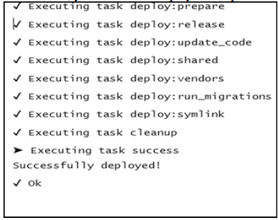

## 部署工具

如果你为你的项目代码在使用一个版本控制系统，例如Git，将发布包推到远程库，你可以使用Git中的`git pull`命令来部署代码到你的生产服务器上，而不用手动上传文件。此外，你可以给自己写一个shell脚本来拉取新的库提交，更新vendors，应用migration等等。

但是，有很多工具可以用来做自动化部署。在本小节中，我们来看一些名叫Deployer的工具。

### 准备

按照官方指南[http://www.yiiframework.com/doc-2.0/guide-start-installation.html](http://www.yiiframework.com/doc-2.0/guide-start-installation.html)的描述，使用Composer包管理器创建一个新的`yii2-app-basic`应用。

### 如何做...

如果你有一个共享的远程库，你可以使用它用来部署源。

#### 第一步：准备远程host

1. 到你的远程host，安装Composer以及`asset-plugin`：

```
global require 'fxp/composer-asset-plugin:~1.1.1'
```


2. 使用`ssh-kengen`生成SSH秘钥。
3. 添加`~/.ssh/id_rsa.pub`文件内容到你的库设置页面中（部署SSH秘钥页面），例如Github、Bitbucket或者其它库存储。
4. 尝试游动克隆的库：

```
git clone git@github.com:user/repo.git
```

5. 添加Github地址，以及已知的host列表（如果你的系统问你要的话）。

#### 第二步：准备localhost

1. 在本地全局安装`deploy.phar`：

```
sudo wget http://deployer.org/deployer.phar
sudo mv deployer.phar /usr/local/bin/dep
sudo chmod +x /usr/local/bin/dep
```

2. 使用部署配置添加`deploy.php`文件：

```
<?php
require 'recipe/yii2-app-basic.php';
set('shared_files', [
    'config/db.php',
    'config/params.php',
    'web/index.php',
    'yii',
]);
server('prod', 'site.com', 22) // SSH access to remote server
->user('user')
// ->password(password) // uncomment for authentication by
password
// ->identityFile() // uncomment for authentication by SSH key
->stage('production')
    ->env('deploy_path', '/var/www/project');
set('repository', 'git@github.com:user/repo.git');
```

3. 尝试准备远程项目目录结构：

```
dep deploy:prepare prod
```

#### 第三步：添加远程配置

1. 打开服务器的`/var/www/project`目录。初始化后它有两个子目录：

```
project
├── releases
└── shared
```

2. 在`shared`文件中创建带有私有配置的原始文件：

```
project
    ├── releases
    └── shared
        ├── config
        │   ├── db.php
        │   └── params.php
        ├── web
        │   └── index.php
        └── yii
```

Deployer工具将会在每一个发布的子目录中通过软连接的方式包含这些文件：

在`share/config/db.php`文件中指定你的私有配置：

```
<?php
return [
    'class' => 'yii\db\Connection',
    dsn' => 'mysql:host=localhost;dbname=catalog',
    'username' => 'root',
    'password' => 'root',
    'charset' => 'utf8',
];
```

此外，在`share/config/params.php`中指定它：

```
<?php
return [
    'adminEmail' => 'admin@example.com',
];
```

设置文件`share/web/index.php`的内容：

```
<?php
defined('YII_DEBUG') or define('YII_DEBUG', false);
defined('YII_ENV') or define('YII_ENV', 'prod');
$dir = dirname($_SERVER['SCRIPT_FILENAME']);
require($dir . '/../vendor/autoload.php');
require($dir . '/../vendor/yiisoft/yii2/Yii.php');
$config = require($dir . '/../config/web.php');
(new yii\web\Application($config))->run();
```

此外，设置`share/yii`文件的内容：

```
#!/usr/bin/env php
<?php
defined('YII_DEBUG') or define('YII_DEBUG', false);
defined('YII_ENV') or define('YII_ENV', 'prod');
$dir = dirname($_SERVER['SCRIPT_FILENAME']);
require($dir . '/vendor/autoload.php');
require($dir . '/vendor/yiisoft/yii2/Yii.php');
$config = require($dir. '/config/console.php');
$application = new yii\console\Application($config);
$exitCode = $application->run();
exit($exitCode);
```

**注意**：我们故意使用`dirname($_SERVER['SCRIPT_FILENAME'])`，而不是原始的`__DIR__`常量，因为如果这个文件时软连接的话，`__DIR__`将会返回不正确的值。

注意：如果你使用`yii2-app-advanced`模板，你可以只重定义`config/main-local.php`和`config/params-local.php`文件（backend、frontend、console和common），因为`web/index.php`和`yii`将会自动通过`init`命令生成。

#### 第四步：尝试部署

1. 回到本地，使用`deploy.php`文件，并运行部署命令：

```
dep deploy prod
```



2. 如果成功，你将会看到部署报告：
3. Deployer在你的远程服务器上，创建一个新的发布子目录，并从你的项目到共享的items，以及从`current`目录到当前发布添加软连接：

```
project
├── current -> releases/20160412140556
├── releases
│   └── 20160412140556
│       ├── ...
│       ├── runtime -> /../../shared/runtime
│       ├── web
│       ├── vendor
│       ├── ...
│       └── yii -> /../../shared/yii
└── shared
    ├── config
    │   ├── db.php
    │   └── params.php
    ├── runtime
    ├── web
    │   └── index.php
    └── yii
```

4. 所有这些完成以后，你必须在`project/current/web`目录中设置你的服务器`DocumentRoot`。
5. 如果在部署过程中，发生了一些错误，你可以回滚到先前的发布上：

```
dep rollback prod
```

`current`目录将会定向到你先前的发布文件上。

### 工作原理...

大部分的部署工具都做了同样的任务：

- 创建一个新的发布子目录
- 克隆库文件
- 从项目中制作软连接到共享的目录上，以及到本地配置文件上
- 安装Composer包
- 应用项目migration
- 从服务器的`DocumentRoot`路径上切换软链接到当前发布目录上

Deployer工具为流行的框架都做了预定义。你可以扩展任何已有的例子，或者为你的特殊的例子制作新的。

### 参考

- 欲了解更多关于Deployer的信息，参考[http://deployer.org/docs](http://deployer.org/docs)
- 关于创建SHH秘钥的信息，参考[https://git-scm.com/book/en/v2/Git-on-the-Server-Generating-Your-SSH-Public-Key](https://git-scm.com/book/en/v2/Git-on-the-Server-Generating-Your-SSH-Public-Key)
