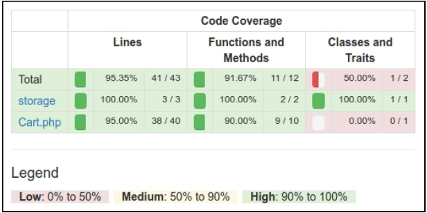

## 使用PHPUnit做单元测试

PHPUnit是最流行的PHP测试框架。配置是使用非常简单。此外，这个框架支持代码覆盖率报告，还有需要额外的插件。上一小节中的Codeception使用PHPUnit来工作，并写单元测试。在这个小节中，我们将会使用PHPUnit测试创建一个购物车扩展示例。

### 准备

按照官方指南[http://www.yiiframework.com/doc-2.0/guide-start-installation.html](http://www.yiiframework.com/doc-2.0/guide-start-installation.html)的描述，使用Composer包管理器创建一个新的`yii2-app-basic`应用。

### 如何做...

首先，我们必须为我们的扩展创建一个新的空目录。

#### 准备扩展结构

1. 首先，为你的扩展创建目录结构：

```
book
└── cart
    ├── src
    └── tests
```

为了将这个扩展做为一个Composer包，准备`book/cart/composer.json`：

```
{
    "name": "book/cart",
    "type": "yii2-extension",
    "require": {
        "yiisoft/yii2": "~2.0"
    },
    "require-dev": {
        "phpunit/phpunit": "4.*"
    },
    "autoload": {
        "psr-4": {
            "book\\cart\\": "src/",
            "book\\cart\\tests\\": "tests/"
        }
    },
    "extra": {
        "asset-installer-paths": {
            "npm-asset-library": "vendor/npm",
            "bower-asset-library": "vendor/bower"
        }
    }
}
```

2. 在`book/cart/.gitignore`文件中添加如下内容：

```
/vendor
/composer.lock
```

3. 添加如下内容到PHPUnit默认配置文件中`book/cart/phpunit.xml.dist`：

```
<?xml version="1.0" encoding="utf-8"?>
<phpunit bootstrap="./tests/bootstrap.php"
         colors="true"
         convertErrorsToExceptions="true"
         convertNoticesToExceptions="true"
         convertWarningsToExceptions="true"
         stopOnFailure="false">
    <testsuites>
        <testsuite name="Test Suite">
            <directory>./tests</directory>
        </testsuite>
    </testsuites>
    <filter>
        <whitelist>
            <directory suffix=".php">./src/</directory>
        </whitelist>
    </filter>
</phpunit>
```

4. 安装扩展的所有依赖：

```
composer install
```

5. 现在我们可以获取如下结构：

```
book
└── cart
    ├── src
    ├── tests
    ├── .gitignore
    ├── composer.json
    ├── phpunit.xml.dist
    └── vendor
```

#### 写扩展代码

为了写扩展代码，执行如下步骤：

1. 在`src`文件夹中，创建`book\cart\Cart`类：

```
<?php
namespace book\cart;
use book\cart\storage\StorageInterface;
use yii\base\Component;
use yii\base\InvalidConfigException;
class Cart extends Component
{
    /**
     * @var StorageInterface
     */
    private $_storage;
    /**
     * @var array
     */
    private $_items;
    public function setStorage($storage)
    {
        if (is_array($storage)) {
            $this->_storage = \Yii::createObject($storage);
        } else {
            $this->_storage = $storage;
        }
    }
    public function add($id, $amount = 1)
    {
        $this->loadItems();
        if (isset($this->_items[$id])) {
            $this->_items[$id] += $amount;
        } else {
            $this->_items[$id] = $amount;
        }
        $this->saveItems();
    }
    public function set($id, $amount)
    {
        $this->loadItems();
        $this->_items[$id] = $amount;
        $this->saveItems();
    }
    public function remove($id)
    {
        $this->loadItems();
        if (isset($this->_items[$id])) {
            unset($this->_items[$id]);
        }
        $this->saveItems();
    }
    public function clear()
    {
        $this->loadItems();
        $this->_items = [];
        $this->saveItems();
    }
    public function getItems()
    {
        $this->loadItems();
        return $this->_items;
    }
    public function getCount()
    {
        $this->loadItems();
        return count($this->_items);
    }
    public function getAmount()
    {
        $this->loadItems();
        return array_sum($this->_items);
    }
    private function loadItems()
    {
        if ($this->_storage === null) {
            throw new InvalidConfigException('Storage must be set');
        }
        if ($this->_items === null) {
            $this->_items = $this->_storage->load();
        }
    }
    private function saveItems()
    {
        $this->_storage->save($this->_items);
    }
}
```

2. 在`src/storage`子文件夹中创建`StorageInterface`接口：

```
<?php
namespace book\cart\storage;
interface StorageInterface
{
    /**
     * @return array
     */
    public function load();
    /**
     * @param array $items
     */
    public function save(array $items);
}
```

以及`SessionStorage`类：

```
<?php
namespace book\cart\storage;
use Yii;
class SessionStorage implements StorageInterface
{
    public $sessionKey = 'cart';
    public function load()
    {
        return Yii::$app->session->get($this->sessionKey, []);
    }
    public function save(array $items)
    {
        Yii::$app->session->set($this->sessionKey, $items);
    }
}}
```

3. 现在我们可以得到如下结构：

```
book
└── cart
    ├── src
    │ ├── storage
    │ │ ├── SessionStorage.php
    │ │ └── StorageInterface.php
    │ └── Cart.php
    ├── tests
    ├── .gitignore
    ├── composer.json
    ├── phpunit.xml.dist
    └── vendor
```

#### 写扩展测试

为了实施这个扩展测试，执行如下步骤：

1. 为PHPUnit添加`book/cart/tests/bootstrap.php`入口：

```
<?php
defined('YII_DEBUG') or define('YII_DEBUG', true);
defined('YII_ENV') or define('YII_ENV', 'test');
require(__DIR__ . '/../vendor/autoload.php');
require(__DIR__ . '/../vendor/yiisoft/yii2/Yii.php');
```

2. 在每一个测试前，通过初始化Yii应用创建一个测试基类，然后在销毁应用时释放：

```
<?php
namespace book\cart\tests;
use yii\di\Container;
use yii\web\Application;
abstract class TestCase extends \PHPUnit_Framework_TestCase
{
    protected function setUp()
    {
        parent::setUp();
        $this->mockApplication();
    }
    protected function tearDown()
    {
        $this->destroyApplication();
        parent::tearDown();
    }
    protected function mockApplication()
    {
        new Application([
            'id' => 'testapp',
            'basePath' => __DIR__,
            'vendorPath' => dirname(__DIR__) . '/vendor',
        ]);
    }
    protected function destroyApplication()
    {
        \Yii::$app = null;
        \Yii::$container = new Container();
    }
}
```

3. 添加一个基于内存的干净的fake类，这个类继承`StorageInterface`接口：

```
<?php
namespace book\cart\tests\storage;
use book\cart\storage\StorageInterface;
class FakeStorage implements StorageInterface
{
    private $items = [];
    public function load()
    {
        return $this->items;
    }
    public function save(array $items)
    {
        $this->items = $items;
    }
}
```

它将会存储一些条目到一个私有变量中，而不是一个真正的session中。它允许我们能独立运行这个测试（不需要真正的存储驱动），并提高测试性能。

4. 添加`CartTest`类：

```
<?php
namespace book\cart\tests;
use book\cart\Cart;
use book\cart\tests\storage\FakeStorage;
class CartTest extends TestCase
{
    /**
     * @var Cart
     */
    private $cart;
    public function setUp()
    {
        parent::setUp();
        $this->cart = new Cart(['storage' => new
        FakeStorage()]);
    }
    public function testEmpty()
    {
        $this->assertEquals([], $this->cart->getItems());
        $this->assertEquals(0, $this->cart->getCount());
        $this->assertEquals(0, $this->cart->getAmount());
    }
    public function testAdd()
    {
        $this->cart->add(5, 3);
        $this->assertEquals([5 => 3], $this->cart->getItems());
        $this->cart->add(7, 14);
        $this->assertEquals([5 => 3, 7 => 14],
            $this->cart->getItems());
        $this->cart->add(5, 10);
        $this->assertEquals([5 => 13, 7 => 14],
            $this->cart->getItems());
    }
    public function testSet()
    {
        $this->cart->add(5, 3);
        $this->cart->add(7, 14);
        $this->cart->set(5, 12);
        $this->assertEquals([5 => 12, 7 => 14],
            $this->cart->getItems());
    }
    public function testRemove()
    {
        $this->cart->add(5, 3);
        $this->cart->remove(5);
        $this->assertEquals([], $this->cart->getItems());
    }
    public function testClear()
    {
        $this->cart->add(5, 3);
        $this->cart->add(7, 14);
        $this->cart->clear();
        $this->assertEquals([], $this->cart->getItems());
    }
    public function testCount()
    {
        $this->cart->add(5, 3);
        $this->assertEquals(1, $this->cart->getCount());
        $this->cart->add(7, 14);
        $this->assertEquals(2, $this->cart->getCount());
    }
    public function testAmount()
    {
        $this->cart->add(5, 3);
        $this->assertEquals(3, $this->cart->getAmount());
        $this->cart->add(7, 14);
        $this->assertEquals(17, $this->cart->getAmount());
    }
    public function testEmptyStorage()
    {
        $cart = new Cart();
        $this->setExpectedException('yii\base\InvalidConfigException');
        $cart->getItems();
    }
}
```

5. 添加一个独立的测试，用于检查`SessionStorage`类：

```
<?php
namespace book\cart\tests\storage;
use book\cart\storage\SessionStorage;
use book\cart\tests\TestCase;
class SessionStorageTest extends TestCase
{
    /**
     * @var SessionStorage
     */
    private $storage;
    public function setUp()
    {
        parent::setUp();
        $this->storage = new SessionStorage(['key' => 'test']);
    }
    public function testEmpty()
    {
        $this->assertEquals([], $this->storage->load());
    }
    public function testStore()
    {
        $this->storage->save($items = [1 => 5, 6 => 12]);
        $this->assertEquals($items, $this->storage->load());
    }
}
```

6. 现在我们可以得到如下结构：

```
book
└── cart
    ├── src
    │ ├── storage
    │ │ ├── SessionStorage.php
    │ │ └── StorageInterface.php
    │ └── Cart.php
    ├── tests
    │ ├── storage
    │ │ ├── FakeStorage.php
    │ │ └── SessionStorageTest.php
    │ ├── bootstrap.php
    │ ├── CartTest.php
    │ └── TestCase.php
    ├── .gitignore
    ├── composer.json
    ├── phpunit.xml.dist
    └── vendor
```

#### 运行测试

在使用`composer install`命令安装所有的依赖时，Composer包管理器安装了`PHPUnit`包到`vendor`文件中，并将可执行的文件`phpunit`放在了`vendor/bin`子文件夹中。

现在我们可以运行如下脚本：

```
cd book/cart
vendor/bin/phpunit
```

我们可以看到如下测试报告：

```
PHPUnit 4.8.26 by Sebastian Bergmann and contributors.
..........
Time: 906 ms, Memory: 11.50MB
OK (10 tests, 16 assertions)
```

每一个点都对应了一次成功的测试。

```
class Cart extends Component
{
    …
    public function remove($id)
    {
        $this->loadItems();
        if (isset($this->_items[$id])) {
            // unset($this->_items[$id]);
        }
        $this->saveItems();
    }
    ...
}
```


```
'components' => [
    // …
    'cart' => [
        'class' => 'book\cart\Cart',
        'storage' => [
            'class' => 'book\cart\storage\SessionStorage',
        ],
    ],
],
```

再次运行测试：

```
PHPUnit 4.8.26 by Sebastian Bergmann and contributors.
...F......
Time: 862 ms, Memory: 11.75MB
There was 1 failure:
1) book\cart\tests\CartTest::testRemove
Failed asserting that two arrays are equal.
--- Expected
+++ Actual
@@ @@
Array (
+ 5 => 3
)
/book/cart/tests/CartTest.php:52
FAILURES!
Tests: 10, Assertions: 16, Failures: 1
```

在这个例子中，我们看到了一次失败（用F标记），以及一次错误报告。

#### 分析代码覆盖率

你必须安装XDebug PHP扩展，[https://xdebug.org](https://xdebug.org)。例如，在Ubuntu或者Debian上，你可以在终端中，输入如下命令：

```
sudo apt-get install php5-xdebug
```

在Windows上，你必须打开`php.ini`文件，并添加自定义代码到PHP安装路径中：

```
[xdebug]
zend_extension_ts=C:/php/ext/php_xdebug.dll
```

或者，如果你使用非线程安全的版本，输入如下内容：

```
[xdebug]
zend_extension=C:/php/ext/php_xdebug.dll
```

安装过XDebug以后，使用`--coverage-html`标志再次运行测试，并指定一个报告路径：

```
vendor/bin/phpunit --coverage-html tests/_output
```

在浏览器中打开`tests/_output/index.html`，你将会看到每一个路径和类的一个明确的覆盖率报告：



你可以点击任何类，并分析代码的哪一行在测试期间还没有被执行。例如，打开`Cart`类报告：


在我们的例子中，我们忘记测试从数组配置中创建storage。

#### 组件的使用

在Packagist上发布扩展后，我们可以安装一个one-to-any项目：

```
composer require book/cart
```

此外，在应用的配置文件中激活组件：

```
'components' => [
    // …
    'cart' => [
        'class' => 'book\cart\Cart',
        'storage' => [
            'class' => 'book\cart\storage\SessionStorage',
        ],
    ],
],
```

另外一种方法，不需要在Packagist上发布扩展，我们必须设置`@book` alias，从而激活正确的类自动加载：

```
$config = [
    'id' => 'basic',
    'basePath' => dirname(__DIR__),
    'bootstrap' => ['log'],
    'aliases' => [
        '@book' => dirname(__DIR__) . '/book',
    ],
    'components' => [
        'cart' => [
            'class' => 'book\cart\Cart',
            'storage' => [
            'class' => 'book\cart\storage\SessionStorage',
            ],
        ],
        // ...
    ],
]
```

无论如何，我们可以在我们的项目中以`Yii::$app->cart`组件的方式使用它：

### 工作原理...

在创建我们自己的测试前，你必须创建一个子目录，并在你的项目的根目录中添加`phpinit.xml`或者`phpunit.xml.dist`文件：

```
<?xml version="1.0" encoding="utf-8"?>
<phpunit bootstrap="./tests/bootstrap.php"
         colors="true"
         convertErrorsToExceptions="true"
         convertNoticesToExceptions="true"
         convertWarningsToExceptions="true"
         stopOnFailure="false">
    <testsuites>
        <testsuite name="Test Suite">
            <directory>./tests</directory>
        </testsuite>
    </testsuites>
    <filter>
        <whitelist>
            <directory suffix=".php">./src/</directory>
        </whitelist>
    </filter>
</phpunit>
```

如果第二个文件在工作目录中不存在，PHPUnit从第二个文件中加载配置。此外，你可以通过创建`bootstrap.php`文件来初始化autoloader和你框架的环境：

```
<?php
defined('YII_DEBUG') or define('YII_DEBUG', true);
defined('YII_ENV') or define('YII_ENV', 'test');
require(__DIR__ . '/../vendor/autoload.php');
require(__DIR__ . '/../vendor/yiisoft/yii2/Yii.php');
```

最后，你可以通过Composer安装PHPUnit（局部或者全局），并在有XML配置文件的目录中使用`phpunit`控制台命令。

PHPUnit扫描测试文件，并找到一`*Test.php`为后缀的文件。所有的测试类必须继承`PHPUnit_Framework_TestCase`类，并包含以`test*`为前缀的公共方法：

```
class MyTest extends TestCase
{
    public function testSomeFunction()
    {
        $this->assertTrue(true);
    }
}
```

在你的测试中，你可以用任何已有的`assert*`方法：

```
$this->assertEqual('Alex', $model->name);
$this->assertTrue($model->validate());
$this->assertFalse($model->save());
$this->assertCount(3, $items);
$this->assertArrayHasKey('username', $model->getErrors());
$this->assertNotNull($model->author);
$this->assertInstanceOf('app\models\User', $model->author);
```

此外，你可以复写`setUp()`或者`tearDown()`方法，用来添加表达式，它将在每一个测试方法之前或者之后运行。

例如，你可以通过重新初始化Yii应用定义自己的基类`TestCase`：

```
<?php
namespace book\cart\tests;
use yii\di\Container;
use yii\web\Application;
abstract class TestCase extends \PHPUnit_Framework_TestCase
{
    protected function setUp()
    {
        parent::setUp();
        $this->mockApplication();
    }
    protected function tearDown()
    {
        $this->destroyApplication();
        parent::tearDown();
    }
    protected function mockApplication()
    {
        new Application([
            'id' => 'testapp',
            'basePath' => __DIR__,
            'vendorPath' => dirname(__DIR__) . '/vendor',
        ]);
    }
    protected function destroyApplication()
    {
        \Yii::$app = null;
        \Yii::$container = new Container();
    }
}
```

现在你可以在你的子类中扩展这个类。你的`test`方法在会在一个自己的应用实例中运行。它会帮助你避免副作用，并创建独立了测试。

#### 注意

Yii 2.0.\*使用旧版的PHPUnit 4.\*，用于兼容PHP5.4。

### 参考

- 所有关于PHPUnit使用方法的信息，参考官方文档[https://phpunit.de/manual/current/en/index.html](https://phpunit.de/manual/current/en/index.html)
- *使用Codeception测试应用*小节
