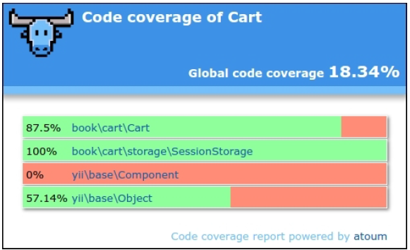

## 使用Atoum测试

除了PHPUnit和Codeception，Atoum是一个简单的单元测试框架。你可以使用这个框架，用于测试你的扩展，或者测试你应用的代码。

### 准备

为新的项目创建一个空文件夹。

### 如何做...

在这个小节中，我们将会创建一个演示，使用Atoum测试购物车扩展。

#### 准备扩展框架

1. 首先，为你的扩展创建目录结构：

```
book
└── cart
    ├── src
    └── tests
```

2. 作为一个composer包使用扩展。准备`book/cart/composer.json`文件：

```
{
    "name": "book/cart",
    "type": "yii2-extension",
    "require": {
        "yiisoft/yii2": "~2.0"
    },
    "require-dev": {
        "atoum/atoum": "^2.7"
    },
    "autoload": {
        "psr-4": {
            "book\\cart\\": "src/",
            "book\\cart\\tests\\": "tests/"
        }
    },
    "extra": {
        "asset-installer-paths": {
            "npm-asset-library": "vendor/npm",
            "bower-asset-library": "vendor/bower"
        }
    }
}
```

3. 添加如下内容到`book/cart/.gitignore`文件：

```
/vendor
/composer.lock
```

4. 安装扩展所有的依赖：

```
composer install
```

5. 现在我们将会得到如下结构：

```
book
└── cart
    ├── src
    ├── tests
    ├── .gitignore
    ├── composer.json
    ├── phpunit.xml.dist
    └── vendor
```

#### 写扩展代码

从*使用PHPUnit作单元测试*小节复制`Cart`、`StorageInterface`和`SessionStorage`类。

最后，我们可以得到如下结构：

```
book
    └── cart
    ├── src
    │   ├── storage
    │   │   ├── SessionStorage.php
    │   │   └── StorageInterface.php
    │   └── Cart.php
    ├── tests
    ├── .gitignore
    ├── composer.json
    └── vendor
```

#### 写扩展测试

1. 添加`book/cart/tests/bootstrap.php`入口脚本：

```
<?php
defined('YII_DEBUG') or define('YII_DEBUG', true);
defined('YII_ENV') or define('YII_ENV', 'test');
require(__DIR__ . '/../vendor/autoload.php');
require(__DIR__ . '/../vendor/yiisoft/yii2/Yii.php');
```

2. 在每一个测试前，通过初始化Yii应用创建一个测试基类，然后在销毁它：

```
<?php
namespace book\cart\tests;
use yii\di\Container;
use yii\console\Application;
use mageekguy\atoum\test;
abstract class TestCase extends test
{
    public function beforeTestMethod($method)
    {
        parent::beforeTestMethod($method);
        $this->mockApplication();
    }
    public function afterTestMethod($method)
    {
        $this->destroyApplication();
        parent::afterTestMethod($method);
    }
    protected function mockApplication()
    {
        new Application([
            'id' => 'testapp',
            'basePath' => __DIR__,
            'vendorPath' => dirname(__DIR__) . '/vendor',
            'components' => [
                'session' => [
                    'class' => 'yii\web\Session',
                ],
            ]
        ]);
    }
    protected function destroyApplication()
    {
        \Yii::$app = null;
        \Yii::$container = new Container();
    }
}
```

3. 添加一个基于内存的干净的fake类，并继承`StorageInterface`接口：

```
<?php
namespace book\cart\tests;
use book\cart\storage\StorageInterface;
class FakeStorage implements StorageInterface
{
    private $items = [];
    public function load()
    {
        return $this->items;
    }
    public function save(array $items)
    {
        $this->items = $items;
    }
}
```

它会存储条目到一个私有变量中，而不是使用真正的session。它允许我们独立运行测试（不适用真正的存储驱动），并提升测试性能。

4. 添加`Cart`测试类：

```
<?php
namespace book\cart\tests\units;
use book\cart\tests\FakeStorage;
use book\cart\Cart as TestedCart;
use book\cart\tests\TestCase;
class Cart extends TestCase
{
    /**
     * @var TestedCart
     */
    private $cart;
    public function beforeTestMethod($method)
    {
        parent::beforeTestMethod($method);
        $this->cart = new TestedCart(['storage' => new
        FakeStorage()]);
    }
    public function testEmpty()
    {
        $this->array($this->cart->getItems())->isEqualTo([]);
        $this->integer($this->cart->getCount())->isEqualTo(0);
        $this->integer($this->cart->getAmount())->isEqualTo(0);
    }
    public function testAdd()
    {
        $this->cart->add(5, 3);
        $this->array($this->cart->getItems())->isEqualTo([5 =>
            3]);
        $this->cart->add(7, 14);
        $this->array($this->cart->getItems())->isEqualTo([5 =>
            3, 7 => 14]);
        $this->cart->add(5, 10);
        $this->array($this->cart->getItems())->isEqualTo([5 =>
            13, 7 => 14]);
    }
    public function testSet()
    {
        $this->cart->add(5, 3);
        $this->cart->add(7, 14);
        $this->cart->set(5, 12);
        $this->array($this->cart->getItems())->isEqualTo([5 =>
            12, 7 => 14]);
    }
    public function testRemove()
    {
        $this->cart->add(5, 3);
        $this->cart->remove(5);
        $this->array($this->cart->getItems())->isEqualTo([]);
    }
    public function testClear()
    {
        $this->cart->add(5, 3);
        $this->cart->add(7, 14);
        $this->cart->clear();
        $this->array($this->cart->getItems())->isEqualTo([]);
    }
    public function testCount()
    {
        $this->cart->add(5, 3);
        $this->integer($this->cart->getCount())->isEqualTo(1);
        $this->cart->add(7, 14);
        $this->integer($this->cart->getCount())->isEqualTo(2);
    }
    public function testAmount()
    {
        $this->cart->add(5, 3);
        $this->integer($this->cart->getAmount())->isEqualTo(3);
        $this->cart->add(7, 14);
        $this->integer($this->cart->getAmount())->isEqualTo(17);
    }
    public function testEmptyStorage()
    {
        $cart = new TestedCart();
        $this->exception(function () use ($cart) {
            $cart->getItems();
        })->hasMessage('Storage must be set');
    }
}
```

5. 添加一个独立的测试，用于检查`SessionStorage`类：

```
<?php
namespace book\cart\tests\units\storage;
use book\cart\storage\SessionStorage as TestedStorage;
use book\cart\tests\TestCase;
class SessionStorage extends TestCase
{
    /**
     * @var TestedStorage
     */
    private $storage;
    public function beforeTestMethod($method)
    {
        parent::beforeTestMethod($method);
        $this->storage = new TestedStorage(['key' => 'test']);
    }
    public function testEmpty()
    {
        $this
            ->given($storage = $this->storage)
            ->then
            ->array($storage->load())
            ->isEqualTo([]);
    }
    public function testStore()
    {
        $this
            ->given($storage = $this->storage)
            ->and($storage->save($items = [1 => 5, 6 => 12]))
            ->then
            ->array($this->storage->load())
            ->isEqualTo($items)
        ;
    }
}
```

6. 现在我们将会得到如下结构：

```
book
└── cart
    ├── src
    │   ├── storage
    │   │   ├── SessionStorage.php
    │   │   └── StorageInterface.php
    │   └── Cart.php
    ├── tests
    │   ├── units
    │   │   ├── storage
    │   │   │   └── SessionStorage.php
    │   │   └── Cart.php
    │   ├── bootstrap.php
    │   ├── FakeStorage.php
    │   └── TestCase.php
    ├── .gitignore
    ├── composer.json
    └── vendor
```

#### 运行测试

在使用`composer install`命令安装所有的依赖期间，Composer包管理器安装`Atoum`包到`vendor`目录中，并将可执行文件`atoum`放在`vendor/bin`子文件夹中。

现在我们可以运行如下脚本：

```
cd book/cart
vendor/bin/atoum -d tests/units -bf tests/bootstrap.php
```

此外，我们可以看到如下测试报告：

```
> atoum path: /book/cart/vendor/atoum/atoum/vendor/bin/atoum
> atoum version: 2.7.0
> atoum path: /book/cart/vendor/atoum/atoum/vendor/bin/atoum
> atoum version: 2.7.0
> PHP path: /usr/bin/php5
> PHP version:
=> PHP 5.5.9-1ubuntu4.16 (cli)
> book\cart\tests\units\Cart...
[SSSSSSSS__________________________________________________][8/8]
=> Test duration: 1.13 seconds.
=> Memory usage: 3.75 Mb.
> book\cart\tests\units\storage\SessionStorage...
[SS________________________________________________________][2/2]
=> Test duration: 0.03 second.
=> Memory usage: 1.00 Mb.
> Total tests duration: 1.15 seconds.
> Total tests memory usage: 4.75 Mb.
> Code coverage value: 16.16%
```

每一个`S`符号表示一次成功的测试。

尝试通过注释`unset`操作故意破坏cart：

```
class Cart extends Component
{
    ...
    public function remove($id)
    {
        $this->loadItems();
        if (isset($this->_items[$id])) {
            // unset($this->_items[$id]);
        }
        $this->saveItems();
    }
    ...
}
```

再次运行测试：

```
> atoum version: 2.7.0
> PHP path: /usr/bin/php5
> PHP version:
=> PHP 5.5.9-1ubuntu4.16 (cli)
book\cart\tests\units\Cart...
[SSFSSSSS__________________________________________________][8/8]
=> Test duration: 1.09 seconds.
=> Memory usage: 3.25 Mb.
> book\cart\tests\units\storage\SessionStorage...
[SS________________________________________________________][2/2]
=> Test duration: 0.02 second.
=> Memory usage: 1.00 Mb.
...
Failure (2 tests, 10/10 methods, 0 void method, 0 skipped method, 0
uncompleted method, 1 failure, 0 error, 0 exception)!
> There is 1 failure:
=> book\cart\tests\units\Cart::testRemove():
In file /book/cart/tests/units/Cart.php on line 53, mageekguy\atoum\
asserters\phpArray() failed: array(1) is not equal to array(0)
-Expected
+Actual
@@ -1 +1,3 @@
-array(0) {
+array(1) {
+ [5] =>
+ int(3)
```

在这个例子中，我们看到一次错误（用`F`表示），以及一个错误报告。

#### 分析代码覆盖率

你必须安装XDebug PHP扩展，[https://xdebug.org](https://xdebug.org)。例如，在Ubuntu或者Debian上，你可以在终端中输入如下命令：

```
sudo apt-get install php5-xdebug
```

在Windows上，你需要打开`php.ini`文件，并添加自定义代码路径到你的PHP安装目录下：

```
[xdebug]
zend_extension_ts=C:/php/ext/php_xdebug.dll
```

或者，如果你使用非线程安全的版本，输入如下：

```
[xdebug]
zend_extension=C:/php/ext/php_xdebug.dll
```

安装过XDebug以后，创建`book/cart/coverage.php`配置文件，并添加覆盖率报告选项：

```
<?php
use \mageekguy\atoum;
/** @var atoum\scripts\runner $script */
$report = $script->addDefaultReport();
$coverageField = new atoum\report\fields\runner\coverage\
html('Cart', __DIR__ . '/tests/coverage');
$report->addField($coverageField);
```

现在使用`-c`选项来使用这个配置再次运行测试：

```
vendor/bin/atoum -d tests/units -bf tests/bootstrap.php -c coverage.php
```

在运行这个测试以后，在浏览器中打开`tests/coverage/index.html`。你将会看到每一个目录和类的一个明确的覆盖率报告：



你可以点击任何类，并分析代码的哪些行在测试过程中还没有被执行。

### 工作原理...

Atoum测试框架支持行为驱动设计（BDD）语法流，如下：

```
public function testSome()
{
    $this
        ->given($cart = new TestedCart())
        ->and($cart->add(5, 13))
        ->then
        ->sizeof($cart->getItems())
        ->isEqualTo(1)
        ->array($cart->getItems())
        ->isEqualTo([5 => 3])
        ->integer($cart->getCount())
        ->isEqualTo(1)
        ->integer($cart->getAmount())
        ->isEqualTo(3);
}
```

但是，你可以使用常用的类PHPUnit语法来写单元测试：

```
public function testSome()
{
    $cart = new TestedCart();
    $cart->add(5, 3);
    $this->array($cart->getItems())->isEqualTo([5 => 3])
        ->integer($cart->getCount())->isEqualTo(1)
        ->integer($cart->getAmount())->isEqualTo(3);
}
```

Atoum也支持代码覆盖率报告，用于分析测试质量。

### 参考

- 欲了解更多关于Atoum的信息，参考[http://docs.atoum.org/en/latest/](http://docs.atoum.org/en/latest/)
- 源代码和使用例子，参考[https://github.com/atoum/atoum](https://github.com/atoum/atoum)
- *使用PHPUnit做单元测试*小节