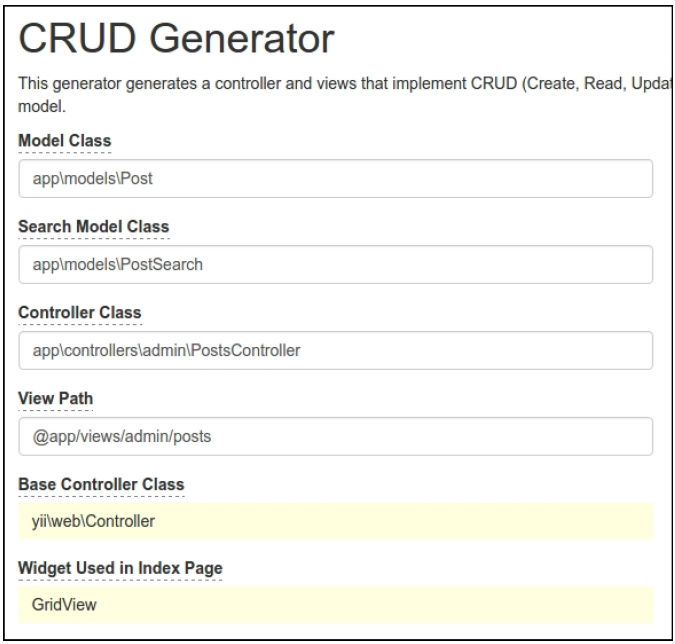
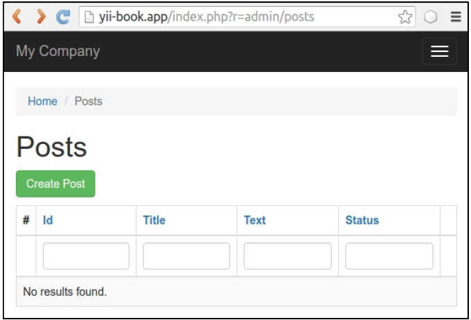
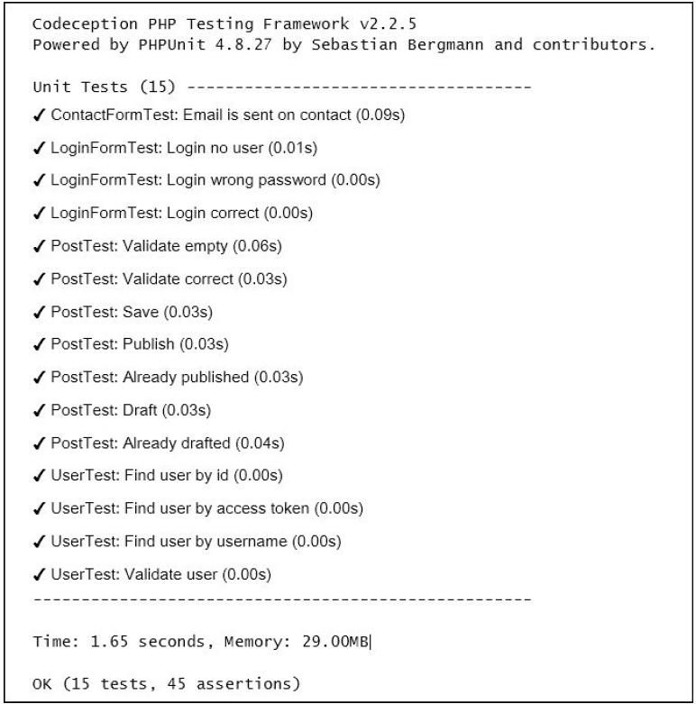
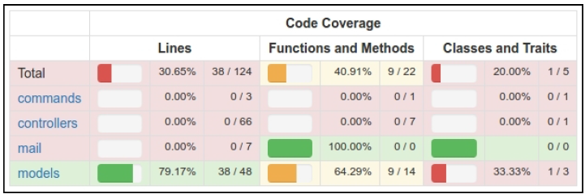
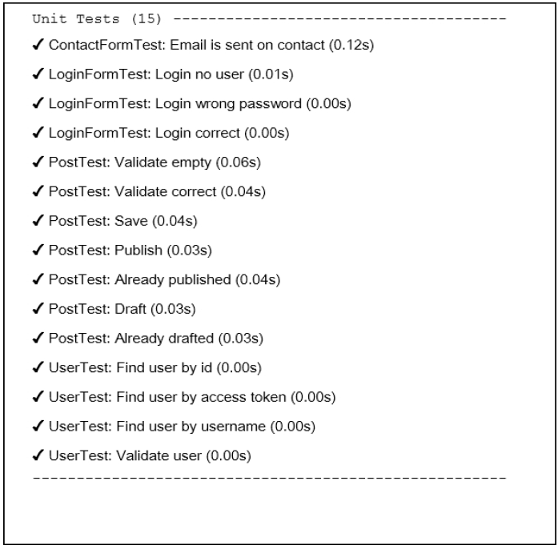
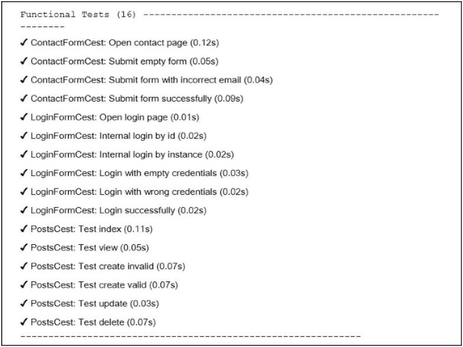
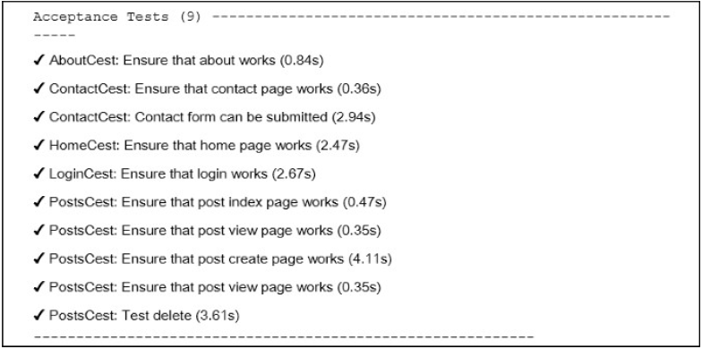
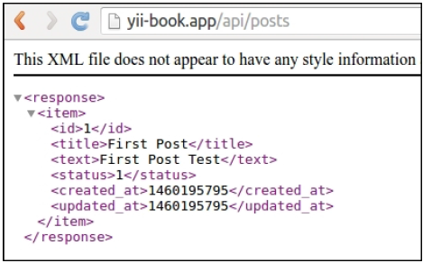
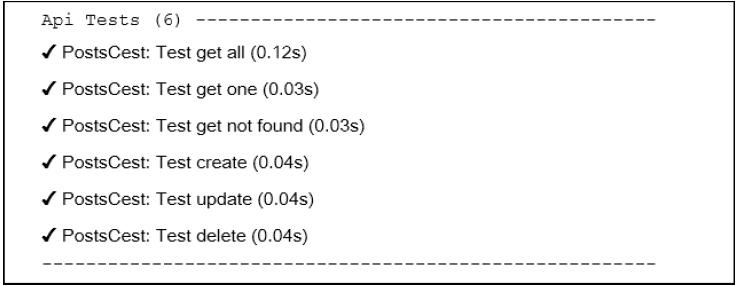

# 第十一章 测试

在本章中，我们将会讨论如下话题：

- 使用Codeception测试应用
- 使用PHPUnit做单元测试
- 使用Atoum做单元测试
- 使用Behat做单元测试

## 介绍

在本章中，你将会学习如何如何使用最好技术用于测试，例如Codeception，PHPUnit，Atoum和Behat。你将会看到如何写简单的测试和如何在你的应用中避免拟合错误。

## 使用Codeception测试应用

默认情况下，基础和高级Yii2应用skeletons使用*Codeception*作为一个测试框架。Codeception支持写单元，函数，以及接受box之外的测试。对于单元测试，它使用PHPUnit测试框架，它将被在下个小节中讨论。

### 准备

1. 按照官方指南[http://www.yiiframework.com/doc-2.0/guide-start-installation.html](http://www.yiiframework.com/doc-2.0/guide-start-installation.html)的描述，使用Composer包管理器创建一个新`yii2-app-basic`的应用。

**注意**：


```
<?php
use yii\db\Migration;
class m160309_070856_create_post extends Migration
{
    public function up()
    {
        $this->createTable('{{%post}}', [
            'id' => $this->primaryKey(),
            'title' => $this->string()->notNull(),
            'text' => $this->text()->notNull(),
            'status' => $this->smallInteger()->notNull()->defaultValue(0),
        ]);
    }
    public function down()
    {
        $this->dropTable('{{%post}}');
    }
}
```


```
<?php
namespace app\models;
use Yii;
use yii\db\ActiveRecord;
/**
 * @property integer $id
 * @property string $title
 * @property string $text
 * @property integer $status
 * @property integer $created_at
 * @property integer $updated_at
 */
class Post extends ActiveRecord
{
    const STATUS_DRAFT = 0;
    const STATUS_ACTIVE = 1;
    public static function tableName()
    {
        return '{{%post}}';
    }
    public function rules()
    {
        return [
            [['title', 'text'], 'required'],
            [['text'], 'string'],
            ['status', 'in', 'range' => [self::STATUS_DRAFT,
                self::STATUS_ACTIVE]],
            ['status', 'default', 'value' =>
                self::STATUS_DRAFT],
            [['title'], 'string', 'max' => 255],
        ];
    }
    public function behaviors()
    {
        return [
            TimestampBehavior::className(),
        ];
    }
    public static function getStatusList()
    {
        return [
            self::STATUS_DRAFT => 'Draft',
            self::STATUS_ACTIVE => 'Active',
        ];
    }
    public function publish()
    {
        if ($this->status == self::STATUS_ACTIVE) {
            throw new \DomainException('Post is already published.');
        }
        $this->status = self::STATUS_ACTIVE;
    }
    public function draft()
    {
        if ($this->status == self::STATUS_DRAFT) {
            throw new \DomainException('Post is already drafted.');
        }
        $this->status = self::STATUS_DRAFT;
    }
}
```



```
<div class="post-form">
    <?php $form = ActiveForm::begin(); ?>
    <?= $form->field($model, 'title')->textInput(['maxlength'
    => true]) ?>
    <?= $form->field($model, 'text')->textarea(['rows' => 6]) ?>
<?= $form->field($model, 'status')->dropDownList(Post::getStatusList()) ?>
    <div class="form-group">
        <?= Html::submitButton($model->isNewRecord ? 'Create' :
            'Update', [
            'class' => $model->isNewRecord ? 'btn btn-success' : 'btn btn-primary',
            'name' => 'submit-button',
        ]) ?>
    </div>
    <?php ActiveForm::end(); ?>
</div>
```






```
coverage:
    enabled: true
    whitelist:
        include:
            - models/*
            - controllers/*
            - commands/*
            - mail/*
    blacklist:
        include:
            - assets/*
            - config/*
            - runtime/*
            - vendor/*
            - views/*
            - web/*
            - tests/*
```














