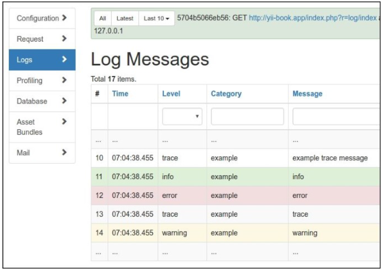
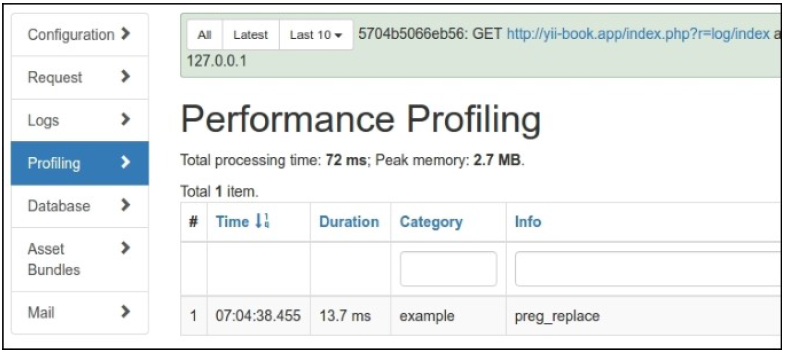
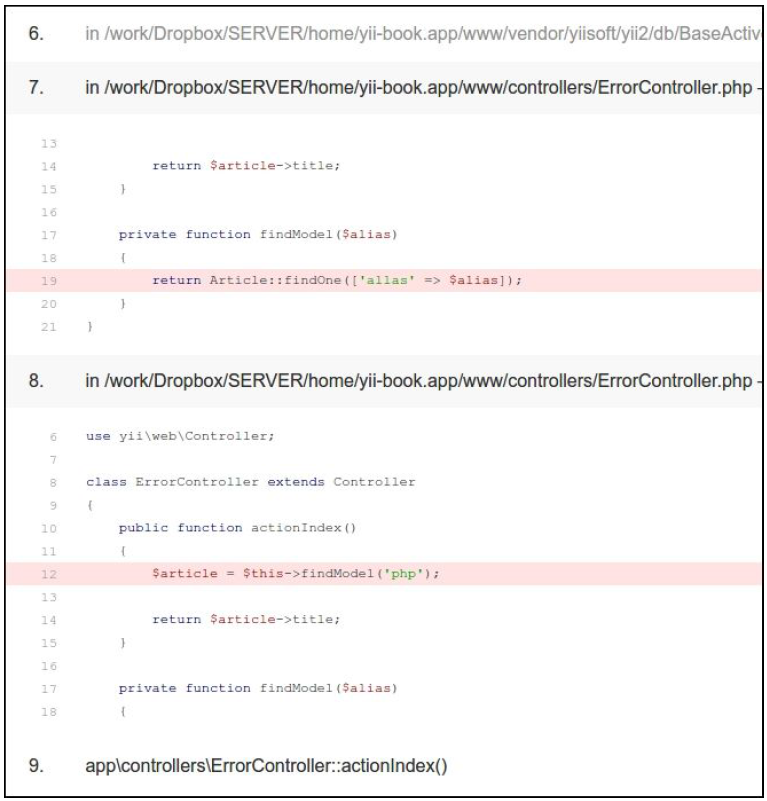
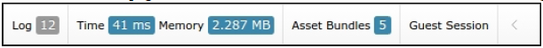
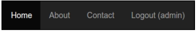
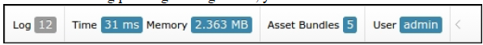
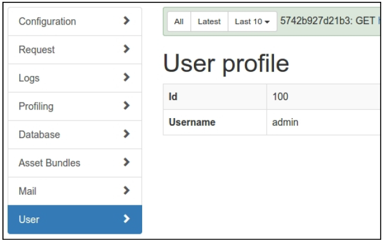

# 第十二章 调试，日志和错误处理

在本章中，我们将会讨论如下话题：

- 使用不同的日志路由
- 分析Yii错误堆栈踪迹
- 打日志并使用上下文信息
- 展示自定义错误
- 为调试扩展自定义面板

## 介绍

如果应用比较复杂，创建一个没有bug的应用几乎是不可能的，所以开发者必须检测错误并能迅速的处理他们。Yii有一套实用的特性，可以处理日志和错误。而且，在调试模式下，如果发生错误，Yii可以给出堆栈踪迹。实用它，你可以非常迅速的修复错误。

在本章中，我们将会回顾日志，分析异常的堆栈踪迹，并实现自己的错误处理。

## 使用不同的日志路由

当你没有机会调试它的时候，打日志对于理解应用真正做了些什么非常关键。不管你是否相信，尽管你能100%确信你的应用将会按照你期望的执行，在生产环境中，它可以做很多你意识不到的事情。这没关系，因为没有人可以注意到任何事情。因此，如果我们期望不寻常的行为，我们需要立刻知道并有足够的信息来重现它。这就是日志派上用场的原因。

Yii允许一个开发者不止可以输出日志消息，也能根据消息的级别和种类进行不同的处理。例如，你可以将一条消息写入到数据库，发送一个电子邮件或者将它展示到浏览器中。

在本小节中，我们将会以更明智的方法处理日志消息：最重要的信息通过邮件发送，不太重要的信息会被保存到的文件A和B中，profiling将会被路由到Firebug中。此外，在开发模式下，所有的消息和profiling信息将会展示在屏幕上。

### 准备

按照官方指南[http://www.yiiframework.com/doc-2.0/guide-start-installation.html](http://www.yiiframework.com/doc-2.0/guide-start-installation.html)的描述，使用Composer包管理器创建一个新的应用。

### 如何做...

执行如下步骤：

1. 使用`config/web.php`配置日志：

```
'components' => [
    'log' => [
        'traceLevel' => 0,
        'targets' => [
            [
                'class' => 'yii\log\EmailTarget',
                'categories' => ['example'],
                'levels' => ['error'],
                'message' => [
                    'from' => ['log@example.com'],
                    'to' => ['developer1@example.com',
                        'developer2@example.com'],
                    'subject' => 'Log message',
                ],
            ],
            [
                'class' => 'yii\log\FileTarget',
                'levels' => ['error'],
                'logFile' => '@runtime/logs/error.log',
            ],
            [
                'class' => 'yii\log\FileTarget',
                'levels' => ['warning'],
                'logFile' => '@runtime/logs/warning.log',
            ],
            [
                'class' => 'yii\log\FileTarget',
                'levels' => ['info'],
                'logFile' => '@runtime/logs/info.log',
            ],
        ],
    ],
    'db' => require(__DIR__ . '/db.php'),
],
```

2. 现在，我们会在`protected/controllers/LogController.php`中生成一些消息：

```
<?php
namespace app\controllers;
use yii\web\Controller;
use Yii;
class LogController extends Controller
{
    public function actionIndex()
    {
        Yii::trace('example trace message', 'example');
        Yii::info('info', 'example');
        Yii::error('error', 'example');
        Yii::trace('trace', 'example');
        Yii::warning('warning','example');
        Yii::beginProfile('preg_replace', 'example');
        for($i=0;$i<10000;$i++){
            preg_replace('~^[ a-z]+~', '', 'test it');
        }
        Yii::endProfile('preg_replace', 'example');
        return $this->render('index');
    }
}
```

以及视图`views/log/index.php`：

```
<div class="log-index">
    <h1>Log</h1>
</div>
```

3. 现在多次运行先前的动作。在屏幕上，你应该看到`Log`头和一个有日志消息数字的调试面板：


4. 如果你点击**17**，你将会看到一个web日志，如下图所示：



5. 一条日志包含我们打的所有信息，堆栈踪迹、时间戳、级别和分类。
6. 现在打开**Profiling**页面。你应该能看到profiling消息，如下截图所示：



profiling信息展示了我们代码块的所有执行时长。

7. 因为我们刚刚修改了日志文件的名称，而不是路径，你应该能在`runtime/logs`中找到日志文件`error.log`、`warning.log`和`info.log`。
8. 打开文件你将会看到如下消息：

```
2016-03-06 07:28:35 [127.0.0.1][-][-][error][example] error
...
2016-03-06 07:28:35 [127.0.0.1][-][-][warning][example] warning
...
2016-03-06 07:28:35 [127.0.0.1][-][-][info][example] info
```

### 工作原理...

当使用`Yii::erorr`、`Yii::warning`、`Yii::info`或者`Yii::trace`打日志时，Yii将它传递给了日志路由。

依赖于如何配置，它会将消息发送给一个或多个目标，例如，通过电子邮件发送错误信息、将调试信息写入到文件A中、将警告信息写入到文件B中。

`yii\log\Dispatcher`类的对象通常被附加在一个名叫log的应用组件上。因此，为了配置它，我们应该在配置文件组件部分设置它的属性。这里唯一可配的属性是targets，它包含了一组日志路由和他们的配置。

我们已经定义了四个日志路由。这里回顾一下：

```
[
    'class' => 'yii\log\EmailTarget',
    'categories' => ['example'],
    'levels' => ['error'],
// 'mailer' => 'mailer',
    'message' => [
        'from' => ['log@example.com'],
        'to' => ['developer1@example.com', 'developer2@example.com'],
        'subject' => 'Log error',
    ],
],
```

`EmailTarget`默认通过`Yii::$app->mailer`组件发送一封电子邮件来发送日志消息。我们将类别限制为example，并将级别限制为error。电子邮件将会从`log@example.com`发送给两个开发者，且主题是`Log error`：

```
[
    'class' => 'yii\log\FileTarget',
    'levels' => [warning],
    'logFile' => '@runtime/logs/warning.log',
],
```

`FileTarget`将错误消息发送到一个指定的文件。我们将消息级别限制为warning，并使用一个名叫`warning.log`的文件。同样我们将info级别的消息存放在`Info.log`文件中。

此外，我们可以使用`yii\log\SyslogTarget`将消息写到Unix `/var/log/syslog`系统文件中，或者使用`yii\log\DbTarget`将消息写入到数据库中。对于第二种情况，你必须应用他们的migration：

```
./yii migrate --migrationPath=@yii/log/migrations/
```

### 更多...

关于Yii打日志有很多有趣的东西，在接下来的部分中进行讨论。

#### Yii::trace和Yii::getLogger()->log

`Yii::trace`是对`Yii::log`的封装：

```
public static function trace($message, $category = 'application')
{
    if (YII_DEBUG) {
        static::getLogger()->log($message, Logger::LEVEL_TRACE, $category);
    }
}
```

因此，如果Yii在`debug`模式下，`Yii::trace`使用trace级别来打日志。

#### Yii::beginProfile和Yii::endProfile

这些方法被用于测量应用中部分代码的执行时间。在我们的`LogController`中，我们测量了`preg_replace`执行10000次所用的时间：

```
Yii::beginProfile('preg_replace', 'example');
for($i=0;$i<10000;$i++){
    preg_replace('~^[ a-z]+~', '', 'test it');
}
Yii::endProfile('preg_replace', 'example');
```

`Yii::beginProfile`标记用于profiling的代码块开头。我们必须为每一个代码块设置一个唯一的token，以及指定一个可选的分类：

```
public static function beginProfile($token, $category = 'application') { … }
```

`Yii::endProfile`可以匹配到先前调用有相同的分类名的`beginProfile`：

```
public static function endProfile($token, $category = 'application') { … }
```

`begin-`和`end-`调用也必须被正确的嵌套。

#### 立即打日志消息

默认情况下，Yii会将所有的日志消息存放在内存中，知道应用终止。这是为了性能考虑，并且一般都能运行良好。

但是，如果一个控制台应用需要长时间运行，日志消息将不会被立刻写出。为了确保你的消息能在任何时候都被打印出来，你可以使用`Yii::$app->getLogger()>flush(true)`显式刷新，或者为你的控制台应用配置修改`flushInterval`和`exportInterval`：

```
'components' => [
    'log' => [
        'flushInterval' => 1,
        'targets' =>[
            [
                'class' => 'yii\log\FileTarget',
                'exportInterval' => 1,
            ],
        ], 
    ],
],
```

### 参考

- 欲了解更多关于打日志的信息，参考[http://www.yiiframework.com/doc-2.0/guideruntime-logging.html](http://www.yiiframework.com/doc-2.0/guideruntime-logging.html)
- *日志和使用上下文信息*小节

## 分析Yii错误堆栈踪迹

当发生错误时，Yii可以展示错误信息以及错误堆栈踪迹。当我们需要知道究竟是什么原因导致的错误时，堆栈踪迹非常有用。

### 准备

1. 按照官方指南[http://www.yiiframework.com/doc-2.0/guide-start-installation.html](http://www.yiiframework.com/doc-2.0/guide-start-installation.html)的描述，使用Composer包管理器创建一个新的应用。
2. 配置一个数据库，并使用如下migration导入：

```
<?php
use yii\db\Migration;
class m160308_093234_create_article_table extends Migration
{
    public function up()
    {
        $this->createTable('{{%article}}', [
            'id' => $this->primaryKey(),
            'alias' => $this->string()->notNull(),
            'title' => $this->string()->notNull(),
            'text' => $this->text()->notNull(),
        ]);
    }
    public function down()
    {
        $this->dropTable('{{%article}}');
    }
}
```

3. 使用Yii生成一个`Article`模型。

### 如何做...

执行如下步骤：

1. 现在我们需要创建一些代码。创建`protected/controllers/ErrorController.php`：

```
<?php
namespace app\controllers;
use app\models\Article;
use yii\web\Controller;
class ErrorController extends Controller
{
    public function actionIndex()
    {
        $article = $this->findModel('php');
        return $article->title;
    }
    private function findModel($alias)
    {
        return Article::findOne(['allas' => $alias]);
    }
}
```

2. 运行过先前的动作以后，我们应该能得到如下错误：


3. 而且，堆栈踪迹展示了如下错误：



### 工作原理...

从错误消息中，我们知道在数据库中，我们没有列的别称，但是我们已经再代码别的地方用到了它。在我们的例子中，这很容易通过搜索所有的文件来找到，但是在一个大项目中，一个列可以存放在一个变量中。而且，we have everything to fix an error without leaving the screen where the stack trace is displayed。我们只是需要小心的读它。

堆栈踪迹逆序地展示了一个调用链条，以产生错误的一个开始。一般来说，我们不需要看所有的踪迹来了解发生了什么。这个框架代码本身已经充分测试了，所以发生错误的可能性是比较小的。这就是为什么Yii展示应用的踪迹是打开的，而框架的踪迹是折叠的。

因此，我们使用第一个展开的部分，并查找别称。找到以后，我们可以立刻告诉你它被用于`ErrorController.php`的第19行中。

### 参考

- 欲了解错误处理的信息，参考[http://www.yiiframework.com/doc-2.0/guide-runtime-handling-errors.html](http://www.yiiframework.com/doc-2.0/guide-runtime-handling-errors.html)
- *日志和使用上下文信息*小节

## 日志和使用上下文信息

有时，一个错误信息不足以修复一个错误。例如，如果你使用最佳实践，并且使用所有可能的错误来开发和测试一个应用，你可以得到一个错误信息。但是，没有执行的上下文，它只是告诉你这里有一个错误，并不清楚究竟是什么导致的。

在我们的例子中，我们将会使用一个非常简单并且代码编写很烂的动作，它会输出`Hello <username>!`，其中`username`直接从`$_GET`中获取。

### 准备

按照官方指南[http://www.yiiframework.com/doc-2.0/guide-start-installation.html](http://www.yiiframework.com/doc-2.0/guide-start-installation.html)的描述，使用Composer包管理器创建一个新的应用。

### 如何做...

执行如下步骤：

1. 首先，我们需要一个控制器。因此，创建`protected/controllers/LogController.php`：

```
<?php
namespace app\controllers;
use yii\web\Controller;
class LogController extends Controller
{
    public function actionIndex()
    {
        return 'Hello, ' . $_GET['username'];
    }
}
```

2. 现在，如果我们运行index动作，我们将会得到一个错误信息，`Undefined index: username`。配置logger将这样的错误写入到文件：

```
config/web.php
```

```
'components'=>[
    ...
    'log' => [
        'targets' => [
            [
                'class' => 'yii\log\FileTarget',
                'levels' => ['error'],
                'logFile' => '@runtime/logs/errors.log',
            ],
        ],
    ],
],
```

3. 在次运行index动作，并检查`runtime/logs/errors.log`。将会有如下日志信息：

```
2016-03-06 09:27:09 [127.0.0.1][-][-][error][yii\base\
ErrorException:8] exception 'yii\base\ErrorException' with
message 'Undefined index: username' in /controllers/
LogController.php:11
Stack trace:
#0 /yii2/base/InlineAction.php(55): ::call_user_func_array()
#1 /yii2/base/Controller.php(151): yii\base\
InlineAction->runWithParams()
#2 /yii2/base/Module.php(455): yii\base\Controller->runAction()
#3 /yii2/web/Application.php(84): yii\base\Module->runAction()
#4 /yii2/base/Application.php(375): yii\web\
Application->handleRequest()
#5 /web/index.php(12): yii\base\Application->run()
#6 {main}
2016-03-06 09:27:09 [127.0.0.1][-][-][info][application] $_GET
= [
    'r' => 'log/index'
]
$_COOKIE = [
    '_csrf' => 'ca689043348e...a69ea:2:{i:0;s:...\"DSS...KJ\";}'
    'PHPSESSID' => '30584oqhat4ek8b0hrqsapsbf4'
]
$_SERVER = [
    'USER' => 'www-data'
    'HOME' => '/var/www'
    'FCGI_ROLE' => 'RESPONDER'
    'QUERY_STRING' => 'r=log/index'
    ...
    'PHP_SELF' => '/index.php'
    'REQUEST_TIME_FLOAT' => 1459934829.3067
    'REQUEST_TIME' => 1459934829
]
```

4. 现在我们可以将我们的应用给一个测试组并不时的检查错误日志。默认情况下，错误报告日志包含了`$_GET`、`$_POST`、`$_FILES`、`$_COOKIE`、`$_SESSION`、`$_SERVER`变量中的所有的值。如果你不希望展示所有的值，你可以指定一个自定义的变量列表：

```
'log' => [
    'targets' => [
        [
        'class' => 'yii\log\FileTarget',
        'levels' => ['error'],
        'logVars' => ['_GET', '_POST'],
        'logFile' => '@runtime/logs/errors.log',
        ],
    ],
],
```

5. 在这个例子中，报告只包含`$_GET`和`$_POST`两个数组：

```
...
2016-04-06 09:49:08 [127.0.0.1][-][-][info][application] $_GET
= [ 'r' => 'log/index' ]
```

### 工作原理...

Yii在打印错误日志信息时，添加了执行上下文和环境的完整信息。如果我们手动打一个日志消息，我们可能知道我们需要的信息，所以我们可以设置一些目标选项来我们真正需要的东西：

```
'log' => [
    'targets' => [
        [
        'class' => 'yii\log\FileTarget',
        'levels' => ['error'],
        'logVars' => ['_GET', '_POST'],
        'logFile' => '@runtime/logs/errors.log',
        ],
    ],
],
```

先前的代码会将错误日志写到一个名叫errors的文件中，此外对于消息本身，它会将`$_GET`和`$_POST`变量的内容打到日志中，如果这两个变量不为空的话。

### 参考

- 欲了解更多关于日志过滤器和上下文信息，参考[http://www.yiiframework.com/doc-2.0/guide-runtime-logging.html](http://www.yiiframework.com/doc-2.0/guide-runtime-logging.html)
- *使用不同的日志路由*小节

## 展示自定义错误

在Yii中，错误处理是非常灵活的，所以你可以为一种特定的错误创建你自己的错误处理方法。在这个小结中，我们将会以一个非常灵敏的方法处理一个404找不到的错误。我们将会展示一个404页面，它会基于输入栏中输入的内容提供建议的内容。

### 准备

1. 按照官方指南[http://www.yiiframework.com/doc-2.0/guide-start-installation.html](http://www.yiiframework.com/doc-2.0/guide-start-installation.html)的描述，使用Composer包管理器创建一个新的应用。
2. 添加失败动作到你的`SiteController`：

```
class SiteController extends Controller
{
    // …
    public function actionFail()
    {
        throw new ServerErrorHttpException('Error message example.');
    }
}
```

3. 添加如下内容到`web/.htaccess`：

```
RewriteEngine on
RewriteCond %{REQUEST_FILENAME} !-f
RewriteCond %{REQUEST_FILENAME} !-d
RewriteRule . index.php
```

4. 在`config/web.php`文件中为`urlManager`组件配置友好的URL：

```
'components' => [
    // …
    'urlManager' => [
        'enablePrettyUrl' => true,
        'showScriptName' => false,
    ],
],
```

5. 对于不存在的URL，展示`Not found`异常：


6. 同时，在我们的`actionFail`中展示`Internal Server Error`异常：


7. 现在我们希望为`Not Found`页面创建一个自定义页面。

### 如何做...

现在我们需要修改`Not Found`页面的内容，但不考虑其它错误类型。为了达到这个目标，执行如下步骤：

1. 打开`SiteController`类并找到`actions()`方法：

```
class SiteController extends Controller
{
    // ...
    public function actions()
    {
        return [
            'error' => [
                'class' => 'yii\web\ErrorAction',
            ],
            'captcha' => [
                'class' => 'yii\captcha\CaptchaAction',
                'fixedVerifyCode' => YII_ENV_TEST ? 'testme' : null,
            ],
        ];
    }
    // ...
}
```

2. 移除默认的`error`部分，`actions()`如下所示：

```
<?php
class SiteController extends Controller
{
    // ...
    public function actions()
    {
        return [
            'captcha' => [
                'class' => 'yii\captcha\CaptchaAction',
                'fixedVerifyCode' => YII_ENV_TEST ? 'testme' : null,
            ],
        ];
    }
    // ...
}
```


3. 添加自己的`actionError()`方法：

```
class SiteController extends Controller
{
    // ...
    public function actionError()
    {
    }
}
```

4. 打开原始的`\yii\web\ErrorAction`类，复制它的动作内容到我们的`actionError()`中，并自定义它用于渲染自定义`error-404`视图，从而展示404错误码的`Not Found`错误：

```
<?php
// ...
use yii\base\Exception;
use yii\base\UserException;
class SiteController extends Controller
{
    // ...
    public function actionError()
    {
        if (($exception =
                Yii::$app->getErrorHandler()->exception)== null) {
            $exception = new HttpException(404, Yii::t('yii',
                'Page not found.'));
        }
        if ($exception instanceof HttpException) {
            $code = $exception->statusCode;
        } else {
            $code = $exception->getCode();
        }
        if ($exception instanceof Exception) {
            $name = $exception->getName();
        } else {
            $name = Yii::t('yii', 'Error');
        }
        if ($code) {
            $name .= " (#$code)";
        }
        if ($exception instanceof UserException) {
            $message = $exception->getMessage();
        } else {
            $message = Yii::t('yii', 'An internal server error occurred.');
        }
        if (Yii::$app->getRequest()->getIsAjax()) {
            return "$name: $message";
        } else {
            if ($code == 404) {
                return $this->render('error-404');
            } else {
                return $this->render('error', [
                    'name' => $name,
                    'message' => $message,
                    'exception' => $exception,
                ]);
            }
        }
    }
}
```

5. 使用一个自定义消息添加`views/site/error-404.php`视图文件：

```
<?php
use yii\helpers\Html;
/* @var $this yii\web\View */
$this->title = 'Not Found!'
?>
<div class="site-error-404">
    <h1>Oops!</h1>
    <p>Sorry, but requested page not found.</p>
    <p>
        Please follow to <?= Html::a('index page', ['site/index'])?>
        to continue reading. Thank you.
    </p>
</div>
```

6. 现在尝试访问不存在的URL，就能看到`error-404.php`视图中的内容：


7. 但是，对于一个失败的动作，我们能看到`error.php`文件中默认的内容：


### 工作原理...

默认情况下，在`yii2-app-basic`应用中，我们在配置文件`config/web.oho`中为`errorHandler`组件配置`errorAction`为`site/error`。这意味着这个框架将会使用这个路由用于展示每一个被处理的异常：

```
'components' => [
    'errorHandler' => [
        'errorAction' => 'site/error',
    ],
],
```

在`SiteController`类中，我们使用内置的`yii\web\ErrorAction`类，它会渲染所谓的`error.php`视图：

```
class SiteController extends Controller
{
    // ...
    public function actions()
    {
        return [
            'error' => [
                'class' => 'yii\web\ErrorAction',
            ],
            'captcha' => [
                'class' => 'yii\captcha\CaptchaAction',
                'fixedVerifyCode' => YII_ENV_TEST ? 'testme' : null,
            ],
        ];
    }
    // ...
}
```

如果我们希望复写它的实现，我们可以 replace it in an inline actionError() method with our own custom content。

在这个小结中，我们添加了自己的`if`条件，用于渲染一个基于错误码的指定视图：

```
if ($code == 404) {
    return $this->render('error-404');
} else {
    return $this->render('error', [
        'name' => $name,
        'message' => $message,
        'exception' => $exception,
    ]);
}
```

同时，我们可以为`Not Found`页面使用一个自定义设计。

### 参考

为了了解更多Yii中的错误处理，参考[http://www.yiiframework.com/doc-2.0/guide-runtime-handling-errors.html](http://www.yiiframework.com/doc-2.0/guide-runtime-handling-errors.html)。

## 为调试扩展自定义面板

`Yii2-debug`扩展是一个强大的工具，可以调试自己的代码，分析请求信息或者数据库查询等等。因此，你可以添加你自己的面板用于任何自定义报告。

### 准备

按照官方指南[http://www.yiiframework.com/doc-2.0/guide-start-installation.html](http://www.yiiframework.com/doc-2.0/guide-start-installation.html)的描述，使用Composer包管理器创建一个新的`yii2-app-basic`应用。

### 如何做...

1. 在你的网站根路径中创建`panels`目录：
2. 添加一个新的`UserPanel`类：

```
<?php
namespace app\panels;
use yii\debug\Panel;
use Yii;
class UserPanel extends Panel
{
    public function getName()
    {
        return 'User';
    }
    public function getSummary()
    {
        return Yii::$app->view->render('@app/panels/views/summary', ['panel' => $this]);
    }
    public function getDetail()
    {
        return Yii::$app->view->render('@app/panels/views/detail', ['panel' => $this]);
    }
    public function save()
    {
        $user = Yii::$app->user;
        return !$user->isGuest ? [
            'id' => $user->id,
            'username' => $user->identity->username,
        ] : null;
    }
}
```

3. 使用如下代码创建`panels/view/summary.php`：

```
<?php
/* @var $panel app\panels\UserPanel */
use yii\helpers\Html;
?>
<div class="yii-debug-toolbar__block">
    <?php if (!empty($panel->data)): ?>
        <a href="<?= $panel->getUrl() ?>">
            User
<span class="yii-debug-toolbar__label yii-debug-toolbar__label_info">
<?= Html::encode($panel->data['username']) ?>
</span>
        </a>
    <?php else: ?>
        <a href="<?= $panel->getUrl() ?>">Guest session</a>
    <?php endif; ?>
</div>
```

4. 使用如下代码创建`panels/view/detail.php`视图：

```
<?php
/* @var $panel app\panels\UserPanel */
use yii\widgets\DetailView;
?>
    <h1>User profile</h1>
<?php if (!empty($panel->data)): ?>
    <?= DetailView::widget([
        'model' => $panel->data,
        'attributes' => [
            'id',
            'username',
        ]
    ]) ?>
<?php else: ?>
    <p>Guest session.</p>
<?php endif;?>
```

5. 在配置文件`config/web.php`中打开你的工具栏：

```
if (YII_ENV_DEV) {
    $config['bootstrap'][] = 'debug';
    $config['modules']['debug'] = [
        'class' => 'yii\debug\Module',
        'panels' => [
            'views' => ['class' => 'app\panels\UserPanel'],
        ],
    ];
    $config['bootstrap'][] = 'gii';
    $config['modules']['gii'] = 'yii\gii\Module';
}
```

6. 重新加载`index`页面，并在调试面板的末尾寻找**游客Session**：



7. 使用`admin`用户名和`admin`密码登录到你的站点。在一个成功的例子中，你可以在主菜单中看到你的用户名：



8. 再次浏览调试面板。现在，你将会看到`admin`用户名：



9. 你可以点击调试面板中的用户名，并看到详细的用户信息：



### 工作原理...

为了给`yii2-debug`模块创建我们自己的面板，我们需要扩展`yii\debug\Panel`类，并复写自己的模板方法；

- `getName()`：调试详情页的菜单项标签名
- `getSummary()`：调试面板格代码
- `getDetail()`：详细页视图代码
- `save()`：你的信息，将会被保存的调试存储中，并从`$panel->data`字段中获取

你的对象可以存储任何调试数据，并在摘要块和详情页中展示：

在我们的例子中，我们存储用户信息：

```
public function save()
{
    $user = Yii::$app->user;
    return !$user->isGuest ? [
        'id' => $user->id,
        'username' => $user->identity->username,
    ] : null;
}
```

在摘要和详情页展示`$panel->data`字段中的数据。

### 处理事件

你可以订阅应用的任何事件，或者`init()`方法中的任何组件。例如，内置`yii\debug\panels\MailPanel`面板搜集和存储所有被发送的信息：

```
class MailPanel extends Panel
{
    private $_messages = [];
    public function init()
    {
        parent::init();
        Event::on(
            BaseMailer::className(),
            BaseMailer::EVENT_AFTER_SEND,
            function ($event) {
                $message = $event->message;
                $messageData = [
                    // ...
                ];
                $this->_messages[] = $messageData;
            }
        );
    }
    // …
    public function save()
    {
        return $this->_messages;
    }
}
```

同时，在我们自己的详情页中，它展示一个格子，里边是被存储消息的列表。

### 参考

- 为了了解更多关于`yii2-debug`扩展，参考[http://www.yiiframework.com/doc-2.0/ext-debug-index.html](http://www.yiiframework.com/doc-2.0/ext-debug-index.html)
- 欲了解更多关于创建一个视图计数面板的信息，参考[https://github.com/yiisoft/yii2-debug/blob/master/docs/guide/topics-creating-your-own-panels.md](https://github.com/yiisoft/yii2-debug/blob/master/docs/guide/topics-creating-your-own-panels.md)